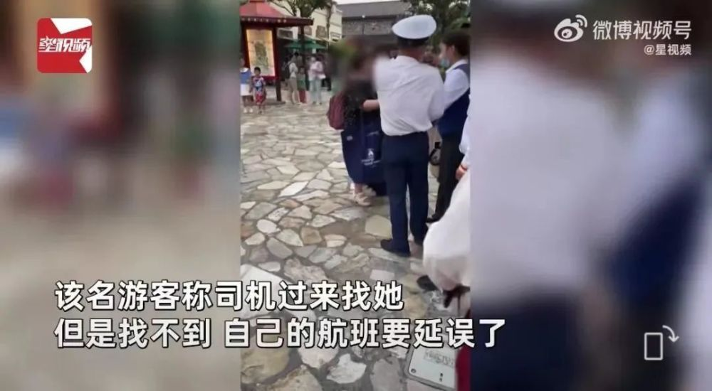
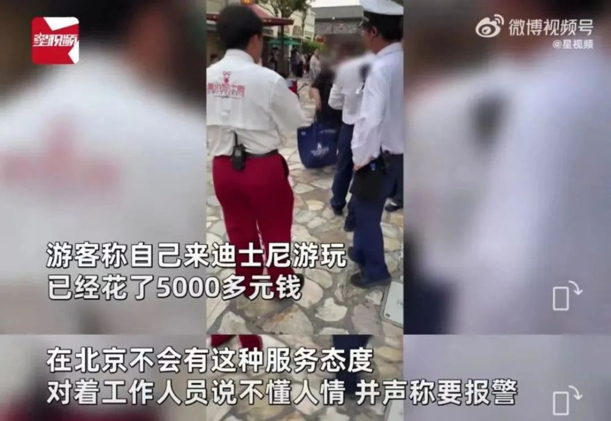

# 女子要求出租车进迪士尼园区接她赶飞机，遭拒后大哭：在北京不会这样

近日，一段 **女子在上海迪士尼门口崩溃大哭** 的视频，引发了网友们的关注。

事情发生在6月15日，视频显示，在迪士尼园区内一名自称北京人的游客 **要求出租车进入园区接她，遭到工作人员的拒绝。**

这名游客称司机过来找她，但是找不到，自己的航班要延误了。该名游客询问工作人员能不能让出租车进来，还表示自己 **要给工作人员磕头。**

游客称自己来迪士尼游玩 **已经花了5000多元钱，**
她对着工作人员说“在北京不会有这种服务态度”，并指责对方不懂人情，同时声称要报警，话题随后也登上了微博热搜。不过许多北京网友表示，
**“这个锅北京人不背”。**

而对于女子的行为，许多人指出， **自己没有时间概念，要误机了怪谁呢！**

还有人说： **在哪里都应遵守规则。**

**话里话外，迪士尼是许多人口中的“快乐老家”，但不是“巨婴之家”** 。

迪士尼作为主题公园意在打造沉浸式的游客体验，走进迪士尼就是走进一个童话世界，猛然出现现实中的出租车，不免会让人觉得“跳戏”。更何况，园区内都是步行的游客，人流大孩子多，机动车进入有安全隐患。在园区有明确规定的情况下，
**为了个人所谓特殊情况提出这样的要求，实在是不合理不合规** 。

而对于这名游客提出，自己快要误机了，找不到出租车停在哪儿，不少网友也指出，这是自己的时间管理出了问题，更何况，迪士尼设有明确的出租车停靠点位。如果自己能提前做一些功课，规划好行程，又何至于提出如此令人啼笑皆非的要求呢？

我们对迪士尼里的公主童话喜闻乐见，是因为这些公主拥有令人喜爱的品质： **她们独立、善良、自强，而绝非因为她们有一身公主病** 。

来源：上海新闻广播、星视频、申江服务导报

编辑：小刘

审稿：钱程灿

