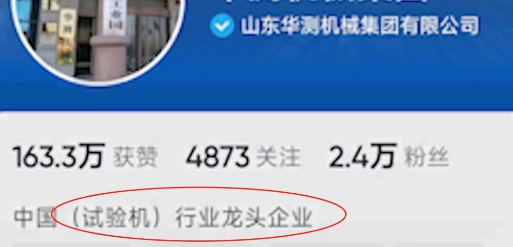

# 山东一公司发通知停聘川大毕业生？公司：管理员私发的，正严厉处理

据澎湃新闻报道，6月17日，网传山东华测机械公司发布通知，称因为张某事件，将停聘四川大学毕业生。随后，引起网络争议。

6月18日，记者发现该视频已经删除。澎湃新闻通过该公司官方账号公布的联系方式，联系到该公司工作人员。

该工作人员承认发过视频，称信息不妥，系工作人员操作失误已删除视频。并称“四川大学毕业生仍可到该公司就业”。

另据华商报援引“老板联播”报道，山东华测内部人员表示：“没有这个事情，管理员个人私自发的，内容已经删掉了，已经严厉处理这个事情了。”

天眼查信息显示，山东华测集团成立于2015年，位于山东省聊城市，是一家以从事仪器仪表制造业为主的企业，注册资本5000万元。

据悉，该公司账号自称试验机行业龙头企业。

**【来源：九派新闻综合澎湃新闻、华商报、老板联播】**

