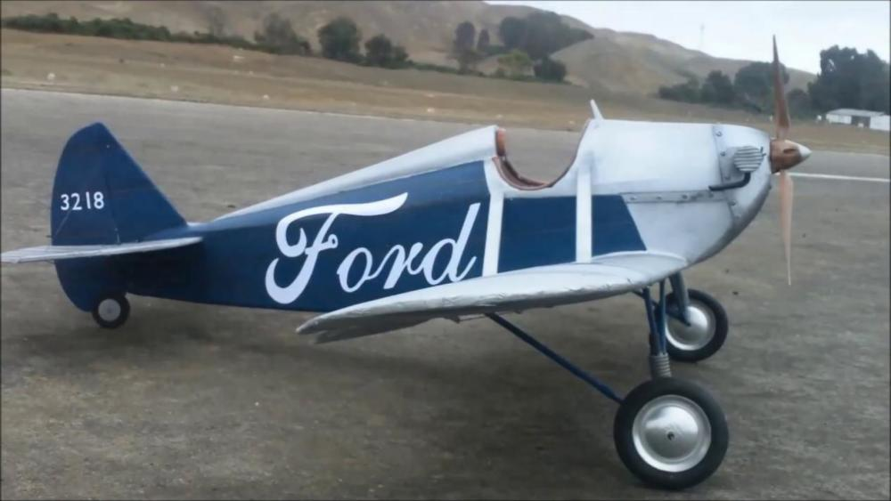
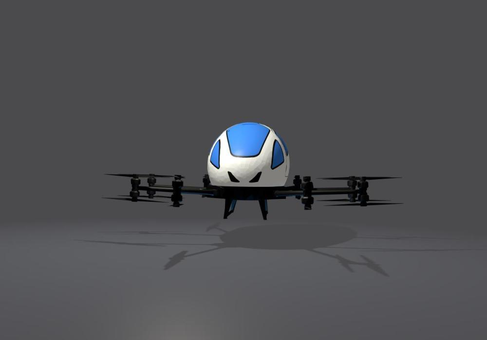
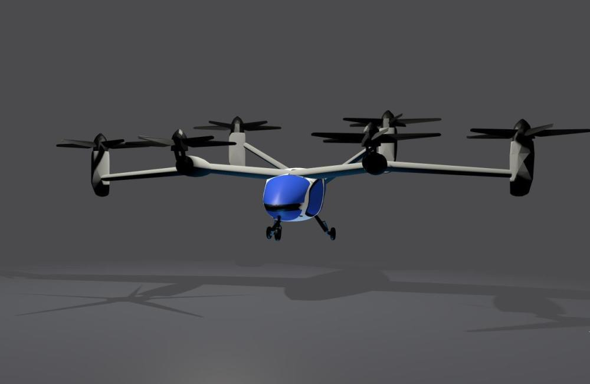
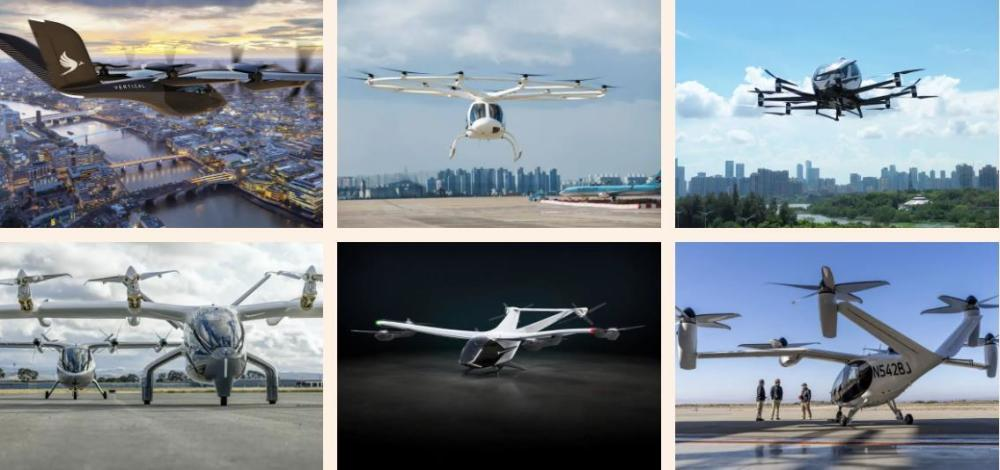
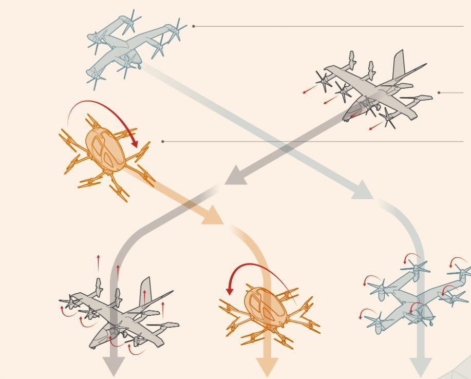

# 明年，“打飞的”将成为现实：飞10分钟700元，比汽车快6倍

**划重点**

  * _1_ 世界各地的许多公司都在开发空中出租车（或称电动飞行出租车），这类飞行器可像直升机那样垂直起降，并像喷气飞机那样巡航飞行。
  * _2_ 目前正在开发的空中出租车可分为三大类，分别是多旋翼飞行器、矢量推力飞行器以及升降加巡航飞行器。
  * _3_ 业内估计，电动飞行出租车从开发到获得认证的成本约为10亿美元。其中，制造成本将在200万至250万美元之间，随着业务规模的扩大，成本将降至100万美元。
  * _4_ 分析师预测，到2040年，电动飞行出租车市场的规模可能高达1万亿美元，每辆空中出租车每年可能产生200万至400万美元的收入。
  * _5_ 制造、认证和运营电动飞行出租车的过程仍然非常昂贵、充满不确定性且竞争激烈。此外，获得监管机构的认证也极其困难。

_图片由AI生成_

腾讯科技讯
空中出租车的概念已经出现了近百年，人们曾经畅想乘坐它们在拥堵的城市街道上空自由飞行，彻底改变人们的未来出行方式。然而，直到最近几年，空中出租车的研发采取的重大进展，今年和明年都被视为关键年份，将迎来行业拐点。多家公司目前都在加紧测试，希望尽快通过监管机构认证，成为全球首家空中出租车运营商，从而被载入史册。

一架带有美国联合航空公司蓝白相间涂装、显得非常时髦的电动飞机准备起飞了。它可以垂直起飞，从拥堵的城市街道上空飞过，呼啸着飞向曼哈顿的天际线。目前，这只是个带有CGI动画的营销视频，但美国联合航空公司和名为Archer
Aviation的空中出租车初创公司表示，这将在两年内成为现实。

届时，可以搭乘四人的电动飞行出租车将定期往返于美国联合航空公司位于纽瓦克的机场和纽约市中心之间。两家公司表示，乘坐汽车或公共交通工具可能需要1个多小时的旅程，而电动飞行出租车只需10分钟（速度约快5-6倍），每位乘客的费用约为100美元（约合人民币713元）。

世界各地的许多公司都在努力实现类似的目标：采用电池驱动的飞机，它们像直升机那样起降，像喷气飞机那样巡航飞行，并得到监管机构的批准，用于商业用途。支持者包括波音和汽车制造商Stellantis等知名公司，几家公司计划在2024年或2025年投入运营。

然而，制造、认证和运营电动飞行出租车的过程仍然非常昂贵、充满不确定性且竞争激烈。业内估计，电动飞行出租车从开发到获得认证的成本约为10亿美元。那些取得成功的公司必须展示出足够的技术能力和资本，并让监管机构有足够的信心来相信他们的飞机足够安全。然后，他们需要将自己的产品定价在能让公众自愿买单的水平上。

电动飞行出租车的支持者承诺，这种旅行将帮助摆脱困扰现代城市的地面交通拥堵问题。但也会面临挑战，比如建设必要的基础设施，确保在拥挤的城市中安静地运营，以及赢得公众的认可。

美国联合航空公司旗下风险投资部门的总裁迈克·莱斯基宁(Mike
Leskinen)表示：“我们将拥有一种使用价值极高的交通工具，可以载人飞行80公里或更短的路程。更大的问题在于，我们如何获得美国联邦航空管理局(FAA)的认证，如何确保（电动飞行出租车）具有与商用飞机相同的安全标准，如何将其融入拥挤的空中交通管制和拥挤的空域？这些都是比电动飞行出租车本很更受关注的问题。但它们将改变人们的生活。这只是时间问题，而不是会不会的问题。”

经过多年的努力，以及一次次地错过预期目标，电动飞行出租车行业正接近拐点。未来18个月将至关重要，因为几家竞争公司都在加紧飞行测试，这对获得监管机构的认证至关重要，同样使它们的资源面临压力。有些公司可能不得不在上市前再次求助于投资者，因为近期对科技股的热情已经消散殆尽。其他公司可能无法清除监管障碍。在一个已经显得拥挤的领域，不是每家公司都能生存下来。

航空安全专家、前机长约翰·考克斯(John
Cox)表示：“真正推动这种空中机动性概念的人，都是有远见的人。空中飞机项目非常超前，而且仍有许多挑战有待克服。”

**01 领先竞争者**

飞行出租车的想法已经存在了100多年。早在1926年，亨利·福特（Henry
Ford）就推出了福特Flivver，这是一款面向大众的飞行汽车。最初，福特认为Flivver在飞机领域的地位，应该像Model
T在汽车行业那样耀眼。但在一次致命的试飞后，Flivver未能走到投产环节。在这条路上，还有许多其他失败例证。

如今，电动飞行出租车的主要参与者分布在美国和欧洲，中国和巴西也有竞争者。其中有些是初创企业，另一些则得到了空客、波音和巴西航空工业公司等老牌行业巨头的支持。波音最近收购了总部位于加州的初创公司Wisk
Aero，后者计划在巴黎航展上展示其最新一代电动飞行出租车。

这些飞行器中，每一种都需要得到本国监管机构的认证，但与传统飞机不同的是，这并不能保证它们能在其他地区安全飞行。计划在三年内推出电动垂直起降飞行器(EVTOL)的公司主要在开发三种类型的飞行器，分别是多旋翼飞行器、矢量推力飞行器和升降加巡航飞行器。

其中，多旋翼飞行器看起来最像直升机。它们没有机翼，飞行距离更短，生产更简单，业界认为它们更容易获得认证。另外两种配置结合了旋翼和机翼。升降加巡航飞行器使用一组旋翼帮助升空，另一组旋翼帮助巡航到目的地。矢量推力飞行器使用一组旋翼抬离地面，然后倾斜推动前进。

**1.Archer Aviation**

Archer
Aviation由两位前对冲基金分析师于2018年创立，他们之前的创业公司是一家在线招聘平台。该公司于2021年在亿万富翁投资银行家肯·莫里斯（Ken
Moelis）的支持下上市。今年3月，Archer Aviation在美国佐治亚州的工厂开工建设，计划明年投产。

Archer Aviation的电动飞行出租车Midnight由市场上已有的航空零部件组装而成，计划于今年夏天进行首次试飞。去年离开Archer
Aviation的联合创始人布雷特·阿德科克(Brett
Adcock)在2021年表示，该公司将于2024年发布该飞行器，但该公司现在表示，预计将于2025年开始运营。

**2.空客**

欧洲的空客公司比初创企业拥有更雄厚的财力，该公司已经试验了几款概念电动飞行出租车，但表示不会与其他公司竞争，也不会试图创造纪录。空客想要开发可以成为该公司另一个业务支柱的东西。

空客的电动飞行出租车名为CityAirbus
NextGen，其演示机型分为截然不同的两款，包括多旋翼的CityAirbus和倾斜翼的Vahana。这两种机型都有固定翼和V形尾翼，以及8个电动旋翼。

**3.亿航**

亿航正在研发一种不需要飞行员的自动驾驶飞行出租车。与大多数计划运营空中出租车服务的公司不同，亿航计划出售为旅游、消防或紧急医疗服务等行业制造飞行器。

亿航的高管们上月对投资者表示，EH216-S已完成获得中国民航局型号合格证“90%”的标准认证。该公司首席财务官此前表示，亿航将于2022年开始运营。特殊许可已经允许该公司飞行器在某些地区飞行，尽管它尚未获得全面认证。

**4.Joby Aviation**

Joby
Aviation成立于2009年，初期在创始人位于加州的一处房产谷仓里运营。该公司与硅谷关系密切，Pinterest和LinkedIn的联合创始人都是其董事会成员。2021年，Joby
Aviation收购了Uber旗下的飞行出租车部门Uber Elevate。

这家垂直整合的公司为S4设计了自己的专用部件，该公司表示，这样做成本更高，但可以改善最终产品，并将供应链中断造成的延误降至最低。一份证券备案文件显示，每架飞行出租车作为空中出租车运营时，预计将产生100万美元的收益。

**5.Vertical Aerospace**

Vertical Aerospace由英国能源企业家斯蒂芬·菲茨帕特里克（Stephen
Fitzpatrick）于2016年创立，一直奉行合作模式。该公司已经与劳斯莱斯和霍尼韦尔合作，利用他们的专业知识，帮助加快通过认证的道路。

Vertical
Aerospace声称，该公司的电动飞行出租车VX4将“非常安静”，目标是“巡航时低于50分贝”。它使用与F-35战斗机相同的飞行控制技术为基础的航空电子设备。该公司不打算运营这款飞行器，而是打算将其出售给客户。

**6.Volocopter**

德国的Volocopter公司希望最早在明年夏天，也就是巴黎奥运会之前，凭借其双座的VoloCity飞行器，成为首架在欧洲进行商业飞行的电动飞行出租车运营商。

VoloCity多旋翼飞行器有独特的光环（或光束），由18个固定螺距旋翼和18个电动马达组成，全部由9个锂离子电池组提供动力。电池组可以在大约五分钟内更换完毕。

虽然大多数公司都是初创企业，但许多公司都有知名的支持者。Stellantis在欧洲拥有标致和菲亚特品牌，在美国拥有克莱斯勒品牌。该公司已同意购买价值至多1.5亿美元的Archer
Aviation公司股票，同时还为该公司生产Midnight。美国联合航空公司为一笔10亿美元的订单支付了1000万美元定金。

丰田向Joby
Aviation投资了近4亿美元，成为该公司最大的投资者，达美航空公司也投资了6000万美元。Volocopter得到了戴姆勒和吉利的支持，而Vertical
Aerospace则吸引了霍尼韦尔和美国航空公司的投资。这家英国公司还宣布，得到了美国航空公司和维珍航空公司的订单。

包括Joby Aviation、Archer Aviation和Vertical
Aerospace在内的几家初创企业已向公众投资者开放，它们通过特殊目的收购公司（SPAC）在美国上市。Joby
Aviation迄今已融资21亿美元，是该领域融资最多的公司，其次是德国的Lilium，融资12亿美元。

与大多数竞争对手不同，Lilium希望使用嵌入四个机翼的电动喷气发动机帮助起飞。该公司已将其认证日期延长至2025年，并在5月份告诉投资者，它正寻求进一步融资2.5亿美元。由巴西航空工业公司控股的Eve
Holding和Wisk Aero分别筹资3.77亿美元和7.75亿美元。总部位于美国佛蒙特州的Beta
Technologies开发的电动飞机也吸引了大量投资，筹资超过7.96亿美元。

过去两年，由于经济不确定性增加，投资者对这些电动飞行出租车公司股票的热情有所下降，这些公司的股价均较上市价格大幅折让。

跟踪空中交通行业发展的SMG咨询公司创始人塞尔吉奥·塞克塔（Sergio
Cecutta）说，航空航天是出了名的资本密集型行业，但筹集的资金数量并不重要，重要的是公司如何有效地利用这些资金来获得认证。在这些公司中某家实现盈利之前，“死神仍在后面紧紧追赶”。

_图：从左上顺时针方向依次为Vertical
Aerospace的VX4、Volocopter的VoloCity、亿航的EH216-S、Joby Aviation的JAS4-1、The City
Airbus NextGen和Archer Aviation的Midnight_

**02 技术挑战**

设计电动飞行出租车的工程师需要面对许多重大技术挑战。垂直起降（以及悬停）所需的动力比有翼飞行更大。欧盟航空安全局（Easa）表示，一架同时具备上述两种功能的飞行器必须做出权衡，垂直起降的难度增加了“某种程度的复杂性和风险，而这似乎被许多利益相关者低估了”。

电池的能量密度低于喷气燃料，这意味着电动飞行出租车不能飞行那么远，也不能承载那么多的重量。伦斯勒理工学院垂直升降机移动中心主任法尔汗·甘地（Farhan
Gandhi）说，虽然这些公司正在使用复合轻质材料来帮助减轻重量，但空中出租车飞行时所消耗的能量依然很高，“在某种程度上，你携带的电池本身就很重，更不用说人和其他有效载荷了。”

此外，电池还有着火的危险。有报道称，这些电动飞行出租车至少发生了两起涉及锂离子电池的火灾，其中一起涉及储存在航运集装箱内的电池。根据甘地的说法，业内领先者所采用的三种飞行器都有优缺点，至于哪一种最好，目前还没有定论。

**03 监管挑战**

这些空中出租车都还未获得航空监管机构的认证。在美国和欧洲，每家公司都需要获得“型号合格证”，以批准飞机及其零部件的设计。他们还需要获得其他认证，以证明这种设计可以大规模生产，而且对于那些计划试飞空中出租车的公司来说，还需要获得官方许可才能以航空承运人的身份运营。

在欧洲，Volocopter拥有最雄心勃勃的目标，计划最早在2024年第二季度让其VoloCity获得欧洲航空安全局的认证。今年3月，Vertical
Aerospace获得了英国监管机构CAA的初步批准。美国联合航空公司旗下风险投资部门的总裁迈克·莱斯基宁称，在美国，Archer
Aviation计划在2024年底前获得认证，它正与Joby Aviation之间展开“认证竞赛”。

欧洲航空安全局是迄今为止唯一发布eVTOL专用技术规范的监管机构。作为“垂直起降特殊条件”规范的一部分，该机构要求规划商用客运航班的开发商采用目前适用于商用客机的安全标准：在10亿个飞行小时内只发生一次灾难性故障的几率。欧洲航空安全局设想，空中出租车将以高频率大量运营，而不仅仅是从现有机场起飞。

通用航空和监管机构垂直起降部门主管戴维·索尔曼(David
Solar)表示：“我们必须在安全目标上找到适当的平衡，因为我们知道，第一次坠机不仅会对一家运营商造成严重损害，而且会对整个行业造成重创。”

美国联邦航空管理局尚未指定目标安全水平，但可能会将阈值设定为每1亿飞行小时或每1000万飞行小时发生一次灾难性故障。美国联邦航空局官员表示，他们的方法和欧洲航空安全局的方法同样安全，只是理念不同。“冗余”(即备用系统)是确保航空安全的核心。尽管欧洲监管机构希望在空中出租车上安装更多备用系统，但美国监管机构将飞行员视为防止灾难发生的额外保障，尤其是考虑到空中出租车在机械结构方面比喷气式客机更简单。

这些差异可能会限制制造商在认证地区以外销售或运营电动飞机的能力，至少在一开始是这样，从而降低利润预期。美国公司正把目光投向追随美国联邦航空管理局脚步的日本、加拿大和澳大利亚。亿航的自动化设计能否在中国以外获得认证还有待观察。

英国民航局高级空中机动性主管克尔斯滕·里恩卡（Kirsten
Riensema）说：“这些公司希望在不止一个地区销售他们的电动飞行出租车。我们协调得越好，对整个行业和确保安全来说就越好。”

通用航空和监管机构垂直起降部门主管戴维·索尔曼表示，欧洲航空安全局正在与美国联邦航空管理局合作，尽量减少认证标准之间的差异，并确保“空中出租车配置的最小改变”，以便运营商可以在两个地区运营。

**04 功能与安全**

空中出租车究竟如何融入每个城市现有的航空生态系统，这是一项正在推进的工作。

为了提供可靠的服务，空中出租车将需要合适的着陆基础设施。航空监管机构正在制定垂直机场的设计和标准。与直升机机场不同，垂直机场可能必须根据不同的尺寸来容纳各种各样的电动飞行出租车。他们还必须提供充电端口。

乘客需要找个地方办理登机手续。与此同时，城市居民需要确信这些空中出租车不仅能保持安静，而且可以安全飞行。

航空监管机构已开始与地方政府合作，就空中出租车运营商在飞行时必须遵守的“飞行走廊”达成一致，这既是出于安全考虑，也是为了尽量减少它们对城市环境造成的潜在影响。

_图：电动飞行出租车如何从水平飞行转换到垂直飞行：矢量推力飞行器可以通过改变推力角度来实现悬停。例如，螺旋桨可以倾斜90度，这样它们就可以从水平推进出租车转换到静态悬停。升力和巡航飞行器有一组发动机用于水平飞行，由传统机翼提供升力，另一组电机则用于悬停。在某些情况下，用于水平飞行的电机倾斜以补充其他电机。多旋翼飞行器的水平飞行涉及将更多电力供应给一组旋翼，促使滑行倾斜和创造水平运动。悬停是通过在所有旋翼上均匀分配动力来实现的。_

运营商还需要考虑其他因素，包括噪音、天气和乘坐质量。虽然一辆空中出租车可能不会在城市的喧嚣中引发关注，但成群结队的空中出租车可能会产生巨大噪音。跟踪空中交通行业发展的SMG咨询公司创始人塞尔吉奥·塞克塔说，这个问题就像“蜜蜂与蜂巢”。你永远听不到蜜蜂的声音，但如果你走到蜂箱旁边，你就会听到很大的声音。

航空安全专家考克斯指出，这些空中出租车的航程也将受到限制。当它们遇到恶劣的天气时，在电池耗尽之前，它们将需要足够的地方着陆。公司需要提前规划好备选路线。他还说：“有非常严重和复杂的空域问题需要解决，比如说你需要至少有三四个地方可以临时着陆。”

**05 运营和成本**

有些分析师预测，到2040年，电动飞行出租车市场的规模可能高达1万亿美元。

空客城市空中交通主管巴尔基兹·萨里汉(Balkiz
Sarihan)说：“我们不打算将首个空中出租车市场作为切入点。还有很多技术需要完善得更加成熟，以及与愿意搭乘空中出租车的人建立起信任。”

对于那些有望实现短途快速、无压力运输的公司，他们向乘客推销的产品价格与出租车相当，比直升机便宜，同时试图平衡开发、批量生产和运营成本。前行业高管、麻省理工学院名誉教授艾伦·爱泼斯坦(Alan
Epstein)表示：“毫无疑问，你可以建造这些空中出租车。问题在于，会产生经济效益吗？”

爱泼斯坦补充说，为了收回制造成本，企业需要大量生产这些电动飞行出租车，那么“谁来为头五年所生产交通工具带来的亏损买单呢？”

Archer Aviation首席执行官亚当·戈尔茨坦(Adam
Goldstein)表示，电动飞行出租车最初的制造成本将在200万至250万美元之间，随着业务规模的扩大，成本将降至100万美元。与直升机相比，它们的部件更少，维护成本更低，运营成本将分摊在更多的旅行中。

虽然Archer
Aviation没有透露何时会盈利，但戈尔茨坦表示，每辆空中出租车每年可能产生200万至400万美元的收入，而且与汽车行业的电动初创企业不同，空中出租车不需要批量生产数百万辆就能成功。

Vertical Aerospace首席执行官斯蒂芬·菲茨帕特里克(Stephen
Fitzpatrick)警告称，电动飞行出租车行业成功的过程非常缓慢。他说：“我们会在2025年看到大量电动垂直起降空中出租车在我们的城市上空飞行吗？不太可能。无论什么时候获得认证，都需要工业化和规模化的过程，而这需要时间。”

**06 关键年份**

几家空中出租车公司的高管正在为他们所说的电动垂直起降飞行的关键年份做准备。Volocopter首席执行官德克·霍克(Dirk
Hoke)希望成为第一个进入市场的公司，成为全球首家空中出租车运营商，这既是为了载入史册，也是为了获得他认为在如何运营新系统方面至关重要的第一手经验。“没有人会记得第二个，”他说。

Joby Aviation执行董事长保罗·西亚拉(Paul
Sciarra)表示，该公司将于明年初向美国空军交付电动飞行出租车。他将其与2010年Uber在旧金山推出的黑色汽车进行了比较，当时后者的规模虽然有限，但证明了其潜在概念是可行的。

西亚拉说：“很长一段时间以来，人们一直在谈论空中出租车和飞行汽车。我认为，今年，或在未来12个月内，空中出租车将开始成为现实。任何新技术的引入都要经过许多步骤才能真正实现。要让它成为人们日常通勤的一部分，还有很长的路要走，但重要的是我们要专注于实现这一目标的步骤，我们确实认为这一点至关重要。”（金鹿）

