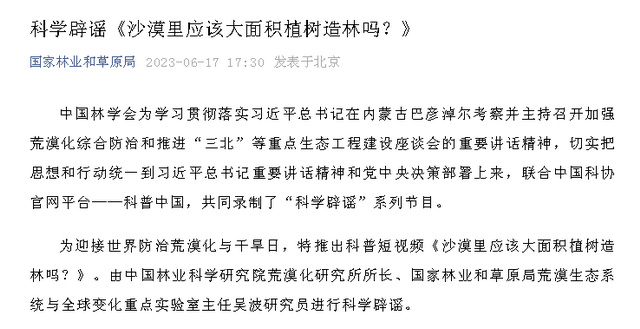
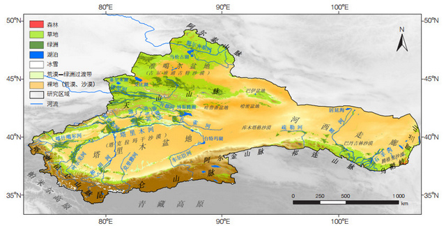
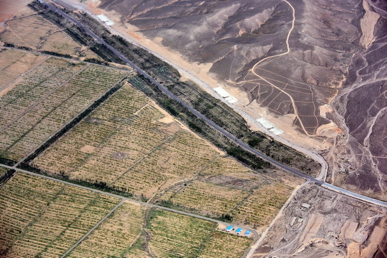

# 沙漠里应该大面积植树造林吗？国家林草局：种树会耗光土壤水分

第29个世界防治荒漠化与干旱日（6月17日）之际，国家林业和草原局就“沙漠里应该大面积植树造林”的说法进行公开辟谣。

中国林业科学研究院荒漠化研究所所长、国家林业和草原局荒漠生态系统与全球变化重点实验室主任吴波研究员表示，根据科学界的普遍共识，沙漠是在干旱气候条件下长期环境演变的结果，造成沙漠环境中植被低矮稀疏的主要原因是气候干旱缺水。

吴波说，沙漠地区不缺土壤，风沙土本身就是一种土壤类型。我国干旱区分布着大面积的沙漠和戈壁，年降水量只有不到200毫米，仅靠天然降水无法支撑大量树木生长，大面积或高密度种树会降低地下水位，耗光土壤水分，导致沙漠生态系统崩溃。

“科学研究早已证明，只有受气候变化或人类活动影响形成的荒漠化土地，才有可能治理和需要治理，治理方式也并不局限于种树，应该乔灌草结合。”吴波说，荒漠化治理应该“以水定绿”，即恢复的植被不能超出当地的水资源承载力，而对于天然的沙漠戈壁，保持其原始状态和生态系统的完整性，让在其中生存的动植物不被打扰才是最好的选择。我们应该始终坚持宜林则林、宜草则草、宜灌则灌、宜荒则荒的原则，科学防治荒漠化。

中国是荒漠化最严重的国家之一，全国荒漠化土地面积257.37万平方公里，占国土面积的26.81%。沙化土地面积168.78万平方公里，占国土面积的17.58%。

_我国西北干旱区概图
资料来源：中国科学院_

国家林草局17日公布的数据显示，十八大以来，我国累计完成防沙治沙任务2033万公顷，53%的可治理沙化土地得到治理。与2009年相比，沙区平均植被盖度上升2.6个百分点，京津风沙源治理工程区20年间林草综合植被盖度由39.8%提高到45.5%，三北工程区森林覆盖率由1978年的5.05%提高到13.84%，重点治理区实现了由“沙进人退”到“绿进沙退”历史性转变。

北京林业大学一位专家对第一财经记者表示，前一阶段社会广泛关注的“宁夏万亩树木”所在地，属典型的内陆干旱沙漠气候，降雨少、蒸发量大，具有明显的季节性干旱等恶劣自然气候特征，对提高造林成活率和促进幼林生长妨碍极大。即便在造林区，也应坚持“适地适树”这一生态学基本原则，根据各种沙地不同的立地条件和树种的生物学特性，将抗旱及适生树种列为主要造林树种。

中国林科院防沙治沙专家杨文斌表示，治沙要采用适地适树的原则，低密度覆盖治沙，尽量选取乡土树种，乔、灌、草结合，增加植被多样性，提升固沙效果，因地制宜，宜乔则乔、宜灌则灌、宜荒则荒。

荒漠化防治是一个全球性的问题和难题。上述专家表示，我国沙化土地面积大、分布广、程度重，气候干旱少雨，蒸发量大，水资源总量相对较少且分布不均，防治形势依然严峻。

第六次全国荒漠化和沙化调查结果显示，全国现有沙化土地168.78万平方公里（25.82亿亩），约占国土总面积的17.58%，分布于30个省、927个县，影响近4亿人口的生产生活，严重影响国家生态安全和区域经济可持续发展。目前，我国荒漠生态系统修复处于初级阶段，稳定性较差。加上区域水资源矛盾突出，不合理的人为活动仍然存在，防沙治沙还处于攻坚克难阶段。

国家林草局三北局一级巡视员武爱民日前在接受媒体采访时介绍，过去一段时间，人们在与风沙抗争的过程中，处于被动防御和重治轻防的状态。一是没有全国或者区域性的防沙治沙规划，主要以社队和群众自发性的形式进行沙化治理，缺乏有效的组织和统一的行动；二是边治理边破坏，甚至破坏远大于治理速度；三是受限于经济、社会、科技以及理念等基础条件的困顿，治理沙化缺乏有效手段。

“一些人甚至片面地认为，只要种了树，哪怕是‘用水浇大’，就能形成小气候，带来降水、防风固沙。完全不顾及当地的水文、气候等条件制约。”上述林草专家说。

_航拍宁夏大面积沙化土地。摄影/章轲_

2021年6月，国务院办公厅印发的《关于科学绿化的指导意见》明确，应遵循生态系统内在规律开展林草植被建设，着力提高生态系统自我修复能力和稳定性。坚持因地制宜、适地适绿，充分考虑水资源承载能力，宜乔则乔、宜灌则灌、宜草则草。

指导意见提出，年降水量400毫米以下干旱半干旱地区的绿化规划要经过水资源论证，以雨养、节水为导向，以恢复灌草植被为主，推广乔灌草结合的绿化模式，提倡低密度造林育林，合理运用集水、节水造林种草技术，防止过度用水造成生态环境破坏。干旱缺水、风沙严重地区要优先选用耐干旱、耐瘠薄、抗风沙的灌木树种和草种。北方防沙带要加大封禁保护力度。

“我们不能把所有功能统统附加到一片森林上。”水土保持专家、北京林业大学教授余新晓表示，应该把“绿化”放在国土空间优化的格局来考虑，而不是单纯的植树播绿。因为并不是所有地方都适合大面积植树造林，有些地方要宜林则林、宜灌则灌、宜草则草、宜荒则荒、宜裸则裸、宜沙则沙。

余新晓介绍，理论上说，年降雨量400毫米以上的区域属湿润半湿润的区域，自然植被是森林；200毫米到400毫米之间属半干旱区，自然植被是灌木，一般不会成片出现乔木，即使有也是散生、稀疏的；200毫米以下是干旱区，自然植被以草本植物为主；低于100毫米就是极干旱区，草本分布也很少，不会出现大面积草原。

今年初，国家林草局、国家发展改革委、财政部、自然资源部、生态环境部、水利部、农业农村部七部门联合印发的《全国防沙治沙规划(2021—2030年)》也明确提出，对于人为活动不频繁的原生沙漠、戈壁等自然遗迹，强化保护，不要人为干预。对于人为活动较为频繁但不具备治理条件的，以及因保护生态的需要不宜开发利用的连片沙化土地，有计划地划定为封禁保护区，实行封禁保护。

