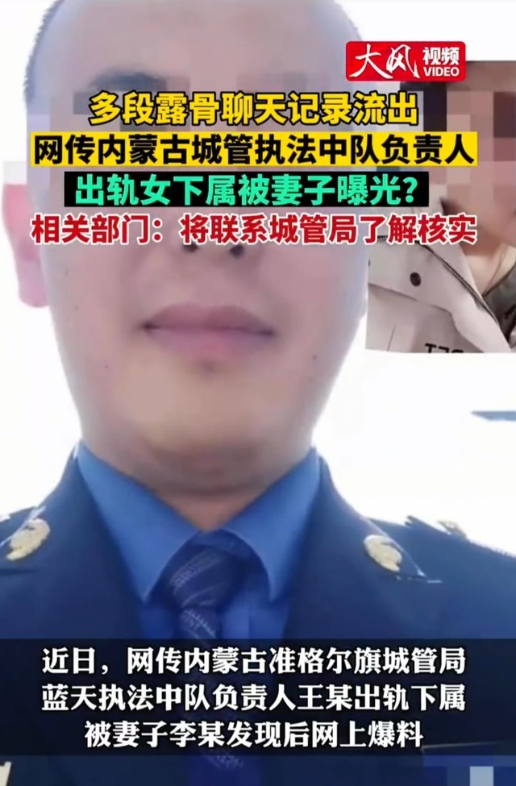
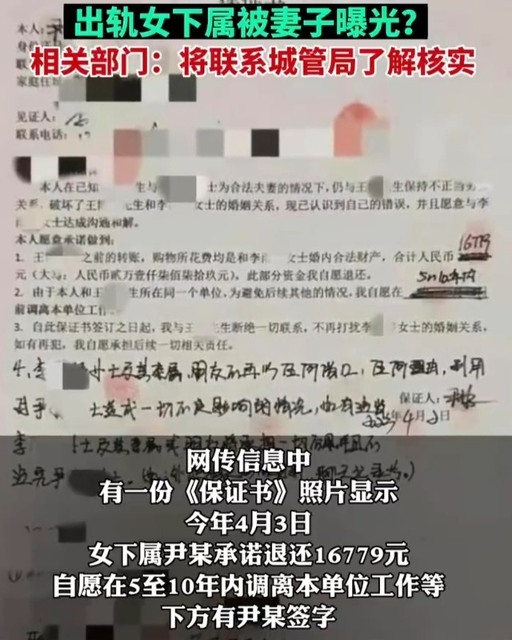

# 网传内蒙古一城管负责人出轨女下属，妻子曝光露骨聊天记录，当地回应

近日，网传“内蒙古准格尔旗城管局蓝天执法中队负责人王某出轨下属，被妻子发现后网上爆料”。6月18日，华商报大风新闻记者从准格尔旗党委宣传部获悉，他们会核实具体情况。

根据网传截图显示，有时间显示的聊天记录最早为2022年，二人有多段露骨聊天内容。

网传信息中有一份《保证书》照片显示，今年4月3日女下属尹某承诺退还16779元，自愿在5至10年内调离本单位工作等，下方有尹某签字。

18日，华商报大风新闻记者从准格尔旗党委宣传部获悉，就网传信息，他们会联系城管局，了解、核实具体情况，届时进行回复。截至发稿，无回复。

**【来源：华商报大风新闻】**

