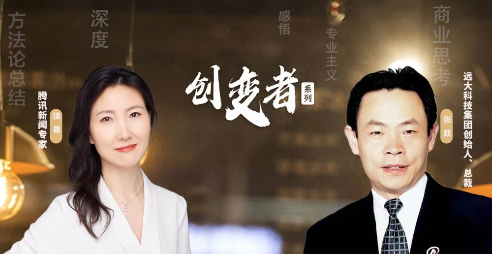
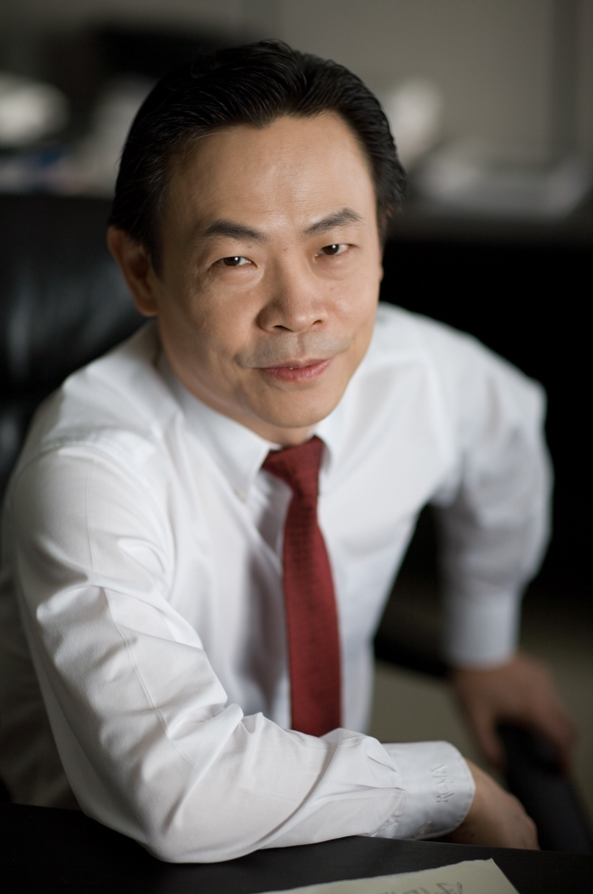
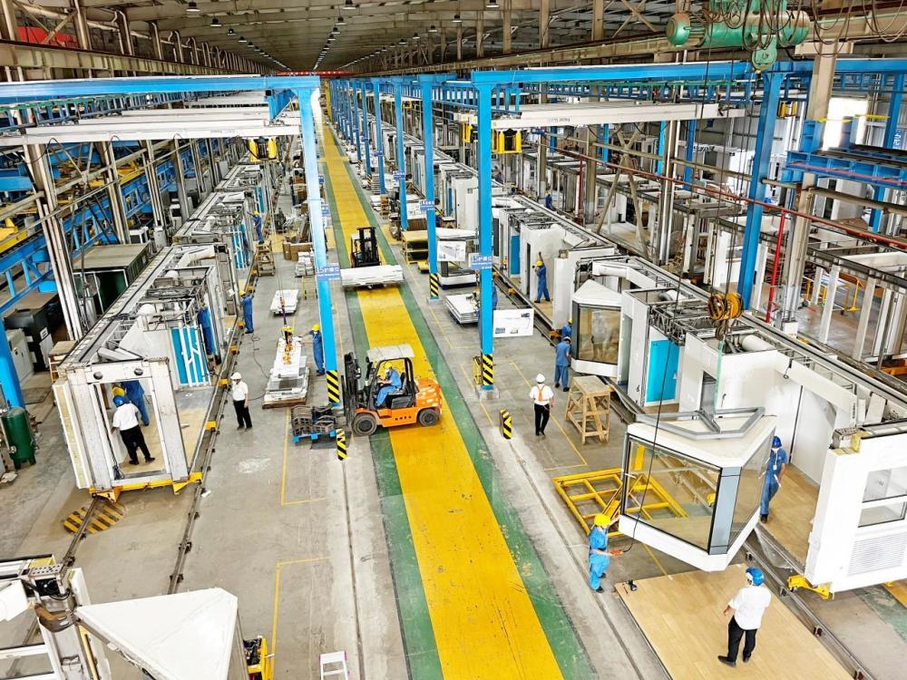

# 中国私人飞机第一人：曾买入7架飞机，如今倡导低碳出行｜创变者

腾讯新闻《创变者》 主笔 徐昙

编辑 杨布丁

**编者按：**

**用创新在变化中应对变化，用耐心和务实精神刷新未来。在不确定的时代，《创变者》系列寻找那些基于专业、勇气和梦想，创造无限可能的人。**

新中国最初的商业进程是从“大王”的成长开始的，比如“饮料大王”宗庆后，“玻璃大王”曹德旺，“家电大王”何享健……他们的标签紧紧地和其赖以成名的业务连接在一起，直到他们意识到应该从“大王”的宝座上走下来，进入新的商业境界。

但是，远大科技集团的创始人、总裁张跃没有被称为“空调大王”或“环保大王”，20多年来，“中国私人飞机第一人”的标签根深蒂固地和他捆绑在一起。

1997年，远大空调的销售额达到了20亿（净利润近4亿），张跃买下了中国第一架私人飞机并取得了驾照，其后几年内，又连续买入了6架。1997年，中国国民人均收入3782元，购买私人飞机几乎可以称为惊世骇俗。初贫乍富的任性、狷狂已经无意识地进入公众的判定中。

“那时候，我觉得是真自由。”张跃说。巨大的财富，来自官方和社会的荣誉，包括企业始终都是独立控股，一切都在掌控之中。“但是，任何东西当你获取的时候都不能让你更快乐了。人要经过这样的阶段，才能有真正的公德心。如果还停留在利己的思维里面，这种人精神上是不自由的，也是不幸福的。”他说。

1960年的张跃8-20岁学习美术，在中专担任几年美术老师后，于1984年下海创业。1988年，他和毕业于哈工大的弟弟张剑一起创立了远大，第二年发明无压热水锅炉，因专利及图纸转让赚到了第一桶金。1992年，兄弟二人又研发出国内第一台直燃式非电空调，赢得了多年的市场红利，在1996年，远大非电空调在中央空调领域销量第一，逐步奠定了在国内外空调市场的领导地位。1998年，张跃、张剑兄弟二人分开经营，走向了不同的业务路线，远大科技集团的业务延伸到洁净空气、建筑、路桥、风电等领域。

近日，腾讯新闻《创变者》在位于长沙的远大城近距离观摩了张跃和他的“王国”，传说中的张跃和现实的张跃存在的巨大反差和“分裂”，让人措手不及。

一个奢侈消费的“小我”，开始思考人类的命运和未来，像《三体》里的文明哲学；

一个学美术出身的艺术家，狂热地研究机械、材料、智控、建筑等，成了公司的总工；

一个在公司管理规章、行为守则上写了几十万字手书的偏执狂，在行事规则上又要求极简主义——“减、简、通用化”；

一个起初非低碳出行的人，最终摒弃了私人飞机，成了一位极端的环保主义者。

一个都不愿上市的人，却发明了活楼（不锈钢建材的工厂化建筑）要颠覆世界，29个小时像搭积木一样盖了一座11层的楼宇。

时间是变量也是力量，可以让人变得矛盾，也可以让矛盾统一。

英国作家毛姆在他最具代表性的小说《刀锋》里说，“一把刀的锋刃不容易越过，因此智者说得救之道是困难的。”意思是得救之道非常狭窄，一个人若越过“刀锋”那就自我解脱了，已参悟到世界运转的秘密。

从物质上的极度奢侈到精神上的升华，张跃因何而变？

_远大科技集团的创始人、总裁张跃_

**以下为腾讯新闻《创变者》主笔徐昙和远大科技集团创始人、总裁张跃的对话，略有删减：**

**“财富极度满足的时候，公德心就起来了”**

**腾讯新闻《创变者》：你是1984年开始创业的，算中国第一代企业家。第一代企业家任正非、宗庆后等大都是40后、50后，你是60后，反而和第三代企业家中的马云、李彦宏、张朝阳同龄。是否因为你成功较早、得到财富时年纪尚轻，才会有买飞机这样超前消费的“轻狂”？**

**张跃：**
我在1995年以前都处于缺钱的状态。直到1995年，我们的产品卖得非常好，那一年差不多有1个亿的利润。你知道那个时候的1个亿太吓人了，突然就有一种对财富的高度满足感。到1996年的时候，远大差不多一年有20亿的销售额，3～4个亿的利润。那个时候想怎么花钱就怎么花钱。当突然有足够多的钱能追求物质上的满足时，我都尽可能地去实现。我觉得等飞机太麻烦，就自己买了一架，然后所有的豪车、好的消费品都不吝惜地去消费。

我买飞机是1997年，1997年我买了两架飞机。中国第二个人买私人飞机的是2007年，是十年以后。因为我获取财富比别人要早得多，比很多中国企业家都早，那个时候我是真自由。还有远大一直以来都是我自己独立控股的，到今天为止还是如此。

那时不仅钱多，社会地位也高，影响也大。所以，我是比较早地获取了名利，比较早地脱离了对物质的单一渴望，或者说名利都看得淡了。

**腾讯新闻《创变者》：什么时候开始考虑社会责任，乃至你说的人类命运的问题？**

**张跃：** 1998年我只有38岁，从那以后我考虑社会意义、社会价值的东西就特别多。

可能体验了各种由财富能够带来的快乐，都体会过了，我发现任何东西当你获取到的时候都不能让你更快乐了。从2002年、2003年这个阶段我是彻彻底底地意识到了环境问题是我们整个人类面临的大问题。

**腾讯新闻《创变者》：当时有很多来自社会的名利吧？度过这个阶段经历了怎样的心理转变？**

**张跃：**
除了物质上足够满足，当时还有官方给的荣誉，社会给的荣誉，别人赞赏的眼光，赞赏的言语等等。但是人要渡过这个阶段，不要沉迷于里面。我基本上在1998年的时候，就完全度过了对名利的追逐。所以，当一个人没有足够富裕的时候，你要想让他有很多公德心比较难。可是到了财富极度满足的时候，公德心就起来了。我希望社会整体上人人都富起来，那大部分人就有先天下之忧而忧的思想了。

没有公德心的人谈不上成功，还停留在单纯利己的思维里面，这种人精神上是不自由的，也是不幸福的。

**“地球上所有的知识我都懂”**

**腾讯新闻《创变者》：远大的产品从无压锅炉到非电空调，到现在的活楼（不锈钢建材的工厂化建筑），远大是个技术驱动的公司。我有个疑问，你可是学美术的，你的这种技术意识和技术能力到底从何而来的呢？**

**张跃：** 这个词用得很好，技术意识。

这种意识开始于我学画画的时候，小时候别人都说我画得好，有一天我父亲最好的一个朋友跟我说了一句话：张跃啊，你画得是好。但是，临摹是奴才，创作是天才。这句刺激的话影响了我一辈子。

我创业时做的第一件事就跟别人不同，做的是无压锅炉，后来做非电空调。后来我做的所有东西都是从零开始的。这个思维就是技术意识，这种意识特别重要。要做社会上没有的，市场上没有的东西。它不局限于你是搞艺术的还是搞技术的。

从头到尾，即便创业最艰难的时候，我总是内心有一种满足感。这种满足感是因为我做的事情是自己创造的。这种满足感让你面对失败的时候都不会觉得憋屈。这点很重要。就是对所做的这件事情除了经济上的回报以外，还多了一层意义。经济上经常有得失，但是，由于你做的这些事情是你创造的，所以那些失败就显得不那么重要了。

这个观念，我相信马斯克，相信很多发明家都有的。

**腾讯新闻《创变者》：我观察了你和技术人员的讨论，以及你所做的研发项目，觉得你至少懂得材料、机械、智控、传感、热工、流体等等专业，你没有经过课堂培训，是如何掌握这么多有专业门槛的知识的？**

**张跃：** 地球上所有的知识，所有的我都懂。

**腾讯新闻《创变者》：所有吗？文理都懂？**

**张跃：**
对。其实科学的逻辑跟社会学还真不同。科学都是有逻辑的。科学的逻辑你通了之后可以做到一通百通。如果没有做到一通百通就是你对科学的底层逻辑没掌握透。

社会学因为涉及到复杂的人的心理，它经常有悖论，没有绝对的逻辑。但是科学和技术，尤其是技术是有绝对的逻辑的。说科学不会有绝对的逻辑是因为我们对科学知识掌握有限，毕竟宇宙这么大。但是，技术都是我们已经形成的科学知识。所以，技术是绝对有逻辑的，它内在的逻辑是一通百通的。所以有些人说“你怎么什么都懂？”,是因为我懂它的底层逻辑。任何事情，即便完全百分之百陌生的事情我也愿意多问几句，这个计算公式是怎么产生的？遇到什么情况会有可能的突变等。把这几个东西弄清楚，10分钟、20分钟就可以弄清楚。

而且最重要的是，你还要写下来，用卡片写的时候你必须要保证每个字都是有严格逻辑的。这个时候你就经过了一次深度思考。所以，我凡是写下来的东西就都把它弄通了。

**腾讯新闻《创变者》：理论界经常强调第一性原理，就是围绕这个行业最本质的因素、不变的因素来创新。比如马斯克用第一性原理围绕能源创新，彻底改变了新能源行业。你懂得多和你的思维方式有关系吗？**

**张跃：** 我们在1992年就提出来一个口号叫“万事求源”，任何事情你都要想到它的根部，它的源头，任何事情都要想到底线和终极目标，其实这都叫万事求源。

因为马斯克很有名，所以他讲的“第一性原理”被大家所熟知。这个万事求源王永庆提过。前一段时间（2023年4月）我在博鳌亚洲论坛遇到他女儿。我就跟王雪红说，我是你父亲的徒弟。她说怎么讲？我说我创业的时候每天捧着王永庆的自传看。王永庆挂在嘴上的和行为表现就是“万事求源”。比如他到长庚医院一进大厅就发现那个花盆摆歪了，他一定亲自纠正花盆应该怎样摆放——放到正中间，花朵朝前。他认为如果这个花盆摆得歪，不是美观的问题，是让人觉得在其他行为中也可以如此。他认为这些细节都是时时刻刻影响员工的行为，影响每一个顾客情绪的。

**腾讯新闻《创变者》：** 你做事的风格是什么都要管，看到不合理的事就要管。这一点是否也延伸到了生意和产业上。你的生意逻辑是什么？

**张跃：**
凡是不合理的东西，我会坚决改掉它。别人会觉得这是鸡毛蒜皮的事，看成一切都是合理的，但我的所有主张背后，有一个非常重要的东西，是要知道什么是错的。从创新的角度，我认为凡是约定俗成的都是错的，凡是复杂的也都是错的，我们做研发时，所有的东西最终都做到极简。

所以，只要不合理的事情我都千方百计地去反对它，甚至动手去改变它。不管它后面是不是有商机，我不管那个。而且我认为你只要改变不合理的东西，那大逻辑上都是有商机的。

**“我如果只占全球建筑市场的5%就有65万亿”**

**腾讯新闻《创变者》：你做企业35年了，虽然开局不错，遇到过什么挫折吗？**

**张跃：**
太多了。任何一件事情都是弯路重重。比如我们做非电空调失败就太多了，那时候钱很紧张。最初大概失败了有十四五台，成本很高，一台大概都在几十万，这是30年前，那时候的几十万顶现在的几千万了。但是，我认为这些弯路你这次不走，迟早要走。

最大的经济上的损失是我2015年开始研发芯板。它的特点是，上下两块钢板，中间夹的是壁很薄的芯，用1100度高温把它们焊在一起。在两三年时间里光做这个材料大概损失了30个亿。在那之前的研发大概还花了50个亿，相关的新科技研发就花了80个亿。这些是自己前些年积累的全部资金，还有一些贷款。到了2016年企业开始有贷款了。

1995年到2015年整整20年时间我是没有向银行或者第三方借过一分钱的，完全靠自有资金，可能我们是全中国唯一的一个零贷款的企业。但研发芯板这件事情上花的钱特别多。

**腾讯新闻《创变者》：付出这么大的试错成本，你想要一个什么样的结果？**

**张跃：**
全世界的建筑市场份额约1300万亿，如果我只占5%，就有65万亿。中国的GDP总量是多少？121万亿（2022年121.02万亿）。也就是说有中国全部GDP的一半这么大。从全球来看，人类财富里面始终有一半是建筑。建筑有两部分的成本，一部分是土地成本，一部分是建造成本。地球上有25%的资金是在建筑的建造领域里的。这是一个巨大的产业，地球上最大的产业就是建筑产业，第二大产业是车辆。但建造产业是车辆产业的5倍。

所以，我为什么会盯得这么紧？我内心里面是极其乐观的，因为市场太大了。

**腾讯新闻《创变者》：继建筑行业后，你又瞄准了风电，我看到你带着技术团队研发风电叶片的材料。从建筑到风电的产业思考是什么？这看似两个行业，内在的一致性是什么？**

**张跃：** 在我们这个时代，一方面是互联网、数码方面超级发达；另一方面，与日常生活密切相关的方方面面却很落后。

从整个人类生存方式看，我认为建筑是人类最大的问题，混凝土还在作为建筑材料。而可再生能源呢，人类也一直没有找到很好的方式，核心问题也是材料，风力发电本是很有前景的一种方式，一种技术系统，但是它的基本材料、叶片的材料不对，还用玻璃钢。建筑除了基本结构材料不对，包括隔热，洁净空气，建造模式都不对，没有一样东西是对的。如果把建筑的问题深度剖析来看，六个方面全是一塌糊涂。第一个是安全，第二个是耐久，第三个是能源效率，第四个是健康，第五个是技术体系，第六个是生产体系。

透过建筑这一件事情，可以看出人类对生存质量的集体麻木。

房子卖的很贵，质量又很差，总以为房地产公司挣了钱，而几家大牌的房地产公司负债都是万亿级的。

那小的房地产公司更活不下去，房地产公司没挣钱，银行没挣钱，城投公司也是负债累累，因为生产体系太落后了，其中很大的一个问题是贪腐，有各种浪费造成的成本和看不见的成本。

其实透过一个问题，我们可以看到社会的方方面面的问题，这个只是最典型的。建筑问题当然是属于众多案例中极为突出的一项，但这样的案例人类能够集体接受。可以想见，这个时代还有多少东西应该改善，还没有改善。

_张跃发明的活楼，用不锈钢做材料的工厂化建筑，房子的建设主体在工厂不在工地。图为活楼房间在生产线上的图景。_

**腾讯新闻《创变者》：据说你让一些学建筑专业的研发人员去了市场部。原因是你觉得根本无法让学建筑的人做出颠覆建筑行业的技术，只有外行才能颠覆行业。所以你自己发明了活楼？你是怎么想出这种新发明的？**

**张跃：**
我所有的创新活动都有一个思想基础。地震出现以后，很多人并不是马上死去，而是在废墟下很多天，在一种煎熬状态下死去的。你看今年土耳其地震十几天后还有活下来的人，当年汶川地震也是这样。这是人类最大的惨剧，比任何杀戮都悲惨。因为任何杀戮都不会让人熬那么多天的。这种极度惨烈比人类任何一种悲剧都要深重。这也激发我把活楼这个产品大面积地推向世界。

活楼的材料是我们研发的芯板（热风铜钎焊不锈钢芯板），比混凝土的重量轻10倍，寿命是钢铁的20倍，强震之下可能会变形但绝不会倒塌。

**腾讯新闻《创变者》：我看到每天都有考察团来公司考察活楼，我遇到过两拨人，他们认同这是好东西，但行为上却不买是为什么呢？是不是还缺少市场教育的过程？**

**张跃：**
我有时候很郁闷，因为这种事情。那么多人了解了我的产品却没买。建筑行业有个问题，这个行业本身很腐败，里面有层层的利益。即便老板有这个愿望，可是一到下面执行层的时候会找一千个理由来阻碍你，不同的利益层在阻碍你。所以，最后我们的建筑要想得到订单总是很难。

**腾讯新闻《创变者》：今天各个行业都在强调创新，你是怎么看创新的？**

**张跃：**
中国范围内搞原始创新的企业很少很少，几乎没有。他们处于根本不敢搞的状态，就是模仿。即使有一点创新都是锦上添花，甚至很多创新都是带有短期福利和长期损害的。所以我现在对全世界的创新都有很负面的看法，大量的资源都用错了地方。人类的信息化或者说数字化的程度已经非常高了。但是，我们的衣食住行水平是低的，没有跟着这个时代进步，环境代价巨大。

_张跃的办公室图景，办公桌边放置着上万张分门别类的卡片。这套卡片式管理也被华为高管借鉴。徐昙摄影_

**腾讯新闻《创变者》：我在你办公桌看到非常多的卡片，像图书的索引。卡片式管理是你一种工作管理的方式吗？就像统帅和将军都是用沙盘的。**

**张跃：** 这些卡片就是我的沙盘，看得见，能马上找得到。

我喜欢写，勤动手。我掌握了这么多的知识，但是记不住那么多的数据，怎么办呢？我用卡片，你看我桌上一万多张卡片都是分类的，我能在5秒钟内找得到任何东西，顶多10秒钟。有时候我那个类别分得有点杂，有四五十类。但是，因为我日期标题都写得很清楚，很容易联想、查找。

天天用这个东西，其实也是刺激自己增强记忆力，你天天寻找自己的卡片，都是自己写的东西，很熟。

**腾讯新闻《创变者》：这种卡片式管理很有效率吗？对其他人适用吗？**

**张跃：**
华为的轮值董事长胡厚崑到我这里看了卡片，说这是好东西，他要拿回去学。他连我设计的那个盒子都拿回去了。他做事极其认真，就想把时间效率提高。我说你们都是用电脑的，电脑的桌面管理不是很方便吗？他说不方便。一打开就受很多信息干扰，搞得人很烦，找东西好痛苦。他说我看你找东西很方便，是个有效率的方法。

因为我要接触到的技术门类太多，信息太杂，不这样做，我什么事都做不了。所以，我过去10年工作效率提高特别多，特别突出。我2013年正式使用卡片，大概到2017年、2018年的时候，突然有一天我就感觉，我现在怎么变得能量这么大了？好像我要干的事情的能力比原来强三四倍，现在则感觉比原来强了十倍。

**“我相信不行贿也能做很成功的公司”**

**腾讯新闻《创变者》：我看整个公司最勤奋的就是你了，每天工作到凌晨，而且很多事你都要管，似乎也使得整个公司很依赖你的思考？**

**张跃：** 苏格拉底有一句名言：真理只有一个。这句话我一辈子都在思考。

每次都发生在我身上，有些事总是我一个人找到答案。我有时候为这种事挺痛苦的，总觉得我们有这么多的员工，为什么没有一个人能解决这些根本性的问题呢？后来一想，还是印证了苏格拉底这句话。

**腾讯新闻《创变者》：整个公司无论是各个部门的墙上，还是电梯、厕所等场所都贴满了行为规范指引，你是一个超级细节控吗？**

**张跃：**
其实正相反，我经常提醒员工，看板多了就没有看板，文件多了就等于没有文件。我要他们学会归纳总结，把生产工艺的文件，从七八百页变成五十页、三十页，逼他们做精。员工写一个3、5页的文件，我会让他们变成一页纸。我们公司的文件，尤其管理性的文件都有一个死规定，就是不超过一页纸。

我告诉所有员工，开始做一件事情，不论是管理、技术，还是产品，都是由简单到繁琐，再到精细，再转化为简洁。这需要花很多时间，关键是需要智慧。从简单到精细，可能要花3000个小时，但是到简洁就要花3万个小时。

所谓的科技创新，没有这个观念是做不了创新的，当你不去追求极简的时候，你做的所有东西都会成为自己的累赘。

我们知道垃圾分类就是资源，如果我们的知识信息不分类，不整理，也会变成垃圾，所以要天天消除我们冗余的知识信息。这就是极简，这种极简的思维我是30多年如一日的，并不是今天开始的。没有电脑的时代是如此，有电脑的时代更要如此。

**腾讯新闻《创变者》：在远大城那么细致繁复的规章制度和行为规范指引，出于什么样的主张？同样，喝干净的水、呼吸干净的空气、吃有机食物，节能等等，出于什么样的主张？**

**张跃：**
本质上我所有的主张都基于一条，对当代人的生命负责，对子孙后代的生命负责。这个并不是多么崇高，他主要是不难啊，如果说很难，要做巨大的牺牲，那就另当别论，关键问题是很容易做到。它的经济成本是可以支付的，广义来说还是有经济效益的。

可以肯定的一点，凡是关系到生命质量的东西，一定要排在第一位，经济要排在第二位。

人类的进步应该始终是围绕着生命的质量、生活品质的提升，不管狭义的还是广义的。所以说我的环保意识，本质上还是健康意识。

只要涉及到我们生命安全健康的东西，都应该是最优先的，这是衡量社会进步的第一指标，其他的都是次要的，如果这个指标没做好，其他的再好也是没有意义的。

**腾讯新闻《创变者》：空调销售、建筑行业都是有很多潜规则的行业，内部手册《远大窄门》专门强调不行贿，你好像在很多方面都强调道德上的干净？**

**张跃：**
我讲一个案例：2001年-2004年期间，北京首都机场T3航站楼建设期，远大和首都机场集团公司原董事长、总经理李培英很熟。那时候机场空调招标，远大排在第一名。但是签约的时候，机场方要远大与一家中间商签合同，可以多付13%，我们认为这是变相贿赂就拒绝了。当时客户经理哭了，说跟了几年就这么丢了，太心痛。几年后（2009年）李培英因贪污受贿被执行死刑。这个案例我讲给许多人听。

我相信不行贿也能做成很成功的公司。从制度上，远大为了防范空调营销人员行贿只给他们2%的提成，卖建筑这类大产品提成再少4倍。这也是万事求源的一种，只要有机会，就不能杜绝贿赂，而这个世界上最具破坏力的东西就是贿赂。

