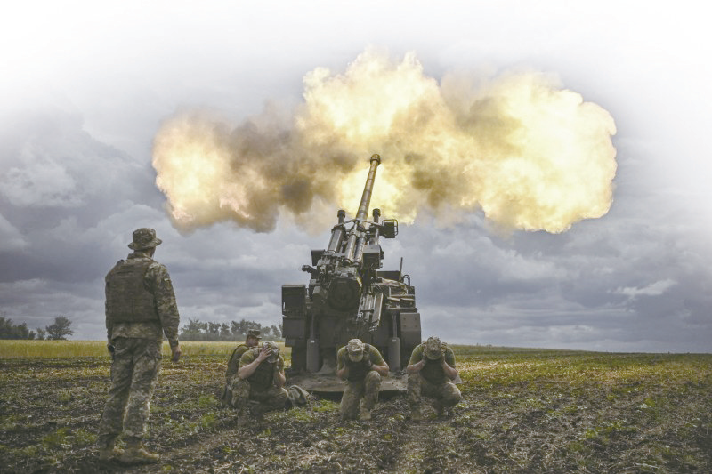

# 俄阶段性挫败乌军大规模反攻？普京：乌军损失每天在持续增加

【环球时报特约记者 柳玉鹏
陈山】从6月初开始的乌军大规模反攻似乎陷入停滞状态，尽管俄乌战场多地仍然战火不断，但经过西方武装和培训的乌军并没有能像去年在哈尔科夫方向的反攻那样取得明显进展，不少西方分析人士担心乌军反攻陷入僵局后，可能会影响到西方对乌克兰的持续援助，为此不断为乌军下一步行动出谋划策。

**俄军：乌军反攻损失惨重**

据俄罗斯《观点报》18日报道，俄国防部发言人科纳申科夫当天表示，乌克兰军方在过去24小时内继续试图向扎波罗热、南顿涅茨克和顿涅茨克方向发动进攻，最积极的行动发生在扎波罗热方向。在扎波罗热方向的战斗中，俄军在24小时内摧毁了乌军33辆坦克、30辆步兵战车和35辆装甲车；在赫尔松方向，俄军消灭30多名乌军人，摧毁2辆汽车，1门美制M777火炮系统等；在顿涅茨克方向，俄军击退乌军8次进攻，消灭210名乌军人。

_乌军炮兵猛烈开火_

俄罗斯方面近日不断宣传已经“阶段性地”挫败了乌军的大规模反攻。俄罗斯《观点报》17日称，俄总统普京在圣彼得堡国际经济论坛全体大会上对记者表示，乌克兰正在着手尝试新的反攻，“现在战斗就在进行中，但基辅没有机会”。他说，乌军正在使用所谓的战略预备队，但重要的是，他们没能在任何一个地段达成目标。普京称：“乌克兰军事技术装备损失每天在持续增加。截至目前，乌军损失了大约186辆坦克和418辆各类装甲车。”俄国防部14日通报称，自6月4日反攻以来，乌军在战斗接触线上死伤约7500人，这还不算俄军使用远程精确制导武器和空中力量深入乌克兰境内的打击给乌军造成的损失。

俄罗斯《消息报》17日援引美国政治学家约翰·瓦罗利的话称，普京在圣彼得堡国际经济论坛上最重要的声明是关于乌军的损失。“这令人震惊，引起了华盛顿的精英们不安，因为全世界都注意到乌军所谓的反攻完全失败了。”北约为此花费了数千亿美元，普京的发言绝对是在羞辱北约，他告诉西方“乌军反攻有多少装备和人员被消灭了”。

俄军事专家弗拉季斯拉夫·舒里金接受《消息报》采访时称：“由于损失惨重，缺乏突破我们防御的成功和前景，当前乌军的反攻活动已经下降。现在战线上的攻击没有此前那么激烈了，因为乌军进攻的第一阶段没有取得成果。在乌克兰军事指挥部，在美国和北约的总部，现在正在疯狂地寻找如何取得成功的机会。乌克兰实现战略转折不会再发生了，这已经没有机会了。但他们希望至少能够在某个地段取得作战成功。”

**西方：乌军反攻不如预期**

西方媒体也部分承认乌军的反攻没有能取得预期效果。当前乌军最主要的突破集中在扎波罗热方向，乌军在反攻中向前推进数公里，可以被称为是“战术规模的胜利”。但美国有线电视新闻网（CNN）17日称，乌克兰对俄军的反攻尚未获得“乐观的观察家们预期的势头”。报道称，当前乌军的攻击类似更广泛军事行动的前奏。到目前为止，乌军的进攻在扎波罗热等乌克兰部分地区取得了一定进展，该地区被视为乌克兰反攻的主要目标，因为占领这里将意味着切断克里米亚和顿涅茨克东部之间的陆桥。但“俄军多层次防御被证明难以破解”。CNN承认，乌军必须对准备充分的俄军防御阵地进行正面攻击，而且关键在于“乌军缺乏制空权”。俄军已经用了几个月的时间来加强当地的防御工事，“乌克兰人永远不可能像去年秋天在哈尔科夫那样取得闪电般的突破”。英国国防部17日发布的最新情报评估也表示，由于攻击直升机的成功行动，俄军“在乌克兰南部获得了暂时优势”。

对于乌军当前反攻的战略意图，相比早先“突破俄军防线、恢复被占领土地”的乐观预计，各方说法也开始变化。美国智库战争研究所的评估认为，乌军在反攻中似乎并没有将西方协助组建的主力部队集中在一个方向使用以形成压倒性力量，而是试图在不同地点发动攻击，从而找出俄军防线的薄弱区域。但报道提醒说，当前俄军采取的策略是利用防线消耗乌军主力，尤其是向前突击的乌克兰主力部队将离开己方近程防空和电子战系统的保护，更容易遭到俄军远程打击。

乌克兰总统泽连斯基办公室主任顾问米哈伊洛·波多利亚克17日则表示，乌军反攻才刚开始，在第一阶段，主要是在不同方向对俄军后方补给打击火力强度增加，以降低俄军整体防御能力。当前乌军反攻的首要目标不是突破俄军防线，而是消灭尽可能多的俄军士兵和技术装备，并“增加俄军的心理压力”。

俄“自由媒体”网站16日称，五角大楼透露了乌军可用于反击的预备队规模。美军参谋长联席会议主席马克·米利称，北约已经为乌克兰训练了6万名军人。为了推进反攻，乌军组建了12个突击旅。此外，美国还在训练更多的乌克兰部队。同时，西方国家为向乌克兰提供的北约装甲车辆培训了5000名乌军操作人员（司机、技术人员、射手）。他们中的大多数人现在都在前线。“乌军部队使用了几乎所有北约装备，这些装备要么已经在前线，要么已经从第三梯队转移到第二梯队”。乌克兰独立新闻社17日报道，乌克兰军事专家弗拉季斯拉夫·谢列兹涅夫称，乌军正在为即将到来的作战行动做准备。他说：“我们可以说大规模的反攻已经开始了吗？我认为这项准备工作还正在进行中，因为目前12个突击旅中只有3个投入使用，其他的都处于战略预备中。让俄军总参谋部感到紧张的是，他们不知道乌军的主要力量将在哪里反攻。很难预测乌克兰的反攻将持续多久。很明显，最终的结果将取决于所动用的资源和俄军的抵抗能力。”

**下一个突破点在哪里？**

为破解当前乌军反攻面临的困境，西方也在不停帮忙出主意。针对当前乌军反攻时未能掌握制空权的现状，多家乌克兰媒体17日报道称，瑞典政府透露，瑞典空军正在培训乌克兰飞行员，外界猜测这可能是乌克兰获得瑞典“鹰狮”战斗机的前兆。据称，乌克兰一直呼吁西方提供先进战斗机，主要针对的是美制F-16战斗机。由于乌克兰空军基地条件糟糕，相比于维护保养复杂、对机场起降条件要求高的美制F-16战斗机，瑞典“鹰狮”战斗机在设计之初就考虑到在恶劣战场环境的使用需求，对于后勤的要求非常低，因此西方军事观察家认为，“鹰狮”战斗机更符合乌克兰的实际需求。

美国“动力”网站17日称，在卡霍夫卡水电站大坝决堤近两周后，尽管汹涌的洪水淹没了水电站下游的大片土地，但上游的水位也大幅下降，“实际上排除了原本阻碍乌军过河的巨大天然屏障”。报道提到，有传闻称，乌克兰特种部队近日越过卡霍夫卡水电站上游的河道，试图在当前俄军防线的后方建立桥头堡，进而对赫尔松和克里米亚的俄军防线构成更直接的威胁。报道猜测，乌军或许会抓住大坝决堤带来的改变，对俄军发动新的攻击。“如果此举获得成功，俄军自去年秋天从第聂伯罗河左岸撤离以来，赫尔松和克里米亚地区将面临直接威胁。此外，如果乌军在卡霍夫卡水电站上游找到更多的过河点，扎波罗热的俄军防线也将受到威胁。”

