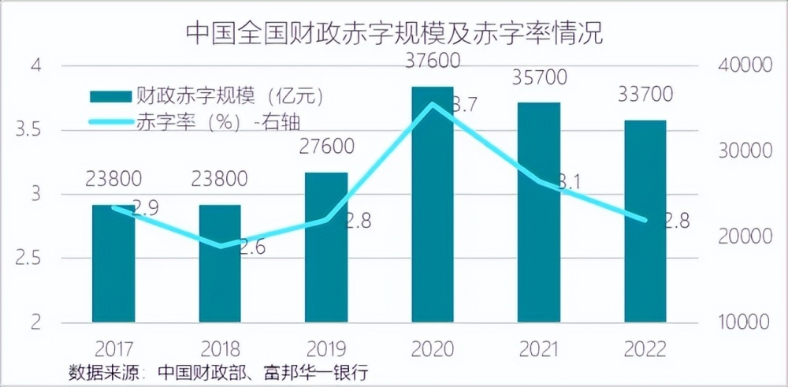

# 停滞20年的大学学费陆续全面松动，大学学费是否应该上调？

倒挂的学费，极低的入学资格门槛，中国高等教育已经无限逼近“普惠式教育”。

**停滞20年的大学学费陆续全面松动**

近日媒体关注到上海高校学费的大幅调整：上海拟从2023年秋季学年起，将公办高校本专科平均学费标准由5420元/生·学年调整至7215元/生·学年，调幅约33%。对于新生来说，每生每学年学费（两个学期）平均多支出约为1795元。

其实早在4月上海就举行了学费调整的听证会。参加的相关方面负责人对这一方案总体表示支持，认为现行学费标准已实施20多年，目前高等教育教学培养模式、专业设置、办学成本、社会需求都发生了变化，对现行收费政策进行优化，有利于推动本市高等教育高质量发展。

今年进行高校学费调整的还有吉林，四川等地。其实最近两年，安徽、陕西等地也陆续启动了高校本科学费调整工作。在2021年4月安徽本科高校学费调整的听证会上，相关方面公布了此次安徽省普通高校本科平均学费标准：由每学年每学生3885元调整至4900元，上调幅度26.1%，计划2021年秋季招生开始执行。根据这一调整方案，调整后的平均学费标准占生均培养成本比例为
20.1%，没有超过相关部门规定的 25% 的上限。预计到 2024 年每年可以增加学费收入 5.76 亿元。

至于原因，安徽教育厅负责人解释，随着教育培养成本的不断提高，经费不足仍然是制约全省高校办学水平提高及高校进一步发展的一个重要因素。该负责人表示，"
实现高等教育高质量发展，迫切需要进一步加大高等教育投入。在政府加大投入的同时，适当调整学费标准，有利于引导高校资源配置和学科建设等，为全省高等教育高质量发展提供资金保障。"

这也是安徽20年来的第一次调整学费。

同年，陕西也启动了学费调整的听证会。在陕西举办的听证会上也强调，大学收费标准自2000年后就再也未曾调整过。2020年9月，河南，也在举办听证会后正式启动了大学学费调整工作。

各地对高校学费的陆续调整，初步打破了高校学费20年不变的现状。

**学费倒挂，高校学费成了非义务教育阶段学费的洼地**

20年来，因为种种原因，全国绝大部分高校学费被死死按住，不准提高，尤其是大多数公办高校的学费处于完全停滞的状态。上海、安徽、陕西等地高校的现状，基本代表了大部分公办高校的现状，即便是清华大学一般专业学费也仅有5000多。

当然，一部分学科专业因为专业的特殊性，相对较高，但也是一直没有调整变化过，例如中央戏剧学院表演、戏剧影视导演、戏剧影视美术设计、播音与主持艺术专业每学年10000元。

民办高校则是其中例外。在大量公办高校学费调整被停止的同时，以大量独立学院为代表的部分民办高校，一直相对灵活。于是在高等教育领域出现了一种奇怪的现象：质量普遍较高的公办学校，学费最低；办学水平与质量普遍较低的民办高校，学费反而普遍较高，出现了不正常的倒挂现。这与国外高校则完全不同，学费与办学质量成正相关，水平越高，学费则越高，水平低，则学费越低。

在大学学费停滞的同时，其他非义务教育学段的学费伴随物价与管理的调整，不断飞涨，我国不同教育阶段学费出现了严重倒挂的现象。在许多城市，幼儿园月收费超过3000元的比比皆是，超过7、8000的也屡见不鲜。同时，私立的中小学（含所谓国际学校）年度学费超过2、3万的比较普遍，在北京上海等大城市，高端的私立学校学费动辄超过数十万，最高竟然超过了45万/年。

本来应该成为非义务教育阶段学费高地的大学学费，反而成了极端洼地，清华北大一年的学费甚至不及一个高端幼儿园一月的学费，中国教育出现了极其诡异的一面。

_*上海浦东新区部分幼儿园收费标准（元/月）_

**低廉的学费在制约高校发展的同时普惠式的高等教育模式也无以为继**

与此同时，高等教育完全进入普及化时代。2021年，全国高校招生1001万人，报名人数满打满算仅有1078万人，这其中还包括了数百万中职学生，绝对录取比例超过了93%。在报名人数第二多的广东，专科录取线仅有100分。在黑龙江，理科本科线也仅有280分。高等教育普及化，已经发展到“考不上大学”变成一件很困难的事情。
2022年，高等教育毛入学率逼近60%。

**极低的学费，极低的入学资格门槛，中国高等教育已经无限逼近“高等普惠教育”。**

目前的学费，与实际的成本相去甚远。在陕西的听证会上，陕西省成本调查监审局对全省63所公办高校2017-2019年学历教育生均培养成本进行监审，经审核生均学历教育培养定价成本2.88万元/生·年。根据陕西提出的两个方案，调整增幅最大，即增长27%后，也仅占实际培养成本的23.50%。

在听证会上，来自西北大学财务处的任君瑞说：目前学校投入在支出中占比越来越大，学费占比越来越小。西北大学2005年各类学费收入为1.16亿元，占学校总收入的27%，去年收入2.8亿元，但仅占总收入的15%。学费收入的增长主要是学生人数的增长，在教育成本的分担机制当中，财政的负担比例越来越大，而学费发挥的分担作用越来越弱，不符合国家关于完善非义务教育培养成本分担制的原则。

目前我国高等学校教育经费以国家直接财政拨款、学校自筹两个板块为主。自筹经费中主要是三个板块，一个是学费，一个是科研经费，一个是社会捐赠。对于大多数地方高校，科研经费，尤其是社会捐赠等是一个短板，学生学费在学校的财政结构中占据了重要地位，是除财政拨款外，主要收入来源之一。

随着物价上涨、高校办学规模的扩大，高校的办学成本也快速攀升。近年来，虽然国家财政拨款在高校教育经费中所占比例呈逐渐上升趋势，但仍无法弥补学校规模扩大、物价上涨、人员经费提高等因素带来的资金缺口。

例如，东北某高校2000-2016年的教育支出上涨约了6倍。若按成本分担原则，学费标准相应也要有所提高。但学费仍维持在2000年的水平，这显然给学校施加了不小压力。

正是面临着种种财务压力，西北大学等高校降低甚至取消一部分研究生的补贴，就曾引来舆论关注，相关高校明确回复：伴随招生量的增长，承担不起了。

如果国家财政有这样的支撑能力，我们也可以继续以这种模式发展，但显然已经捉襟见肘。从宏观看，目前国家财政在提高教育投入，尤其高等教育投入上困难越来越多。

近年经济下行压力增大，降费减税导致财政收入增速下滑，在未来可预期的一段时间内，对于教育的投入难以保持较高的增长。更重要的是，国家教育投资这块蛋糕近年也开始做结构性调整，每一个阶段的教育都有充足的理由需要增加投入。比如根据学前教育政策调整，国家承担主体责任，学前教育成为近年教育投资的重头，占比快速上升。在基础教育上，还面临提高教师待遇，普及高中教育，高考改革等等，这些也都需要提高投入，这些都让教育财政捉襟见肘。

经济的发展显然也无力支撑。根据财政部数据，2022年上半年全国地方一般公共预算本级收入5.5万亿元，扣除留抵退税因素后增长4.7%，按自然口径计算下降7.9%。地方一般公共预算支出约11.3万亿元，比上年同期增长5.9%。一对比就明白，上半年我国各地处于财政赤字的状态，赤字金额为5万多亿元。

2023年一季度，全国一般公共预算收入62341亿元，同比增长0.5%，但支出67915亿元，同比增长6.8%。

高等教育不是义务教育，不是必须保障的教育阶段，显然不大可能力保投入，那么怎么办？至少增加社会公众的投入是必要的，也是合理的，这也是近年相关部门不断提出完善非义务教育阶段成本分摊机制的原因。学前教育已经明确由国家承担主体责任，高中仍然是基础教育阶段，主体仍然是以国家为核心，那么剩下的，主要就是高等教育了。

**有钱不一定能办好一所高校，但没有钱却是万万不能的。**
最新一期双一流名单公布，广东成为大赢家，这和广东这些年对高校的投入是分不开的。2018年，深圳对高等教育的财政投入，就超过了北京上海的总和。深圳职业技术学院在高职学校里遥遥领先于其他高职院校，和深圳的投入显然无法分离。2022年，深圳职业技术学院的财政收入超过33亿元，在全国也可排在前70名。

**调整高校学费的四个理由和一条红线**

对于高校学费调整，大家都有很多的顾虑，在安徽陕西河南的听证会会上代表们都表达了一些担忧。对此，我们首先可能需要统一思想与认知，求得社会公众的理解与支持，尤其是对穷且益坚的孩子给与足够的保障基础上调整，否则就会引起社会的不满，对公平的质疑，这也是当年高校学费被死死摁着的重要原因之一。

**第一，针对贫困学生的相关扶助制度已经非常完善，国家每年扶助贫困学生的金额已经超过2600亿，学业优秀的孩子绝不会因贫困而失学，为调整高校学费提供了基础保障。**

伴随社会发展水平的提高，无论是各级教育部门，还是学校，或者是社会金融部门，对贫困学生的扶助制度与助学贷款已经非常完善，基本可以做到全覆盖了，尤其是国家这个主力军。如今，我国建成覆盖学前教育至研究生教育的具有中国特色的学生资助政策体系，实现各教育阶段全覆盖、公办民办学校全覆盖、家庭经济困难学生全覆盖。今年教育部发布会上披露，目前国家每年对贫困学生与优秀学生的资助资金已经超过2600亿，年资助人次1.5亿，基本做到“应助尽助”。

这一系列扶助政策，已经有力地保障了穷且益坚的孩子读书的权利，为调整高校学费也创造了重要的前提条件，也应该广泛让公众知晓。这和20多年前我们仍在精英教育时代，同时各种扶助手段不完善，一些贫困家庭大学生无法顺利完成学业引发我们对教育公平的担忧是不同的。

**第二，我们明白一个道理，高等教育不是义务教育，必要的经济成本也是个人应该分担的，更是社会资源配置，包括劳动力层次分配重要手段之一。**

高等教育不属于义务教育，不是所有人都必须上的，过低的学费事实上也造成高等教育无限逼近“高等普惠教育”，对于职业教育发展也是间接的掣肘。从劳动力构成上来讲，也必然是一个金字塔结构，最后所有学生都涌入高等教育，是否妥当？就业问题又如何解决？

就业难，最大的困难之一就是期望值错配：并非绝对的需求岗位太少，而是达不到大学生的期望。日前国家发改委相关负责人披露，近年中职与高职的毕业生就业率分别超过了95%和90%，明显超过了大量本科高校。这其中固然有职业教育的优势，但我们显然不能说中职教育的质量比本科还高，不能否认不同学历层次同学对于就业期望值的差异。

不断推高的学历，显然在加剧这种就业上的结构性矛盾。

**第三，要获得公众支持，还要正确理解“不能让一个大学生因贫失学”的观念，这一说法在当下对于部分人，已经失去了正当性。**

在精英教育时代，招生人数较少，上大学不容易，同时，包括学生贷款以及贫困学生扶助政策不够完善，我们有必要喊出这个口号，不仅仅是对公平的保障，也是对勤奋学习孩子的褒奖，是我们优秀文化与传统的继承。

但在今天，高等教育完全进入普及化，几乎人人都能上大学的背景下，这一口号对于一部分人已经失去了正当性。很多根本不愿意学，不努力学习的孩子也有条件与机会大规模进入高校。在这种情况下，过度强调这一点，已经缺乏足够的正当性，甚至形成误导。

**第四，适当调整高校学费，不仅是对高等教育投入的有效补充，也是加强对中西部与地方高校扶助的有力措施。**

无论如何，足够的财力都是高校发展的重要基础。和著名高校相比，地方高校对学生学费依赖还是比较大的，尤其是经济欠发达地区。适当调整学生学费，对于缓解地方高校经费压力有着重要而积极的意义。与一流大学不同，地方高校学生学费在学校的收入结构中占比较高，对学校的收入构成影响是很大的，适当提高学费，对地方高校，尤其是中西部欠发达地区的高校，有着现实的意义，在当下也比较迫切。

**调整高校学费的同时，也需要吸取其他非义务教育阶段私立学校收费失控现象的教训，严控整体水平与红线。**

当然，允许高校调整学费，并非可以随意增长，我们必须吸取学前教育与私立中小学学费失控的教训，有成本核算的基础上，进行总体控制，比如设置上限等。

目前相关部门设置了学费的上限，即最高不能超过培养成本的25%。目前公办学校执行得比较很好，但是民办高校往往因为缺乏足够的财政支持，学费普遍较高。对于这一现状，也需要实事求是，让市场去检验淘汰。目前民办高校因为质量与学费贵的原因，导致报到率极低，就是市场最好的反馈，给公办学校也是一个警示。

伴随新生儿快速降至956万，高校生源危机已经在赶来路上，如果没有质量，高昂的学费也救不了你，只能是毒药。

_资料图_

