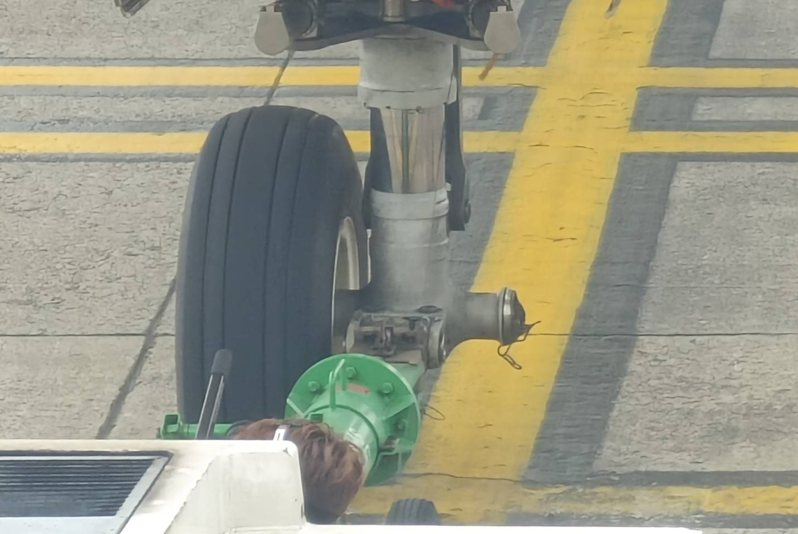

# 台媒：新加坡廉价航空一航班，降落桃园机场后发现前轮少个轮胎

【环球网综合报道】联合新闻网等多家台媒消息称，新加坡廉价航空“酷航”一架TR-897航班，今天(19日)凌晨从韩国仁川飞往桃园机场，降落时才发现飞机前轮少了一个轮胎。

_新加坡“酷航”TR-897航班从仁川飞抵桃园机场，降落后发现少了前轮左侧轮胎。图自台湾联合新闻网_

据台湾联合新闻网报道，新加坡廉价航空“酷航”TR-897航班今天凌晨零时6分从韩国仁川飞抵桃园机场，降落前发现前胎胎压异常，降落机场后地勤人员发现飞机前轮少了左侧轮胎，仅剩右侧轮胎还在。目前该航班在等待维修。

