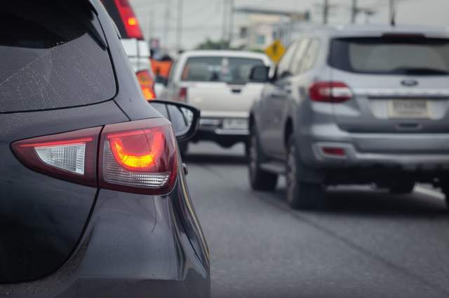

# 国六a切换到国六b，汽车为什么没有大甩卖？

“几个月前汽车价格战的时候，网上很多消息说是已经接到通知，5月底15万买奥迪A4，17万出头买宝马3系。还有说国六b排放标准马上就要实施，几百万辆已经生产出来的国六a标准的车都会清仓大甩卖。这都6月中旬了，怎么还没听说哪里大甩卖？”早在3月就打算买车的小于（化名）听了当时身边一群亲戚朋友的分析，决定再等几个月，到5、6月汽车大甩卖时再抄底。可是眼下汽车虽然仍有优惠，但3月的“盛况”再也没有出现，所谓的多个品牌大甩卖更是毫无迹象。

如小于一样等待新一轮汽车降价潮的消费者不在少数。但令他们失望的是，距离国六b排放标准实施仅剩不到半个月时间，之前网上流传甚广的会令人大吃一惊的新一轮价格战却并未到来。

按照5月8日生态环境部、工信部、商务部、海关总署、市场监管总局发布的《关于实施汽车国六排放标准有关事宜的公告》，自2023年7月1日起，全国范围全面实施国六排放标准6b阶段，禁止生产、进口、销售不符合国六排放标准6b阶段的汽车。

但多数等待再一次大降价的消费者不知道的是，早在2016年轻型汽车的国六标准发布开始，体系能力较强的车企就开始以此进行研发和生产汽车，经过数年的发展，多数车企早已开始按照国六b标准生产汽车。所谓的“排放标准切换”，在实际生产销售过程中，已经实施多时。

而且，考虑到此前疫情对生产、销售进程等所造成的影响，《关于实施汽车国六排放标准有关事宜的公告》中还特别指出，针对部分实际行驶污染物排放试验（即RDE试验）报告结果为“仅监测”等轻型汽车国六b车型，给予半年销售过渡期，允许销售至2023年12月31日。

这意味着，小于和其他等待大甩卖的消费者们，注定等不到市面上多数车型的价格大降。只有少数技术滞后，不具备国标切换能力的小众汽车品牌，或许在面对这一政策时，会被迫选择降价清仓。

事实上，小于的亲朋好友们之所以会判断国标切换前汽车会出现大规模降价，在一定程度上也是受到了经验之谈的影响。2019年，在国五切换国六前夕，由于不少省市提前实施国六标准，且在当年7月1日后限制不符合国六标准的车型上牌，导致多个品牌经销商清库存压力陡增，不得不大幅降价。但这一次，由于给了车企充足的准备时间，国标切换前“遍地八折车”的情况没能再现。

从时间线来看，我国从国一升级国二标准用了5年时间，国三升级国四标准用时3年，而从国五到国六仅仅用了2年，从国六a到被称作“全球最严苛标准”的国六b，中间也仅相隔了3年。许多业内人士表示，虽然我国制定汽车排放标准的时间较晚，但却用20年的时间走完了欧美国家30年的排放升级之路。

_图/图虫创意_

**全球最严标准**

我国的汽车排放标准升级虽然快，但每一次给汽车行业带来的震动都不容小觑。像这次国六a平稳切换到国六b的情况，是建立在近年来国内汽车企业在研发层面不断进步的基础上。

两会期间，全国人大代表、中国科学院生态环境研究中心副主任贺泓在接受采访时公开建议，我国应该尽快研究制定国家第七阶段机动车污染物排放标准。

今年以来，关于“国七标准正在制定，最晚将于2025年实施”等消息也反复出现，虽然仍没有官方通告，却也在业内引起了一阵讨论和争议。

国六b还没实施，国七又要提上日程了？尽管这只是一个建议，但从汽车市场的发展来看，标准切换越快，被淘汰的车企也就越多。在当前本来就竞争激烈且整体增速放缓的态势下，汽车行业也越来越焦虑。

排放标准切换升级，到底革了谁的命？

“国六”标准，全称为“国家第六阶段机动车污染物排放标准”，包含“国六a”和“国六b”两个排放限值方案，其中“国六a”标准于2020年开始实施。

国六b指的是国六标准第二阶段，其排放限值较国六a更加严格。一氧化碳、非甲烷碳氢化合物、氮氧化物及其PM细颗粒物等排放标准限值较国六a降低了30%-50%左右。因其复杂性和标准门槛大于“欧六”标准，因此在发布之初也被业内称为“全球最严排放标准”。‍‍

过去，欧洲机动车排放标准一直是我国排放标准升级的重要参考，但国六的实施，一举超越了欧排标准。根据欧六标准的要求，家用轿车每公里一氧化碳排放不高于1g，氮氧化物不高于0.06g，PM细颗粒物不高于0.005g，而国六b的对应标准则分别是0.5g、0.035g、0.003g。‍‍‍‍‍‍‍

此外，国六b排放标准还增加了实际道路行驶排放监测（RDE），只有RDE监测结果不超过标准限值且符合20万公里耐久要求的车型，才能满足国六b排放标准要求。

尽管要求严苛，但从目前情况来看，我国汽车市场顺利过渡并非难题。中国汽车工业协会表示，自国六标准发布起，多数企业按照国六b标准要求进行产品研发和生产，业内相当于提前实施了国六b标准。

据协会统计，截至2023年1月底，不满足实际行驶污染物排放试验(即RDE试验)要求的库存车辆超过189万，含已采购部件的库存车辆超过200万。而1-5月，国内汽车销量已经超过千万辆。

中国汽车工业协会副秘书长陈士华表示，生态环境部等五部门联合发布的《关于实施汽车国六排放标准有关事宜的公告》有助于市场稳定。

中信证券研报指出，市场上仍有部分老旧车型不符合国六b排放法规，其去库存行为可能对行业产销、价格产生影响。但此次国标切换影响的时间维度不会太长，影响程度也将明显小于2019年国五向国六a的切换。

**“大排量”成为历史？**

“机动车排放标准切换升级，淘汰了一些实力不足、研发掉队的品牌，我并不觉得可惜，这些品牌不被政策淘汰也会被市场淘汰。可惜的是一些大排量、大功率的好车也退出了市场。”作为资深越野玩家同时也是卖家的大华（化名）对此十分惋惜，鉴于环保压力无可奈何，但六缸及以上发动机的魅力，真的无法替代。

在他看来，国六标准在很大程度上抹平了丰田普拉多、BBA等在高功率版本上车型的优势，导致从前的许多“神车”落幕。

丰田普拉多是其中的典型代表。早在2017年底，一汽丰田就已经停产了普拉多2.7L车型，仅提供3.5L车型。2019年，丰田汽车宣布，迫于排放法规的压力，将于次年正式停产旗下普拉多3.5L车型。2020年6月，一汽丰田四川工厂最后一辆丰田普拉多下线，并配文“2003-2020年，346706台，霸气收官”，从此正式在华停产。

雷克萨斯LX的5.7L
V8时代也已远去，尽管国外已经推出了LX600，但由于排放问题，至今未引入国内市场。奥迪A8、R8以及宝马M760Li的12缸时代，也成为了绝唱。

除了选择停产之外，还有不少大排量车型为了适应新规，选择了“脱胎换骨”。路虎卫士、奥迪A8L、奔驰S级等多款车型均推出了2.0T版本或者搭载48V轻混技术。丰田、大众、通用、福特、BBA等此前拥有大排量神车的品牌，目前的主力发动机都是2.0T以下，多缸大排量正在成为历史，1.5T、三缸、轻混、插混正在不断渗透。

在大华看来，大排量车最后的去处只能是成为一些收藏用的“奢侈品”，毕竟除了油耗高，车船税、保险高之外，这类车型的维修保养费用也远超小排量车型。

从全球汽车业的发展史来看，无论是基于经济、能源还是环保层面的原因，车型的进化和普及都与大排量车型背道而驰。这也是继德系车、美系车之后，日系车在全球连续多年保持销量领先的主要原因之一。而到了当下全球汽车业电动化转型的时代，中国汽车终于开始实现“弯道超车”。

“产业升级是大势所趋。”中国汽车工业协会副总工程师许海东认为，不论是排放标准的实施还是促消费政策的推出，都将进一步带动整个汽车产业绿色转型，加快新能源汽车推广应用。

作者：郑宇

