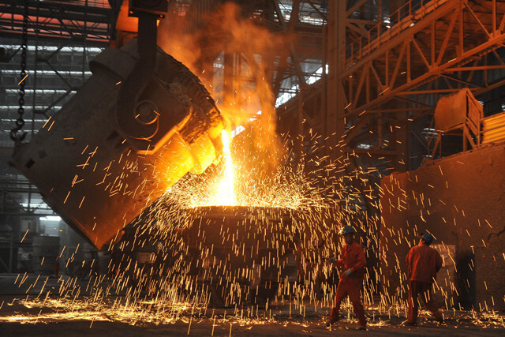

# 在超常规手段打压中资手机后，印度又“盯上”了中国的钢铁

在对中国手机不断下手后，印度又把目光盯上了中国的钢铁。

**印度间接税和海关中央委员会（CBIC）主席乔里（Vivek Johri）日前表示，印度财政部正审查关于征收中国钢铁反补贴税的建议。**
印度间接税和海关中央委员会是印度财政部的下属部门。

随着印度经济增长，对于中国钢材，特别是优质钢材的需求大增。 **根据最新公布的数据，2023年4月，印度从中国进口的成品钢数量创5年来最高纪录。**

对于这一新动向，上海国际问题研究院中国与南亚研究中心秘书长刘宗义告诉第一财经记者，中国钢铁产量位居全球第一，不少产品物美价廉，自然对印度同类产品构成了竞争，“印度利用关税作为壁垒，一方面是要保护国内产业，另一方面是希望缩小与中国的贸易逆差。”

**印度再次盯上中国钢铁**

印方数据显示， **印度在4月共进口了50万吨成品钢，这是2019年以来的最高水平，同比增长38.2%。**
中国对印度出口的成品钢主要是用于汽车、家电和耐用消费品的冷轧钢板，以及电气钢板和管道用钢材。当月，中国向印度出口的钢铁产品，占到印度成品钢进口总量的近四分之一，同比增长近八成。

此前，印贸易救济总局（DGTR）提议对中国进口钢材产品征收反补贴税。印度部分钢铁企业指称，中国钢材享有约补贴，售价低于印度产钢材的30%至40%，因此相对印度同类产品具有很高的市场优势，随着产品大量涌入市场，导致印度中小型企业制造的本土钢材滞销，这些企业的产能利用率仅达到30%。

在2022年中印双边贸易中，中国对印出口进一步增长，这主要是疫情后印度内需扩大，并且随着印度经济的升级，对中国中间产品的需求进一步扩大。不过2022年中国自印度进口大幅度降低，导致印度对华贸易的逆差进一步拉大，印度方面一直试图通过各种办法降低逆差。

**其实，这已不是印度第一次“盯上”中国钢铁了。**
2017年7月4日，印度对中国热轧和冷轧不锈钢板作出反补贴肯定性终裁，建议对中国涉案产品征收进口报关价18.95%的反补贴税。2017年9月7日，印度开始对中国涉案产品征收反补贴税。

但2021年，在疫情后印度为降低国内企业的生产成本，促进国内经济的恢复，印度取消了部分钢铁产品的反倾销税与反补贴税，并降低了钢铁产品的进口关税。作为印度的主要钢铁进口国，中国再次向印度大量出口钢铁产品，中印之间的钢铁贸易在短期内迎来繁荣。

中印之间的钢铁贸易并不是单向的。印度作为世界上重要的铁矿石生产国之一，是中国铁矿石重要的进口来源国，为中国低品粉铁矿石的市场供应贡献了重要力量。

**印度钢铁需求大**

目前，印度正处于一轮基建热潮之中。根据世界钢铁协会的预测，印度2023年钢铁需求将增长6.7%，至约1.2亿吨，这将是全球主要经济体中增速最快的。

印度总理莫迪2022年11月宣布，经过8年的努力，印度已经成为世界第二大钢铁产量大国。
**尽管已是钢铁生产大国，但随着近年来需求不断增长，印度如今也不得不依赖于更多的钢铁进口来填补供应空白。**

印度国内最大的钢铁生产商京德勒西南钢铁公司（JSW steel）副总经理阿查里亚（Jayant
Acharya）表示，“任何经济体在国家大力建设阶段都需要大量钢铁和大宗商品。而印度正在经历这个阶段，到2030年，印度的钢铁年消费量可能会提高到2亿吨以上。”

印度目前城市化水平仍较低。随着未来城市化水平的稳步推进，印度国内的钢铁消费量还将进一步上涨。印度评级机构ICRA的研究报告显示，在经历了
10年的低增长之后，印度国内钢铁需求可能正处于长期高速增长的风口浪尖。

印度欣欣向荣的钢铁需求已经吸引到一批国外投资，新日本制铁公司和印度米塔尔家族已经成了合资企业，韩国钢铁制造商浦项制铁和阿达尼集团也拟在印度建立综合炼钢厂。

不过， **安全问题是印度钢铁企业的软肋，由于工人岗位技术培训不足，安全生产意识不高，导致印度钢铁厂事故频发**
。6月13日，就在此前发生列车脱轨相撞事故的奥里萨邦，印度塔塔集团的一个钢铁厂内，发生一起安全事故，当时正在检查高炉的工程师和工人被熔化的钢水喷溅导致受伤，在19名伤者中，有2人伤势严重。

