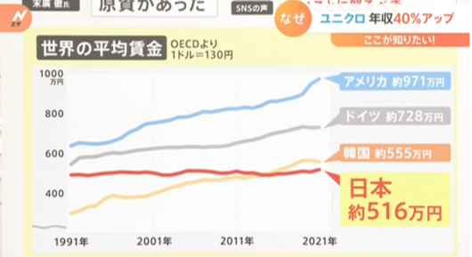

# 日本“三十年如一日”的工资终于涨了，今年创下30年来最高涨幅纪录

日本“三十年如一日”的工资终于涨了。

智库东京商科研究公司(Tokyo Shoko Research)的最新数据显示，今年所有大型日企都提高了工资，大型工会成员的工资上涨了4% ，
**创下30年来的最高涨幅纪录。**

日企与工会的工资谈判初步结果上月出炉，日本大企业在今年春季为员工加薪3.91%， **创下近30年来的最高水平。**

工资上涨对于饱受通胀困扰的日本普通家庭而言，是个好消息，但这并不意味着他们打败了通胀。

4月份，日本名义人均现金工资仅同比增长1%， **而扣除了通胀因素后的实际工资收入同比下降3.0%** ，为连续13个月同比负增长。

另外，该智库研究显示， **四分之一的中小型企业没有加薪** ，这些雇主拥有全日本三分之二的员工。

这意味着， **工资追不上物价的窘境目前并未得到真正改变。**

30年不涨工资的背后

过去30年来，日本工资稳如磐石，在欧美国家工资持续上涨的同时， **坚定在近乎水平的位置向右滑动。**

根据经济合作与发展组织 (OECD) 的数据， 2021年日本的平均年薪为39711美元，近比1991年的37866美元高了1845美元。

**30年的工资累计涨幅不到5%，相比之下，法国、德国等其他G7国家的工资涨幅为34%。**

而从整体来看，日本工资水平也远低于欧美国家。

日本平均工资近为经合组织平均水平（约51000美元）的四分之三。

根据美国金融软件公司Intuit的数据，纽约一名咖啡师的年薪约为 22500 美元，作为对比，日本经济研究所的数据显示，东京一名咖啡师的年薪为 219
万日元（约合15700 美元）。两者相差6800美元。

目前， **日本工资水平处于发达国家中的“吊车尾”位置，甚至还不如隔壁的“老冤家”韩国。**

**造成日本工资“三十年如一日”的因素有很多，但归根结底还是经济的长期不景气。**

1990年代房地产泡沫破裂后，日本经济一蹶不振，基本上处于停滞状态。

1991年至2021年间，日本GDP增长率平均下跌至0.7%，物价30年来也基本没有涨过。

在经济前景悲观的情况下，企业为了防止再次遭遇经济危机冲击，将大量的利润转换为存款，而非提高员工待遇。

这种“蓄水式”的经营模式，使他们先后平稳度过了随后的亚洲金融危机、全球金融危机，以及新冠疫情的冲击。

期间，日本企业还基本上避免了大规模裁员。

然而，不加工资就意味着员工手头紧张，进一步导致消费降级、生产疲软、经济增长无力，这样一来，企业更没有安全感，更加不愿意涨薪。
**一个糟糕的恶性循环形成。**

日本政府曾多次尝试打破这种尴尬的局面。

过去十余年，日本前首相安倍晋三，曾通过刺激政策帮助企业提高了利润，但并未能有效推动企业涨薪。

而现任首相岸田文雄则希望通过“新资本主义”政策改变这一点。

岸田文雄已多次向企业施压，呼吁他们涨薪，帮助日本家庭应对通胀上行。

他希望今年将最低工资标准从961日元（约合48.5元人民币）提高到1000日元， **涨幅为4.2%。** 此外，他还主张对涨薪的公司给予税收减免。

值得一提的是，日本法律规定政府不能干涉企业经营，因此岸田文雄能够说服企业加薪，可见他本人的政治手腕。

兼职、灵活就业人员比例飙升也是日本薪资增长缓慢的其中一个原因。

一般来说，在像日本这样老龄化严重和人口萎缩的国家，劳动力需求紧缺本应该会推动工资上涨。

但是，日本企业会选择雇用女性、学生、退休人员或外国人兼职，来避免用工成本增加。

据OECD日本事务部高级经济学家Müge Adalet
McGowan称，到2021年，日本总劳动力中近40%从事兼职或灵活就业，大大高于1990年的约20%。

McGowan说：

随着这些非正规工人的比例上升，平均工资当然也保持在较低水平，因为他们赚得更少。

除此以外，日本独特的工作文化也间接造就了今天的局面。

**传统“终身雇佣”制度下，公司在涨薪方面非常谨慎，以便在困难时期仍能够保持较低的用工成本。**

McGowan表示，日本基于资历而非绩效的薪酬体系，降低了人们跳槽的积极性。

在经济不景气的背景下， **对于很多打工人来说，一份稳定的工作要比更高的薪水或者升职更具性价比。**

虽然“终生雇佣”近来出现动摇的迹象，但在日本依然根深蒂固，日本工人跳槽频率远不及西方国家。

“日本劳动力市场的最大问题是，顽固地坚持按资历支付工资，”日本著名战略家和投资者Jesper
Koll此前告诉CNN，“如果引入真正的基于绩效的薪酬，将会出现更多的工作流动和晋升。”

通胀高企，工会取得“春斗”胜利，涨薪潮来袭！

去年以来，在全球主要央行开启激进加息风暴的时候，日本央行选择做一个“孤勇者”，坚持超宽松的货币政策。

日本政府的持续刺激，加上两年来能源价格高企，日本物价终于由“通缩”变为“通胀”。

日本4月核心CPI（剔除生鲜食品和能源）升至4.1%，创下1981年以来的最高纪录，5月份东京核心CPI同比增长3.2%，仍远高于央行2%左右的目标。

通胀高企也意味着普通居民的生活成本压力山大。6月初，从方便面，到瓶装酱油，日本国内数千种必需消费品集体涨价。

这使得日本工会在今年的春季劳资谈判中摆脱了“通缩”思维，开启了一场激烈的涨薪“斗争”，并在政府的声援下取得了不错的初步结果。

根据日本经济团体联合会5月份公布的“春斗”——日本大型企业与工会的工资谈判——第一轮结果，日本大企业在今年春季为员工加薪3.91%，创下近30年来的最高水平。

而本轮涨薪潮，则由优衣库母公司迅销集团打头阵。

1月初，迅销宣布3月给优衣库日本国内8400名正式员工涨薪，最高涨幅高达40%！

经过本轮调整，普通员工起薪为30万日元（约合1.54万元人民币），门店经理起薪39万日元（约合2万元人民币）。

随后，涨薪的多米诺骨牌在制造、餐饮、金融等领域蔓延。 **截至目前，大多数日本商业巨头已经宣布大幅涨薪。**

另外， **企业日趋激烈的人才争夺战也推高了毕业生的工资。**

三井住友银行16年来首次上调了大学毕业生的起薪，涨幅超过24.4%，瑞穗和三菱UFJ银行分别将2024年起薪分别提高55000日元和50000日元。

根据《日本经济新闻》近期调查，2023年4月入职的大学毕业生的起薪同比增长了2.2%， **为2010年以来最高涨幅。**

目前还不清楚，由能源成本推高的通胀能持续多久，又是否会刺激日本多年来一直努力实现的那种正增长周期。

日本央行在最新的利率决议中预计，到2023财年中期，CPI（剔除新鲜食品）的同比涨幅可能会放缓，进口对CPI的传导效应减弱。此后，在工资加速增长等因素的支撑下，通胀预计再次升温。

