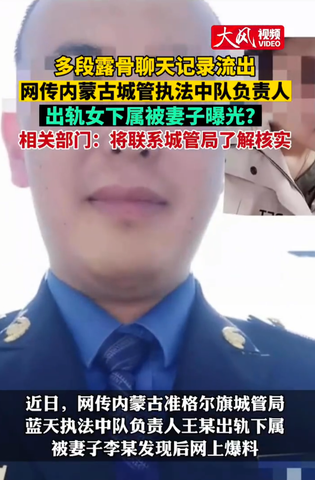
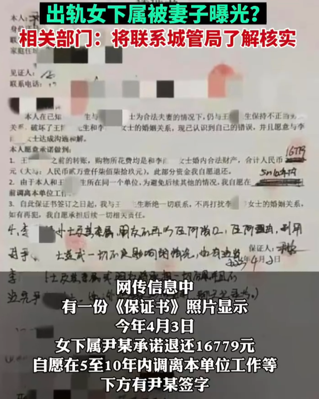
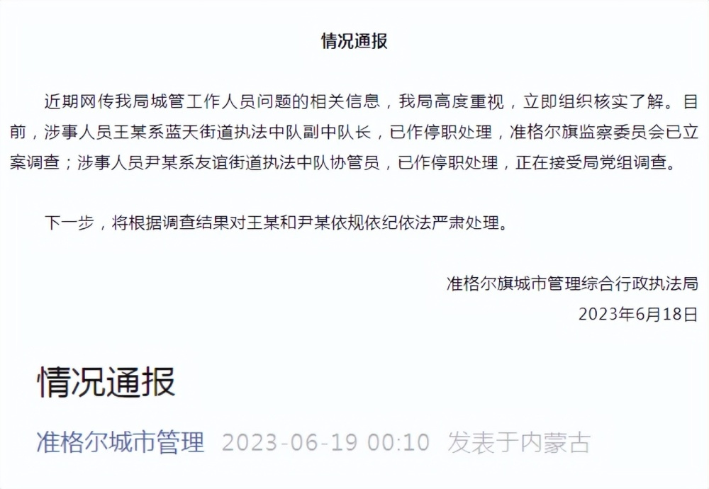

# 网传内蒙古一城管干部出轨女下属，官方：涉事人员均已停职

近日，网传“内蒙古准格尔旗城管局蓝天执法中队负责人王某出轨下属，被妻子发现后网上爆料”。

根据网传截图显示，有时间显示的聊天记录最早为2022年，二人有多段露骨聊天内容。

网传信息中有一份《保证书》照片显示，今年4月3日女下属尹某承诺退还16779元，自愿在5至10年内调离本单位工作等，下方有尹某签字。

18日，准格尔旗城市管理综合行政执法局发布情况通报称，涉事人员王某系蓝天街道执法中队副中队长，涉事人员尹某系友谊街道执法中队协管员，均已作停职处理。

**情况通报**

近期网传我局城管工作人员问题的相关信息，我局高度重视，立即组织核实了解。目前，涉事人员王某系蓝天街道执法中队副中队长，已作停职处理，准格尔旗监察委员会已立案调查；涉事人员尹某系友谊街道执法中队协管员，已作停职处理，正在接受局党组调查。

下一步，将根据调查结果对王某和尹某依规依纪依法严肃处理。

准格尔旗城市管理综合行政执法局

2023年6月18日

（准格尔城市管理、大风新闻）

编辑：赵珊珊

