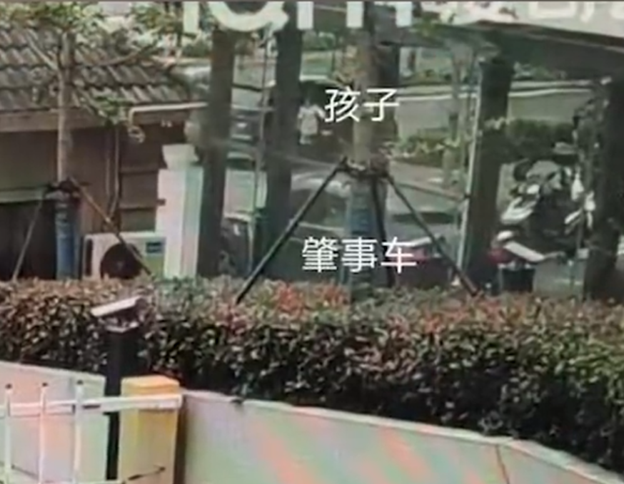
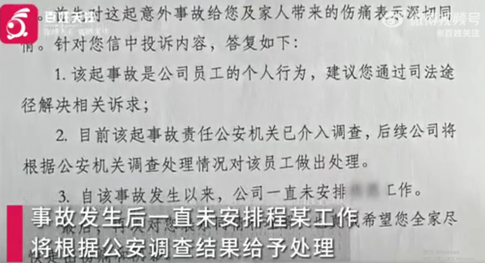

# 5岁女孩遭东航飞行员撞倒碾压身亡，东航回应：已暂停其工作

据九派新闻视频报道，6月20日，南京一女子发视频称，东航江苏分公司飞行员在小区门口，开车撞到她5岁的女儿后不停车，碾压孩子致死，引发关注。

20日，当事人陈女士表示，4月22日上午，爸爸送儿子过马路，女儿自己从车上下来后向爸爸方向奔跑，被肇事者撞上致死。

事故的责任判定书认定双方责任均等，陈女士不认可。

东航江苏公司飞行部一工作人员表示，目前已暂停肇事者的工作，需等复议责任判定的结果，公司再作进一步决定。

另据百姓关注报道，20日，陈女士称，肇事者事发两个月来既不露面也未曾表示过歉意。

陈女士的委托人称，事故发生后，肇事者没有打110，也没有参与抢救。

事发后，陈女士多次打电话、写信件到东航江苏公司，直至5月26日，公司书面回应称系员工个人行为，事发后已未安排其飞行工作。

20日，记者联系东航江苏分公司，其宣传部门一直未接听电话。

**【来源：九派新闻综合九派新闻视频、百姓关注】**

