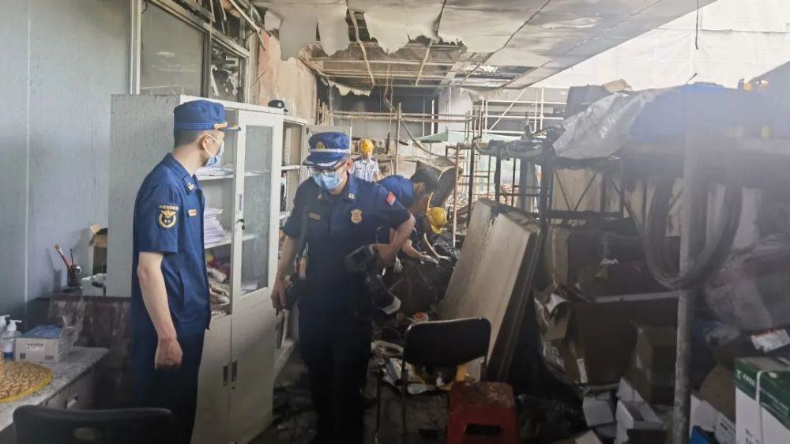
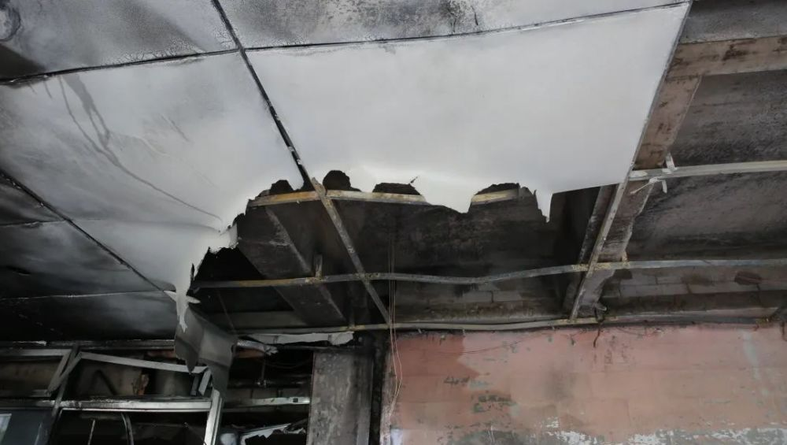
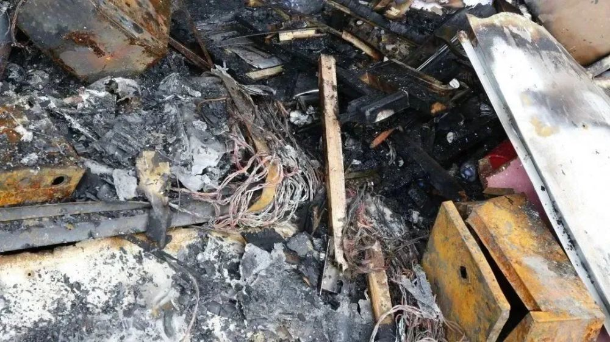
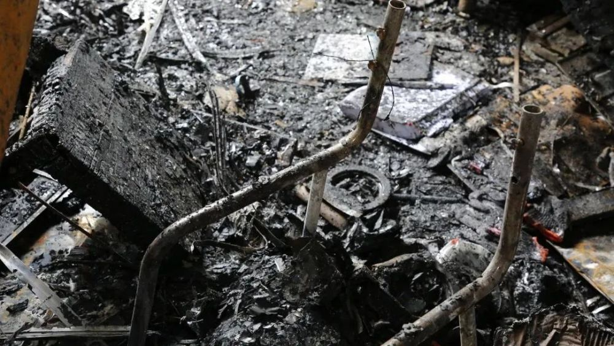

# 上海一医院起火：未造成人员伤亡，1名相关责任人被控制

6月20日晚，国家消防救援局微信公众号“中国消防救援”发布消息称，6月20日凌晨1时17分，上海健康医学院附属崇明医院一临时办公室发生火灾，上海市应急联动中心接到报警后，立即调派崇明区消防救援支队4站14车102名消防救援人员赶赴现场处置，火灾未造成人员伤亡。

本文图片均来自微信公众号“中国消防救援”

经勘查， 起火部位为上海健康医学院附属崇明医院门诊楼和急诊楼之间的连廊外廊部位临时办公室。

该区域总面积为100㎡，火灾烧毁烧损办公室内办公桌、一台计算机及资料等，过火面积约6㎡，微型消防站第一时间到场并进行处置，火灾未对医院正常运行造成影响。

一名相关责任人已被公安机关控制，事故原因正在调查中。

