# 中国247城，谁的罚没收入高

247个地级以上城市，三分之二“罚没收入占比”集中于3%-8%，29个超过10%

**文 | 陈汐 刘建中**

地方政府的收入主要有两种：一种是公共财政收入；另一种是基金收入。

公共财政收入，又称“一般公共预算收入”，主要包括“税收收入”和“非税收入”两大块。基金收入的大头是土地出让收入。在过去几年，绝大多数省份的土地出让收入占基金收入的80%以上。基金收入还包括彩票公益金等。

从发展方向看，地方政府收入应该以“一般公共预算收入”为主，而“一般公共预算收入”应该以“税收收入”为主。

包括“罚没收入”在内的“非税收入”所占比例应当呈下降趋势。“罚没收入”是指执法、司法机关，对违法违章者罚款的款项、没收的赃款和赃物变价款。

一个城市“罚没收入”与“税收收入”的比值（下称“罚没收入占比”）除了可以反映当地财政收入的质量，还可以反映一些其他信息。

在不同地区，“罚没收入占比”差异巨大。在某些城市，这个比值接近于1%，比如北京、苏州、上海。而在另一些城市，这个比值接近30%，比如广西壮族自治区梧州市。

“罚没收入占比”不应过高，也不应增长过快。高增速不一定意味着存在乱罚款、乱摊派等不合理现象，但却可以给研究者提供一个关注点、一个思考方向。

那么，哪些城市的“罚没收入占比”偏高呢？

**为了行文的方便，我们将“罚没收入占比”定义为“A”，即A =“罚没收入”/ 税收收入 = “罚没收入占比”。**

如果仅用某一年的数据排序，比如仅用了2021年的数据，这有可能导致排序失真。这是因为如果某市2021年的“罚没收入”远远高于或低于其他年份，那么排序就有失公允。

为了解决以上问题，本文用2018年-2021年四年数据的平均值。不用2022年数据是因为很多城市还没有披露2022年数据。

如果没有特殊说明，文中各城市的A值都为2018年-2021年四年数据的加权平均值。

各城市的“罚没收入”是四年的总数，税收收入也是四年的总数。所有样本城市的具体数值见尾注表10。

不考虑台湾省、中国香港和澳门，我们从31个省、直辖市、自治区（下称各省）中找到了295个地级以上城市的数据。从中排除了税收收入过低的城市：如果某城市2018年-2021年四年的税收收入总和不足100亿元，将其排除。

最终，选取了247个地级以上城市进行分析比较。具体样本城市见表1。

**表1: 各省的入选城市**

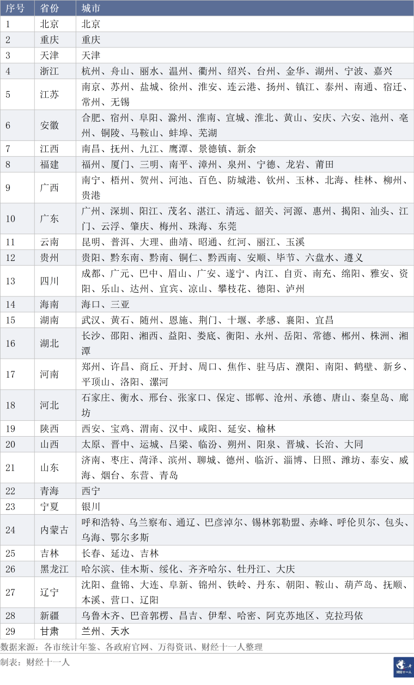

_注1：上海没有单独披露罚没收入，所以没有入选。但根据上海披露的其他数据估算，其“罚没收入占比”约为1%。
注2:西藏因数据不全，没有入选。_

**247个城市A值的分布与特点**

先看一下247个城市的A值分布（图1）。

**图1: 247个城市的A值分布**

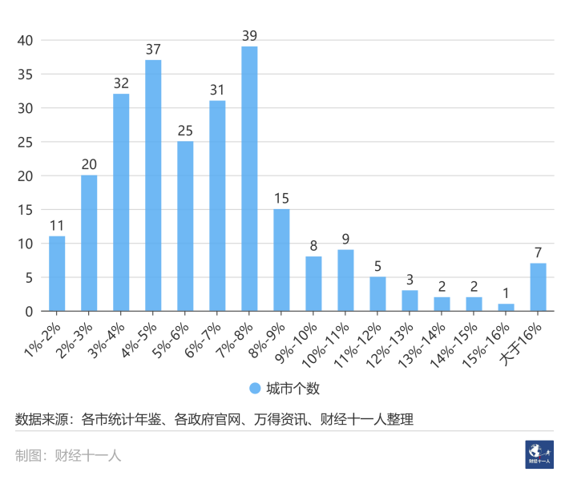

从图1可以看出，各城市的A值集中于3%-8%，这其间有164个城市，占比为66.4%（164/247 = 66.4%），约三分之二。

**247个城市的A值中间值为5.8%。最高值为广西梧州29.8%，最低值为苏州1.1%。**

我们发现，省会城市和资源型城市的A值普遍偏低。

从表2看，样本中26个省会城市A值的中间值为3.2%，且数值普遍低。这是因为省内优质企业倾向于在省会注册，导致省会的增值税、企业所得税偏高，从而拉高了整体税收。

A值=罚没收入/ 税收收入，税收高了，A值就低了。

**表2: 各省省会的A值**

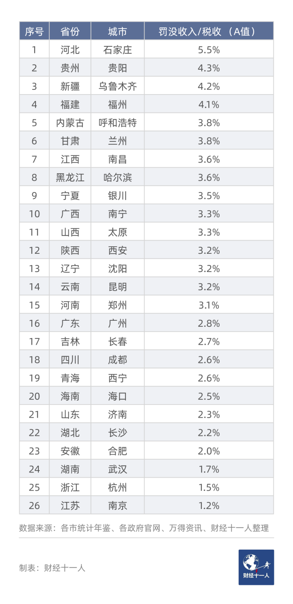

_注：西藏拉萨数据不可得。_

同理，资源型城市往往聚集着大型企业，所以税收较高，A值较低。比如鄂尔多斯、克拉玛依、东营、榆林、大庆、乌海等（见表3）。

**表3: 部分资源型城市的A值**

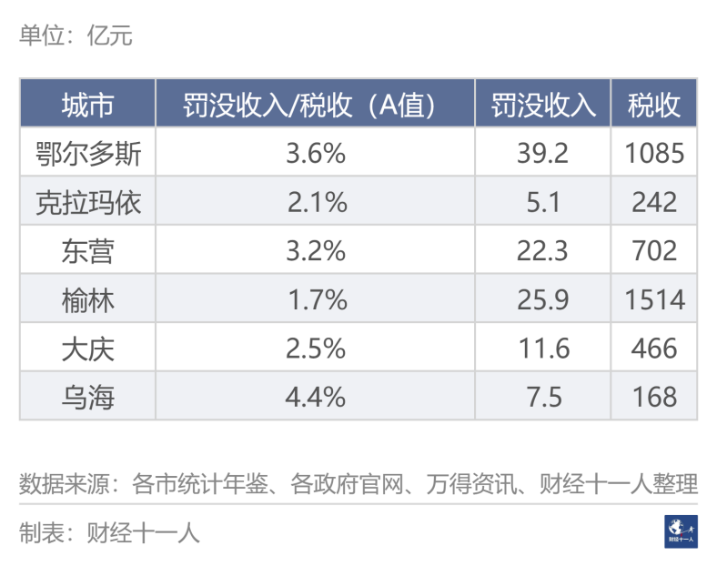

表2和表3提示我们，在分析一个省的普遍情况时，不能过于关注省会城市和资源型城市，而更应该关注其他城市的数据。

表4显示了黑龙江6个城市的罚没收入占比，可以发现，其省会哈尔滨，资源城市大庆的A值很低，而其他城市较高。

**表4: 黑龙江省各样本城市的情况**

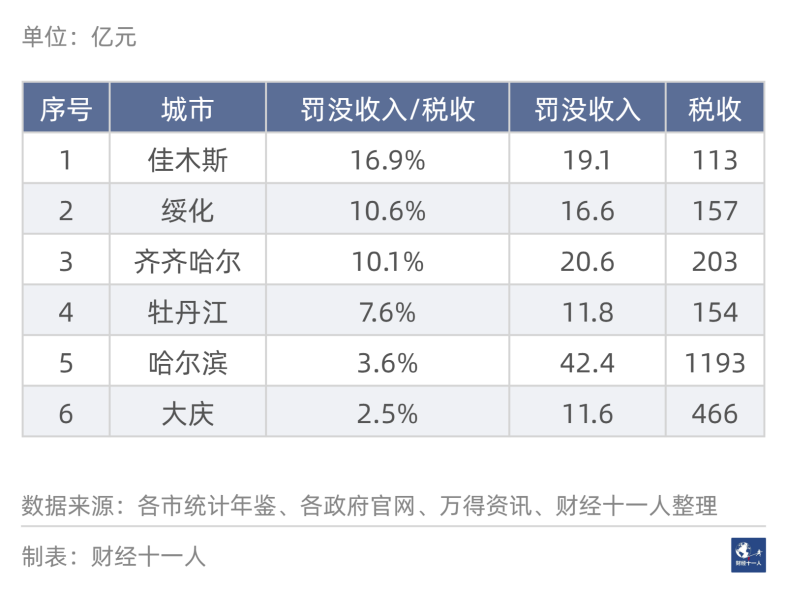

样本城市中，哪些城市的“罚没收入占比”偏高？

下面看看247个城市中，A值最高的30个城市。

**A值最高的30个城市**

表5是样本中，A值最高的30个城市的情况。

**排名最高的前10个城市分别是梧州29.8%、贺州23.2%、邵阳19.8%、盘锦18.5%、乌兰察布18.2%、佳木斯16.9%、广元16.1%、湘西15.8%、巴中14.8%、河池14.7%。广西、四川、湖南居多。**

这30个城市都来自9个省份：广西和湖南各有5个城市，内蒙古4个，黑龙江、辽宁、河北、贵州、四川五省各有3个，山东有1个城市：枣庄。

这30个城市中，29个城市的A数值超过了10%。

**表5: A值最高的30个城市**

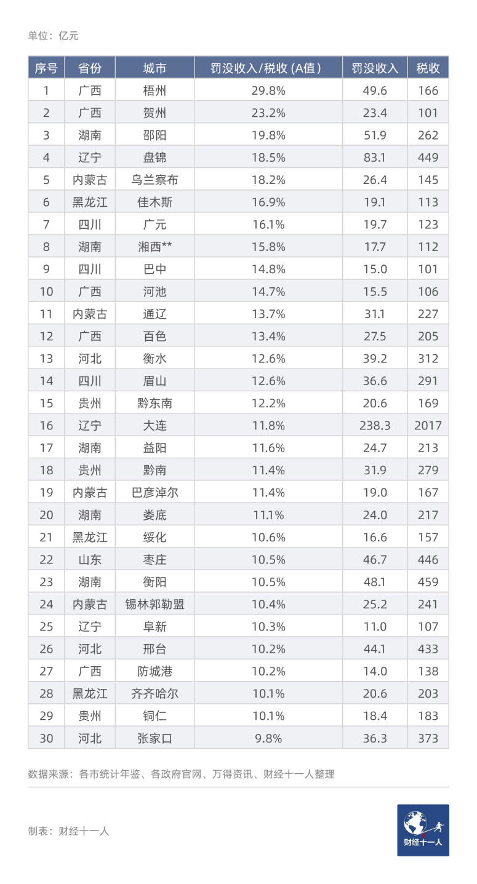

_注：城市后标注**，表示2021年数据缺乏，测算用了2018-2020年三年数据。_

以上30城的中值为12%，而247城的中值为5.8%。

广西梧州市以29.8%居全国首位。从表6看，梧州的罚没收入在2018年之前仅不到2亿元。但2018年和2019年大幅上升为7亿多，而2020年之后再次大幅增长，并维持在15亿元以上。

**表6: 2015年-2022年梧州的罚没收入与税收**

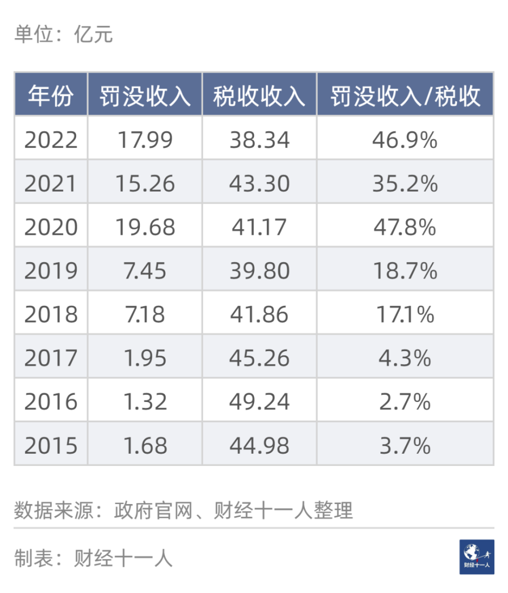

梧州市2018年罚没收入大幅增长，根据其财政报告，原因是：“传销大案查处增加罚没收入。”2020年的原因是：“公检法部门加快扫黑除恶专项整治案件处理进程，促进罚没收入增加。”2022年的原因是：“市本级、藤县和万秀区一次性大案要案罚没收入增加。”

一位财政研究专家对《财经十一人》说，从各城市的“罚没收入占比”的高低，可以看出一些信息，但不能反映问题的全貌。有些城市虽然数值偏高，但却具有合理性。所以，“罚没收入占比”并不是批评或表扬的基础，只是提供一些客观数据，提供一个思考和研究的方向。

下面看看，哪些城市的“罚没收入占比”较低？

**A值最低的31个城市**

在所有样本城市中，A值低于3%的有31个。

在31个城市中，省会城市有11个：广州、成都、长春、西宁、海口、济南、长沙、合肥、武汉、杭州、南京。资源型城市有4个：榆林、克拉玛依、大庆、玉溪。

上文说过，省会城市和资源型城市的A值普遍偏低。扣除以上15个城市后，可以更容易看出最低城市的集中规律。剩下的16个城市，主要集中于江苏、浙江、广东。表7列出了这16个城市的情况。

**表7: 16个A值低于3%的非省会、非资源型城市**

表7中16个城市，江苏有5个：南通2.8%、宿迁2.7%、常州2.0%、无锡1.8%、苏州1.1%。浙江4个：金华2.8%、湖州2.5%、宁波2.0%、嘉兴1.8%。广东3个：珠海2.0%、东莞1.9%、深圳1.4%。

除了江苏、浙江、广东，还有四省各有1城：湖北宜昌2.9%、山东青岛2.7%、福建厦门1.8%、北京1.3%。

中国四个直辖市，北京、上海很低。北京1.3%，我们推算上海约为1%。但上海未直接披露罚没收入，所以没有被选为分析样本。天津4.7%，重庆3.6%。作为直辖市，天津数值偏高。天津已经披露了2022年数据，2022年的A值为8.2%。

最后看看，各省内部谁是A值最高的城市。

**各省A值最高的城市**

如果城市样本数量过小，分析的意义不大。所以这里忽略了样本数量小于3个城市的省份。忽略之后还剩21个省份。表8列出了这些省份的情况。

**表8: 各省A值最高城市**

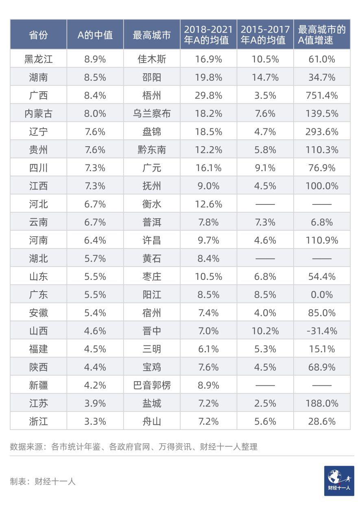

表8中的增速，指的是相对于2015年-2017年三年均值的增速。从表8可以看出，这些省内最高的城市，其A值大多经历了大幅增长。其中，三分之一的城市增长超过了100%。

表8中，A值增长较少的有福建三明、云南普洱、广东阳江、山西晋中。其中，山西晋中出现了负增长。表9是晋中2015-2021年的罚没收入和税收情况。我们发现，2018-2021年晋中罚没收入的平均值并没有下降。晋中A值下降的原因是其税收收入的大幅上升。

**表9: 山西省晋中市2015-2021年的罚没收入等**

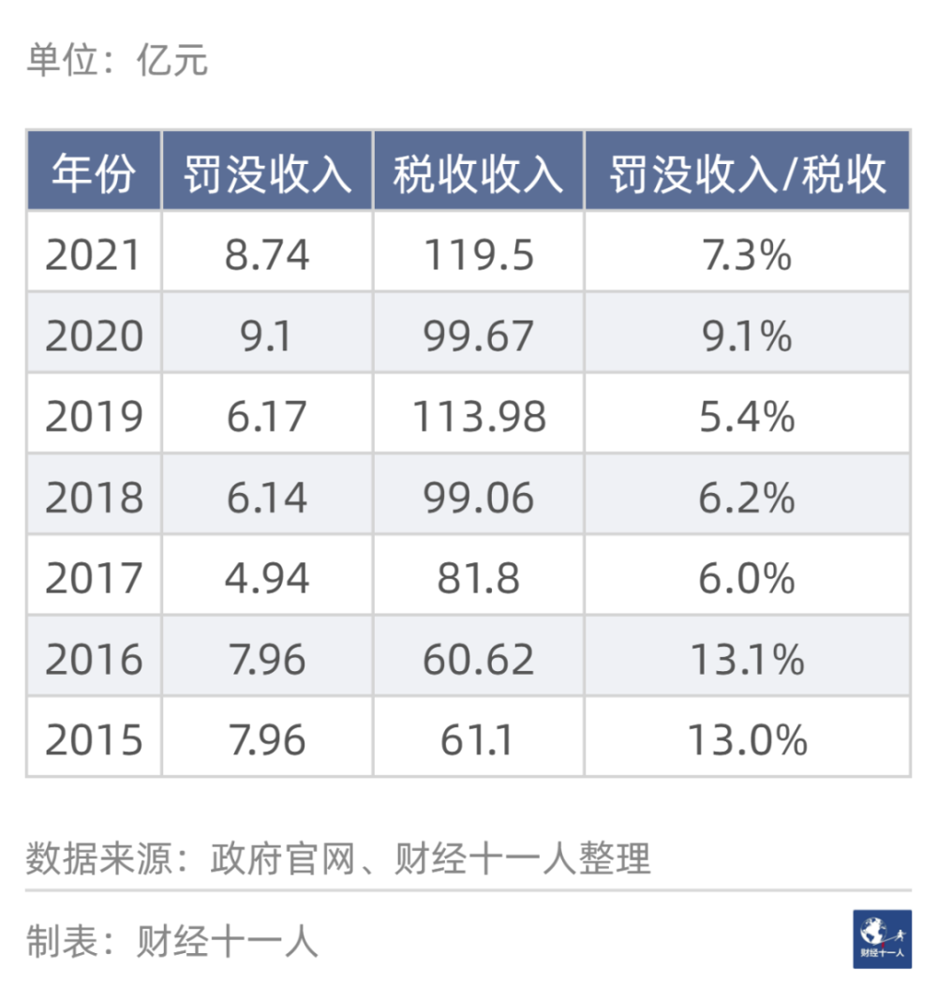

上文的财政研究专家对《财经十一人》说，因为研究所选的时间段为“2018年-2021年”，这里面包含了两年疫情。而在疫情之下，管理规则和管理行为与之前相比必然有所不同。所以，对于增速较快的地区，需要更深入地分析具体原因，才能提出有利改进的建议。

在文中的最后，我们有个希望：希望罚款仅仅是促进行为向善的一种手段，而不要成为一种目的。

**尾注：247个样本城市的数据**

**表10-1: A值8%以上的城市**

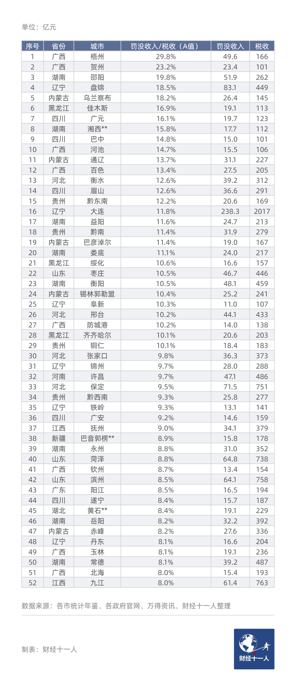

**表10-2：A值6%-8%的城市**

**表10-3: A值4%-6%的城市**

**表10-4: A值4%以下的城市**

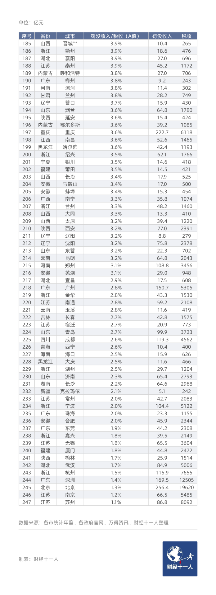

**注：** 城市后标注**，表示2021年数据缺乏，测算用了2018-2020年三年数据。

**作者为《财经》产业研究中心研究员，编辑：刘建中**

**延伸阅读：**

中国哪些省市罚没收入高？

