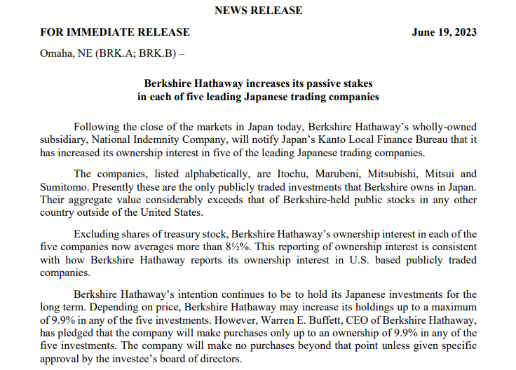

# 买不停，巴菲特“突击”加仓日本五大商社，3年所持日资规模扩2倍

随着日本股市来到近33年高位，巴菲特并未放缓买入的脚步。

周一（19日）日本股市收盘后， **伯克希尔哈撒韦官网发布声明称，已通过全资子公司National Indemnity
Company将其在日本五大商社的平均持股比例提高至8.5%以上。** “股神”加持、加上宽松货币政策或将成为支撑该国股市进一步走高的重要因素。

**大笔押注获得丰厚回报**

**12日披露的监管信息显示，伯克希尔持有伊藤忠商事7.4%的股票、丸红和三菱8.3%的股票，三井8.1%的股票和住友8.2%的股票。按照伯克希尔的最新声明，巴菲特选择了在过去一周大举增持。**

伯克希尔重申此前的立场，打算“长期持有其在日本的投资”，但 **根据价格的不同，持股比例最高不会超过9.9%。**
“除非得到被投资方董事会的具体批准，否则不会在这之后进行任何收购。”

**这实际上是巴菲特在长期无法找到合适并购对象后投资思路上的转变。**
他曾在股东信中表示，整体并购可能带来的问题是大多数真正伟大的企业没有兴趣让任何人接管他们。拥有一家优秀企业的非控股股权，比拥有控股100%的困难企业更有利可图，更令人愉快，工作也少得多。

根据外媒统计， **在3年前初始投资60亿美元以后，目前伯克希尔在日本的资产总规模已经超过170亿美元，成为其最大海外资产目的地。**

除主动增持以外，资产规模扩张与股价表现密切相关。今年以来，三菱和丸红的股价上涨了超过60%，三井、伊藤忠和住友的涨幅也达到了35%以上。按目前的市值计算，浮盈或达到近50亿美元。

在多重利好冲击下，上周日经225指数强势上攻33800点，连续第10周上涨。盛宝银行市场策略师查纳纳（Charu
Chanana）在报告中表示：“日本股市的顺风继续增加。虽然之前有人预测伯克希尔将继续增持股份，但这一宣布的时间比预期的要早，将进一步提振对日本股市的乐观情绪。”

2020年8月，伯克希尔正式登陆日本市场，披露持有伊藤忠商事、丸红商事、三菱商事、三井商事和住友商事五大商社5%的股份。

在各国央行收紧流动性以应对通胀时，日本超宽松货币政策及经济前景改善让巴菲特再次加大了投资力度。今年4月，伯克希尔在五大商社的持股比例已经升至7.4%。“股神”在本年度股东大会上阐述了理由，认为商社与伯克希尔业务相似，但股价却“低得离谱”。他称赞这些企业在熟悉的行业中站稳了脚跟，专注于长期发展，而且规模效应突出，足以对伯克希尔的盈利产生实质性影响。

**货币政策持续助力**

今年以来，日本股市时隔多年再次成为全球焦点。
**除了人工智能狂潮带动的纳斯达克100指数外，日股年内涨幅在主要市场中高居第二，并遥遥领先欧洲等主要经济体市场。**

在“股神”效应和日本企业治理改革推动下，国际资本不断涌入日本股市。据日本财务省统计数据，外国投资者已经连续九周净买入日本股票，买入金额合计达到7.4万亿日元（约520亿美元），而海外交易对日股今年涨幅的涨幅贡献达到70%。

企业治理新政有助于日本市场摆脱其“价值陷阱”的称号，此前日本企业普遍专注于市场份额，而很少关心股东回报。野村资产管理公司高级客户投资组合经理麦卡格（Andrew
McCagg）认为，股东回报率的提高可能是巴菲特决定加码买入的关键因素。他们在所了解的行业中找到被低估的公司，看到了长期的改善路线图。

与此同时，日元疲软也可能成为利好股市的因素。日本央行上周召开议息会议，维持政策利率在-0.1%不变，维持10年期日本国债收益率目标在0％左右，并且没有修改收益率曲线控制（YCC）政策，符合市场此前预期。

日本央行称，如有必要将毫不犹豫地加码宽松，以实现可持续的2%的通胀目标。该行还将继续大规模购买债券，继续以固定利率买入国债，并在必要时灵活增加债券购买量。日本央行行长植田和男表示，当前经济不确定性仍非常高，持续、稳定实现2%的物价上涨目标“还需要时间”。受此影响，日元兑美元汇率周一再次失守141关口。

美银证券日本首席经济学家戴瓦里耶（Izumi
Devalier）日前表示，日本央行维持了超过20年的宽松货币政策有望迈向正常化，但最终要到2024年底实现。随着日本国内经济的进一步改善，日经指数可能进一步上行。

