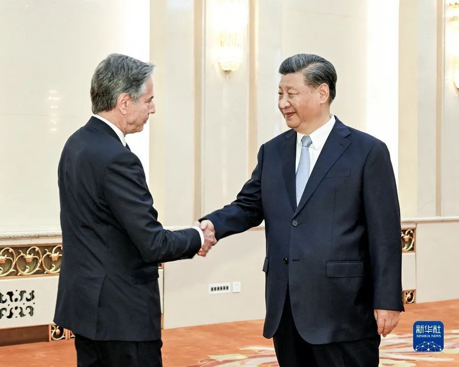

# 侠客岛：布林肯访华的几个关键问题

6月19日，中国国家主席习近平会见访华的美国国务卿布林肯。此前，中共中央政治局委员、中央外办主任王毅、国务委员兼外长秦刚也分别同布林肯会面，就中美关系问题进行了长时间坦诚、深入、建设性沟通。
**布林肯是拜登政府上台以来首位访华的美国内阁官员，也是2018年以来首位访华的美国国务卿。**

如何看待中美关系迭经波折、陷入低谷后的重要高层互动？侠客岛采访了中国人民大学国家发展与战略研究院研究员、美国研究中心副主任刁大明和清华大学战略与安全研究中心助理研究员孙成昊。

_6月19日下午，国家主席习近平在北京会见美国国务卿布林肯。图源：新华社_

**1、侠客岛：今年以来，中美关系因“气球事件”、蔡英文“过境”窜美等问题深受伤害。中方定性的两国关系“处在建交以来的最低谷”，传递出什么信息？**

**刁大明：** “最低谷”一词相对客观准确地界定了当前中美关系。
**“最低谷”到来，是因为美方过去一段时间采取的一系列错误极端行径，根源是美方的错误对华认知。**
中方当着美方的面提“最低谷”，是希望美方通过切实行动让中美关系止跌企稳。中美要摆脱现在的局面，不能只靠中国单方面努力。

**孙成昊：** 中美关系确实遭遇较大挑战。拜登政府上台以来，美对华政策未有实质性调整，仍以“战略竞争”为由打压中国，中美关系因之下行。
**“最低谷”的定性，是在敦促美方反思对华政策，促使中美关系平稳发展。**

**2、侠客岛：中方强调，中国对美政策始终保持连续性和稳定性，希望美方“冷静、专业、理性处理意外偶发事件”。年初布林肯推迟访华，这次访问前，美国务院又称美方将继续回击中方的“刺激性行为”。怎么防止意外偶发事件令中美关系脱轨失控？**

**刁大明：**
“冷静、专业、理性”这个提法，近期中方已公开说过多次。中美之间联系复杂频密，有可能出现一些意料之外的情况乃至事件，甚至被美国国内某些人恶意炒作、干扰两国关系正常发展。
**双方应本着相向而行的态度，用冷静、专业、理性、务实的方式予以应对，避免让类似事件对两国关系正常发展构成挑战**
，更不能让美国国内反华势力借题发挥、平添两国沟通成本。

中美关系遭遇波折，美方有必要深刻反思。美方决策层应充分发挥政治影响力与控制力，避免其内部某些人大肆炒作，牵绊美方对华互动。

**孙成昊：** 中美关系存在的裂痕，多与美方过激反应、无端指责相关，比如近期美方炒作“中国在古巴设监听设施”的假新闻等。
**防止中美关系脱轨失控，需要美方意识到症结所在，拿出真诚态度。** 在此前提下，双方需加强接触，进一步了解彼此立场，为协商解决两国关系问题建立共识。

当前，美方对华“竞争、合作、对抗”三分法中，竞争、对抗大于合作。此态势若不改变，势必激化冲突。美方应多做“合则两利”的加法而非“斗则俱伤”的减法，在符合双方利益的领域促成务实合作。

_6月19日，中共中央政治局委员、中央外办主任王毅在北京会见美国国务卿布林肯。图源：央视新闻_

**3、侠客岛：美方虽表态不支持“台独”，但执意安排麦卡锡会见蔡英文、实施对台5亿美元军售、拉拢盟友打“台湾牌”。怎么看待中方强调台湾问题是中美关系“最突出的风险”、敦促美方“将不支持‘台独’的承诺真正落到实处”？**

**刁大明：** 拜登政府上台后，在台湾问题上有两个明显态势：一是在高科技、供应链领域插手台湾事务， **将台湾问题“复杂化”**
；二是基于“中产阶级外交”，自己不想对外投入过多，就渲染台海风险，纠集盟友应对“中国威胁”， **将台湾问题“国际化”**
。这些“玩火”行为十分危险。中方强调台湾问题，是希望美方停止“以台制华”，同时期待拜登政府平衡各方，避免让美国在如此重大、风险突出的议题上“政出多门”。美国国内在台湾问题上有多重声音，完全无助于美国自身的对外战略稳定。

**孙成昊：** 美国从未放弃“以台制华”战略。台湾是美国选定的牌。美国对一中原则的掏空，彰显出其确立的对台政策范式——
**将一中原则跟“与台湾关系法”、对台“六项保证”等绑定。这种做法并不为中国所接受。**
在俄乌冲突背景下，美方有意将台海问题渲染成亚太地区安全危机，一再挑动舆论声势，为实施“印太战略”铺路。所以中方强调，美方必须真正坚持中美三个联合公报确定的一中原则，明确反对“台独”。

**4、侠客岛：习近平主席强调，“宽广的地球完全容得下中美各自发展、共同繁荣”，但美国一直拿国强必霸的模板来镜像中国。如何看待中美在认知上的差异？**

**刁大明：**
中美关系陷入低谷，根源就在美方抱持错误的对华认知。美方应认识到，中国的持续发展为世界繁荣与安全注入了强劲动力，对世界对美国都有好处。美方不应拿西方陈旧语态、固化叙事来误判中国。
**美国当前面临的所有问题，没一个是因中国而生。动辄搞“自己有病、别人吃药”的外部归因，只会拖延治疗。**

习近平主席的表态高屋建瓴，对中美关系稳定发展至关重要。中方明确告诉美方，大国竞争不符合时代潮流。中美两国之间存在的共同利益应该得到重视，各自取得成功对彼此都是机遇而非威胁。

**孙成昊：** 美国喜欢用现实主义大国政治的思路去理解国际格局变迁。但正如习近平主席所说，
**世界在发展，时代在变化，大国竞争解决不了美国自身的问题和世界面临的挑战**
。国际上许多国家并不希望中美冲突对抗，不愿在中美之间选边站队。美方对华的错误认知，只会加剧第三方恐惧，阻碍经济全球化推进。

_6月19日下午，国家主席习近平在北京会见美国国务卿布林肯。图源：新华社_

**5、侠客岛：中美关系要止跌企稳，接下来需解决哪些问题？**

**刁大明：** 中美关系重回正轨的路线图越来越清晰， **关键是要遵循习近平主席提出的相互尊重、和平共处、合作共赢原则**
。中方说的是敞亮话，告诉美国一要明确认知，二要关注中国核心利益关切，三要冷静、专业、理性处理。接下来就看美方的实际行动。

中美外长会谈提到“五个同意”，其中既有落实两国元首巴厘岛会晤共识的方向性议程，也有鼓励扩大两国人文和教育交流的具体议题。
**布林肯访华延续了今年5月以来中美互动的积极态势。** 期待两国能积小步成大步，让中美关系稳下来、好起来。

**孙成昊：**
随着美国进入大选季，拜登政府开展对华合作将遭受更多阻力，所以应抓住当下时间窗口。后疫情时代，全球经济复苏面临挑战，在宏观经济和公共卫生层面，中美恰能通力合作。在气候变化领域，中美也有携手前行的空间。

_（图源：网络）_

采写/点苍、云歌

编辑/九段

