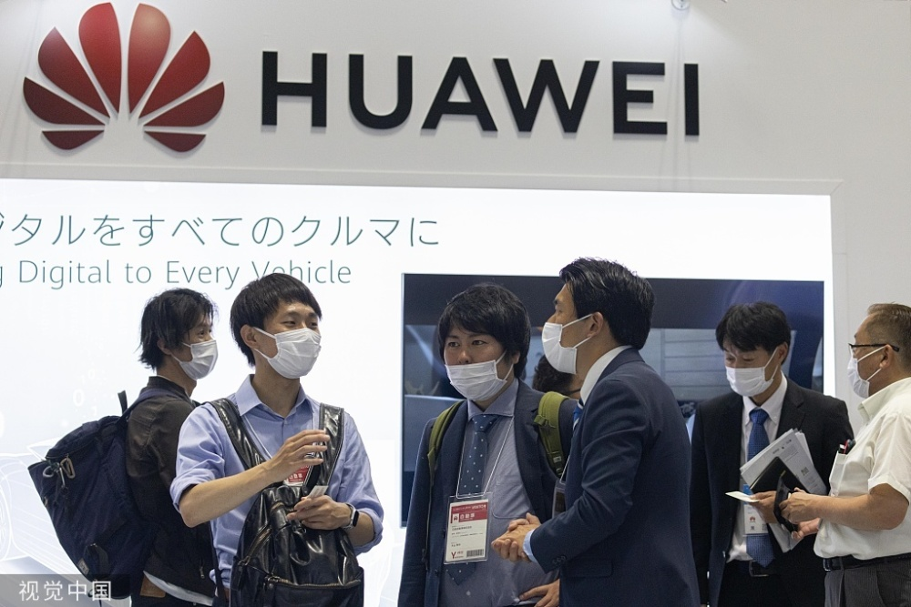

# 华为向约30家日企收取专利费，相关人士：印证中企在通讯行业话语权增加

【环球时报报道 记者
赵觉珵】据《日本经济新闻》报道，中国华为公司正在向大约30家中小型日本公司收取使用专利技术的许可费，这表明该公司正加强对此类收入的依赖。除了日本，华为还在东南亚地区加强收取专利许可费。有熟悉华为的通信业人士19日告诉《环球时报》记者，由于华为在通信领域拥有大量专利，向相关企业收取专利费也是业内正常做法，从侧面印证了中国企业在通信行业的话语权正在增加。

_2022年5月25日，日本横滨，中国电子制造商华为在2022年横滨汽车工程博览会上参展。（视觉中国）_

据报道，华为正向使用无线通信模块组件的制造商和其他公司收取专利费。从只有几名员工的企业到拥有100多名员工的初创公司都收到了华为的要求，有的费用是每个组件50日元（约合2.52元人民币）或更少，也有的是整个系统价格的0.1%或更少。

东京大学访问研究员二又俊文对《日本经济新闻》分析称，上述收费要求符合国际标准，华为拥有大量的标准必要专利，这些专利对于使用4G或 Wi-
Fi等无线通信标准至关重要。很多公司生产的符合这些标准的设备也使用了华为的专利技术，这意味着如果华为提出要求，许多相关公司将不得不支付专利使用费。

根据华为官网披露的数据，该公司是全球最大的专利持有企业之一。截至2021年年底，华为全球共持有有效授权专利4.5万余族（超过11万件），90%以上专利为发明专利。华为公司称，在第三方专业机构发布的报告中，华为在5G、Wi-
Fi 6、H.266等多个主流标准领域居于行业领先地位。

2021年3月，华为宣布将开始收取5G专利授权许可费，单台手机收费上限为2.5美元。路透社去年援引华为美国首席知识产权法律顾问史蒂文·盖斯勒的话称，在截至2021年的过去3年中，华为全球专利授权收入约为12亿美元。

一名与华为有长期合作的通信业人士19日对《环球时报》记者表示，收取专利费属于行业管理，企业需要通过这一途径获得研发成本、促进创新。相比爱立信、诺基亚等通信业企业，华为的收费标准并不算高。

据外媒报道，2017年，爱立信公开5G多模手机专利费标准，根据手机售价不同，专利费用在2.5美元到5美元之间。2018年，诺基亚公布5G专利收费标准，每部使用其专利的5G手机应向其支付3欧元专利费。有报告称，在5G时代，高通、爱立信、诺基亚等企业收取了全球专利费用的大部分。

