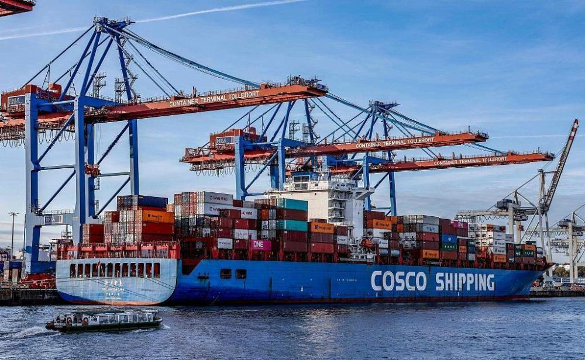

# 历时近2年波折，中企入股德国汉堡港协议终签署

【文/观察者网
刘程辉】历经两年波折，中企入股德国汉堡港的交易终于尘埃落定。汉堡港口与物流股份公司（HHLA）6月19日发布声明称，在完成最终投资审查程序后，该公司与中远海运港口有限公司（CSPL）就汉堡港“福地”（Tollerort）集装箱码头（CTT）签署了最终股权收购协议。

_汉堡港口与物流股份公司19日发表声明_

根据协议，中远海运港口有限公司将收购汉堡港“福地”集装箱码头24.99%的少数股权，“福地”集装箱码头将成为中远海运集团（COSCO）处理亚洲和欧洲之间货物运输的首选靠泊码头。

声明还称，这项合作加强了汉堡作为北海和波罗的海地区物流中心的地位，还巩固了德国的工业国家地位。

这项交易最终能够达成实属不易。2021年9月，汉堡港口与物流公司宣布，中远海运港口将获得汉堡港“福地”集装箱码头35%的权益，作价为6500万欧元。

但此后，德国政府内部对于该交易经历了反复“拉锯”。

2022年9月，受到德国经济和气候保护部、内政和国土部等6个参与投资审查的联邦部门的阻挠，声称中国可能会利用其经济影响力来贯彻自身地缘战略利益。与此同时，联邦总理府则选择站在支持收购案的德国企业界一边。各方一时间僵持不下。

10月下旬，在总理朔尔茨的大力支持下，德国联邦政府批准了一项妥协方案，允许中远海运收购“福地”24.99%的股权，并禁止超过这一门槛的进一步收购。此前拒绝该交易的六个联邦部门放弃抵制，与总理府达成妥协方案。朔尔茨评价德政府的这一决定“是正确的”。

但今年4月，德国联邦经济和气候保护部发言人又表示，由于“福地”已被列为“关键基础设施”，政府正在重新评估是否将允许中资继续入股该码头。

5月，德国政府最终为交易“打开绿灯”，表示将继续与中国达成港口协议，允许中国航运巨头中远集团购买汉堡港口码头24.99%的股份，而非原计划的35%，双方于去年10月敲定的协议内容不变。

汉堡港是德国最大海港，也是欧洲第三大海港，对德国经济具有突出的重要性，而中国是该港口最大的贸易伙伴。而中远海运港口在全球37个港口投资了46个码头，共营运367个泊位。

有德媒曾描述，汉堡港将会是中远在欧洲布局的“最后一个环节”。除了海上航线，汉堡也是“一带一路”中欧陆运的一个重要节点。汉堡港官网介绍，2021年汉堡与中国超25个目的地之间铁路运输量，较前一年强势增长51%。

_2022年10月26日，中远集团集装箱船“新联运港”号在汉堡港“福地”集装箱码头卸货/视觉中国_

对于中企入股汉堡港一波三折的经历，观察者网专栏作者左千户曾撰文指出，对于汉堡港来说，有三分之一的箱子都是从中国港口运来或者要去中国港口的，汉堡港面临着严峻的竞争局面，这个时候更应该积极跟班轮公司合作，以争取更多的业务。但实际中，德国方面却是用限制股份的方法去干扰企业经营决策。出发点是“利用经济影响力获取贯彻战略利益”，这是完全无法从经济角度解释的行为。

左千户认为，未来我们不能再继续一厢情愿的认为外国政府会从经济角度考虑问题并促成合作，而是要推进对合作国家的国别研究，摒弃国内固有的思维局限，实事求是地调查清楚合作国家内部的社会形态、利益团体、舆论思潮等；再根据合作国家的实际情况去制定合作政策，签订协议，应对风险。

值得注意的是，目前正值国务院总理李强访问德国之际。

6月19日下午，李强在柏林同德国工商界代表座谈交流时表示，我们理解各方都有自己的安全关切，重要的是如何合理界定和防范风险。如果处理不当，将风险扩大化，只会造成更多和更大的问题。

李强强调，企业对风险的感受最直接、最敏锐，知道如何规避和应对，应该把防风险的主导权还给企业。防风险和合作不是对立的，不合作才是最大的风险，不发展才是最大的不安全。经济全球化使世界经济你中有我、我中有你，应该辩证看待依赖问题，不能人为夸大“依赖”，甚至把相互依存与不安全简单画等号。对于一些具体问题要具体分析，各方完全可以通过协商合作，共同防范应对。

**本文系观察者网独家稿件，未经授权，不得转载。**

