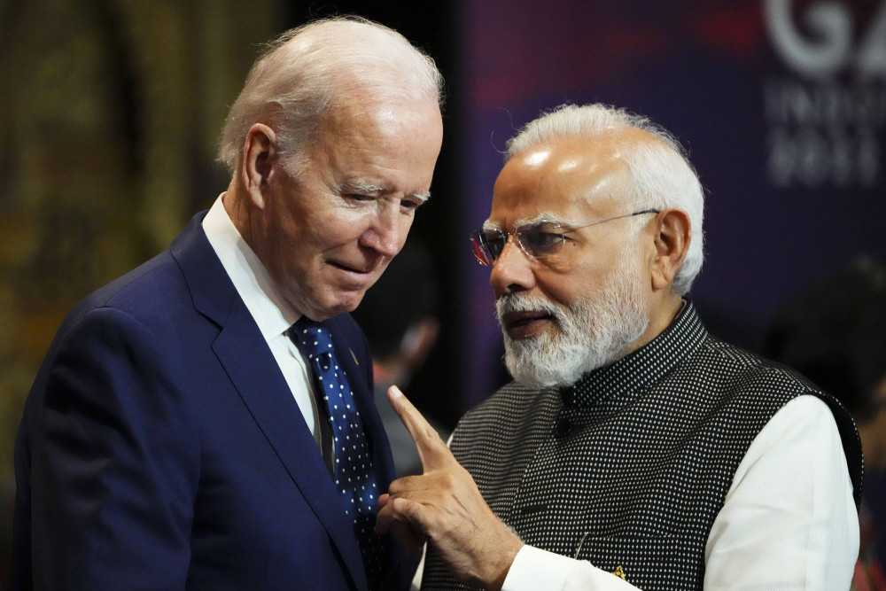

# 启程访美前，莫迪称印度和美国“空前互信”

（观察者网讯）当地时间6月20日，美国《华尔街日报》刊登了对印度总理莫迪的采访文章。在即将启程访问美国之际，莫迪称赞了印度和美国之间日益增长的国防合作，称印美关系“比以往任何时候都要牢固”，两国领导人的互信达到了“前所未有的程度”。

_《华尔街日报》报道截图_

文章称，莫迪在新德里的总理官邸中接受了采访，谈论了有关印度外交政策、现代化建设和经济发展等话题。他试图将印度描述为全球南方国家的所谓“天然领导者”，坚称印度理应在全球政治中发挥“更深入、更广泛的作用”。

自莫迪及其领导的印度人民党在2014年和2019年的选举中获胜以来，莫迪在印度国内的支持率水涨船高。莫迪政府已在教育和基础设施领域投入了大量资金，随着地缘政治局势愈发紧张，一些寻求“多元化供应链”的跨国公司开始在印度建设新工厂。

“让我明确一点，我们不认为印度会取代任何国家。我们将这一进程视为印度在世界上获得应有地位的步骤。”莫迪说，“当今世界相互联系和相互依存的程度高于以往。为增强弹性，供应链应该更加多样化。”

莫迪即将在6月21日启程访问美国。谈及印度与美国的关系，他对《华尔街日报》称，印度和美国日益增长的国防合作是“伙伴关系的重要支柱”，印美关系“比以往任何时候都要牢固”，两国领导人之间存在“前所未有的信任”。

《华尔街日报》指出，近年来，日益加深的经济联系强化了印度和美国的关系，两国间贸易额在2022年达到创纪录的1910亿美元，这使得美国成为印度最大的贸易伙伴。美国还是印度第三大国际直接投资（FDI）来源国。

但与此同时，印度又与俄罗斯关系密切，俄罗斯为印度提供约50%的军事物资，其中包括武器、弹药、坦克、战斗机和S-400防空系统等装备。作为莫迪政府“多向结盟”外交政策的一部分，印度寻求与各个大国合作，促进印度的利益。

在俄乌冲突爆发后，由于印度拒绝制裁俄罗斯，莫迪的立场曾遭到美国政客的批评。对此，莫迪回应说，印度始终“站在和平一边”。印度政府认为，所有国家都应该尊重国际法，通过外交和对话的方式解决争端。

莫迪称，他已多次与俄罗斯总统普京和乌克兰总统泽连斯基通电话，“印度会竭尽所能，支持为了结束冲突、确保持久的和平与稳定所作出的一切努力。”

谈及印度与中国的关系，莫迪则声称，“边境地区的和平与安定”对中印双边关系至关重要，印度主张“遵守法律”并通过“和平方式”解决分歧和争端。

此外，莫迪还认为，联合国等国际组织需要改革，“非洲国家拥有发言权吗？印度人口众多，在全球经济中有着亮眼表现，但印度在这些机构中拥有一席之地吗？”他暗示，印度将继续寻求加入联合国安理会。

_资料图：2022年11月，印度总理莫迪和美国总统拜登在二十国集团峰会期间交谈
图自视觉中国_

据“今日印度”电视台报道，应美国总统拜登的邀请，莫迪将在21日前往美国，进行正式的国事访问。莫迪会首先访问联合国总部所在地纽约，出席国际瑜伽日的庆祝活动，然后再飞往美国首都华盛顿。白宫将举行国宴招待莫迪，美国国会也邀请莫迪在众议院和参议院联席会议上发表讲话。

印度总理办公室在20日的官方声明中表示，印度和美国的关系是多方面的，两国在科技、教育、卫生、国防和安全领域有着密切的合作。此次访问将加强两国基于所谓的“民主、自由和多样性共同价值观”的关系，巩固在“四方安全对话”和“印太经济框架”等组织下的合作。

《华尔街日报》预计，在莫迪访美期间，印度有望与美国达成共同制造战斗机发动机的协议，这将允许印度斯坦航空公司使用通用电气公司的发动机。印度可能还会以数十亿美元采购美国MQ-9B无人机，用于海上和边境巡逻。

美国《纽约时报》此前分析称，拜登政府图谋利用印度抗衡中国的经济影响力，从而在全球供应链中“排挤中国”。因此，即使美国政府频频批评印度的“人权问题”，拜登依然把莫迪视为所谓“民主世界”的盟友。《华尔街日报》也认为，华盛顿积极向印度示好，是为了让印度成为“制衡中国”的战略力量。

**本文系观察者网独家稿件，未经授权，不得转载。**

