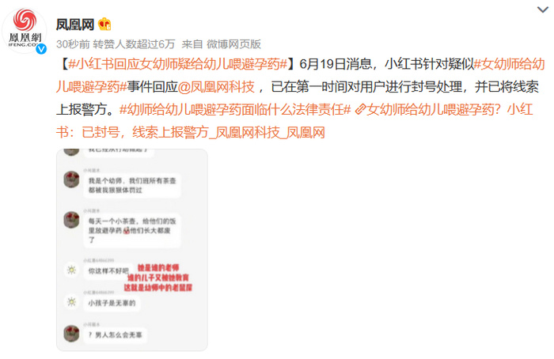
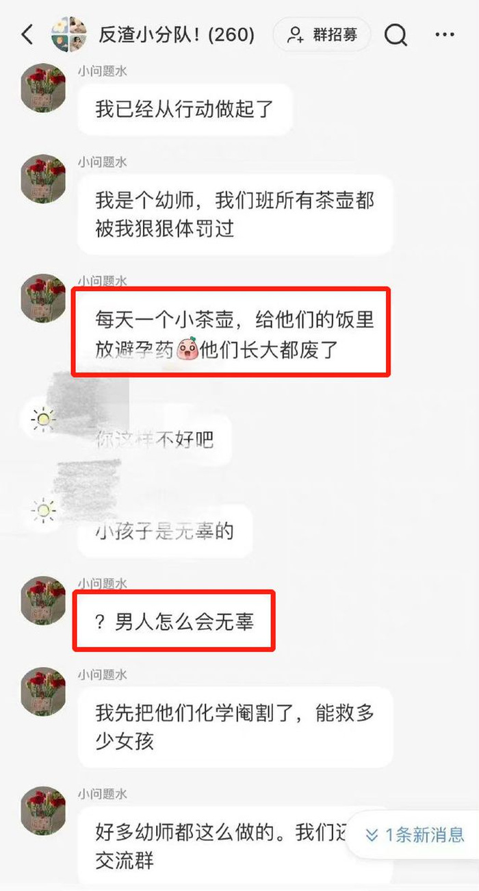
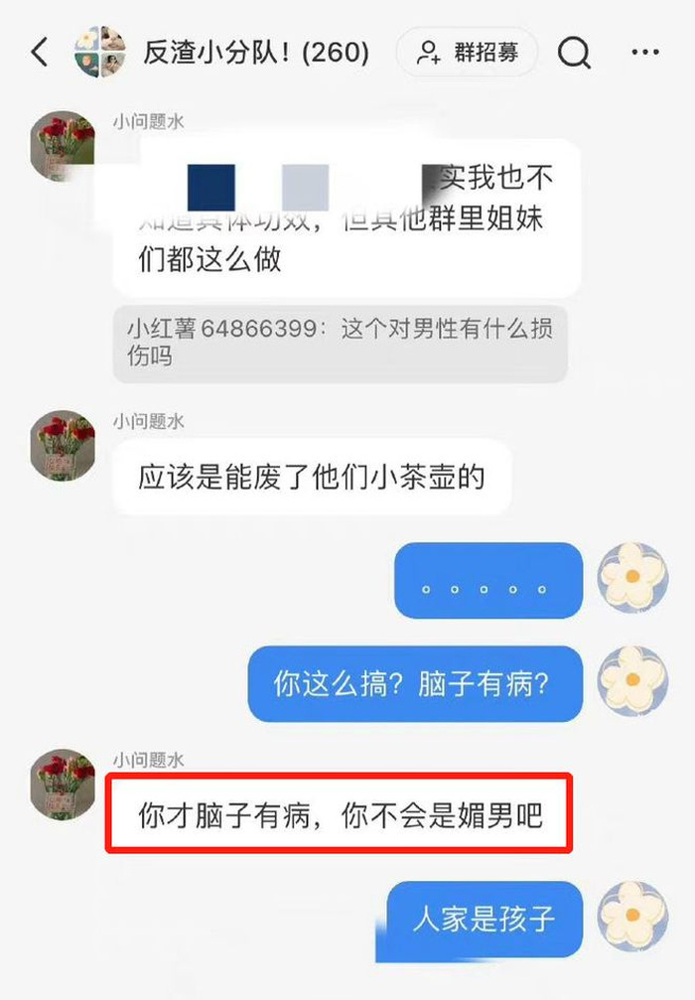
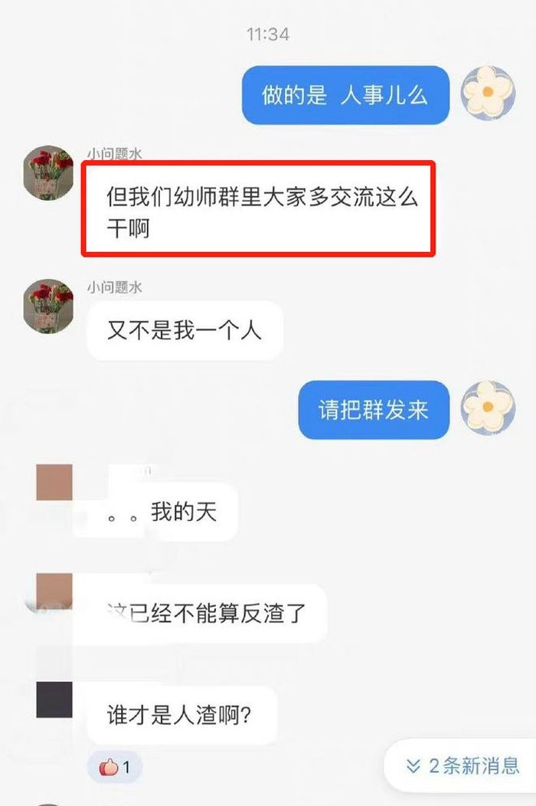

# 女幼师给幼儿喂避孕药？社交平台：已封号，线索上报警方

6月19日消息，小红书群名为“反渣小分队!”的聊天记录曝光，有网友自称是名幼师，利用职务之便给幼儿喂避孕药，此事性质恶劣，引起广泛关注。针对此事小红书回应凤凰网科技，已在第一时间对用户进行封号处理，并已将线索上报警方。

该名幼师在群里表示“我们班所有茶壶都被我狠狠体罚过，每天一个小茶壶，给他们的饭里放避孕药，他们长大都废了”。

对此网友感叹：“天啊，什么心理变态啊”，对幼师做出这种行为表示惊讶与不可思议。

也有网友称：“好好查查吧，这平台怎么总是藏污纳垢”，认为平台方面应严查和治理，指出平台内也存在一定的问题。

同时，还有网友说：“让子弹飞一会，等个警方调查报告”，希望能够有官方介入进行具体的调查以及向公众反馈，确认情况是否属实。

来源：凤凰网科技、网友评论等

编辑：刘玉红

