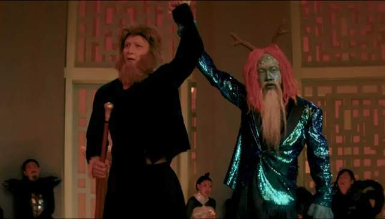

# 孙悟空当爹了，观世音教育人学英文，为什么老外都爱魔改《西游记》

就算你还没看过美国迪士尼出品的最新美剧《西游ABC》，可能也听说了吧？孙悟空当爹了……而且和很多中年男人一样，正在为如何与青春期叛逆的儿子相处发愁。不仅如此，戴老花眼镜穿松糕鞋的观世音菩萨动不动就教育人“好好学英语”，牛魔王身上那身blingbling的奇怪西服说不上是蓝还是绿，这部冠以“西游”帽子的美剧，脑洞和离谱程度让人一时无法单纯用东西方文化或是审美差异以一言蔽之。

这就不难理解，它为何在中外观众群体中收获了两极评价。在代表媒体评价指标的北美权威评分机构Metascore，27家媒体给《西游ABC》打出72的高分，烂番茄新鲜度达96%，“幽默风趣”“多元化表达”“符合Z世代胃口”等评价被多次提及。而在豆瓣，开分直接不及格，之后在5.5分左右徘徊，现在缓慢爬升到5.8分，“剧本太弱（智）”、“坚持到观音出场那一段就看不下了”等短评收获上百人点赞。连弹幕上中国网友都说：“拍得挺好，下次不要再拍了”。

_西游ABC剧照_

**《瞬息全宇宙》的“团建”**

这部剧从开拍时起，关注度就颇高，它是美国主流流媒体平台少见的亚裔创作者主导、亚洲面孔担纲主演、讲述美国亚裔故事的作品。《瞬息全宇宙》原班人马杨紫琼、关继威、许玮伦、吴汉章（第一季还未亮相）全员参演，因此《西游ABC》被称为《瞬息全宇宙》“团建”。七名导演，六位是华裔，还出现了德斯汀·克里顿和刘玉玲的名字，前者是《尚气》的导演，后者是好莱坞著名的华人女演员和电影制片人。

故事情节并不复杂，一条线聚焦美国普通高中生王进的校园生活，他在学校邂逅了孙悟空的儿子孙维辰。另一主线是孙悟空父子与牛魔王的对决。两个华裔中学生引发了《西游记》诸神入世，以此探讨当下亚裔族群在美国生存时所面临的一系列挑战。

对于寒暑假看着八六版《西游记》长大的观众，《西游记》是伴随一代人成长的经典，虽然当时经费不足，但是拍摄出来的效果，包括剧情逻辑、创作想法、演员表演不管放在哪个年代，都是一部难以超越的作品。在这个框架下看《西游ABC》，那简直是“槽多无口”，浑身不得劲。“五毛钱”服化道整出来的神仙好像小学时在地摊买的劣质玩具；剧情逻辑有硬伤——孙维辰偷走老爸的金箍棒，去寻找当年师徒四人没取得的第四卷经书，居然只是因为一个梦；编剧根本不懂西游更不了解中国文化——济公怎么就乱入了西游故事并且在剧中还成了自私小人？更不要提所有神仙凡人的那一口“烫嘴”中文，对了，还有帅了几十年堪称人类优质男性的阿祖，居然毁了演艺形象，第一次丑到观众。

但如果你能留心一下这部剧的创作背景，会发现《西游ABC》虽然带了“西游”两个字，但并非改编自《西游记》原著，而是改编自美籍华人作家的连环画《美生中国人》。也就是说，它和吴承恩没有关系，和我们熟悉的那个八六版《西游记》更是不沾边。倘若卸下名著的包袱，也许你能从另一个角度观看这部剧。

这部剧的创作班底虽然为华裔，但大约他们并没有想过文化输出这么有高度的概念，他们每一天实实在在面对着的身份认同、自我定义、家庭关系、生活挣扎……才是他们想要表达的，神仙、神话无不是他们借以自我表达的工具。本质上，这是几代亚裔在美国生活多年后，终于有机会唱出的一曲表达自我的高歌。难能可贵的是，他们并没有因此就苦大仇深，而是用放飞到肆无忌惮的脑洞和他们根植于两种文化中所生长出来的幽默以及价值观，造就了独属于他们自己的新的东西。其中的确有很多被网友诟病的美国主流社会对亚裔的刻板印象，但你不能否认，《西游ABC》正是对这种刻板印象的消费，这是一群轻松、自洽且自信的人才能够做到的。

片子有很多优点，例如丝毫不悬浮，细节细致到男主家里的所有遥控器都包上了保鲜膜。笑点极接地气，例如即便“见证过千百万人的苦难，试过让海浪平静下来”的观世音菩萨，也看不懂宜家家具的拼装说明书，直嚷嚷“瑞典家具打败不了我”。让人忍俊不禁的层出不穷的创意，始终没有模糊掉故事的最底层逻辑——亚裔不想当配角或小丑，我们也可以冲破困境，突破自我，成为主角和英雄。

剧中，关继威饰演的亚裔喜剧演员在接受采访时说也想演英雄，白人主持人略带嘲笑地问道：“你该不会想演蝙蝠侠吧？”关继威严肃地回答：“我想要扮演的是一个有勇气的人、一个敢于踏上征途的人，英雄未必要有超能力，他们只是会在最重要的时刻挺身而出，为信念而战。”

**那些被魔改的《西游记》**

其实，外国人对《西游记》的改编热情，不是一两天了，美国在20多年前就翻拍过《西游记》，那部在NBC电视台播出《齐天大圣》，所有角色统统“入乡随俗”成了金发碧眼，唯一的东方面孔观音居然和唐僧谈起了恋爱。韩国对《西游记》的衍生创作贡献也不小，孙悟空一会和韩国历史传说中的善花公主相遇，一会去参与星球大战，在韩剧《花游记》里，唐僧不但是“伏妖能力者”，还和孙悟空成为一对生死相依的恋人，携手消灭妖魔鬼怪。是的，《花游记》里的唐僧是一位小姐姐，女唐僧的设定韩国不是首创，这一脑洞来自日本。

日本绝对算是《西游记》的“头号迷弟”，他们的知识分子阶层对《西游记》原著非常了解，但是一旦进入到大众向的影视、游戏领域，反而是经过深度改编的作品更容易被大家接受。早在1911年，日本就把《西游记》搬上了电影银幕——由吉泽商店制作的无声电影《西游记》，比中国还早了15年。1978年，日本斥资5000万拍摄了世界范围内首部《西游记》电视剧，不仅在日本一鸣惊人，甚至被翻译输出到西方国家。在这部剧中，唐僧由日本女星夏目雅子扮演，从此，女唐僧成了日本改编中的一种固有范式。后来日本各大电视台至少又拍过4个版本的《西游记》，全部是由女明星反串唐三藏。

“性转版”唐三藏在当年就曾引发中国观众的强烈不满，直到今天也未被年轻一代中国网友接受。不过，在国外诸多《西游记》的衍生创作中，也不乏同时被各国观众喜爱的作品，其中最有代表性的也出自日本，例如热门动漫《七龙珠》，豆瓣评分9.3。据说，鸟山明在最初画《七龙珠》时，本来想讲一个与《西游记》深度结合的搞笑冒险故事，为此他还特地到中国旅游采风，甚至在初稿中，悟空的造型完全就是一只猴子。但最后，他还是决定走原创的道路，创作出了自己的世界观和战斗系统。

为什么全世界都如此喜爱改编《西游记》而不是其他的中国名著？也许21世纪初中国初代网友就已经在BBS上道出了关键——《西游记》是最早的“在路上”的中国故事。在地图庞大的《西游记》中，师徒四人一路西行，历经九九八十一难，遇到上百个神仙妖怪，探索多种文化，几乎是一个故事宝库，无论神秘奇幻、浪漫爱情还是公路旅行、宗教文化，几乎能满足所有类型所有文化背景的创作需求，也贴合历险这一世界共享的创作母题。因此，在海外的改编中，西游文化往往并非作为文化对话的“他者”，而是很方便就赋予改编地域的本土文化。

其中最熠熠生辉的角色孙悟空，被学者梁归智誉为“是自由的隐喻”，他的经历能够得到最大公约数的共鸣。西方文化史几乎就是英雄形象的演变史，他们将《西游记》看为中国人有关英雄的超世俗想像，因此孙悟空常常是衍生作品中的绝对主角。唐僧的一心向佛，猪八戒的贪财好色，沙僧的忠诚耐心，似乎也都隐喻了人性的不同层面，他们为了共同的目标，不但和外部环境也要与自己的内心作艰难的斗争，放在任何文化和民族的背景里，这都是可以理解也愿意共情的故事。

其实，《西游记》本身即是一个不断改编而成的结果。从玄奘奉诏口述的《大唐西域记》，到故事越来越离奇的唐末笔记《大慈恩寺三藏法师传》《唐新语》《三藏取经变文》，再到北宋年间《大唐取经诗话》创造出神通广大的“猴行者”，又到元代西游戏曲出现广泛推广西游故事……是每个时代的不同创作者一起孕育了如今的《西游记》。可以说改编无处不在，而今天，即便有再多“魔改”大约也不必紧张，因为时间自会冲刷掉沙砾，只有优秀的作品会留存下来，成为时代文化记忆的一部分。

记者：李静

