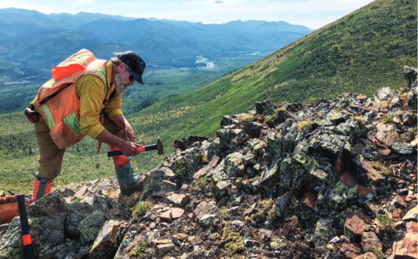
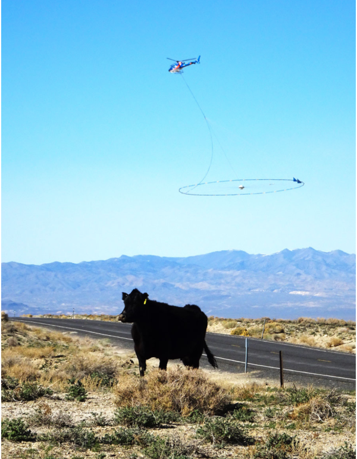
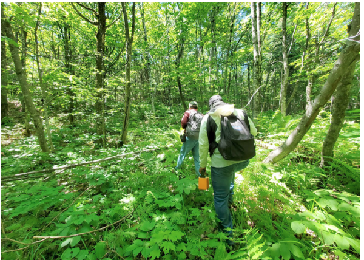
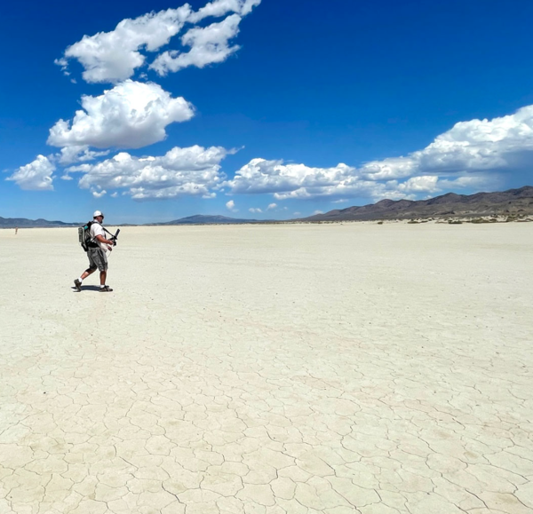
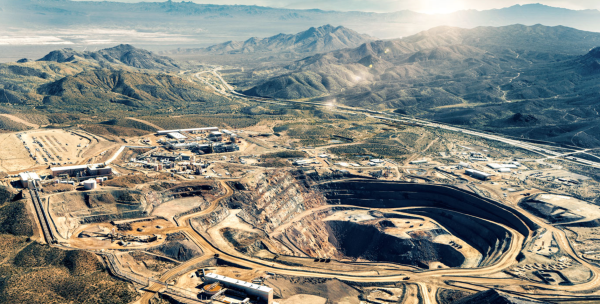
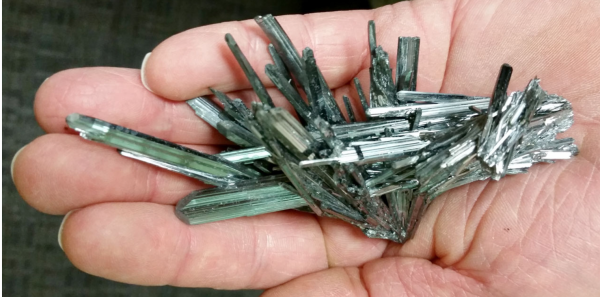

# 寻宝游戏：美国近几十年来首次全国地质调查，涉及锂矿等关键资源

从空中看，美国缅因州（Maine）是一片整齐划一的绿色海洋：森林覆盖了该州90%的面积。但在树叶和泥土之下，是一系列更加多样化的地质地形，它们由数亿年前与北美大陆碰撞的火山岛的遗迹形成。

从两年前开始，美国地质调查局(USGS)的研究人员开始对这些地区进行调查，寻找珍贵的矿物。据美国《科学》杂志近日报道，研究人员最新在距离加拿大边境50公里的彭宁顿山（Pennington
Mountain），发现了含有价值数十亿美元的锆、铌和其他对电子、国防和可再生能源技术至关重要的元素矿藏。

“这是一个完美的发现，”美国地质调查局退休科学家约翰·斯莱克(John
Slack)说，他参与了这次调查，“我们认为整个阿巴拉契亚山脉（Appalachians）都有潜力。”

_美国地质调查局(U.S.
Geological Survey)正在资助阿拉斯加东部变质岩的测绘工作，那里可能蕴藏着包括稀土在内的多种重要矿物。_

**一、缘起**

今年4月18日，美国联邦政府《通货膨胀削减法案》(Inflation Reduction
Act)正式生效，其中的关键一项：对于电动汽车提供消费者购买税收补贴，需满足动力电池所包含的关键矿产原料的部分本土化要求。

然而，到底什么是关键矿产？

据介绍，“关键矿产”指的是50种已开采的矿物质。根据这份由美国地质勘探局在美国国会的指示下制定的清单，关键矿产不仅包括17种目前主要在中国生产的稀土元素，还包括用于生产钢铁的锌和用于电动汽车电池的钴等不太常见的材料。

但在过去十年中，当议员们向美国地质调查局询问美国国内这些关键矿产的供应情况时，得到的回应令人不安：美国地质调查局甚至不知道该去哪里找。

几十年来，美国的矿业公司一直在将采矿业务转移到国外，部分原因是为了避开美国相对严格的环境法规。确定矿产资源的基本勘探工作停滞不前。上一次美国全国范围的调查是为了寻找铀，调查于上世纪80年代结束。

美国地质勘探局负责能源和矿产的副局长莎拉·赖克（Sarah
Ryker）表示，与大多数发达国家相比，包括澳大利亚、加拿大，甚至爱尔兰，“美国的地图绘制不足，我们正处于一个尴尬的时刻。”莎拉·赖克说。

为了填补这一知识空白，美国地质调查局在2019年启动了一项地球测绘资源计划，也称“地球核磁共振成像”计划(Earth Mapping Resources
Initiative，或称为Earth
MRI)。在每年1000万美元的预算下，该机构开始与州地质调查局合作，将数据数字化，并委托实地调查，以详细绘制最有希望的地质区域。

2021年，美国联邦政府通过《两党基础设施建设法》（Bipartisan Infrastructure
Law），法案为该项目拨款3.2亿美元，几乎占美国地质调查局整个预算的三分之一，资金在5年内投入使用。

大规模的资金推动下，“全国各地的地质调查都在复兴，”新墨西哥州地质和矿产资源局的经济地质学家弗吉尼亚·麦克勒莫尔(Virginia McLemore)说。

与此同时，矿业公司也在拥抱“地球核磁共振成像”计划。全球矿业巨头力拓(Rio Tinto)的地球物理学家欣克斯(Donald
Hinks)表示，他支持其他矿业公司与该项目合作并共享数据。力拓甚至资助了美国地质调查局在蒙大拿州的一些航班，以换取1年的独家数据访问权。欣克斯说:“在公共领域拥有这种高质量、大规模的数据将推动新想法和新发现。”

**二、困难**

在采矿史的大部分时间里，矿脉的起源故事显得不那么重要——勘探者发现了它，矿工把它挖了出来。但美国地质勘探局的地球物理学家安妮·麦卡弗蒂(Anne
McCafferty)说，到目前为止，大多数明显的矿藏发现都不存在了。“最低处的果子已经摘了。”安妮·麦卡弗蒂说。

矿物的稀缺性促使地球磁共振成像计划采用了一种“矿物系统” （mineral
systems）方法，这种方法首先在澳大利亚首创，试图根据矿物的形成过程来预测在哪里可能找到关键的矿物。

例如，寻找稀土矿物可以从寻找一种不寻常的富含碳的岩石开始，这种岩石被称为碳酸盐岩。地质学家也可能会寻找富含黏土的岩石或沉积物，这些岩石或沉积物可以在水侵蚀源岩后捕获稀土元素的浓缩物。

为了收集这些能说明问题的岩石的历史，美国地质勘探局的科学家需要整合各种信息来源。其中一些已经存在，例如基于数十年野外工作的大规模地质图，以及基于人工或自然地震的地震波反射的岩层深层结构调查。

而最新的地球核磁共振成像(Earth
MRI)计划也使用了全新的飞行器。飞行器的空中勘测飞行距离地表仅100米，能够增加更多细节，并为新一代更清晰的地质图提供信息。

_在内华达州，一架牵引着感应线圈的直升机测量了地下电阻。_

研究者们在飞机上使用的工具之一是磁力计（magnetometer），它可以探测富含铁和其他磁性矿物的岩石。另一种是伽马射线光谱仪（gamma ray
spectrometer），它可以捕捉钍、铀和钾发出的辐射，这些元素经常出现在包含稀土矿物元素的火山岩里，并且经常被聚合到它们的晶体结构中。

_在缅因州，地质学家携带传感器测量岩石的放射性。_

其他的工具包括激光高度计，可以绘制地表起伏图，揭示地质历史。美国宇航局开发的一种“高光谱”
（hyperspectral）仪器可以根据矿物质吸收的特定波长的光来识别暴露在地表的矿物质。

在综合数据中，“你可以看到下面的所有地质情况，”美国地质勘探局负责东海岸航空勘测的地球物理学家Anjana
Shah说。“这是了解地球的一种非常有力的方式。”

_一名研究人员校准了机载高光谱传感器收集的数据。_

**三、寻找**

在早期的尝试中，地球核磁共振计划的飞行器飞行在在北卡罗来纳州和南卡罗来纳州上空。在这些州的烟草农场下面，隐藏着沙滩化石，这些沙滩是过去两次冰期之间温暖时期留下的海岸线，当时海平面比现在高。

北卡罗来纳州地质调查局的地貌学家凯瑟琳·法雷尔(Kathleen Farrell)说，激光高度计捕捉到了这些海岸线和古河流的细微起伏。

古老的海滩上有黑砂沉积物，这些黑砂是由山脉侵蚀和河流沉积而成的，富含重金属元素。法雷尔和她的同事们希望通过将收集到的新的空中数据与实地测绘和钻孔取样相结合，了解卡罗莱纳州黑砂的起源。他们想了解沿海平原是如何随着时间的推移而形成，为什么黑砂只在特定时期形成，以及这些砂来自上游的哪里。

这些问题的答案将有助于地质学家发现新的重金属矿床，要知道，佛罗里达州北部的类似地点是美国为数不多的钛的商业来源之一。

而在今年，一项覆盖密苏里州、肯塔基州、田纳西州、阿肯色州、伊利诺伊州和印第安纳州部分地区的地球核磁共振调查将探测另一个神秘的地震带——里弗特裂谷(Reelfoot
Rift)。

里弗特裂谷被埋在长达数公里的沉积物之下，它很可能是7.5亿年前罗迪亚超大陆（Rodinia
supercontinent）开始分裂时在大陆基岩上形成的一个裂缝。1811年和1812年，与这个裂谷有关的断层引发了新马德里地震，是美国落基山脉以东地区有史以来最大的地震。

里弗特裂谷和附近的基岩变形造成了危险，也为矿物质的形成创造了机会。这些裂口为岩浆提供了通道，使其在地质年代较晚的时期涌出，那时非洲大陆板块与北美大陆板块相撞，形成了阿巴拉契亚山脉。这种岩浆也形成了伊利诺斯州南部的萤石区，这里曾经产出了美国大部分的萤石——用于冶炼钢铁和制造氢氟酸。

不仅如此，这些岩浆可能也在形成希克斯巨蛋(Hicks Dome)的过程中发挥了作用。希克斯巨蛋位于伊利诺伊州乡村上空1公里处，是该州最接近火山的地方。

在美国地质勘探局的航空数据中，这是一个磁异常区域，从穹顶上钻出的岩心富含稀土矿物。来自岩心的地球化学示踪剂暗示，圆顶深处的沉积物是由碳酸盐岩形成的——这种不寻常的火山岩与世界上最好的稀土矿床有关。

_加州的帕斯山是美国唯一生产稀土元素的矿山。美国地质调查局希望地球资源测绘计划能够鼓励更多的采矿活动。_

**四、锂矿**

如今，没有哪种矿物比锂更重要。

锂被用于手机和电动汽车电池中，驱动着世界上越来越多的电动产品。然而，美国只有一个锂矿，位于内华达州，其未经加工的锂原矿被送往国外进行加工。内华达州地质学家詹姆斯·福尔兹(James
Faulds)说，该州有潜力储藏更多的锂矿，并可能成为国际锂资源“震中”。

锂通常存在于火成岩中——在地壳中结晶的岩浆或在地表冷却的熔岩。许多已知的锂矿床都在该州北部的麦克德米特火山口，这是一个1600万年前由地球深部热点形成的火山口，也为黄石公园提供燃料。火山口内的雨水或下面的热水将火山口粘土沉积物中的锂浓缩到黄石公园其他火山热点地区。

“为什么会出现这种矿化？”内华达大学里诺分校的地质学家Carolina Muñoz-
Saez问。她和她的合作者正在研究锂和锂黏土的地球化学，以确定锂元素是在火山喷发期间由过热的水集中的，还是在火山喷发之后，随着水渗透到火山口富含火山灰的岩石中的。问题答案可能会引导地质学家寻找其他同样丰富的矿藏。

地球核磁共振成像(Earth
MRI)也已经表明，锂探矿者不必拘泥于火山口。野外地质学家已经在构造隆起的地壳块围成的盆地中发现了似乎富含锂的岩石。詹姆斯·福尔兹说，以“盆地和山脉”地形而闻名的内华达州有很多这样的地方。

美国地质勘探局的地球物理学家乔纳森·格伦表示，不仅如此，这些盆地往往拥有热盐水系统，这是地热发电的潜在来源。

地球核磁共振计划也在规划高光谱调查，扫描没有树木的干旱地表，寻找含矿土壤。例如，锂和稀土元素具有很强的光谱反射；其他特征可以揭示与锂或其他矿物相关的黏土矿物。

除了识别可能含有矿藏的岩层外，地球核磁共振成像还加速了美国地质勘探局探测废弃铜矿或铁矿尾矿中遗留的宝贵资源。美国地质勘探局正在与各州地质机构合作，编制一个关于矿山废料场地的国家数据库，并为研究人员提供了评估废弃矿山潜力的方法。“如果你能挖到岩石，在地上再挖一个洞有什么意义?”美国地质勘探局地球核磁共振项目协调员达西·麦克菲问道。

_用于制造电池的锑矿。_

受美国联邦政府新政的影响，在内华达州，锂勘探正在蓬勃发展，但在缅因州，立法者于2017年颁布了一项严格的采矿法，当时该州最大的土地所有者、加拿大林业公司J.D.欧文(J.D.
Irving)考虑开采其土地上发现的金、银和铜储藏。最新的情况是，在彭宁顿山(Pennington
Mountain)发现稀土矿床，并在该州其他地方发现锂矿后，立法者正在考虑修改法律，允许放宽一些负责任的采矿。

非营利环境组织世界资源研究所(World Resources Institute)美国-国际合作部主任梅丽莎·巴巴内尔(Melissa
Barbanell)说，考虑到绿色技术的需求和降低碳排放的必要性，许多环保组织正在软化对关键矿物开采的立场。她补充说，跟煤炭的燃烧不一样，用于电池和风力涡轮机的矿物几乎总是可以回收利用的——只要政策制定者推动这些矿物的再利用。

美国地质调查局退休科学家约翰·斯莱也支持挖矿，他退休后去了缅因州。在他看来，在资源回收能够满足社会需求之前，关键的矿产开采仍然需要进行。他说:“没有矿业，我们就无法拥有低碳的未来和绿色科技。这不是一个选择，而是一个至关重要的必须。”

