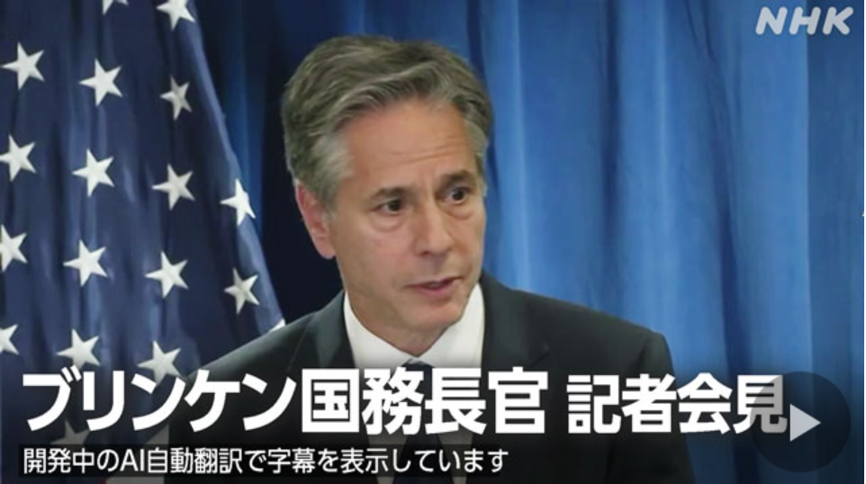
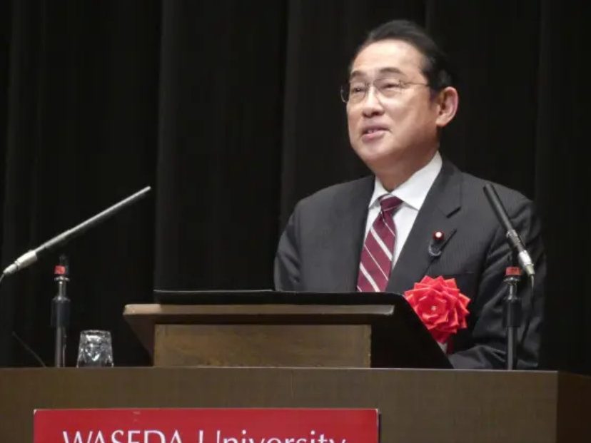
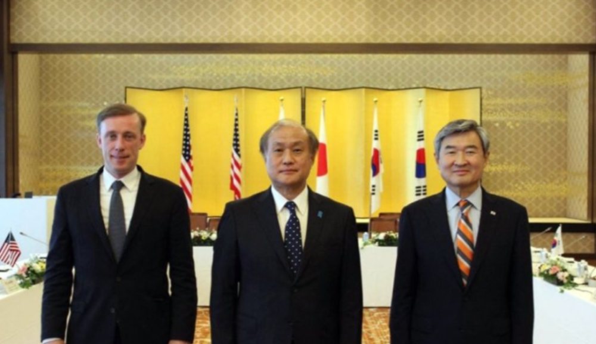

# 布林肯访华，日本感受到压力了？岸田释放有意访华的信号

美国国务卿布林肯访华行程已经结束，但中美高层此番接触引起的反响才刚开始显现。近日，日本首相岸田文雄及官房长官松野博一接连就中日关系与中美关系表态，岸田甚至表达了考虑访华的意愿。

上海市日本学会名誉会长、上海国际问题研究院资深研究员吴寄南表示，尽管布林肯此访能否推动中美关系趋稳止跌尚有待观察，但访问本身已令日方颇为焦虑，开始反思此前紧跟美国步伐“制裁”中国的所作所为是否明智的问题。

**日方密切关注**

对于布林肯访华，日本是最关注此事的国家之一。

在布林肯为期两天的访华行程中，日本主流媒体密切跟进，详细报道秦刚外长和王毅主任与他的会谈。尤其是布林肯获得中国国家领导人会见后，多家电视台安排了特别节目，邀请有关专家就此事进行分析与研判。

_日媒对布林肯访华极为关注。图源：NHK_

“有日媒认为，布林肯访华对日本而言有如上屋抽梯，下不了台。”吴寄南表示，“中美关系在过去一段时间陷入最低谷，日本当权者误判形势，押错了宝，在背离中日四个政治文件的道路上愈走愈远。”

去年12月，日本政府出台《国家安全保障战略》《国家防卫战略》《防卫力量整备计划》等安保三文件，大幅增加防卫费，致力于拥有对敌攻击能力，其中，明确将中国定位为“前所未有的最大战略挑战”，明显背离中日之间“互为合作伙伴、互不构成威胁”的政治共识。

今年5月，日本政府公布23项针对中国的半导体制造设备出口管制措施，充当了美国围堵、打压中国半导体产业发展的“急先锋”。在同月召开的七国集团（G7）广岛峰会上，日本更是积极配合美国，推动阵营对抗，裹挟与会的其他国家，将这场峰会变成了一场污名化中国的“大合唱”。

“但是，布林肯在经历了一波三折后终于如愿展开访华日程，并与中方高层展开密集的长时间会晤，这是让日方始料未及的。”吴寄南说，中美双方在制止双边关系下滑上达成共识，决定进一步加强高层沟通，这不能不触发日本当权者痛苦的历史记忆。

1972年美国总统尼克松访华，令此前追随美国、积极推行反华政策的日本佐藤政府猝不及防，并在寻求改善中日关系无果后被迫下台。吴寄南认为，美国推行“越顶外交”的历史教训始终是日本政要脑海里挥之不去的阴影，布林肯访华产生的冲击波将会逐步显现出来。

**岸田释放信号**

当地时间18日，即布林肯飞抵北京当天，日本首相岸田文雄在其母校早稻田大学发表演讲时表示，希望能亲自访问中国。这一消息立即引起日方国内外舆论的广泛关注。

_岸田在早稻田大学演讲时表达访华意愿。图源：GJ_

岸田是在接受提问时作出上述表态。他先表示，现阶段并没有访华的确切计划，坦承并没有就此事与中方取得共识。然后，岸田强调了与中方保持沟通的重要性，声称有必要通过反复对话和相互努力，来构筑“建设性且稳定的关系”，“在一切层级力图保持密切沟通很重要”。最后，岸田表示，在此过程中将会考虑访华。

回顾中日交往的历史，日本领导人通过在公开场所发表演讲并回答提问的方式来释放信号和传递意图，并不少见。但是，若想砸了别人家的锅又要向对方卖好，装作没事一样，恐怕这种一厢情愿的算计很难得逞。

吴寄南认为，日本当权者在过去一段时间处理涉华问题时有四个“失”：首先是“失落”，即中日综合国力对比在实现逆转、差距越拉越大后，日方从不服气到充满焦虑，心态不平衡了；其次是“失信”，日方背弃四个政治文件中的政治承诺，严重破坏双边互信；再次是“失衡”，日本本应秉持“日美同盟，日中协调”的方针，在中美间保持一定的战略平衡，却加快对美“一边倒”的步伐，盲目追随美国；最后是“失算”，日本当权者的这种误判、盲动，最终导致丧失战略自主、损害日本自身国家利益的后果。

日本官房长官松野博一19日在记者会上就布林肯访华及岸田表态作出回应，强调中美关系的稳定对国际社会极为重要，日方将在“主张应主张的东西”的同时，努力建立对华“建设性关系”。但对于舆论最为关心的岸田访华问题，他只能表示“目前尚未决定”。这表明日本高层在如何应对布林肯访华后大国博弈的新局面尚未形成一致共识。

中日两国互为各自最重要的邻国。高层沟通自然是题中应有之义。今年4月，日本外相林芳正访问中国，并与国务院总理李强和国务委员兼外长秦刚举行会谈。这是日本外相3年多以来首次访华。岸田首相如果愿意访华，相信中日两国民众都是所乐观其成的。

**仍待继续观察**

不过，事情并没有那么简单。

人们注意到，在布林肯抵达中国前，白宫国家安全顾问沙利文率先造访印度与日本，并与日本、韩国、菲律宾相关官员在东京举行会晤。

15日，沙利文在东京与日韩两国的安全顾问举行三边会议。16日，沙利文出席首次举行的美日菲三边安全顾问会议。其中，美日菲会议声明提及颇具暗示意味的、所谓反对“通过武力或胁迫改变现状的单方面企图”。此前，沙利文访问印度，与印方协调印度总理莫迪将于22日对美展开的国事访问，并试图说服印度斥资购买美制无人机。

美方官员称，沙利文此行与布林肯访华纯粹是“巧合”。沙利文在东京还称，美国更关注莫迪访美，给足印度面子。

_美日韩三国安全官员15日在东京举行三边会议。图源：Yonhap_

吴寄南表示，这显然是美国对其亚洲盟国和有关国家的一种安抚。基于历史经验与地缘政治现实，盟国势必对布林肯此行极为关注，美国也会就布林肯访华的大致日程和会谈内容与盟国进行一定程度的“对表”。

布林肯本人在启程访华前，分别与韩国外长和日本外相通话。布林肯重申美国作出的安保承诺，并表示会与对方分享访华成果。

“即便岸田释放有意访华的信号，日本的对华政策也不会迅速转向。中日关系走到今天，是内外各种因数相互作用的结果。不过，历史经验表明中日关系的盛衰变化在很大程度上取决于中美关系这一当代国际关系主轴的走向。”
吴寄南强调，“基于同样的原因，一旦中美关系进入相对稳定可控的阶段，日本等国势必会对其对华关系进行某种力度的调整。自民党高官等日本政要的访华将是可以预见的大概率事件。”

出品 深海区工作室

撰稿 杨一帆

编辑 深海贝

