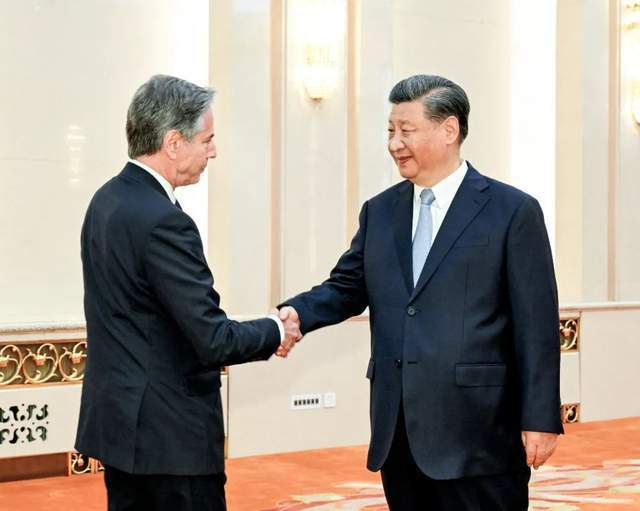

# 布林肯访华，能否让中美关系走下“悬崖顶”

6月18至19日，美国国务卿布林肯访问中国。国家主席习近平礼节性会见布林肯。中共中央政治局委员、中央外办主任王毅会见布林肯，国务委员兼外长秦刚同布林肯会谈。

这是中美关系“解冻”的重要一步。今年年初出现的“无人飞艇事件”使布林肯推迟了此前商定的访华行程。拜登政府对这起意外事件过度反应，力图借此在美国国内展现其对华强硬态度。其后又出现蔡英文窜访美国等事件，中美关系逐步跌入冰点，令双方本该落实中美元首巴厘岛会晤共识的努力陷入困境。

布林肯此次北京之行，既是拜登政府内阁成员首次访华，也是2018年以来美国国务卿首次访华。这从一个侧面展现出中美关系的紧张程度。而布林肯此访的重要性在于，能否延续中美关系近来的“再接触”进程，尤其是为习近平主席和拜登总统在未来几个月举行面对面的峰会扫清障碍。

_6月19日下午，国家主席习近平在北京会见美国国务卿布林肯。图/新华网_

**高级别交往明显增加**

在布林肯此访期间，中方明确表示，中美关系面临困难的根本原因在于美国的对华错误认知及其相应的错误政策选择。

拜登政府上台后，将中国明确定位为“最严峻地缘政治挑战”，宣扬要与中国展开长期竞争、战略竞争，认为两国之间的较量迎来“决定性十年”。美国方面对华施压的紧迫感日益上升，在供应链重塑、投资审查、出口管制、科技交流等方面频出新招。令人忧心的是，美国诸多政策考量与“备战打仗”有关，俄乌冲突显著增强了美国对华战略竞争态势。

拜登政府的对华总体战略是“投资、结盟、竞争”。在过去两年多时间里，拜登政府将精力主要用于加强与盟友之间的关系，试图借此打造针对中国的所谓“优势地位”。

布林肯访华前夕，中美之间高级别交往明显增加，拜登政府对与中国恢复对话有着强烈的愿望。5月，美国总统国家安全事务助理沙利文与中央政治局委员、中央外办主任王毅在奥地利维也纳举行面对面的会晤，双方长谈近10个小时。据英国《金融时报》消息，深受拜登总统信任的美国中央情报局局长伯恩斯（William
Burns）曾在5月份秘密访华。拜登派遣伯恩斯到访北京，反映了白宫对中美关系急剧恶化的严重关切。

今年9月，印度将主办二十国集团（G20）峰会，中美两国元首有望共同参加这一重要多边活动。今年11月，美国将在旧金山举办亚太经合组织（APEC）领导人非正式会议。过去几年，习近平主席都亲自出席了这一会议。近几个月以来，拜登政府一再呼吁中美两国恢复高层交往，维持双方沟通渠道的“畅通”。实际上，“无人飞艇”事件后，美国国务院推迟了一些针对中国的制裁、出口管制和其他敏感行动，试图避免进一步加剧中美关系的紧张。

**“再接触”的多重驱动因素**

中美关系近来的“再接触”有着多重驱动因素，布林肯此访有助于美方更加清晰地了解中方的关切和立场。拜登政府认为负责任地管控美中竞争，防止竞争沦为冲突，是符合美国利益的。换言之，美国对华战略既有“压”的一面，也有“稳”的需求。美方高度担心中美因缺少沟通对话而导致发生意外的军事冲突。在俄乌冲突仍然僵持难下的情况下，美国绝不希望“两线作战”。拜登已经宣布参加明年的总统选举，争取连任，如果中美两军在台海或其他区域发生军事对抗，这将令白宫更为焦头烂额。当然，要想避免这一最坏状况，关键在于美方必须真正坚持中美三个联合公报确定的一个中国原则，尊重中国主权和领土完整，明确反对“台独”。

此外，美国的经济复苏需要与中国进行合作，布林肯的访问或将为中美接下来的高层交往创造有利条件。拜登政府推动的大规模政府开支带来不少副作用，美国的消费者价格指数（CPI）持续上涨，表明其通胀压力依然很大。硅谷银行危机等事件，则暴露出美国金融体系的风险。围绕对中国商品征收的惩罚性关税，美国大量的企业和商业机构持续向美国贸易代表办公室表达反对意见。美国商会认为，这一做法推高了生产成本，破坏了美国竞争力，给美国企业、工人和家庭造成了本不应面临的困难。

在这种情况下，拜登政府释放出在经贸问题上与中国加强协商的信号。近期，美国财长珍妮特·耶伦在约翰斯·霍普金斯大学发表演讲时表示，美国的对华经济政策有三大目标：一是维护国家安全与人权利益；二是寻求对华健康的经济关系，促进公平竞争；三是在债务问题等全球性挑战方面增进合作。耶伦强调，美国并不寻求与中国经济“脱钩”，“一个遵守规则、经济发展的中国对美国是有利的”。此外，美国商务部部长雷蒙多、贸易代表戴琪也与赴美参加APEC系列会议的中国商务部部长王文涛举行了建设性的会谈。未来几个月，耶伦、雷蒙多等拜登政府的重要经贸政策官员或将访问中国。

再者，布林肯的访华之行，也有安抚美国盟友的意图。虽然拜登政府大力构建针对中国的多边阵营，但盟友在对华政策上与美国并不全然一致。今年4月，法国总统马克龙和欧盟委员会主席冯德莱恩访华。美国政客在台湾问题上的挑衅令欧洲感到担忧，马克龙表达了在台湾问题上不能被美国牵着走的看法。冯德莱恩则强调，“与中国脱钩既不可行，也不可取，更不切实际”。不久前，沙利文在布鲁金斯学会发表的演讲中借用了冯德莱恩的“去风险”表述，再度表示美国无意与中国“脱钩”。沙利文强调美国并不希望与中国对抗或冲突，期待在气候问题、宏观经济稳定、粮食安全等方面与中国合作。

**如何从“悬崖顶上”走下来？**

布林肯在访问中国期间，重申了拜登政府的“四不一无意”承诺，即不寻求“新冷战”，不寻求改变中国制度、不寻求通过强化盟友关系反对中国、不支持“台湾独立”、无意同中国发生冲突。要想让中美关系“再接触”进程持续下去，美国方面必须做到“言行一致”，避免双方之间的战略互信继续受到损害。当务之急是把两国元首巴厘岛会晤共识真正落到实处，推动中美关系止跌企稳，重回正轨。中方还向布林肯强调，要冷静、专业、理性处理意外偶发事件。

无疑，布林肯的一次访问很难改变美国的既定对华战略，对下阶段中美关系可能面临的新挑战仍要有清醒的认识。从过去一个时期看，拜登总统以及美国高官在对华关系上做出的很多承诺都没有完全落实，不禁令人怀疑美方对改善中美关系的诚意。拜登政府可能会在“去风险”的旗号之下，将更多的中国企业和科研机构等纳入美国商务部管辖的“实体清单”，进一步强化出口管制，还有意推出限制美国对中国高技术产业投资的举措。美方还力图通过炒作“强迫劳动”等人权和价值观问题，促使西方国家企业减少对中国供应商依赖。

除了行政部门，美国的立法部门也在寻求增强对华施压力度，国会的“鹰派”议员在中国议题上不断发难。很大程度上，中美关系成为共和党和民主党相互争斗的牺牲品，两党都担心被对方指责对华软弱。特别是，美国国会试图在台湾问题上抢夺政策制定的方向盘，不少议员严重缺乏对台湾问题重要性和复杂性的了解。今年4月，以共和党议员加拉格尔为主席的美国众议院中国问题特别委员会，在国会山举行有关台海冲突的兵棋推演。这种赤裸裸的兜售战争、挑动紧张的行动，不仅会破坏中美政治交往的氛围，也将进一步侵蚀中美关系的社会民意基础。

正如王毅对布林肯所言，中美关系处于关键节点，需要就对话还是对抗、合作还是冲突作出选择，开历史倒车没有出路，推倒重来更不可取。在美国方面持续强化对华施压的背景下，中美关系的走向令人担忧。曾亲自经历第二次世界大战和冷战的美国前国务卿基辛格在布林肯访华前夕警告称，中美关系已经“站在悬崖顶上”，如果目前紧张局势持续下去，台湾海峡很可能会爆发军事冲突。毫无疑问，两个核大国之间的战争不会有真正的赢家，也会伤及两国人民和整个世界的利益。作为美国的最高级别外交官员，布林肯有责任落实他在访华期间做出的承诺。拜登政府也需要以最大诚意和相应行动处理好对华政策，维护好两国关系的政治基础，避免中美关系步入灾难性结局。

（作者系复旦大学国际问题研究院教授）

作者：赵明昊

