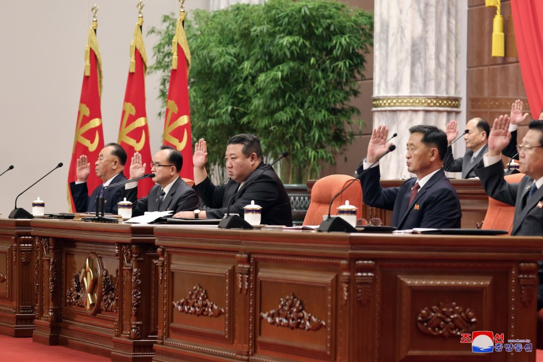

# 朝鲜为何公开宣布这是“最严重的错误”？

“这是最严重的错误。”

2023年6月16日到18日，朝鲜劳动党第八届中央委员会第八次全体扩大会议（下简称八届八中全会扩大会议）在党中央委员会本部召开。据朝中社报道，在提交给全会的报告中，劳动党中央政治局“严厉总结了在一方面出现的绝不可忽视的一些缺点”，即今年5月31日军事侦察卫星发射失败事件。

_6月16日到18日，朝鲜劳动党八届八中全会扩大会议举行_

5月31日上午，朝鲜宇宙开发局使用“千里马1号”型新型运载火箭，在平安北道西海卫星发射场发射了军事侦察卫星“万里镜1号”。但是，火箭第一阶段分离后，第二阶段发动机失灵，丧失推进力，坠落于西海海域，疑似航天器残骸已被韩国军方打捞。

这是朝鲜首次发射军事侦察卫星，亦是2016年以来首次发射卫星，本次会议报告将之称为“宇宙开发领域的重大战略工作”，韩美媒体则多认为这是为八届八中全会扩大会议召开的“献礼工程”。发射失败后，朝方曾表示将“在短期内尽快进行第二次发射”，但如今发射窗口期已过，八届八中全会扩大会议也已闭幕，而外界尚未发现再次发射的动向。

朝鲜劳动党一般在每年6月和12月举行中央委员会全会，以半年为期检讨国防、经济、工业、农业各战线工作得失，同时调整包括劳动党中央政治局在内的人事安排。本次会议，除了严厉总结卫星发射失败，批评相关干部“不负责任”，宣布改组宇宙开发机构，还做出一系列人事变动决定。

**“严厉总结”和“严厉批评”**

从细节上看，劳动党八届八中全会扩大会议，有些不同寻常。根据劳动党中央政治局5月28日发布的召开中央委员会全会的决议，本次会议应在“6月上旬”召开。但会议实际的开幕时间，拖延到了6月16日。

_6月16日到18日，朝鲜劳动党八届八中全会扩大会议举行_

除了仅进行一天的八届一中全会外，朝中社等官方媒体对八大以来历次劳动党中央全会，都按日发布报道，更新会议进度。但这一次，除了宣布开幕的报道，以及一篇总结性的长通讯外，朝中社并未逐日发布会议动态。

在报道全会听取政治局报告时，朝中社未提及最高领导人金正恩是否如往常一样进行大会发言。朝鲜中央电视台的画面则显示，金正恩并未亲自作报告。6月18日全会闭幕后，增选后的劳动党中央政治局召开第一次会议，官方播发图片也显示金正恩并未出席。

韩美政府、媒体及分析人士多认为，这些变化与5月31日的卫星发射失败有关。韩联社就称，这一重大事件影响到对朝鲜上半年工作成果的总结和评价，或许是八届八中全会扩大会议稍稍延期、金正恩没有作大会报告的原因。

朝鲜对卫星发射失败事件的批评确实非常严厉。金正恩曾说：“卫星发射不只是科技工作，而是拿着国家和民族的尊严，在全世界的关注下进行的非常重要、责任重大的工作。”

本次全会报告中，劳动党中央政治局指出，虽然劳动党八大提出的国防力量发展五大重点目标都很重要，但其中“军事侦察卫星开发工作对我们武装力量的发展前景和切实做好战斗准备方面具有极其重大的意义”。也正因此，发射失败成为“最严重的错误”。

此前，负责卫星发射的朝鲜宇宙开发局解释说，“千里马1号”卫星运载火箭在正常飞行过程中完成了第一级间分离，但二级发动机未能正常点火，导致火箭失去动力，坠入半岛西部海域。事故原因初步认为是用于“千里马1号”的新型发动机系统可靠性和稳定性较差，以及所用推进剂的燃烧有不稳定性特点。

韩国国情院则宣称，以往朝鲜发射火箭的一、二级推进器都是按直线飞行，此次设为朝偏西方向飞行，强行向东变更飞行路径，可能在此过程中发生技术问题。此外，韩国于5月25日成功发射自研火箭“世界号”，或许“刺激到朝鲜”缩短了卫星发射准备周期，从而出现事故。

本次政治局报告则点出另一个问题：“负责推进射星准备工作的干部们的不负责任的态度”。为此，报告两次使用“严厉”一词，“严厉总结”缺点并“严厉批评”有关干部态度。不过，到底谁将为卫星发射失败事件负政治责任，官方报道并未披露具体决定。

一个细节是，被视为朝鲜“军事和军工战线主要负责人”的劳动党中央政治局常委李炳哲，在八届八中全会扩大会议上，和同为政治局常委的赵甬元、金德训、崔龙海均在主席台第一排就坐，位列金正恩两侧。不过，会议期间，赵甬元、金德训、崔龙海均被朝中社提及在各自分管领域发言，而李炳哲则没有发言的报道记录。

**宇宙开发部门或将重大改组？**

不过，报告同时强调，“万里镜1号”发射失败，不会导致朝鲜的宇宙开发工作暂停。相反，报告要求有关部门干部和科学家“铭记重大使命感，彻底分析此次发射失败的原因和教训，尽快成功发射军事侦察卫星”。

自1998年以来，朝鲜共七次进行卫星及卫星运载火箭发射试验，其中仅两次将卫星送入轨道。2012年4月，“光明星3号”在发射第一阶段约100秒后失败，其部分残骸被韩国军方回收。同年12月，朝鲜第二次尝试发射“光明星3号”，顺利将卫星送入近地轨道。虽然美国政府宣称该卫星不能稳定观测地表，但就卫星发射而言，这是朝鲜第一次成功。

除了强调再次发射卫星，政治局报告还指出，“扩大和发展宇宙产业当作国家性工作来顽强推进”已成为迫切任务，朝鲜要“全部调动全国的宇宙科技潜力”。政治局已就此提出“必不可少的机构措施”，将提请最高人民会议审议。

目前，朝鲜的宇宙开发工作主要由2013年组建的宇宙开发局主导，但科研力量分散在国家科学院及各主要科研院所。为整合研究力量，朝鲜在2016年成立了联系各部门卫星科学家的宇宙协会，首任委员长由金策工业大学副校长担任。每一年，朝鲜都会举行一次全国性的跨部门宇宙科技研讨会，组织者有时是宇宙开发局，有时是宇宙协会，有时又是科学技术总联盟。

分析认为，随着朝鲜推动“核武库倍增”等军工发展计划，2022年以来，新整合成立的洲际弹道导弹部队、导弹总局等机构纷纷亮相，显示出朝鲜正在重新整合军工研发力量。在此背景下，改革宇宙开发领导机构，并不令人意外。

值得注意的是，本次会议上，曾任劳动党中央军需工业部部长的强纯男当选劳动党中央政治局委员。他去年12月调任国防相之际，刚刚成为政治局候补委员。也是在去年12月，被美国财政部以参与大规模杀伤性武器和弹道导弹研发为由列入单边制裁名单的新任平壤市责任书记金秀吉、前军需工业部长俞镇分别晋级政治局候补委员和中央委员。

如今，强纯男进一步升迁，是因指挥庆祝朝鲜人民军建军75周年阅兵式等工作有功，还是可能担任更高的职位？多位前军工战线高级官员进入决策层，谁将领导导弹总局，谁将领导宇宙开发？尚有待观察。

在今年4月18日的视察中，金正恩曾提出对朝鲜宇宙开发的远期设想：在五年计划期间“把大量侦察卫星”多角布置在太阳同步近地轨道上，形成自己的卫星情报网。9年前发布宇宙开发局徽章时，朝中社曾解释称，其浅蓝色带状的轨道意味着，朝鲜将“向宇宙所有轨道继续发射卫星”。

**经济、统一战线为何“老将出马”？**

除了卫星发射失败，遭到劳动党中央政治局严辞批评的，还有经济建设。据朝中社报道，政治局报告指出，上半年度经济工作中“无条件执行国民经济计划”的纪律不够严明、经济自立基础夯实工作不够扎实。全会发言中，负责劳动党组织、纪律工作的劳动党中央政治局常委赵甬元还指出，一些地方政府的人民委员长“陷于失败主义泥坑，没有以主人的态度进行自己所肩负工作”。

韩国统一部认为，这些词句“暗示（经济建设）计划未能如期得到落实”。与此同时，一年前刚刚卸任高层职务的原劳动党中央经济部长吴秀容，此番和强纯男一起当选劳动党中央政治局委员，同时出任中央委员会书记，并兼任部长。《劳动新闻》在刊发其照片时，标注显示他已经复职劳动党中央经济部长。

年过七旬的吴秀容早年是技术官员出身，长期在工业部门任职，曾负责合资企业事务，2007年获得象征朝鲜最高荣誉的金日成勋章。2017年，朝鲜劳动党组建“前所未有”的经济部，统管财政、经济、工业战线工作，首任部长就是吴秀容。从金正恩提出核武器发展与经济建设并行的方针，到2018年转向“以经济建设为中心”，再到劳动党八大重提国防与核战略，吴秀容始终负责经济工业领域工作。

因此，去年6月吴秀容被免去劳动党中央委员会书记、经济部长职位时，分析普遍认为他是“到站退休”。此后，他依然以高级干部身份出现在一些礼仪性场合。韩政府统一部发言人6月19日表示，朝鲜此番重新启用吴秀荣，是为了“克服困难，因为当前缺乏经济成就”。

从八届八中全会扩大会议的报道细节来看，经济工作仍是劳动党中央当前工作的重中之重。2022年6月八届五中全体扩大会议以来，劳动党历次中央委员会全会都扩大到主要农业官员及工厂负责人，本次会议延续了这一“新常态”。本次政治局报告还透露，2023年是朝鲜“建设历史上工程量最多”的一年。

此外，今年3月，劳动党在八届中央委员会会期内破例召开一次前后都只间隔3个月的八届七中全体扩大会议，重点讨论农业和粮食问题。韩联社称，这是为了解决“90年代以来最严峻的粮食危机”。据韩国农村振兴厅去年12月公布的数据，朝鲜去年粮食作物同比减产18万吨。联合国粮农组织称，朝鲜需接受外部粮食援助。

在此背景下，韩联社评论道，吴秀容重返“经济指挥塔”，有望为解决粮食难题和推动朝鲜经济以尖端产业为中心发展发挥领导作用。

另一位在本次会议上复出的“老将”，是2019年朝美会谈破裂后就离权力中心“越来越远”的原统战部长金英哲。77岁的他跳过党中央候补委员，被直接补选为劳动党中央委员，随即“更进一步”，当选政治局候补委员。

如今活跃在朝鲜政坛的高级干部如赵甬元、金德训、金与正等，大多是在金正恩成为最高领导人后逐步成长起来的“新生代”。但金英哲和吴秀容是金正日执政时期成长起来的高级干部，二人都名列金正日治丧委员会名单。此外，他们都曾参加2018年到2019年的朝韩、朝美对话。金英哲曾作为金正恩的“特使”前往美国面见特朗普，吴秀容则在2019年2月陪同金正恩出访越南河内。他们重回决策层，是否意味着更重大的政策调整？

本次会议开幕时，朝中社报道列举会议的三个主要议题之一是“应付国际形势剧变的国家外交及国防战略问题”。但在总结报道中，这部分内容占据篇幅不长，没有明确强调核武库、洲际弹道导弹等建设工作。不过，报告指出，朝鲜将“更加积极地开展对外活动”。

记者：曹然

