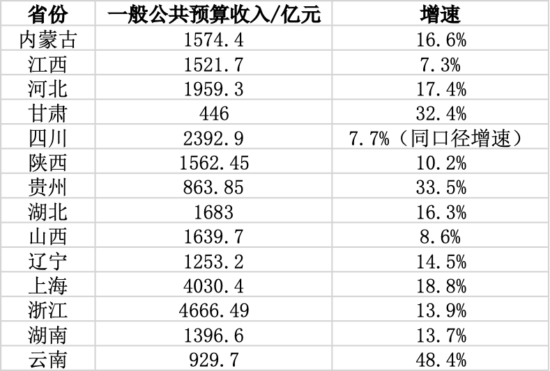

# 14省份公布前5月财政“账本”：税收收入恢复性增长，卖地收入仍低迷

近日，各地陆续公布今年前5月财政收支“账本”。

澎湃新闻梳理发现，截至目前，已有至少14省份公布1-5月财政数据，14省份一般公共预算收入均实现正增长，按自然口径计算，多个省份实现两位数增长，其中，云南、贵州、甘肃增速分别达48.4%、33.5%、32.4%。

从支出来看，除云南一般公共预算支出同比下降外，12省份支出均同比增长（湖南未公布前5月财政支出数据），多省民生等领域支出占比大、增速高。

此外，由于房地产市场持续低迷，地方政府性基金预算收入中的国有土地使用权出让收入大部分出现下滑。

_部分省份2023年1-5月一般公共预算收入情况（制图：澎湃新闻）_

**地方财政收入恢复性增长，部分省份卖地收入降幅收窄**

财政部近日公布的数据显示，今年1-5月，地方一般公共预算本级收入53841亿元，同比增长16.5%。

今年以来，地方财政收入整体恢复性增长。据澎湃新闻不完全统计，截至目前，已有内蒙古、江西、河北、甘肃、四川、陕西、贵州、湖北、山西、辽宁、上海、浙江、湖南、云南等14省份公布今年前5月财政收支相关数据。其中，14省份的一般公共预算收入均实现正增长，按自然口径计算，绝大多数省份实现两位数增长，增速较高的为云南（48.4%）、贵州（33.5%）、甘肃（32.4%），均为西部省份。

相较于1-4月的一般公共预算收入增速，14省份中，河北、甘肃、陕西、贵州、湖北、辽宁、上海、湖南、云南9省份1-5月的增速继续提升，其他省份增速下降。增速下降的省份中，来自江西省财政厅的数据显示，5月份，该省一般公共预算收入完成227.4亿元，同比下降1.9%。

从一般公共预算收入构成看，税收收入为主要部分，内蒙古、甘肃、陕西、贵州、湖北、山西、辽宁、浙江、湖南、云南10省份公布了前5月税收收入增速，多高于非税收入，同时，除陕西（9.9%）、山西（4%）外，其余8省份税收收入均为两位数增长，其中，云南（87.2%）最高。

财政部数据显示，1-5月，全国税收收入84774亿元，同比增长17%。前述10个省份中，云南、甘肃（52.3%）、贵州（43.3%）、湖南（21.2%）、湖北（20.2%）、辽宁（18.7%）6省份税收收入增速快于全国水平。

**当前地方财政收入大幅上升，除了经济恢复因素外，还主要受到基数效应影响，去年同期大规模增值税留抵退税拉低了基数。**

云南省财政厅指出，1-5月全省地方一般公共预算收入增速较高的原因主要是上年同期落实大规模增值税留抵退税政策拉低收入基数，剔除增值税留抵退税因素，全省地方一般公共预算收入同口径增长5.4%，税收收入同口径增长4.7%。浙江省财政厅也指出，全省1-5月增值税1532.41亿元，增长67.0%，主要是去年4月以来国家实施大规模增值税留抵退税政策，收入基数较低。

除了一般公共预算收入外，以卖地收入为主的政府性基金预算收入是地方财政收入的另一重要来源。不过，由于房地产市场低迷，国有土地使用权出让收入多为两位数负增长，政府性基金预算收入也多为负增长。

从全国看，1-5月累计，全国政府性基金预算收入18657亿元，同比下降15%。地方政府性基金预算本级收入17051亿元，同比下降16.7%，其中，国有土地使用权出让收入14893亿元，同比下降20%。

14省份中，内蒙古、江西、河北、甘肃、湖北、浙江、云南公布了前5月政府性基金预算收入情况，除云南（18.7%）、内蒙古（8.7%）实现正增长外，其余省份均为负增长，湖北（-31.7%）、江西（-23.4%）、浙江（-20.2%）为两位数负增长。江西、甘肃、湖北、浙江、云南公布了前5月国有土地使用权出让收入情况，除云南（19.6%）外，其余均为负增长，不过，甘肃、湖北、浙江的降幅较1-4月收窄。

粤开证券首席经济学家罗志恒指出，我国房地产风险逐步缓释，但房地产销售、投资同比降幅扩大，房地产待售面积同比创2016年3月以来新高，房地产企业拿地能力和意愿未明显恢复，导致土地出让收入仍大幅负增长，直接减少了部分地区的可支配财力。

罗志恒进一步表示，当前我国财政形势稳中有忧，收入的大幅提升主要是基数效应导致，考虑到土地出让收入大幅下降和债务集中到期，地方财政紧张状态仍值得关注。

**财政支出保持增长，但多省增速放缓，民生支出增速高**

虽然财政收入恢复性增长，但财政支出也基本保持增长，部分地方财政处于紧平衡状况。

财政部数据显示，1-5月累计，全国一般公共预算支出104821亿元，同比增长5.8%。其中，地方一般公共预算支出91729亿元，同比增长5.7%。

14省份中，除云南前5月一般公共预算支出增速为负、湖南未公布前5月财政支出相关数据外，其余12省份前5月一般公共预算支出同比保持正增长，其中，上海增速最高，为16.3%，此外，湖北（12.8%）、内蒙古（11.4%）、四川（10.3%）为两位数增长。不过，多个省份1-5月一般公共预算支出增速较1-4月下滑。

从支出科目看，社保、教育等民生领域支出增速较高，且占比较大。比如，山西财政厅表示，1-5月民生支出占全省一般公共预算支出比例达81.4%。浙江、湖北等地1-5月教育支出、社会保障和就业支出等民生领域支出增速快于整体支出增速。

此外，也有部分省市财政支出重点保障科学技术等领域，从全国看，前5月科学技术支出3342亿元，同比增长8.6%。上海市财政局表示，1-5月，文化旅游、商业服务、科学技术等重点支出优先保障，执行情况较好。

对比地方财政收入和支出，两者之间存在一定差额，根据新华社此前报道，当前地方40%左右的财力来自中央财政的转移支付，今年，中央对地方转移支付规模创下近年新高，达10.06万亿元。财政部相关负责人表示，当前，中央对地方转移支付预算正按规定抓紧下达，确保符合下达条件的资金“应下尽下”，为地方分配使用资金留出更宽裕时间。

地方各级财政也在加大资金统筹、盘活、压减、调整力度，开源节流，有保有压，提升财政资金使用效益。

总体上看，当前我国财政运行仍保持紧平衡状态。罗志恒指出，在低基数的作用下一般公共预算收入增速持续上升、房地产低迷引发土地出让收入负增长，整体可支配财力并未明显扩张。

