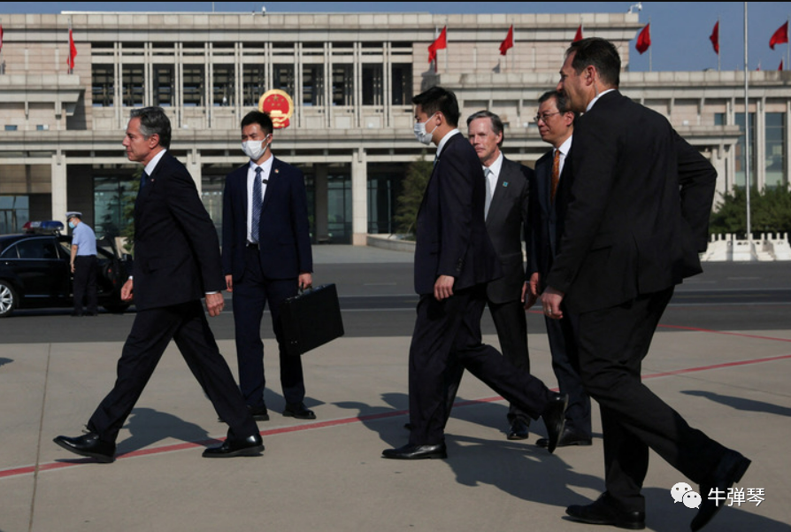
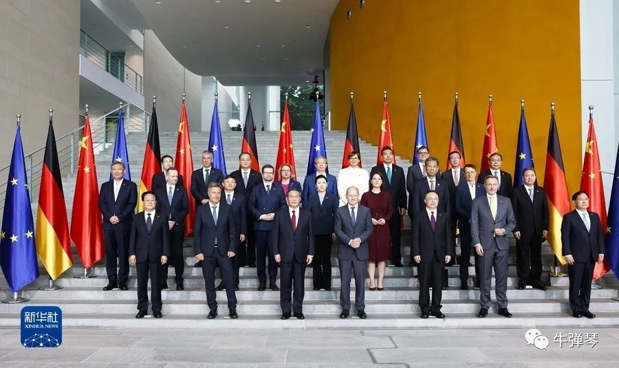
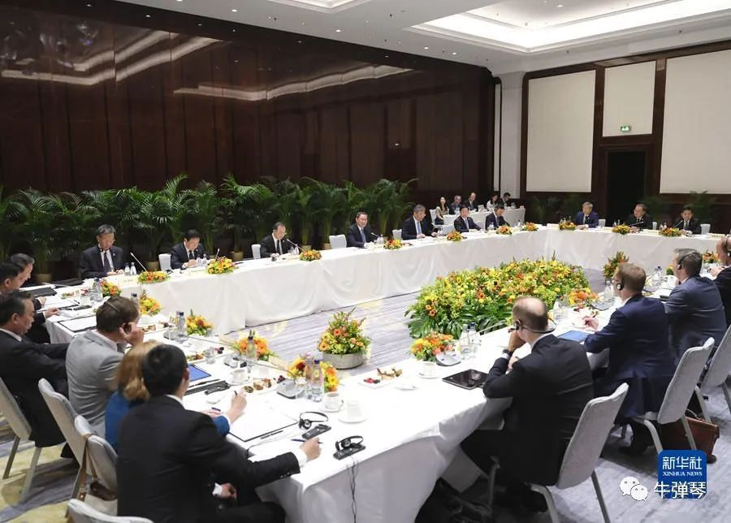
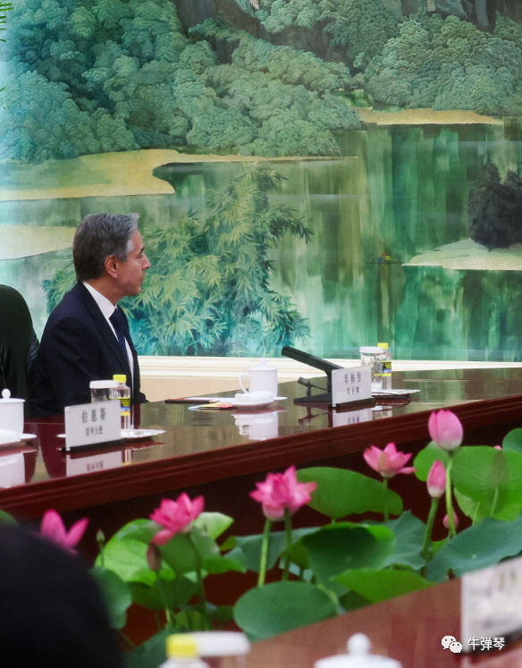

# 中国这一轮仲夏外交攻势，让世界刮目相看

6月是仲夏。 **中国这一轮仲夏外交攻势，着实让世界刮目相看。**

完全我个人的观点，这一轮攻势，大致可分为三个波次。

**第一波次，毫无疑问，是美国国务卿布林肯的登门来访。**

大背景，大家都知道，中美今年进行了一系列激烈较量，让全世界看得心惊胆战。以至于在和布林肯会谈时，秦刚很坦率地说了一句话：
**当前，中美关系处在建交以来的最低谷。**

这种最低谷，是很危险的，不排除出现急转直下的事件。

看有朋友就分析，慑于中方的坚定斗争意志，又感受到国际社会的担忧，美国开始着急从危机中翻篇。

所以，我们看到，最近在与中国打交道时，美方明显姿态放低，不管是拜登还是布林肯，都多次公开“喊话”，称希望与中方重启高层互动，加强管控，防止风险失控。

所以，我们看到，最终布林肯来了，这也是他第一次作为国务卿访华，而且，不是“应邀来访”，而是“双方商定”他来北京。

但总体谈得还不错，坦诚、深入、建设性。他与秦刚会谈，与王毅见面。外界更惊喜地看到，中国最高领导人还礼节性会见了布林肯，这是当年蓬佩奥来访时没有的特殊礼遇。

中国领导人明确告诉布林肯：
**中国尊重美国的利益，不会去挑战和取代美国。同样，美国也要尊重中国，不要损害中国的正当权益。任何一方都不能按照自己的意愿塑造对方，更不能剥夺对方正当发展权利。**

经过激烈的谈判，中美最终达成五项共识。

一是双方同意共同落实两国元首巴厘岛会晤达成的重要共识，有效管控分歧，推进对话交流合作。

二是双方同意保持高层交往。布林肯国务卿邀请秦刚国务委员兼外长访美，秦刚表示愿在双方方便时访美。

三是双方同意继续推进中美关系指导原则磋商。

四是双方同意继续推进中美联合工作组磋商，解决中美关系中的具体问题。

五是双方同意鼓励扩大两国人文和教育交流，就增加中美之间客运航班进行积极探讨，欢迎更多对方国家学生、学者、工商界人士到彼此国家互访，并为此提供支持和便利。

这样的积极进展，拜登也很高兴，当即在华盛顿表态， **“我们走在正轨上”** 。

我相信，中美的仲夏共识，多少也让国际社会舒了一口气，你们这两只大象，还是别斗了。

但关键是落实。对说一套做一套，我们都有严重的“审美疲劳”了。

接下来，就是检验美国信誉的时候了。

**第二波次，就是中国总理出访欧洲了，先去德国，再去法国。**

说起来，这还是李强总理3月就任后的第一次出访。人生的第一次，总有着特殊的意义；政治家的第一次，更传递出非同寻常的信息。

为什么是德国？为什么是法国？

很简单，也表现了中国对德国和法国的特别看重。

但我们也不用回避，在发展对华关系上，德国和法国有自己的坚持，但也受到美国的强大压力。

中国总理是去谈合作，也是去做工作。

很有意思的一个细节，看新闻报道， **在德国柏林，中国总理还召开了一次别开生面的座谈会。**

西门子、大众、奔驰、宝马、舍弗勒、巴斯夫、科思创、瓦克化学、默克、思爱普、安联等一众德国大企业老板参加。根据中国总理的提议，他们围绕如何看待当前国际经济政治形势、如何看待中国经济走势、如何看待未来技术发展前景、如何看待一些国家提出的所谓“去风险”“降依赖”等，畅谈交流。

中国总理的有些话，很是意味深长。

他告诉德国企业家： **防风险和合作不是对立的，不合作才是最大的风险，不发展才是最大的不安全。**

他接着说：经济全球化使世界经济你中有我、我中有你，应该辩证看待依赖问题，不能人为夸大“依赖”，甚至把相互依存与不安全简单画等号。对于一些具体问题要具体分析，各方完全可以通过协商合作，共同防范应对。

什么意思？

所谓“去风险”“降依赖”，我们很清楚，针对的是我们中国；但上纲上线，损害的是企业利益，也不符合时代潮流。

德国企业家，肯定心有戚戚焉。

所以，在与李强总理会谈时，德国总理朔尔茨也明确承诺： **德方欢迎中国实现发展繁荣，反对任何形式的脱钩，去风险不是“去中国化”。**

但关键还是落实。

相信总理的这一次出访，对中德中法以及中欧关系都会是一个促进，在这个非常特殊的仲夏时刻。

**第三波次，就是四位外国总理联袂来访了。**

哪四位？

**巴巴多斯总理莫特利、**

**蒙古国总理奥云额尔登、**

**新西兰总理希普金斯、**

**越南总理范明政。**

他们都将出席6月底在天津举行的夏季达沃斯论坛，并对中国进行正式访问。

其中，既有邻国，蒙古和越南，都是山水相连的友好邻邦；也有加勒比客人，巴巴多斯，是加勒比重要国家；还有西方来客，新西兰虽在大洋洲，但属于西方世界，而且还是盎撒国家，“五眼联盟”成员。

但没关系，来了都是客。

我们也不用回避，疫情等种种原因，很多朋友都很长时间没来中国了，一些关系也有点生疏了。

现在，多走走看看，多见面交流，以中国人的待客之道，以中国市场的巨大魅力，很多问题往往就不成问题，很多合作多谈谈也就成了。

最后，怎么看？

仲夏这三波外交攻势，有开门迎客，也有出动出击，有依次会见，也有联袂到访……

有些，波澜不惊，从容淡定；但有些，跌宕起伏，精彩纷呈。

**什么是外交艺术？**

**这就是外交艺术** 。

还是那句话， **将朋友搞得多多的，将敌人搞得少少的，上下同心，中国又何惧之有？**

哪怕美国要求选边站队，我相信，拒绝站队的国家，肯定一大把。德国肯定拒绝，法国绝对不干，很多国家也都会强烈反对。

这又让我想起最近的 **“外交之花”——最高领导人会见布林肯时，会议桌中间摆的是荷花。**

为什么是荷花？

新华社记者解读说： **当下正是荷花盛开时节，“荷”与“和”“合”谐音，我们期待中美两国和平共处、合作共赢。**

荷花，寓意着和平，合作。

**这是中国人的外交艺术，更是中国人的处世之道。中国不是敌人，而是朋友。将中国当作敌人，那只会是敌人的噩梦。**

我们要有这种自信，我们更要有这种实力，不仅仅是硬实力，还要有软实力。辱骂与恐吓决不是战斗，做好自己的事情最重要。

仲夏之际， **接天莲叶无穷碧，映日荷花别样红！**

这就是中国。我也该去圆明园看看荷花了。

