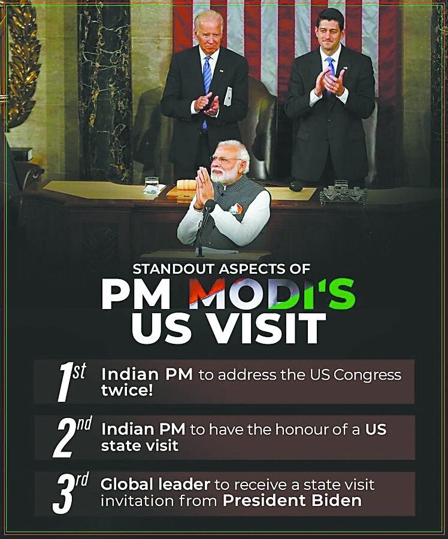

# 印度总理莫迪今天启程访美，美高官：中国肯定是此次访问战略话题

【环球时报综合报道】印度总理莫迪21日起访问美国。据《印度时报》报道，自2014年上任以来，莫迪曾先后6次访问美国，但这次访问首次被提到“国事访问”的高度。“从许多方面来看，莫迪都是拜登以国事访问规格接待外国领导人的奇怪选择”，美联社20日发文称，随着拜登政府认定与印度的关系对美国来说具有“决定性意义”，“莫迪政府的人权纪录和与俄罗斯的密切关系都被抛诸脑后”。路透社称，此访被视为美印关系的“转折点”，具有里程碑意义，其焦点是美印将深化国防工业合作、共享高科技，预计印度将获得美国很少与非盟友分享的关键技术：美国将批准通用电气在印度生产其国产战斗机的发动机，印度将购买31架由通用原子公司制造的MQ-9B“海洋卫士”武装无人机。《华尔街日报》称：“在美西方与俄罗斯对峙、与中国日渐对立之际，印度料将从中得利。”

_印度人民党发布的莫迪访美宣传图片。背景图为莫迪2016年6月在美国国会联席会议上发表演讲，当时拜登为美国副总统。_

**“从未有印度总理这样做过”**

印度报业托拉斯20日称，在莫迪之前，只有印度前总理辛格于2009年11月被邀请到美国进行“国事访问”。根据印度政府公布的日程，莫迪21日将在纽约联合国总部主持国际瑜伽日活动；22日，拜登将在白宫接待莫迪，后者将在美国国会联席会议上发表演讲。印度政府称，这将使莫迪成为首位两次在美国国会发表演讲的印度总理（上次是2016年6月）。印度外长苏杰生说：“没有任何一位印度总理在美国国会发表过两次演讲，在世界各地，也只有少数人这样做过……包括丘吉尔、曼德拉。这就是为什么它如此重要。”

美国“政治新闻网”19日称，最引人注目的时刻是拜登22日将举行国宴招待莫迪，这是通常为亲密盟友保留的荣誉。拜登政府上台以来，只有法国总统马克龙和韩国总统尹锡悦受到如此款待。评论称，“这将是对新德里崛起的认可，但掩盖了它带来的复杂性，批评者指责拜登政府将传统地缘政治置于人权问题之上。”

23日，莫迪将在美印战略伙伴关系论坛组织的一场活动上发表讲话，多名美国商界领袖将出席。美国CNBC网站称，莫迪此行中，约有15至20位美国企业首席执行官将拜访莫迪，包括美光科技、通用原子公司、通用电子及特斯拉公司。在离开美国前，莫迪还计划向在美印度侨民发表讲话。

**“中国肯定是此访的战略话题”**

美印双方都极力强调莫迪此访的重要性。路透社称，印度外交秘书克瓦特拉19日对记者说，“这是我们关系中的一座里程碑”，预计将展示的一项重要成就是在防务领域的合作，印度寻求在国内生产更多的武器和装备，供本国使用和出口。新德里亚洲协会政策研究所高级研究员莫汉说：“这不是一次例行访问，这是印度和美国关系的一个根本性转折点。这不是抑制中国或反对中国的问题，而是关乎在亚洲建立新的权力平衡。”

“随着中国崛起，印度和美国都需要彼此，美国需要在印太地区有更多的伙伴。”美联社20日引述印度外交学者米斯拉的话说，“他们不能再单打独斗了，因为中国正在追赶美国，且中国经济规模远大于印度。因此，美印存在地缘政治利益的一致性。”

《印度斯坦时报》20日发表对美国总统国家安全事务助理沙利文的采访称：“天空是印美关系的极限，全世界都会感受到影响。”当被问到“对中国的担忧在多大程度上推动了美印关系的发展”时，沙利文说，拜登总统和莫迪总理更多从机遇的角度看待美印关系，而不是从威胁和挑战的角度看待，“这不是某种地缘政治交易或针对共同威胁的权宜之计”，“话虽如此，中国肯定会成为此次国事访问的战略话题”。

“美国正在对俄中两国打‘印度牌’”，俄罗斯《生意人报》20日以此为题发文称，此次莫迪访问期间，美国的主要目的是让印度站在自己一边，以对抗俄中两国。为此美国可以做出许多妥协，例如向印度出售攻击型无人机，就联合生产战斗机发动机达成协议，包括技术转让。美国希望说服印度放弃与俄罗斯的传统军事合作，并证明美国是一个更具前景的伙伴，对印度盟友不再有任何限制。

**从“不结盟”到“多向结盟”**

《华尔街日报》20日发表对莫迪的专访。报道称，与印度前领导人尼赫鲁在冷战初期提出的“不结盟”愿景不同，莫迪的外交政策是“多向结盟”，即与一系列全球大国合作，以推进印度的利益，包括那些彼此之间存在冲突的国家。莫迪发出的信息是，印度在全球政治中的作用和其对世界经济的贡献巨大，印度的时代已经到来。他还暗示印度想要成为联合国安理会常任理事国。

针对外界批评印度在俄乌冲突中的立场，莫迪在采访中称：“我不认为这种批评在美国广泛存在。”“印度的立场众所周知，也得到充分理解。”“有些人说，我们是中立的。但我们并不是，我们站在和平的一边。”他表示，应通过外交和对话而不是战争来解决争端。

美联社称，2021年，俄罗斯石油仅占印度年度原油进口量的2%，这个数字现在超过19%。美国智库战略与国际问题研究中心（CSIS）专家罗索表示，白宫虽然希望印度不要继续购买俄罗斯石油，但也不会让此事变成决定性因素，因此会通过“细微、适当的方式轻轻推印度”。

上海国际问题研究院研究员赵干城20日告诉《环球时报》记者，莫迪访美的主要看点就是军事技术上的合作，这是美国的“一记狠招”，目的是要把印度从俄罗斯一边拉过来，因此俄罗斯和印度的关系接下来会面临挑战。印度不愿意全面依附美国，但是到手的好处也不会放弃。

俄罗斯也关注到这一问题。俄新社20日报道称，美国希望让印度远离俄罗斯，或者减少印度在国防装备领域对俄罗斯的依赖。但印度在与俄罗斯的关系和俄乌冲突上都清楚地表明了自己的立场。目前，印度的目标是使该国的武装力量现代化，新德里不会放弃与俄罗斯的关系。

【环球时报驻美国特约记者 郑可 环球时报记者 王琪 环球时报特约记者 柳玉鹏王逸】

