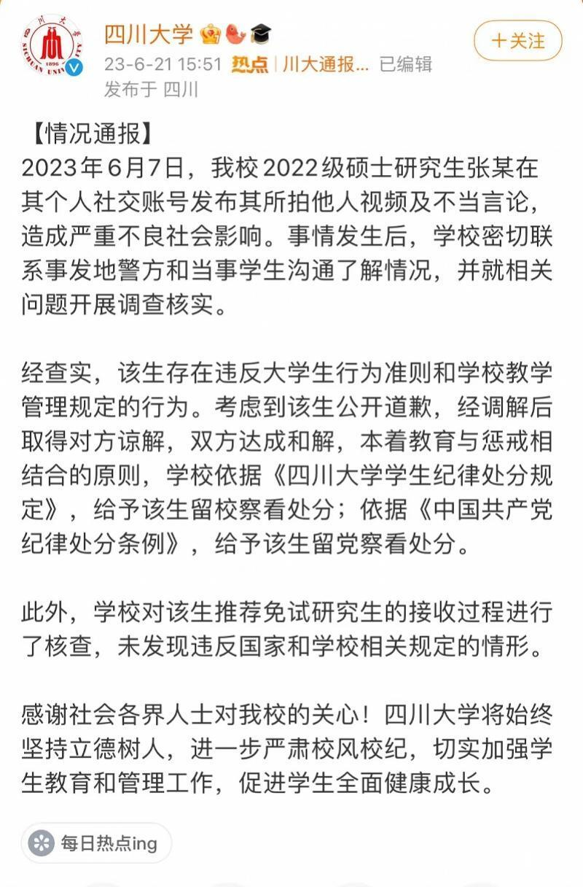

# 川大通报女学生地铁偷拍事件处理结果，媒体：还有两件事待查

对涉事学生保研的河南大学选送阶段，可能还需要张某本科所在学校也同样给出调查结论。不仅如此，还有其高中阶段涉校园霸凌的情况，也是川大通报后需要继续当事学校“接球”回应的一个部分。

南都评论员 萧锐

“造成严重不良社会影响”，就在刚刚，四川大学就该校在读硕士研究生张某“在其个人社交账号发布其所拍他人视频及不当言论”事件发布情况通报，在认定“造成严重不良社会影响”后，鉴于其获得谅解及双方和解情况，给予张某留校、留党察看处分。

不是开除，但也都在开除边缘的两项处分了！作为涉事学生现就读学校，川大的回应和调查一直都备受瞩目，此次校方发布的情况通报，在其职权范围内对涉事学生进行了处理，亦是代表校方对此事件的态度。

按照《四川大学学生纪律处分规定》与《中国共产党章程》的相关规定，留校（党）察看均属于仅次于开除的处分措施，均有明确的察看期限，和对被处分人相应的再次考察程序。

川大校规明确，受到留校察看处分的学生，在留校察看期间未发生违纪行为的，按程序解除留校察看处分；在留校察看期间再次发生违纪行为的，给予开除学籍处分。党章亦有相应的“坚持错误不改的，应当开除党籍”规定。

也就是说，不管是川大校规，还是党章层面，对当事人的后续表现，都留有以观后效的余地。当事人此前在社交平台发布的致歉声明所言之“以实际行动改正”，
**不仅有外界的众目睽睽，也应当有校方的明确监督，从这个层面看此事也并没有完全画上句号。**

同时，川大通报明确其对该生“推荐免试研究生的接收过程”进行了核查，未发现违反国家和学校相关规定的情形，措辞严谨的表述也部分披露了此前外界对于张某保研阶段涉川大部分的核查结果。

**而对涉事学生保研的河南大学选送阶段，则可能还需要张某本科所在学校也同样给出调查结论。**
不仅如此，还有其高中阶段涉校园霸凌的情况，也是川大通报后需要继续当事学校“接球”回应的一个部分。

“教育与惩戒相结合”没错，治病救人也没毛病，对于一件已经引发公众如潮关注的公共事件，涉事机构、部门对其各自所涉阶段情况进行负责任的认真核查，也同样不能说是“个案升级”的处置，而应是必须要直面的分内事。

互联网时代的公共治理，因为各种数据的便捷汇总而难免有“拔出萝卜带出泥”的情况，更积极地应对总是要比遮掩回避要妥帖一些。

此前江西“指鼠为鸭”事件大动干戈的最终调查就是一个很好的示范。从另一个层面来说，对于已经牵扯出来的诸多陈年旧事有一个各管一段的权威结论，也是对当事人更负责任的态度。

“教育与惩戒相结合”的前提，就是要搞清楚基本事实。

**本着舆论要求全面审查的呼声，涉“地铁诬告门”的多家教育机构，应更加积极承担起各自的调查责任、坦然面对分内的调查任务。**

