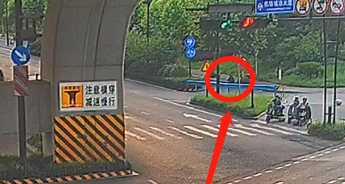
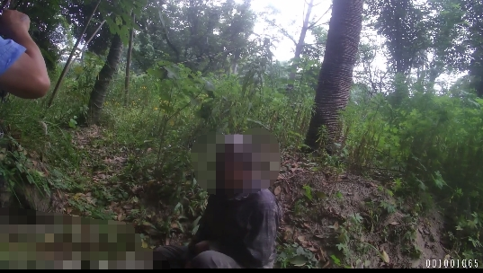

# 杭州一男子出门买早饭，在绿化带内迷路四天三夜，吃野花喝露水求生

“多亏了你们，再晚一步就危险了！”

近日，市民赵先生带着一面锦旗来到萧山宁围派出所，感谢派出所警力快速反应，暖心救援。

事情要从6月5日说起，当天上午，赵先生向派出所报警，称自己哥哥已经失联多日。

据悉，赵大伯今年52岁，在工地干活，6月3日一早离开工地后就没有回来，家属找了好久都没有收获，只能求助警方。了解情况后，派出所立即调取监控，发现大伯进入高架附近绿化带后便不见踪影。

救援警力第一时间赶到现场，此处绿化带面积广阔，植被茂盛，贸然深入的确有可能迷失方向。

现场警力立即开展“地毯式”搜寻，一路“披荆斩棘”，不放过每个角落，终于在一处树丛中发现了虚弱的赵大伯。

赵大伯在萧山打工不久，事发当天独自出门买早饭，因不熟悉环境误入绿化带中，结果被困，身边又没带手机，无法求助，这些天是靠吃野花喝露水挨过来的。

在确认赵大伯身体并无大碍后，搜救警力护送其安全回到家人身边。

**争分夺秒、化险为夷、暖心救援，为宁围派出所点赞！**

