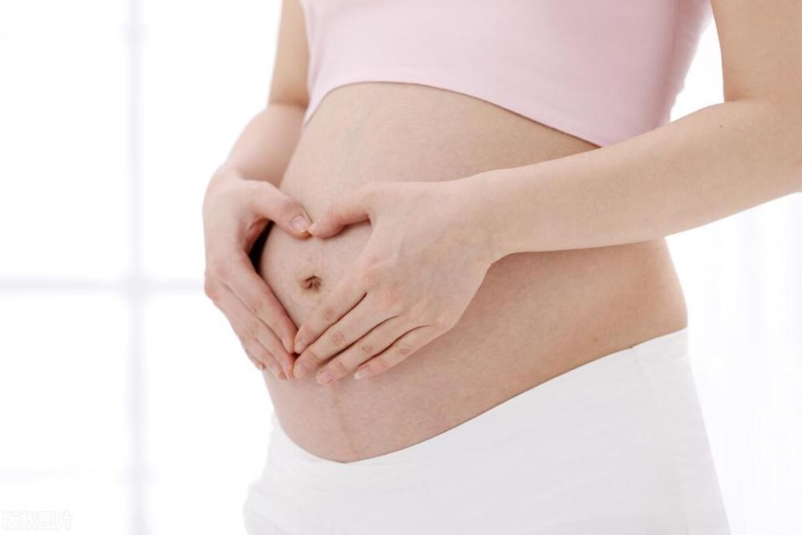

# 辅助生殖终进医保，但救不回生育率，妇产医院正遣散医护

拿到文件，北京妇产医院医保办主任谢丹第一时间跟门诊部、生殖科主任同步了消息。10天后，促排卵检查、囊胚培养、胚胎移植术……16项辅助生殖技术，将纳入北京医保。到时，医院的就诊量、工作量会迎来上涨。

7月1日起，16项辅助生殖项目纳入医保，北京妇产医院是文件中指定的16家医院之一。相比2022年2月，北京医保局仓促发文，此后落地暂停，搁置了一年。“这一年捋顺了部分项目价格和政策执行程序问题。”资深医疗投资人林掌柜透露。

政策利好，快速传导至二级市场，辅助生殖板块股市看涨。但利好十分短暂，在低生育率的现实里，与辅助生殖相关的机构、医院、公司几乎心照不宣：北京落地的16项辅助生殖进医保，拉不回生育率，也拉不高业务量。

一位专业人士表示，在不孕不育的人群里，大概只有20%的人群选择辅助生殖。国内每年做辅助生殖的大约仅有100万例，成功率也仅有30%~35%；也有人直言，没有生育意愿的女性，恰恰是不需要辅助生殖服务的女性，“这两拨人群刚好岔开了”。

不仅如此，“医保紧张的地方，生育意愿高，但辅助生殖没进医保；医保比较宽裕的地方，生育意愿反而低，辅助生殖却进了医保。”一位业内人士直言，这个矛盾难以调和。

为提升生育率，2016年放开二胎，托育、生育津贴、生育假期等政策出台。在低生育率时代背景下，辅助生殖进医保也被业内解读为提升生育率举措之一。

但产科寒冬的阴霾一年胜过一年。曾经“分娩大户”的区县妇幼保健院，降薪、内部调岗，下发通知几年不再招聘产科医生，甚至整体被当地的县人民医院兼并为一个科室；北京一家民营妇产医院，开业时门前喷泉、灯饰，如今为了省电，一层一片漆黑.....

回归现实，我们仍没有挣扎出低生育率的漩涡。

**辅助生殖，跌跌撞撞进医保**

业内纷纷表示，6月15日当天才得知辅助生殖进北京医保的消息。从宣布到落地，新政留给北京16家医院的准备时间只有半个月。医院为了等待已久的新政，正热火朝天。

谢丹很兴奋，替那些经常在医院里遇到的女性高兴。这次北京将辅助生殖纳入医保，“实际上待遇很好了。”

“大概能报销1万多块钱。”美中宜和生殖健康部负责人李洋告诉八点健闻，女性辅助生殖里，药是花费的大头，纳入医保的项目偏向于操作项目，占整体费用的三分之一。

这不是北京第一次传出要将辅助生殖纳入医保。早在2022年2月，北京就曾宣布，将16项辅助生殖技术项目纳入医保甲类报销范围，并于当年3月26日正式落地。按原计划，北京将成为全国第一个将辅助生殖技术纳入医保的省级地区，但进展并不顺利。

到了2022年3月26日，期待政策落地的患者去定点医院咨询，只得到了暂停执行的结果。

从新疆医保局答人大代表的回复中，似乎可以窥见暂停的原因：北京市于2022年3月26日将宫腔内人工受精、胚胎移植等16项辅助生殖技术纳入医保支付范围，但国家尚未制定出台相关新政策，因此，国家医保局要求北京暂停执行该政策。

这其中，也有国家医保局此前发文要求，逐步清理、规范各地“医保待遇小清单”的原因。

“一年前过于仓促，暂停是因为当时价格体系还没有完全理顺。考虑到医保基金的承压问题，国家医保局肯定要压一压。”资深医疗投资人林掌柜说。

有关辅助生殖是否纳入医保，医保局的态度在近三年也一度转变。2020年10月10日，国家医保局表示，“目前尚不具备将辅助生殖技术纳入基本医疗保险支付范围的条件。”但到2022年8月，17部门联合发布《关于进一步完善和落实积极生育支持措施的指导意见》，提出逐步将适宜的分娩镇痛和辅助生殖技术项目按程序纳入基金支付范围；2023年5月，在国新办发布会上，国家医保局表示，逐步将辅助生殖技术项目纳入医保基金支付范围。

业内预测，国家医保局的口径放松后，辅助生殖进医保或将陆续在各地落地。“总的趋势是发达地区先落实，江苏、浙江、上海甚至天津、广东都是有可能的。”林掌柜说。

**难以驱散的产科寒冬**

辅助生殖进医保，并没有驱散产科寒冬的阴霾。

北京市朝阳区某妇产医院信息数据分析负责人韩映观察，近10年来，分娩出生人口在2017年达到峰值后，出生率急剧下滑。

多年来，韩映观察统计北京朝阳妇产类医院的出生人口变化情况。“生育政策调整效应2017年达到最大化，开始以每年20%的速率下降。”2023年第一季度仅比2022年同期增长3%，韩映粗略预测，2023年出生的新生儿估计仅比2022年增长5%，“也就是3万与3万零几百的区别，没有实质性增长”。

低生育率背景下，就算这次被纳入辅助生殖定点医院名单的北京妇产医院，也从之前一年接近19000的分娩量，降至1万，缩水近50%，这是北京市分娩量排名第一的医院。

湖北省妇幼保健院，这些年的年分娩量也下降了约10%；云南一家县级医院因生育率降低，年分娩量从1000多缩水至500~600人；河北一家妇幼保健院破产清算，外债5000多万、薪资拖欠一年未发，正寻找接盘者……

早年作为“分娩大户”的县妇幼保健院，靠产科分娩就能很好存活，“救治能力也因此相对较弱”，如今，发不出工资，被县人民医院收编，成为县人民医院的一个科室。被收编后的县妇幼保健院，为提升其救助能力，县人民医院向县妇幼保健院派驻医生。现在，不少妇幼保健院的院长，也是综合医院派去的。

“综合医院产科分娩量下降，产科病床使用率降低，于是不得不缩减床位编制，并缩减医务人员的规模。有的医院产科近几年都不招医生和护士，有的分流到妇科或其它科室。”

北京一家民营妇产医院，也从之前一年将近3000的分娩量，降至三四百，缩水近1/10。“之前医院门口布景的喷水池、还有金鱼，现在为了节约电，一层楼灯都不开了。”韩映称。

妇产赛道资深投资人周生（化名）深感妇产行业最近几年的凋零。

“投的钱都打水漂了。”周生（化名）参与改制的两家县级妇幼保健院，重新装修、建楼，前后共投入7个多亿。

曾有一度，县级妇幼保健院成为地方财政想甩掉的一块“烫手山芋”，周生回忆，正是在这个背景下，地方财政与民营医院一拍即合，达成很多合作。2014年以后，政府与社会办医合作的PPP模式（Public-
Private-
Partnership）相当火热。然而，前期火热的合作，最终也难逃“政府中途违约，不履行承诺”的命运，项目陷入夭折，周生参与的项目也因此打水漂。

多位业内人士表示，在低生育率影响下的产科寒冬笼罩下，“伤害值”从高到低，依次为综合医院产科、专科型妇幼保健院、头部妇产民营医院。一度被认为是受公立医院挤压的高端民营医院，在同一战场中，反而伤害值最低。韩映举例，朝阳区产科服务量下降50%时，但做高端妇产的头部民营医院，降幅可能只是20%左右。

无论民营还是公立，只要沾上“妇产”二字的医院，都在寻找出路。一些妇幼保健院为了生存，开始承接一些政府项目，比如两癌筛查、新生儿疾病筛查等，政府出钱买服务的项目，交给妇幼保健院之后，对医院的经营和财务情况有改善。

然而，这些应对低生育率导致医院收益下降的举措，也只能是“小修小补”，更多的医院开始开设九价疫苗门诊、发展成人科室，从专科走向综合，进行自救。

**日渐走低的生育率**

产科寒冬是中国低生育率的缩影，站在这个大背景下，我们又该如何理解辅助生殖进医保的信号？大部分从业者认为，此举可以给医疗机构带来更多患者。林掌柜将之视为一次“集采”操作，价格下降，以量换价是底层逻辑。也有人认为，辅助生殖进医保的影响不会大，“进医保可能不会带来很多客户，只能说明国家对这项技术认可度很高。”李洋说，在生育面前的1万、2万，没差太多钱。

进医保，能帮助需要靠辅助生殖完成生育的女性，减轻负担。但而今看来，辅助生殖也更像一剂“后悔药”，它挽救不了中国日渐走低的生育率。

“ 20多岁的时候不想生孩子，等35岁的时候，想生发现确实条件不允许了，‘后悔药’还可以吃一下，起码有技术解决这个问题。”李洋说，它解决的是医疗问题。

但出生人口下降，属于复杂的社会问题，其背后是近乎难以撼动的、低迷的生育意愿。目前的生育主力军是90后一代，但相较而言，80后生育意愿更高。但这一代生育意愿相对高的群体，也普遍徘徊在35岁以上。

生育年龄在30岁以下，辅助生殖成功率最高能到五六成，到35岁时，只有三四成的成功率。高龄的话，三四个周期能成功就算是幸运儿了。值得注意的是，这里的“成功率”指的是受精成功率，最终的分娩成功率还要再打个8折。

目前，辅助生殖总周期数超过百万，且每年以超十万的速度在增长。平均下来，中国每年通过辅助生殖出生的婴儿超过30万，但与近几年千万左右的出生人口相比，占比不大，更遑论扭转出生人口下降的大势。在80后还有较高成功率时，未将辅助生殖纳入医保。如今，即使80后群体有心再生，极低的成功率也只会导致事倍功半。在生育问题上，一步慢，就步步慢。

而且，提高出生率需要“一揽子”支持计划，医疗只是其中一部分，后面还有孩子出生后的养育和长大后的教育，甚至和生育家庭的工作生活压力有关。生育政策需要立体。在促进生育上，辅助生殖进医保只是一道辅助项，是清扫的众多障碍中的一个。

但想挽救中国日渐走低的生育率，光靠辅助生殖进医保的“后悔药”可远远不够。

（田为对此文亦有贡献。）

宋昕泽、罗春昊丨撰稿

李 琳丨责编

**本文首发于微信公众号「八点健闻」，未经授权不得转载**

