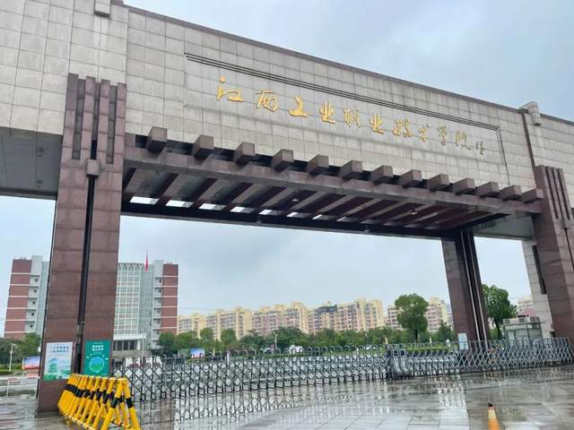
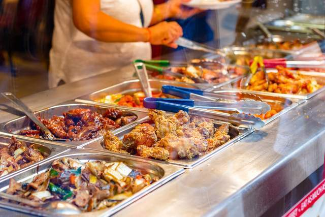
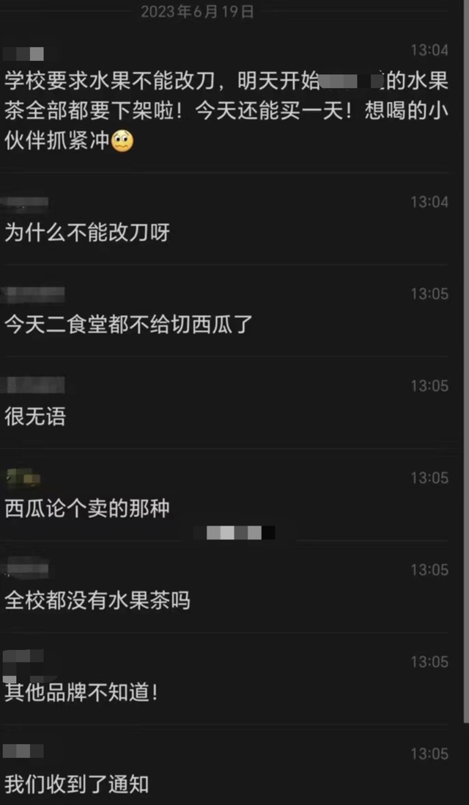
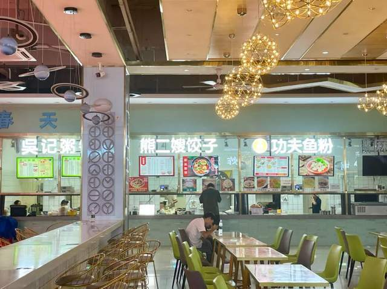
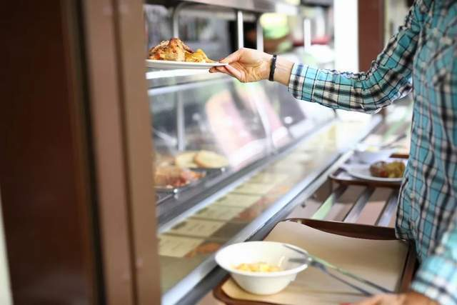

# 鼠头事件引高校餐饮圈震荡：租金变高，不让切西瓜和蔬菜

**在“鸭脖”最终认定鼠头后，大半个月的闹剧，终于告一段落。**

**但在江西——舆论的震中，震荡还在持续。事发地江西工业职业技术学院，发现鼠头的食堂已经关闭；两公里外的江西师范大学，也连夜通知食堂下架叶子菜，水果不能改刀；还有不少食堂档口老板，听到了要涨押金的风声，压力一阵阵袭来。**

**与此同时，事件背后的供应商母公司“中快餐饮”也浮出水面，与之合作的高校食堂分散在全国各地，更是数以百计。**

**大学生苦食堂异物久矣。每日人物访谈了几位高校餐饮从业者，其中不乏与中快餐饮合作过的人。在他们的经历中，可以看到食堂异物的背后，餐饮公司与商家、学生、学校之间的角力，以及，规模达到2万亿的团餐产业，是如何重塑了高校餐饮生态。**

**文 |** 徐晴 钟艺璇 金叶露

**编辑 |** 易方兴

**运营 |** 栗子

**“买个西瓜跟做贼一样”**

一颗鼠头，最后竟会牵连到水果和绿叶菜。以涉事学校为中心，一场风暴开始了。

6月20日，在吃出鼠头的江西工业职业技术学院，校门口的几滩雨水，提示着这里下过一场大雨，一如学校刚刚经历的舆论风暴。临近期末，学生们离校回家，步履匆匆，空气里，是行李箱轮子划过地面的声音。

“鼠头”或是“鸭脖”，在这里是敏感词。在校门口，几乎每一个学生听到后都颇为警惕，加快脚步离开。这里安保也愈发严格，保安们凌厉地盯着每一个入校的面孔。

有媒体报道，由于“鼠头鸭脖”，学校已与食堂供应商江西中快后勤服务有限公司解约。一位学生谨慎地说，学校只有一个食堂，发现鼠头的一楼已经关闭了，只剩二楼还在营业。要不是快放假，食堂或许会人满为患。而到了饭点，又多了一些领导模样的人在食堂二楼走来走去，这名学生说：“平时没见过这么多领导。”

风波也席卷到了两公里外的江西师范大学。鼠头事件的第三天，江西师范大学内的一家茶饮店，在群里发通知，“学校要求水果不能改刀”，所有带有柠檬的产品明天正式下架。那一夜，学生们争着喝“最后的水果茶”。过了晚上十点，校内古茗的排队还有100杯开外，至于幸运咖，直接繁忙置休。

_▲
茶饮店在学生群发布水果茶下架通知。图 / 受访者提供_

西瓜也不能切了。校内的水果摊上再没有红穰，只有绿皮。一位学生在买瓜的时候，被告知：买瓜可以，只能买整瓜，学生只能找了6个人拼瓜。

拼完还是得切，为了难得的生意，老板躲在屋里，偷偷给西瓜改刀，留下妻子在门外警惕放风。“买个西瓜跟做贼一样。”

水果不能改刀只是个开始。很快，蔬菜也跟着遭殃了。在关东煮店的微信群里，老板称要“一律下架绿叶菜”；一家麻辣烫摊位，也很快没有了菜叶子。

没人能解释这些变化的逻辑。一位学生说，从19日开始，师大每个食堂里突然出现了应诉经理。至于消失的西瓜和绿叶菜，高校没有明面通知，商家们也语焉不详，有人说是“学校要求”，有人改口“自愿下架”。

如同一场应激反应，一个鼠头，几乎“震荡”了附近高校的餐饮圈。就像一位学生在江西师范大学微博超话里调侃的：“世界因鼠鼠而改变。”

同样被影响的，还有江西工业职业技术学院背后的供应商——江西中快后勤服务有限公司，这家公司的母公司是深圳中快餐饮，在团餐行业里是头部企业，圈里称“南有中快，北有千喜鹤”。

事实上，江西工业职业技术学院，只是中快餐饮版图上小小的一角。公开信息显示，它在全国经营的高校食堂项目高达七百多家，除了江西省的多家大学，复旦大学、中国科学技术大学、南开大学、天津大学、香港中文大学等等也是它的客户。

而弄清楚它是如何一步步发展为头部企业，又是如何在过去的几十年里，乘着团餐行业的东风，改变着国内高校食堂的样态，或许，能对这次的鼠头事件，有更深刻的认知。

**处长下海**

“人的一生都和食堂有关。”

这是中快创始人李平金说过的一句话，这句话里，能看到中快的野心。

一个人从幼儿园、小学、中学、大学乃至参加工作、养老，都要和食堂打交道。而中快餐饮，也正是从一个小小的食堂档口发家。

50后的李平金，在江西星子县（现庐山市）出生。家里有7个兄弟姐妹，他是老大。动荡的年代，带给他一个辛苦的童年。他要照顾弟妹，每天干农活、放牛、打猪草、砍柴，为了养家，他还做过铁矿矿工。

人生的转折发生在1974年。那一年，他被单位选中，派他去学习地质找矿。结业后，成功调到一家铜矿的指挥部，担任秘书。那之后，命运开始向他倾斜，1991年，李平金已经是江西有色地质勘查局总务处的处长。

有些报道喜欢用“处长下海”来形容李平金。他跳出体制内，投身创业，干团餐。这是一种天然带有集体属性的业态，在体制内干过多年的他很熟悉。

最初创业时，他承包了一家乡镇企业的服务大楼，之后，叫上做过厨师的弟弟李四星一起，又承包了江西万寿宫工商处食堂。

李平金重视家人，他曾说过，创业的重要原因是为了解决弟弟妹妹的工作，还有帮父亲在老家盖房子。用人上面，他也喜欢用同乡人，根据《团餐头条》的文章《中快创始人李平金：半生关注食堂，成就中国团餐巨头》，1995年，李平金带着16位出身星子县的老乡，在江西蓝天学院（现名江西科技学院）的后门口开了一家餐厅，名字也有老家的影子，叫“星星餐厅”。

这对他的创业生涯来说，也是一个契机。当年的星星餐厅，性价比高、口味好，很受学生欢迎，还有人从学校翻墙出来吃。后来，李平金发展成江西蓝天学院一个食堂的承包人，他的高校食堂承包之路也从此开始。

后来的近30年里，李平金先打开了江西的二十多家高校食堂市场，进入南昌大学二食堂、江西财经大学四食堂等，然后从江西向全国扩张，先后进入复旦大学和浙江理工大学食堂。

他认为团餐有无穷的发展潜力。除了大学，他把餐饮的触角，伸到了劳动局、电子厂、中小学、医院和企事业单位，这些也是李平金眼中的蓝海。

如李平金所料，中快餐饮踩中了团餐产业发展的鼓点。根据“中国教育后勤协会”刊登、发布的文章《“中快餐饮”调研报告》，2015年，“中快餐饮”以年均30%速度迅速扩张，业务覆盖全国多个省市区，旗下员工达2万人。

_▲
中快餐饮的野心是引领团餐潮流。图 / 中快餐饮官网_

中快餐饮之所以能够迅速扩张，进入各地高校，一方面原因是解决了高校的痛点。2010年接受《人民政协报》采访时，李平金说，从学校的角度看，把食堂承包出去“节省了支付后勤人员的工资和国家的水电费”。

陈东曾经是江西一家高校食堂的经营者，他回忆过，“学校的校领导和后勤部门都挺喜欢中快的，客观来说，中快是头部餐饮公司，管理流程和制度确实要优于其他公司。”

另一方面，在资本运作层面，中快餐饮因为对成本的控制，保障了盈利和扩张需要的现金流。《“中快餐饮”调研报告》发现，在2015年，中快餐饮的原料采购很低，甚至比全国任何地区高校餐饮统一采购的价格都低，尤其是蔬菜，价格能低约10%。价格优势带来了巨大的竞争力。

**营收规模“直逼海底捞”**

度过了最初的发展阶段之后，中快餐饮逐渐把自己打造成一个平台，为更多商家进入高校提供便利。

而在规模越来越大之后，这两年，它改变了过去固定的收费模式。鼠头事件，表面上暴露出的是管理、品质、监管的问题，但背后的根源，往往与利益有关。

林文也是江西的餐饮创业者。去年，通过中快餐饮的招商负责人，他签订合同，有资格在一所高中的食堂里开设一个酸菜鱼档口。

林文记得，店铺的租金，过去几年是固定的，但这两年改成了两种模式，“生意稳定的餐厅都是抽点，最低都要抽（每月营业额的）20%，高的抽30%都有。生意要是差点，就用房租模式，比如一年8万这种。”

江西高校食堂的另一位经营者陈东，也证实这一点。他曾经承包了几年的集中打菜窗口，早年学校还是用交租模式，现在转变为抽点，“中快会设置一个保底抽成，营业额低于这个抽成，就要交固定的钱。但是抽成又是上不封顶，超出了保底，赚多少抽多少。”

除了抽点，还要交水电和公摊。

简单来说，对于中快而言，这是一种“上不封顶，下可保底”的盈利模式。在陈东看来，这些算法一切都指向了一点，“利益最大化”。

在这之外，供应链采购是另一大收入来源。中快要求非连锁、没有独立供应链的商家们统一采购——所需食材由中快餐饮提供，但价格有时候要比商家寻找渠道自采贵10%左右。

还有一种隐性的增收方法。比如把占地面积更大的大锅饭取消，改成一间一间的档口，收入比租给一家做大锅饭要多得多。

陈东说，这样做的副作用，会隐性地增加学生的用餐成本。

_▲
江西师范大学食堂内部。图 / 金叶露摄_

在这样的策略下，中快餐饮持续膨胀，长出新的枝干。

在疫情利好团餐的2022年，中快餐饮宣称，集团的43家分子公司，服务1500家客户。当年一起创业的弟弟李四星，如今是中快餐饮集团的董事长，他在2022年接受媒体采访时称，中快餐饮营收规模“直逼海底捞”。

这是中快的高光时刻。

要知道，团餐市场的头部效应极其明显。市场里有10万家参与企业，但九成以上，年营收都不超过1亿元。像“南中快，北千喜鹤”这样的团餐巨头们，占据着绝大多数细分市场。

比如，中国烹饪协会等公布的2022年中国团餐企业10强里，排名第二的北京健力源餐饮客户，就集中在央企、银行、互联网大厂中，例如国家电网、阿里巴巴、华为等。而排名第六的武汉华工后勤管理有限公司，业务则辐射中南和贵州地区的食堂、后勤。

可以说，全国的食堂，背后都有团餐巨头的身影。

当一个行业快速发展，市场规模迅速扩大，在利益之下，矛盾就产生了。高校食堂是一个特殊的市场，大学生对价格敏感，一顿饭的价格超过10元，会直接影响每天的流水。在商家们的视野里，利润一方面要被抽成，另一方面要被低廉的价格带压制，想多赚点钱，只能想办法节约成本。

比如，不少档口会开设勤工俭学的岗位，学生兼职比较便宜。还有一种办法，是买更便宜的食材。林文发现，因为冻肉更便宜，“高校食堂有不少肉用的是冻肉”。以及，虽然中快餐饮不准自采，但有的商家会“又买统采的，又可以自采一部分，两边买，掺着用”。

他说，对待自采，管理方也会“睁一只眼闭一只眼”。

而鼠头事件，就是在这样多方拉扯、博弈的背景下产生，很难说它是偶然，还是必然。

_▲
图 / 视觉中国_

**困在学生身份里的消费者**

大学生苦食堂异物久矣。

那些年，在食堂吃出来的异物，包括最基础的头发丝、塑料膜、钢丝球，进阶版异物，有苍蝇、蟑螂，还有可能会伤害人体的铁丝、钉子、烟头。但在鼠头事件之前，这些异物很多时候都被低调处理了，没能引起多少关注。

曾经在江西某高校就读的王希希记得，大三那年，自己在食堂的一个拌粉档口里，咬到了半截烟头。她气坏了，端着盘子走到档口前，问“这是怎么回事？”

“你想干什么？”老板娘的语气很冲，看到烟头后，她第一时间把烟头抢了过来，往后厨一扔。

唯一的证据就这样没了。

王希希愣住了，在后续的沟通里，老板娘从头到尾绝口不提赔偿，最后给王希希买了一瓶矿泉水了事。

在学生角色面前，消费者这个属性似乎是弱化的。王希希不明白，“如果我不是学生，是社会上的一个普通消费者，老板还会这样对待我吗？”

和王希希这类第一时间就被商户“打发”的学生不同，大学生吴淼才真正体会了维权过程的复杂与艰难。

有一回，吴淼在大学食堂吃出了一颗尖锐的花椒刺。她向学校的校务信箱投诉，多次打12315咨询，与各种老师沟通多次，才得到档口老板的私下道歉。

对方的解释是，供应链上出了问题，买的一大包花椒里掺进了一根花椒刺，中午饭点客流集中，工作人员容易疏忽，没有仔细甄别。

由此可见，食品安全事件发生在学校里，很容易变成一场“内部事件”。

_▲
长达三厘米的花椒刺，吃进嘴里很危险。图 / 网络_

吴淼在维权时就发现，某种意义上，自己被学生这个身份“困”住了。她唯一的渠道就是学校的投诉信箱，而维权是否顺利，完全取决于学校是否重视、如何看待，以及老板会不会承认。

她记得，在她还不知道异物是花椒刺、向后勤的老师描述“吃出来一根钉子”时，后勤老师在确认是花椒刺后，还打电话埋怨她：“好歹也是受过教育的人了，说话这么不严谨让人误会。”

其实，按照《食品安全法》，食品吃出异物，可以向经营者要求支付价款十倍或者损失三倍的赔偿金；赔偿的金额不足一千元的，按照一千元进行赔偿。吴淼原本跟商家约定赔偿1000元，在这通电话里，变成赔500元，后勤老师或许是觉得花椒刺没有钉子严重，说，剩下的就不给了。她坚决要求赔1000元，推拉多次，才拿到了全部的钱。

另一方面，高校餐厅的经营者陈东也提到，当餐饮公司将档口承包给商户，商户是不需要办经营许可证和卫生许可证的，“以食堂整体为单位来办”，而他工作的高校食堂里，“卫生许可证上的第一责任人是校领导”。这意味着，校方对于食品安全实际有不可推卸的责任。

_▲ 图 / 视觉中国_

而夹在中间，商家们也感到为难。食品里出现异物，是客观存在的事实，就算装了灭蝇灯、遵守各项规范，异物还是会有出现的概率。如果每出现一次，就要赔1000元，收入会受到很大影响。林文说：“商家肯定不愿意出现异物，能发现我肯定把它处理掉，忙的时候发现不了，确实没办法。”

眼下，“鼠头鸭脖”的风波还没有过去，追责情况还未落地，但身在江西的林文已经感觉到了“次生灾害”。从前，中快餐饮收的押金大约在6万，鼠头事件被爆出后，他听到风声，“可能会上调到6-10万”，本来手头能开两个档口的钱，现在只能开一个。

结账的周期也不知为何拉长了。以前把税票交给中快餐饮公司，几天就可以收到打款，但最近，林文认识的一位档口老板“已经大半个月没有收到钱了”。他只能预见，未来的监管、进入高校门槛会越来越高。

“难啊”，话音落下，他重重地叹了一口气。

但也有“好消息”。在江西师范大学，改刀西瓜和绿叶菜的“禁令”悄悄落下的半天后，因为舆论影响又被取消，它们悄悄地回到了自己的位置上。

当荒诞过去，一切又平静得如同无事发生。

（文中受访者均为化名）

**参考资料：**

[1] 庐山追梦人 || 李平金—— 处长下海，策划中快“帝国”崛起.微庐山老万

[2]中快创始人李平金：半生关注食堂，成就中国团餐巨头.团餐头条

[3]企业呼吁：大学食堂改革向产业化迈进.人民政协报

[4]中快餐饮集团有限公司高校服务总结.中国教育后勤研究

**文章为每日人物原创，侵权必究。**

