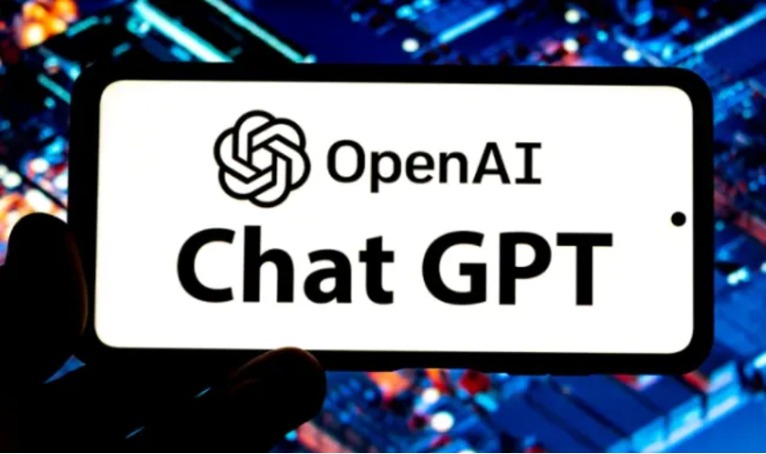
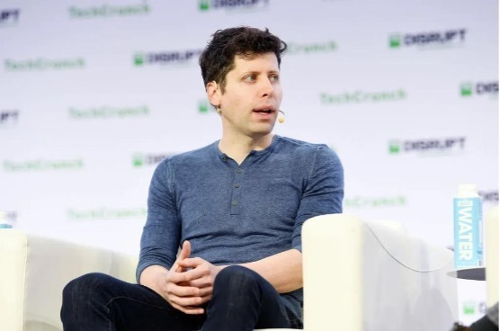

# ChatGPT之父的“政治阴谋”：到访世界各国，会晤政府首脑

划重点：

  * _1_ 在OpenAI游说各国对人工智能进行监管的同时，该公司秘密游说欧盟，试图减轻对自身的监管。
  * _2_ OpenAI CEO奥特曼之前曾威胁监管过度会考虑退出欧洲市场，但后来又改口称没有离开欧洲计划，打算与欧盟合作。
  * _3_ 经过努力，在欧盟出台的《人工智能法案》中，“基础模型”未被纳入“高风险”，只需遵守少量要求。

腾讯科技讯 6月22日消息，今年5月，OpenAI的首席执行官萨姆·奥特曼（Sam
Altman）到访世界各国首都，与满座的人群交谈并与政府首脑会晤时，他一再谈到全球人工智能监管的必要性。

但根据外媒从欧盟委员会获得的有关OpenAI与欧盟官员接触的文件显示，在幕后，OpenAI一直通过游说希望对《人工智能法案》（AI
Act）进行调整，以减轻该公司的监管负担。《人工智能法案》目前是全球最全面的人工智能法案。本月中旬，欧洲议会投票通过了该法案，禁止实时面部识别，并对ChatGPT等生成式人工智能工具提出了新的透明度要求。《人工智能法案》现在将进入欧盟启动监管前的最后阶段。欧盟官员将尝试就这一法律草案与欧盟行政部门和成员国达成妥协，他们之间目前仍存分歧。如果该法案要在欧盟明年的选举前生效，则必须在明年1月完成立法程序。

2022年，OpenAI一再向欧洲官员提出，即将出台的《人工智能法案》不应将OpenAI的通用人工智能系统--
包括ChatGPT的前身GPT-3和图像生成器Dall-E 2--
视为“高风险”。如果被纳入“高风险”范围，将使它们受到严格的法律监管，包括透明度、可追溯性和人力监督。

这种做法使OpenAI与已向自己投资130亿美元的微软，以及互联网搜索巨头谷歌站在了一起。这两家公司此前都曾游说欧盟官员，支持放松该法案对大型人工智能提供商的监管。两家公司都认为，遵守该法案最严格要求的责任应该由明确将人工智能应用于高风险用例的公司承担，而不是由构建通用人工智能系统的公司承担。

“就其本身而言，GPT-3并不是一个高风险系统，”OpenAI在一份此前未公开的7页文件中说，该文件于2022年9月发送给欧盟委员会和理事会官员，题为《OpenAI关于欧盟人工智能法案的白皮书》。“但是它拥有可以在高风险用例中使用的可能性。”

OpenAI在欧洲的这些游说努力之前从未被报道，而奥特曼最近对欧盟《人工智能法案》变得更加直言不讳。今年5月，他在伦敦告诉记者，如果OpenAI认为自己无法遵守规定，它可以决定在欧洲“停止运营”，他说为此他受到“很多”批评。奥特曼后来收回了警告，说自己的公司没有离开欧洲的计划，并打算与欧盟合作。

尽管如此，OpenAI的游说努力似乎是成功的：欧盟立法者批准的法案最终草案没有包含早期草案中的措辞，即通用人工智能系统应被视为与生俱来的高风险。相反，达成一致的法律要求所谓的“基础模型”，即经过大量数据训练的强大人工智能系统的提供商，遵守少量要求，包括防止非法内容的产生，披露系统是否经过版权材料训练，以及进行风险评估。知情人士透露，OpenAI支持将“基础模型”作为法案中的一个独立类别。

回到2022年9月，欧盟委员会这一明显的让步尚未达成。在当时OpenAI与欧洲官员分享的白皮书中，该公司抵制了《人工智能法案》中一项拟议修正案。该修正案认为，如果ChatGPT和Dall-
E等生成式人工智能系统生成的文本或图像可能“在人看来是由人类生成的，是真实的”，那么就应当归类为“高风险”。OpenAI在白皮书中表示，这一修正案将意味着他们的模型可能“无意中”被视为高风险，并建议废除该修正案。该公司认为，相反，依赖该法案的另一部分就足够了，该部分要求人工智能提供商充分标记人工智能生成的内容，并让用户明白他们正在与人工智能系统进行互动。

OpenAI提出异议的修正案没有被纳入欧洲议会6月份批准的《人工智能法案》最终文本中。“他们得到了他们想要的，”欧洲数字权利的高级政策顾问莎拉·钱德尔（Sarah
Chander）说。她说，这份文件“表明OpenAI和许多大型科技公司一样，利用人工智能的效用和公共利益来掩盖他们淡化监管的财务利益。”

OpenAI发言人对此表示:“应欧盟政策制定者的要求，2022年9月，我们提供了一份关于我们安全部署GPT-3等系统的方法的概述，并根据这一经验对当时的《人工智能法案》草案进行了评论。从那以后,《人工智能法案》已经有了实质性的发展，我们已经公开谈论过这项技术的进步能力和应用。我们继续与政策制定者合作，并支持欧盟的目标，即确保现在和未来安全地构建、部署和使用人工智能工具。”

2022年6月，在提交白皮书的三个月前，三名OpenAI工作人员在布鲁塞尔首次会见了欧盟委员会官员。“OpenAI希望欧盟委员会澄清风险框架，并知道他们如何能够提供帮助，”欧盟委员会保存的官方会议记录显示。“他们担心通用人工智能系统会被列为高风险系统，并担心更多的系统会被默认为高风险系统，”据一名直接了解此次接触的欧盟委员会消息人士称，官员们从那次会议中获得的信息是，OpenAI和其他大型科技公司一样，害怕可能影响人工智能创新的“过度监管”。该消息人士称，OpenAI的员工在会议上表示，他们意识到了风险，并尽一切努力减轻风险，但员工没有明确表示，由于他们的努力，OpenAI应该受到更宽松的监管。他们也没有说他们希望看到什么样的监管。“OpenAI没有告诉我们好的监管应该是什么样子，”该人士表示。

白皮书似乎是OpenAI提供这种投入的方式。在该文件的一个部分，OpenAI详细描述了它用来防止其生成式人工智能工具被滥用的政策和安全机制，包括禁止生成特定个人的图像，通知用户他们正在与人工智能互动，以及开发工具来检测图像是否是人工智能生成的。在概述了这些措施之后，OpenAI似乎暗示这些安全措施应该足以防止其系统被视为“高风险”。

OpenAI在白皮书中还表示：“我们相信，我们降低系统通用性质风险的方法是行业领先的。尽管采取了上述措施，但我们担心，围绕通用系统的拟议语言可能会无意中导致我们所有的通用人工智能系统被默认为高风险。”

审阅OpenAI白皮书的Access Now布鲁塞尔办事处专注于人工智能的高级政策分析师丹尼尔·勒弗（Daniel
Leufer）表示：“他们说的基本上是：相信我们会自我监管。这非常令人困惑，因为他们对政客说，‘请监管我们’，他们吹嘘他们所做的所有(安全)事情，但你一说，‘好吧，让我们相信你的话，把它定为监管底线’，他们就说不。”

在白皮书的其他部分，OpenAI主张修改该法案，允许人工智能提供商出于安全原因快速更新他们的系统，而不必首先经过欧盟官员可能很长的评估。

该公司还主张破例允许在教育和就业领域使用生成式人工智能。OpenAI认为，例如，人工智能系统起草工作描述的能力不应被视为“高风险”用例，也不应被视为在教育环境中使用人工智能起草考试问题以供人类管理。OpenAI去年9月表达了这些担忧后，该法案增加了一项豁免，“非常符合OpenAI的愿望，即从系统范围中删除那些对人类决策没有实质性影响或只是有助于决策的系统，”勒弗说。

OpenAI继续与致力于同欧盟官员就《人工智能法案》问题进行接触。在今年3月31日的一次会议上，根据欧盟委员会保存的官方会议记录，OpenAI对ChatGPT的安全功能进行了演示。OpenAI的工作人员在会上解释了在操作中学习的做法，即该公司在全球发布人工智能模型并根据公众使用情况进行调整。该员工称，这种做法“非常重要。”

根据记录，OpenAI还在会议期间告诉官员，“对人工智能的指示可以调整为拒绝共享例如如何制造危险物质的信息”。情况并非总是如此。研究人员已经证明，在正确的哄骗下，ChatGPT可能容易被越狱行为利用。在这种情况下，特定的提示可能会导致它绕过其安全过滤器，并遵守指令，如编写钓鱼电子邮件或提供危险物质的配方。（无忌）

