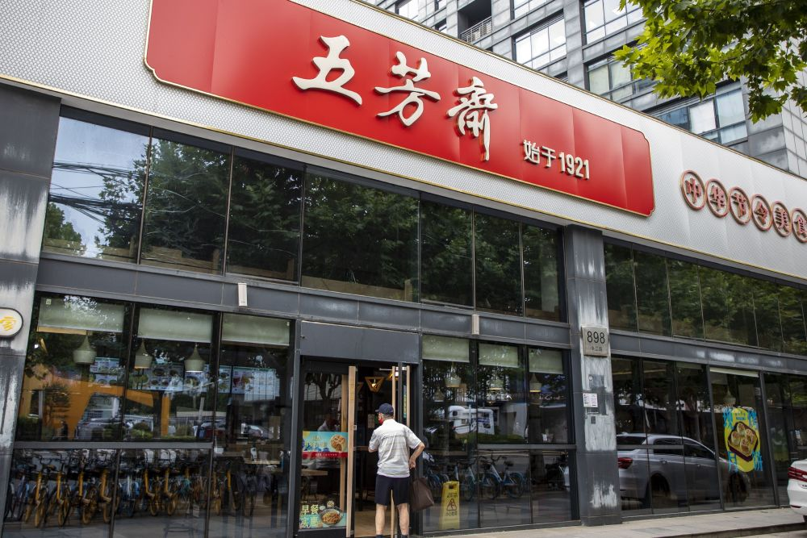
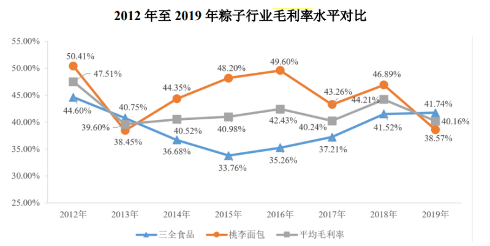

# “粽子一哥”上市后首个端午节：平均毛利率40%，仍难“粽”横市场

_图/IC_

端午佳节，粽子无疑是主角。

新京报贝壳财经记者走访了解到，今年6月22日是端午节，早在5月时各大商超货柜已经开始销售粽子类商品。其中，有的粽子礼盒生产日期为4月上旬。

“粽”横江湖，线上营销同样开始造势。记者翻看多个电商和社交平台发现，直播间大多都在卖粽子，并打出“距离端午节只剩X天”字样。直播间内，主播一遍一遍重复着“现在下单，当天发货，端午节之前肯定能到。”

粽子市场早已成为企业掘金地，并“吃出一家上市公司”。早在2021年，顶着“中华老字号”光环，五芳斋开始冲击“A股粽子第一股”，并于2022年8月底在上海证券交易所主板上市。时至今日，五芳斋仍是粽子一哥，资本市场也并未跑出第二家以粽子支撑业绩的上市公司。不过，在上市后的首个端午节，五芳斋也有隐忧。

在最新公布的2023年第一季度报告中，五芳斋的营收约为2.16亿元，同比下滑28.74%，归属于上市公司股东的净利润约为-6396.67万元，这已经是其连续第三个季度归属于上市公司股东的净利润处于亏损状态。

**单个低至2.5元，粽子“挺进”直播间**

6月19日，贝壳财经记者在朝阳区一家商超内看到，不少消费者正在选购粽子。一名消费者表示，自己是广东人，老公为北京人，因此南北的口味都要照顾到。“其实已经在网上买了一些，都吃光了，想着端午节当天总要吃几个，就再买点。”

贝壳财经记者走访看到，线下渠道粽子之间价格差异不小。以一家大商超所销售粽子为例，其散装粽子的单个价格不超过10元，最便宜的为2.5元。相比于散装粽子，超市里销售的粽子礼盒不多，价位大多不超过100元，价格较高的为259元。

相比之下，线上渠道的粽子价格则更加丰富。贝壳财经记者在淘宝网输入“粽子”，并按价格排序，价格便宜的小枣粽9元2只，而千元以上的粽子礼盒同样存在，馅料多为黑松露、和牛、海参、鲍鱼等较贵的食材。

端午佳节，粽子也是流量密码。贝壳财经记者在叮咚买菜APP上看到，目前其自有品牌蔡长青有不少口味粽子上线，其中蔡长青大肉粽、蛋黄大肉粽和蔡长青白米粽为用户喜爱榜前3名。此外，平台中还有不少老字号品牌粽子售卖，包括诸老大、五芳斋、真真老老等。

叮咚买菜相关负责人告诉贝壳财经记者，数据显示，近一个月，“粽子”等相关关键词搜索量同比增长了100%。从销量来看，蔡长青大肉粽最受用户喜爱，日均销售达3000多份，寓意“高中”的礼盒也十分受欢迎，预计今年粽子品类总交易额将达到两千多万。

据了解，虽然市场需求大，但由于粽叶酥脆易破等原因，目前粽子生产依旧是以人工为主，部分企业可以在灌装馅料和捆扎等环节实现机械化。

贝壳财经记者注意到，不少企业把直播场地搬到了粽子生产车间。“家人们，所见即所得，咱们今天敢在车间直播，工地直发，就是为了大家能吃到放心的粽子。”各个直播间里的主播们一边说着相似宣传语，一边催促屏幕前的消费者下单。

今年端午节前后，各大直播间除了粽子品牌卖力销售，也有餐饮品牌入局。

6月19日下午，张兰·俏生活直播间里，除了带货麻六记商品，还上线一款名为“麻六记端午粽子礼盒”，8粒粽子共800克售价79.9元。据主播介绍，当天下午三点十分时，已经销售超过2000单，10分钟后产品售罄下架。

**咸甜之争，“新品淘汰率超过50%”**

一直以来，“粽子应该是甜的还是咸的”也是端午节一大话题。

近日，中国数据研究中心发布报告称，消费者购买粽子时所考虑的主要三个因素是口味/味道、价格和原材料质量，分别占比51.71%、47.46%和46.34%，咸粽子力压白粽和甜粽，成为本次调研中最受消费者喜爱的粽子口味。此外，年轻人比中年人更喜欢八宝粽，巧克力粽的喜爱群体主要是中老年人。

报告指出，粽子消费个性化、品质化、高端化趋势明显，在售新口味粽子超过130种，鲍鱼、松茸、燕窝等高端食材获得青睐。地方菜食材的“加入”，也让粽子口味焕新，并获得消费者认可，其中，松茸鲜肉粽、佛跳墙粽、香辣小龙虾粽，均以超10倍的销量环比增幅引领新口味粽子消费新风尚。

于商家而言，则在咸甜之间不做选择，“端午佳节‘粽’是情，糖馅儿肉馅儿啥都行”，从销售端也能看出，粽子礼盒多为组合装，甜咸都有。

6月21日下午，天猫榜单粽子热销榜数据显示，排在第一位的为五芳斋端午礼盒粽，售价为39.9元到149.9元不等，其中，39.9元礼盒包含8粽4味共1120克，149.9元的礼盒包含13粽7味两盒绿豆糕，净含量1660克，保质期为4个月。

一粽子生产企业工作人员告诉贝壳财经记者，粽子的用户黏性差，新品淘汰率会超过50%。向前追溯，这一企业基本每年都会上新10个左右新口味，大概一半新品可以留到下一年。

“上新品主要是为了吸引消费者的注意力和关注度，一旦察觉到消费者对这个产品的新鲜劲儿过去了，我们就会撤掉。”上述工作人员称，根据经验，以“南咸北甜”为基调的经典款最受消费者青睐，但是出于营销的角度，依然会坚持年年上新品。

**平均毛利率40%，五芳斋仍难“粽”横市场？**

粽子赛道，并不缺乏竞争者，不少企业都在积极布局粽子类产品。

贝壳财经记者注意到，在招股书中，北京稻香村食品有限责任公司、嘉兴市真真老老食品有限公司、三全食品股份有限公司、郑州思念食品有限公司、桃李面包股份有限公司等均被五芳斋视为主要竞争对手。

据五芳斋招股书，预计到2024年我国粽子市场规模将增长至102.91亿元，2020年至2024年的年复合增长率预计为7%，将保持良好的发展态势。

尽管竞争激烈，但行业毛利率依然维持在40%左右。

五芳斋招股书显示，粽子行业毛利率整体处于较高水平。从上市公司三全食品和桃李面包披露的数据来看，自2012年以来，粽子行业平均毛利率水平在40%上下波动，整体波动在合理范围之内。

贝壳财经记者注意到，五芳斋之外，不少上市公司都在销售粽子类产品，包括桂发祥、三全食品、煌上煌、来伊份等。

今年5月，五芳斋曾对外表示，目前粽子行业除五芳斋等龙头企业外，其他竞争格局较为分散，小型粽子作坊企业超过5000家。同时，由于粽子市场存在大量家庭作坊式的小粽子店难以被统计在册，目前第三方权威机构统计的仅包括商超及线上渠道的粽子行业规模，约为80亿元至100亿元，五芳斋市场占有率30%左右。

_粽子行业毛利率情况。截图自五芳斋招股书_

不过，随着闯入资本市场，“粽子一哥”的隐忧也被放大。

2021年6月，五芳斋递交招股书冲击上市，一年多以后，五芳斋叩开A股大门。根据招股书，2018年至2021年，五芳斋实现营业收入依次约为24.23亿元、25.07亿元、24.21亿元、28.92亿元；归属于母公司股东的净利润分别约为0.97亿元、1.63亿元、1.42亿元、1.94亿元。

2022年，五芳斋实现营业收入约24.62亿元，同比下滑14.87%；归属于上市公司股东的净利润约1.37亿元，同比下滑29.01%；归属于上市公司股东的扣除非经常性损益的净利润约1.14亿元，同比下滑24.2%。

五芳斋表示，2022年收入下降主要是由于受宏观环境影响，连锁门店大面积关闭，物流受阻。但是，得益于产品成本下降以及产品结构的优化，公司主要产品粽子的毛利率提升2.02个百分点。

值得一提的是，2022年，五芳斋的粽子系列产品实现营业收入约17.47亿元，约占总营收的71%。

财报显示，五芳斋粽子系列产品季节性较强，在阶段性产能条件无法完全满足销售旺季产品的供应时，通过委托外部供应商加工的方式安排生产。2022年，五芳斋粽类产品自产产量35260.62吨，委外加工产量10902.03吨，自产占比76.38%。

2023年第一季度，五芳斋的营收约为2.16亿元，同比下滑28.74%，归属于上市公司股东的净利润约为-6396.67万元。这已经是五芳斋连续第三个季度陷入亏损，2022年第三季度和第四季度，其归属于上市公司股东的净利润依次约为-1395.83万元、-9093.75万元。

新京报贝壳财经记者 阎侠 编辑 王进雨 校对 卢茜

