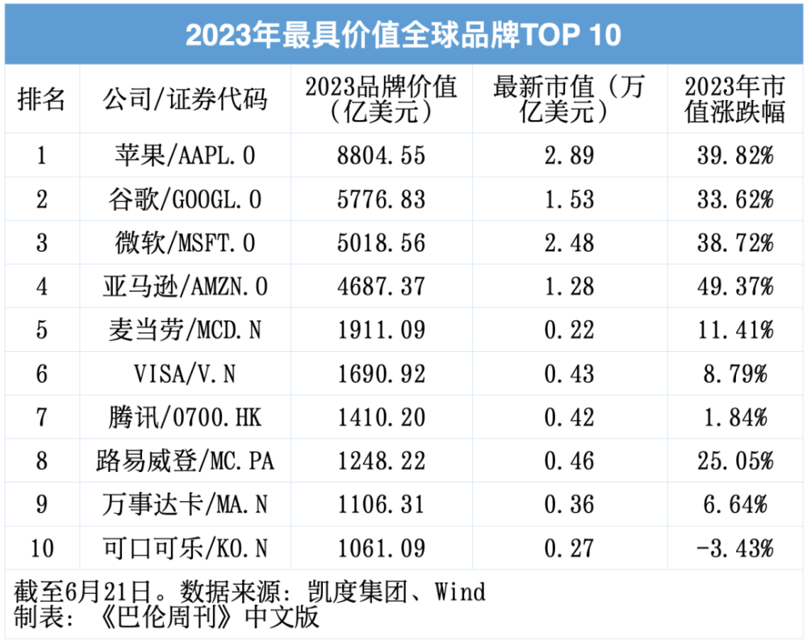

# 全球品牌TOP 10，只有一家中国公司

全球品牌TOP 10中，科技公司占据了半壁江山，排名前四的企业均为美股头部科技企业。

近日，全球品牌数据与分析公司凯度集团发布了2023年最具价值全球品牌排行榜。其中，最具价值全球品牌TOP
10的总市值年初至今增长约2.5万亿美元，显示出强大的品牌韧性和投资价值。

凯度集团大中华区CEO暨BrandZ全球主席王幸表示，品牌是企业最重要的无形资产，品牌价值已经占到企业估值的30%。她指出，强品牌在经济周期中能够显示出更强的韧性，并能更快地穿越周期并实现增长。

根据该机构的研究，十年前，品牌价值占企业无形资产的比重为38%，而2023年这一比例上升到52%。

**科技牛市**

在全球品牌TOP 10排名中，科技公司占据了半壁江山，其中排名前四的企业均为美股头部科技企业。这与2023年上半年美股走势相一致；它们也是TOP
10榜单中股价和市值涨幅最高的公司，并推动纳斯达克指数年初迄今上涨了29%。

市值逼近3万亿美元的苹果收获了高达8804.55亿美元的品牌价值。凭借积极的消费者感知，苹果彰显出了品牌溢价的合理性。《巴伦周刊》报道，iPhone的销售对这家科技巨头来说至关重要，最近一个季度，iPhone贡献了948亿美元总收入中的513亿美元。

有华尔街分析师认为iPhone销量的下降可能在未来对苹果的收入构成风险。瑞银分析师David
Vogt的研究表明，与六个月前的数据相比，计划在未来12个月购买iPhone的数据“稳定并略有下降”。该分析师在6月中旬将苹果的评级从“买入”下调至“中性”。

但这并不妨碍苹果股价持续上涨。截至6月21日收盘，苹果今年的涨幅达42%。

上半年，谷歌、微软、亚马逊同样取得了不俗的市场表现。这三家公司的共同利好来自于人工智能。谷歌母公司Alphabet推出了Chatgpt的竞品Brad，并计划在广告服务中加入人工智能技术。微软则将人工智能与其云业务相结合。亚马逊将利用人工智能技术帮助用户寻找合适的产品，该公司CEO此前曾表示将大力投资人工智能。

市场对于人工智能的题材炒作观点分歧。美国银行的策略师将这轮人工智能的上涨称为“婴儿泡沫”（baby
bubble），而也有分析师认为人工智能股的估值还没有进入泡沫领域。

而毫无疑问的是，此番美股的牛市几乎是由科技股推动的。《巴伦周刊》中文版在此前的报道中指出，在这一有史以来最“瘦”的牛市中，7家公司贡献了98%回报，其中四家公司正是来自全球品牌榜的TOP
4。

全球品牌TOP 10中唯一一家中国公司是腾讯。2023年一季度，腾讯营收达1499.86亿元人民币，同比增长11%；净利润(Non-
IFRS)325.38亿元人民币，同比增长27%。

腾讯在财报中称，“游戏业务收入改善，广告业务收入保持迅猛增长，推动总收入实现坚实增长。”年初至今，公司股价上涨8.07%。

**消费行业两极化**

除科技公司外，2023年最具价值全球品牌排行榜的另一类主要公司来自消费行业。凯度认为，入选TOP 10的三家公司分别代表了消费行业的两大趋势。

一方面是高端消费的坚挺，代表公司是路易威登。面对多轮涨价，消费者们没有被“劝退”，反而是“越涨越买”，使得该品牌2023年排名上升两位至第八名，是全球前十名中唯一的奢侈品牌，品牌价值达1248亿美元。除此之外，迪奥的品牌价值增长了9%至114亿美元，是奢侈品类别中增长最快的品牌。

在2023年，蓬勃发展的奢侈品行业一直是欧洲市场的佼佼者。《巴伦周刊》认为，高端零售商对欧洲股市的重要性与苹果于美国股市的重要性相当。

但是该行业近期面临了一些压力。因为美国经济增长的放缓，一些潜在的奢侈品购买者开始感受到了经济痛苦。

尽管最近出现了抛售，LVMH自年初以来仍上涨了20%以上。4月，LVMH市值突破5000亿美元大关，成为了欧洲市值最高的公司。以Matt
Garland为首的德意志银行分析师在近期的一份研究报告中写道：“对于许多投资者来说，奢侈品行业仍然很拥挤，该行业相对于市场的溢价处于历史高位。”

另一方面是高性价比消费品的销售展现出了高度弹性。以2023年全球品牌TOP 10中的麦当劳和可口可乐为例，凯度认为它们以“物有所值”赢得了消费者。

此前，麦当劳公布的一季报显示，公司销售额为59亿美元，每股收益2.63美元，均超过了华尔街预期。同期，可比店面销售额增长12.6%，超过分析师预期的8.7%。

可口可乐一季度销售额110亿美元，同比增长5%，调整后的每股收益为68美分。FactSet调查的分析师预计该公司营收108亿美元，每股收益为65美分。

麦当劳和可口可乐在一季度都进行了提价。麦当劳在2023年早些时候宣布部分餐品将涨价20%；可口可乐2023年一季度平均售价上涨了11%。

这意味着在宏观经济放缓的情况下，一季度必选消费品的强劲势头能否继续仍存争议。

如麦当劳管理层认为，尽管通货膨胀率正在下降，但食品和纸张成本的增幅将保持在中高个位数，而在劳动力市场紧张的情况下，劳动力通胀将保持高位。可口可乐认为，通货膨胀将继续影响其本财年的财务业绩，大宗商品价格上涨将对成本造成压力。

年初迄今，麦当劳股价上涨13%，可口可乐则下跌了1.95%。

**文 | 《巴伦周刊》中文版撰稿人 林一丹**

**编辑 | 彭韧**

版权声明：

《巴伦周刊》(barronschina)原创文章，未经许可，不得转载。

（本文内容仅供参考，不构成任何形式的投资和金融建议；市场有风险，投资须谨慎。）

