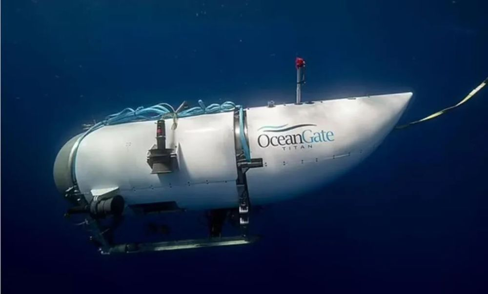
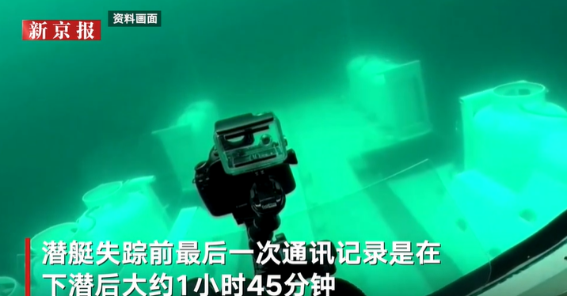

# 失踪的泰坦号：首次试航与母船通讯中断超两小时，曾解雇提议整改员工

对于这种名为“科考”，实为富豪旅游的深潜活动，国际间和业内早就啧有烦言。

**全文3453字，阅读约需7分钟**

**撰稿/陶短房（专栏作家） 编辑/迟道华 校对/陈荻雁**

_▲资料图：“泰坦”号潜艇。图/海洋之门探险公司_

在著名的“泰坦尼克”号“冰海沉船”海难发生一百一十一年后的今天，又一艘“泰坦”号被困在了同一片海底。当地时间6月18日，一艘名为“泰坦”号的小型深海观光潜艇出航后不久，在昔日“泰坦尼克”号长眠的同一海域失联，至今下落不明。

**被困的“泰坦”**

1912年4月，巨型客轮“泰坦尼克”号在从英国南安普顿港前往美国纽约港的航程开始5天后撞上冰山，沉没在距美国纽约2012公里、3784米深的大西洋底。全船2224名乘员中，遇难者超过1500人，是迄今为止非战争时期最严重的船舶遇难事故。

这场悲剧因伤亡之惨痛永铭史册，并借助前后两部同题材电影《冰海沉船》（1958年）和《泰坦尼克号》（1997年）广为人知。

1985年9月，退役美国海军军官巴拉德率领的美法联合探测队找到了“泰坦尼克”号的残骸。此后，不断有科学家、寻宝者、猎奇者、潜水爱好者等探访此地。

2015年，一个名叫海洋之门探险（OceanGate Expeditions）的美国公司宣布，将开始运营使用袖珍潜艇探访“泰坦尼克”号残骸的“科考”项目。

当时这家公司仅拥有一艘可下潜到800米深的袖珍潜艇“独眼巨人”号。为此他们特意向材料公司Spencer
Composites求助，最终建成了可下潜至海平面以下4000米的“泰坦”号，这也是潜深最深的民用潜水器。

“泰坦”号重10432千克，船壳厚13厘米，船体使用碳复合纤维，用两个圆形钛合金端盖加固，内舱尺寸为670X280X250厘米，能搭载1名操纵手和4名乘客。前部为号称“任何深海潜水器中最大”的圆形全景观景平台。

潜水器有专用单人厕所和厕所门帘，有船载音乐系统，有加热舱壁，却没有科考作业所必须的桌椅和充足舱内照明。相反，却在船壳外部安装了强大的探照灯和多个4K摄像机，以便乘员在海底观景。

该船内装简陋，船上导航和电子设备也“尽可能采用现成货架产品”。有消息称，该船使用了“星链”作为水下短信系统的备份，但此次显然都失灵了。

“泰坦”号为电动，四个推进器仅能确保3节的低航速，且航程极短，因此需要由母船携带到海上释放。

2018年，“泰坦”号开始试航，2021年投入正式运营，2022年总计进行了10次“考察”（并非都是以“泰坦尼克”号残骸为目的地），今年因海况和天气原因，此次是首航。

此次出航是在当地时间6月18日中午，系由加拿大科考船“极地王子”号携带出海释放的。当天下午，美国海岸警卫队发布公告，称“泰坦”号在释放1小时45分钟后失联，迄今尚未找到。失踪地点距加拿大东部纽芬兰与拉布拉多省海岸约370公里。

由于“泰坦”号缺乏自航自救能力，且舱门从外锁死，只能依靠外力搜救，自身无法脱险。潜艇上所携带氧气只够96小时使用（还是在理论极限情况下，实际上如果乘员“乱说乱动”，会大幅缩短氧气可用时间），因此倘当地时间本周四（6月22日）再无法营救，“泰坦”号和它的5名乘员凶多吉少。

海洋之门探险公司的创始人是美国著名航空航天工程师兼飞行员拉什，他也是公司的首席执行官（CEO）。

“泰坦”号的运营，名为加拿大纽芬兰纪念大学海洋研究所的“科考”项目，实则是变相商业旅行，乘员需缴纳25万美元团费，才能踏上为期9天9夜的“科考”之旅。

由于是2023年首航，此次出海规格非常高。拉什本人亲自登艇，指令长是深潜经验丰富的法国籍职业海洋探险家。三名付费乘客则个个大有来头，分别为58岁的英国亿万富翁哈丁，48岁的巴基斯坦首富达武德，和达武德19岁的儿子苏莱曼。

出发前，达武德父子和哈丁都在网络社交平台为自己“广而告之”，欢呼这次因天气原因多次推迟的“伟大航程”终于启程。他们恐怕想不到，这次“伟大”所需付出的代价，远不止25万美元和一次艰苦的“特训”。

_▲“泰坦”号潜艇计划参观“泰坦尼克”号水下残骸。图/新京报我们视频截图_

**对“安全质疑”装聋作哑**

对于这种名为“科考”，实为富豪旅游的深潜活动，国际间和业内早就啧有烦言。

前美国国务卿克里早在多年前就严厉斥责这类活动，认为违反了2001年联合国教科文组织《水下文化遗产保护公约》的宗旨，是对水下文物的掠夺性商业开发，呼吁订立更强有力的国际公约，保护“泰坦尼克”号残骸和遗址免遭“打捞和侵入性研究”。但因为残骸位于公海海底，这项倡议进展缓慢。

另一些人士则从安全的角度提出质疑。

2022年11月，美国哥伦比亚广播公司（CBS）电视台播出一则有关“泰坦”号的专题报道，当年搭乘过该船的美国著名作家赖斯（《辛普森一家》编剧之一）指出，该船设计“非标”，舱门锁死后只能从外面打开，船舱狭窄没有座位，且参与者都要签署“生死状”，“仅第一页就三次提到‘死’且要求参与者自己负责”。

CBS之所以如此关注“泰坦”号，是因为其资深记者波格采访了“泰坦”号的首次试航。当时，“泰坦”号与母船的通讯联系中断两个多小时，所幸潜艇业已上浮，最终虚惊一场。

波格事后在一则电视节目中披露，造价不菲的“泰坦”号使用了碳纤维和钛合金等昂贵材料制造艇壳，却仅仅安装了一个按钮，控制杆居然是常用于电子游戏、市价仅30美元的无线控制器，让他感到实在为乘员的安全捏把冷汗。

捏把冷汗的还包括另一些更专业的相关人士。

2017年底，海洋之门探险公司海事运营总监洛奇里奇向CEO拉什提交了一份报告，指出构成“泰坦”号艇体的碳纤维“正常情况下比金属材料坚固，但在高压下较金属材料更易撕裂，甚至突然失效”，而4000米深海恰是典型的高压条件，因此“必须首先对‘泰坦’号船体进行非破坏性测试，以防万一。”

甚至，《纽约时报》曾发现，2018年美国海洋技术协会（Marine Technology
Society）曾致信拉什，认为海洋之门探险公司对其潜艇设计超出既定行业安全标准的说法“具有误导性”，对此表示“一致关注”，并警告“这些设计可能存在会导致‘灾难性后果’的隐患”。

但所有事前的质疑都被海洋之门探险公司生硬“反弹”。

2018年，针对“安全是否合规”的质疑，该公司公关稿称“新生事物总是走在规则之前”；在2019年的一部宣传视频中，公司特聘软件安全专家避重就轻地表示，深潜“科考”是“真正的探险和挑战，可不是去迪士尼”，并表示“会提供特训”。

然而，其官网上显示的“特训”和安全要求，不过是年满18岁、能爬梯子，且特意标明“只要付费就无须任何潜水经验”。“特训”也是在线“自助完成”的。对此，有人吐槽海洋之门探险公司唯一的准入标准是那25万美元/人的团费。

更过分的是，拉什和海洋之门探险公司不仅对提出安全质疑的海洋技术协会装聋作哑，还把同样提出整改意见的本公司员工洛奇里奇于2018年1月解雇了，甚至一度与之对簿公堂，指控后者“诽谤公司声誉”。

海洋之门探险公司声称，该公司“独特的声学监测系统”完全可以替代标准的非破坏性测试；2021年，拉什本人亲自在CBS“辟谣”，称“别说乘坐，就算开‘泰坦’号都无须太多专门技术和培训”。

从拉什亲自登艇可以推断，他本人或是真的相信自己的船“安全无恙”，并因此讳疾忌医。然而，他怕也将为此付出惨痛代价。

_▲搜救工作正在开展。图/新京报我们视频截图_

**是否还有救？**

当地时间6月20日晚，美国海岸警卫队发布最新公告，第一区队长、海军少将毛格表示，已投入美国海岸警卫队两架C130“大力士”专用海上巡逻机，配合加拿大“极地王子”号科考船在出事海域搜救，并将尽快投入可抵达海平面以下6000米深处的遥控深潜器。海洋之门探险公司董事总经理认为“我们还有搜救的时间”。

但许多专家对此表示悲观，一位匿名专家对美联社记者表示，除非“泰坦”号并未下潜或中途上浮，仅仅是因通讯设备故障而失联，如果真的潜入海底，“基本没救”。

1914年“泰坦尼克”号的“冰海沉船”惨剧，曾引发海事规则的一系列亡羊补牢式重大变革，并在此后的航海中拯救无数生命。

此时此刻，针对“泰坦”号的搜救仍在进行，或许，5名乘员的命运会更好，但无论搜救结果如何，都不应重演杜牧在《阿房宫赋》中所言“后人哀之而不鉴之，亦使后人而复哀后人也”的一幕。

