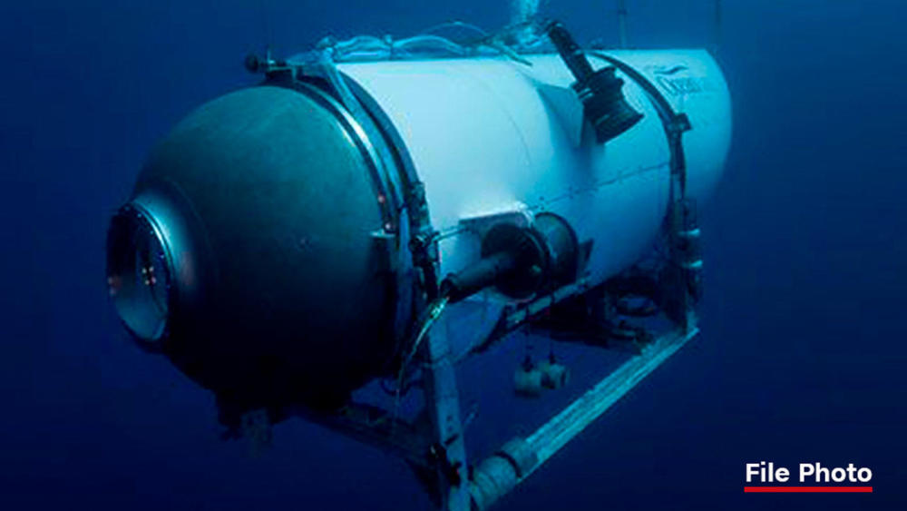
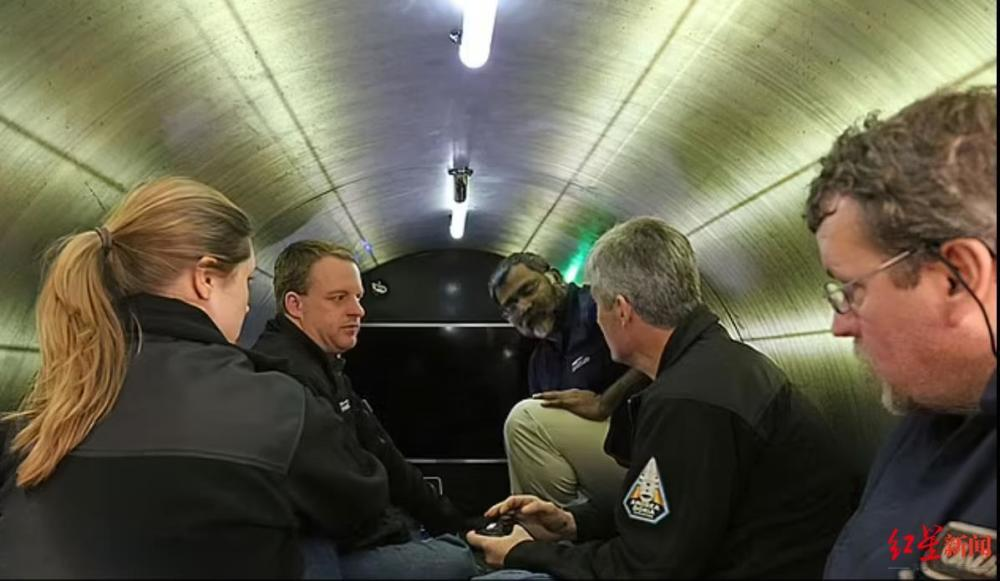
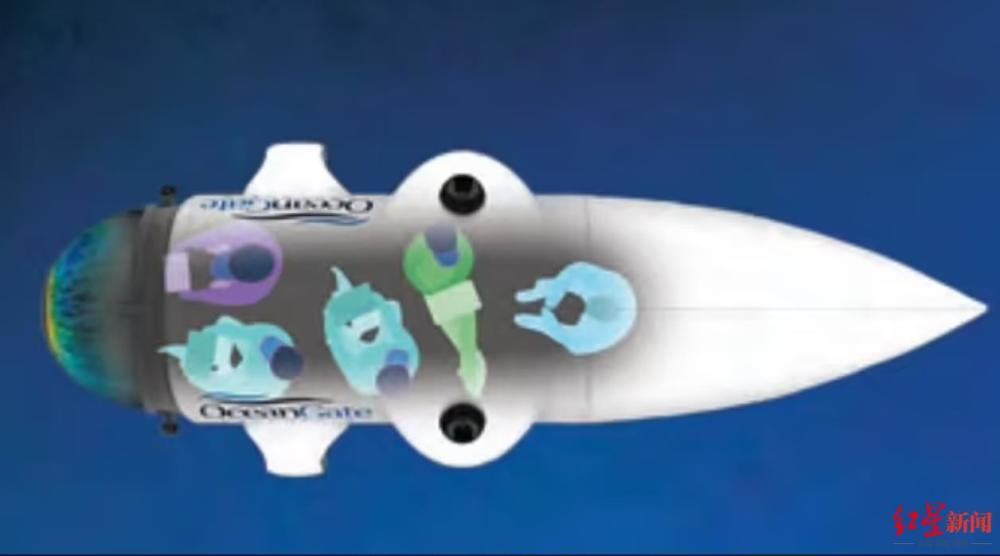

# 奇迹是否会发生？“泰坦”号氧气22日19:08耗尽，舱内5人生死未卜

到深海3800米探访“泰坦尼克”号沉船的“泰坦”号深海潜水器，在失踪两天后，氧气将于美国东部时间22日7点08分（北京时间22日19点08分）耗尽。

目前，一项复杂的国际搜索行动正处于最关键的时刻，更多先进的设备被紧急送往北大西洋。

_↑水下的“泰坦”号 资料图_

但截至目前，“泰坦”号的具体位置仍然未知，船上五名乘员的命运令人揪心。一些专家表示，失踪潜水器上的氧气含存量正成为一个至关重要的问题。那么，氧气耗尽后会发生什么？是否会有奇迹出现的可能？

**极限生存考验：**

**内部和外部环境都十分恶劣**

据该潜水器所属公司——海洋之门的一份文件显示，“泰坦”号的氧气续航可达96小时。专家们一致认为，时间、物理和距离的限制，决定了营救失踪潜水器上五名乘员的“机会窗口”正在迅速关闭，他们预计，“一个艰难的选择即将到来”。

此前，有分析称，“泰坦”号可能被困在了泰坦尼克号沉船的区域。然而，在这个被称为“午夜区”的区域，一直以其“寒冷的温度和永恒的黑暗”而闻名。据描述，这个“严酷无情的环境，更像外太空而不是地球上的生命区域”。

曾参加过“泰坦”号探险的人回忆道，他们在一片漆黑的环境中下降了两个多小时，最后突然坠入海底。潜水器的灯光只能提供有限的视距，不会超过几米。而潜水器内部的条件也十分堪忧，甚至只有一个人可以伸腿的空间。美国全国广播公司科技编辑本·戈金在推特上表示，“这看起来像地狱！”

_↑舱内空间狭小
资料图_

曾是潜艇艇长的马奎特称，完全可以“想象五名乘客在潜水器中的经历”，“又渴又饿，但这可能不会杀死他们”。他认为，如果他们还活着，可能会感到非常不舒服。此前，美国海岸警卫队表示，潜水器上仅有“一些有限配给”的食物和水。

“他们会感觉很冷。因为整个潜水器周围的水处于冰点或略低于冰点。当他们呼气时，气体就会凝结，潜艇内部会结霜。”他说道。“所有人都会挤在一起以保持体温，但他们呼入的氧气不足，而且还在呼出二氧化碳。”

马奎特还进一步解释道，潜水器吸收呼出二氧化碳的能力“有限”，高浓度的二氧化碳会引发头痛、恶心等症状。但“氧气、二氧化碳和冰冷的环境是他们必须尽可能长时间克服的东西，以便给救援人员所需的时间。”

**会有奇迹吗？**

**96小时营救“窗口期”进入倒计时**

6月21日，美国海岸警卫队上尉弗雷德里克在新闻发布会上表示，剩余的氧气不是唯一要考虑的细节。他强调，搜救队伍仍在计划“救出一名活着的船员”，并称“不想讨论搜救工作何时结束”。那么，96小时倒计时结束后会发生什么？是否会有奇迹出现的可能？

纽芬兰圣约翰纪念大学的高压氧医学专家肯·莱德斯博士指出，舱内氧气耗尽后的生存时长取决于一个人的新陈代谢，有些人可能比其他人活得更久。“这不像关灯，而是像爬山，”他说。船舱里的人需要尽一切努力减少氧气消耗，比如休息、放松和保持冷静。因为过多的运动可能会导致新陈代谢加快，产生更多的二氧化碳。

_↑“泰坦”号上的五名乘员_

斯坦福大学肺科专家康菲尔德称，如果潜水器在水下仍然完好无损，有几个因素可能有助于延长船上五人的生存时间。比如保持冷静，不那么频繁地深呼吸，他们可能会再坚持几个小时。“如果他们能放慢呼吸，多争取10%的时间，那就会为救援增加9个小时的宝贵时间。”

与此同时，二氧化碳的水平也会影响生存时间，如果二氧化碳浓度过高，船舱里的人可能会陷入昏迷失去意识，甚至最终死亡。

莱德斯还指出，“海水的低温环境可能是他们的朋友”。有一种可能性是，如果他们足够冷静并失去了意识，反而有可能活下来。因为在寒冷的环境里，心跳会非常缓慢。“（但）他们能撑过极限一周吗？我很怀疑。但有些人可能比其他人活得更久。”

_↑舱内示意图_

曾领导美国海岸警卫队的保罗·祖昆夫特补充道，96小时期限一到，“海洋之门”公司必须作出决定，想要自费进行哪种打捞和救援行动。这种规模的操作可能会在燃料、人员和维护成本之上花费数百万美元。

不过，前美国海军潜水员博比·斯科利在接受媒体采访时表示，所有人都在关注96小时“窗口期”，但这并不是一个固定的数字，“我知道搜救队并没有把重点放在这个固定的数字上”。他认为，即使超过这个时间窗口，救援任务也将继续下去，“所以这也给了我希望”。

红星新闻记者 徐缓

责编 官莉 编辑 何先锋

