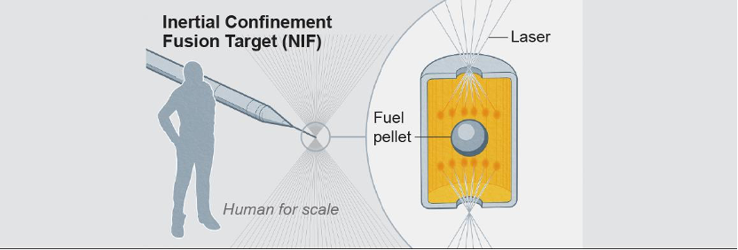
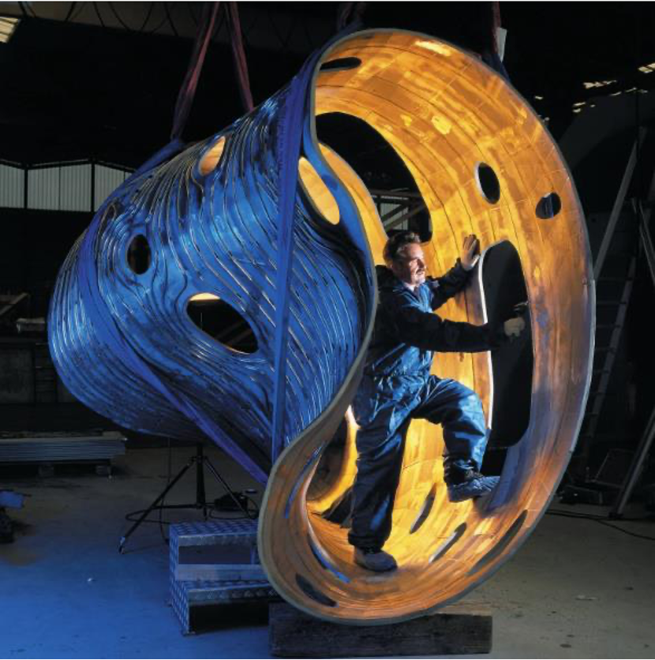

# 未来“人造太阳”发电，电费不要钱，但要等到2050年之后

**划重点**

  * _1_ 可控核聚变有可能产生接近零碳排放的无限清洁能源，却不会产生与今天的核裂变反应堆相关的危险放射性废物。
  * _2_ 科学家预测，当人类学会如何以可控和持续的方式进行核聚变时，电力将变得“便宜到不需要计量、随意使用的程度”。
  * _3_ 科学家预计，可控核聚变电厂将首先取代仍然活跃的燃煤电厂，然后是石油和天然气发电厂，最后是核裂变电厂。
  * _4_ 可控核聚变现在看起来比10年前更有可能成为未来的能源来源，但在未来10到20年里依然难以实现，所以我们还需要依赖太阳能、风能、核裂变能等。

去年12月，致力于可控核聚变研究的物理学家声称取得了重大突破。美国加州国家点火装置实验室（NIF）的一个研究团队宣布，他们从可控核聚变反应中提取的能量超过了触发该反应的能量。这是全球首次，也是物理学迈出的重要一步，但距离将核聚变作为一种实际能源利用起来的目标依然遥远。这一高调声明引发了核聚变研究领域的惯性回应：支持者对此赞不绝口，反对者充满质疑。

这种激烈的对立反应凸显了核聚变研究领域的高风险。世界越来越迫切地需要丰富的清洁能源，以缓解燃烧化石燃料造成的气候危机。可控核聚变有可能产生接近零碳排放的能源，却不会产生与今天的核裂变反应堆相关的危险放射性废物。自20世纪50年代以来，物理学家始终在研究可控核聚变能，但令人沮丧的是，将其转化为实用能源仍然遥遥无期。

可控核聚变能会成为我们这个能源紧缺的星球上重要的能源来源吗？如果是的话，它会及时到来以帮助拯救地球吗?

第二个问题是该领域为数不多有明确答案的问题之一。大多数专家都认为，在2050年左右之前，我们不太可能从可控核聚变中产生大规模的能源。考虑到本世纪全球气温的上升可能在很大程度上取决于我们在那之前对碳排放做了什么或没做什么，可控核聚变不太可能成为“救世主”。

美国劳伦斯利弗莫尔国家实验室的项目负责人奥马尔·哈瑞肯（Omar
Hurricane）说：“我确实认为，可控核聚变现在看起来比10年前更有可能成为未来的能源来源，但在未来10到20年里依然难以实现，所以我们需要其他解决方案。”

因此，到本世纪中叶实现脱碳将需要依赖于其他技术，比如太阳能和风能等可再生能源、核裂变能，或许还有碳捕获技术。然而，放眼未来，我们有充分的理由认为，到本世纪下半叶，当更多的发展中国家开始需要西方那样的能源预算时，可控核聚变能将成为能源经济的关键部分。解决气候变化问题不是一蹴而就的事情。如果我们能在不彻底改变气候的情况下渡过未来几十年的瓶颈，未来的道路可能会更平坦。

**01 在地球上制造恒星，电力变得超便宜？**

几乎与核裂变一样，可控核聚变也被认为是一种潜在能源。1945年末，在曼哈顿计划的一次汇报会上，意大利物理学家恩里科·费米(Enrico
Fermi)设想了用于发电的聚变反应堆。费米曾在二战期间领导了在芝加哥建造第一座裂变反应堆的项目。几年后，科学家们发现了如何释放可控核聚变能的方法，但只是在不受控制的世界末日般的氢弹爆炸中才能成功。有些科学家预测，一旦我们学会了如何以可控和持续的方式进行这一过程，电力将变得“便宜到不需要计量随便用的程度”。

_图1：核裂变和可控核聚变的基本组成部分_

但事实证明，实现目标的挑战比预期要大得多。哈瑞肯说：“这太难了！我们基本上是在地球上制造恒星。”

两个氢原子聚变生成氦是为太阳和其他恒星产生巨大能量的主要过程。当这种轻原子核相互结合时，会释放出巨大的能量。但是由于这些原子核带有正电荷，它们彼此排斥，需要巨大的压力和温度才能克服静电屏障，使它们融合。如果科学家能够控制聚变燃料，包括氘和氚（氢的两种重同位素）的等离子体混合物，反应中释放的能量就可以实现自我维持。但你如何在大约1亿开尔文的温度下装瓶等离子体，这比太阳中心的温度高几倍？

_图2：D-T反应的基本构成，该反应使用氘和氚来产生聚变燃料_

没有任何已知材料能承受如此极端的条件，即使是极耐热的金属（如钨）也会在瞬间被融化。长期以来，反应堆设计最青睐的解决方案是磁约束：将带电等离子体保存在由强磁场形成的“磁瓶”中，这样它就永远不会接触聚变室的墙壁。最流行的设计被称为托卡马克（Tokamak），由苏联科学家在20世纪50年代提出，它使用环形容器。

_图3：托卡马克反应堆的基本设计_

这个过程需要精细的控制。炽热的等离子体不会静止不动，它往往会产生很大的温度梯度，从而产生强烈的对流，使等离子体变得动荡不安，难以控制。这种不稳定性，类似于微型太阳耀斑，可以使等离子体接触到墙壁，从而破坏它们。

其他等离子体的不稳定性可以产生高能电子束，在反应室的包层上穿孔。抑制或控制这些波动始终是托卡马克核反应堆设计者面临的主要挑战之一。普林斯顿等离子体物理实验室主任史蒂文·考利(Steven
Cowley)说：“过去10年之所以能取得巨大成功，主要是因为对这种湍流进行了详细的定量研究。”

磁约束核聚变的最大障碍之一是，需要能够承受来自聚变等离子体、经过严格处理的材料。特别是，氘-氚可控核聚变会产生强烈的高能中子流，这些中子与金属壁和包层中的原子核碰撞，造成微小的熔化点。然后金属再结晶，但被削弱，原子从它们的初始位置移动。在一个典型可控核聚变反应堆的包层中，每个原子在反应堆的生命周期内可能会移位大约100次。

_图4：等离子体在国家点火装置(NIF)的靶室内流动_

如此强烈的中子轰击产生的后果目前尚不清楚，因为聚变从未像运行中的反应堆所需的那样持续很长时间。英国原子能机构(UKAEA)的首席执行官伊恩·查普曼（Ian
Chapman）说：“在运营核电站之前，我们不知道也不会知道材料的降解和寿命信息。”

然而，对这些退化问题的重要见解可能会从一个简单的实验中收集到。这个实验产生了强烈的中子束，可以用来测试材料。这样的设施主要基于粒子加速器项目，被称为国际聚变材料辐照设施，用于示范导向中子源，将于本世纪30年代初在西班牙格拉纳达开始运行。美国也有意建设类似的设施，称为聚变原型中子源，但尚未获得批准。

目前还不能保证这些材料问题能得到解决。如果它们被证明是无法克服的，一个替代方案是用液态金属制造反应堆壁，液态金属不会被熔化和再结晶破坏。但普林斯顿等离子体物理实验室主任考利说，这会带来一系列其他技术问题。

另一个主要挑战是制造可控核聚变燃料。地球上有丰富的氘，这种同位素占天然氢的0.016%，所以海洋里确实充满了氘。但是氚自然形成的数量很少，而且它的半衰期只有12年，因此它会不断消失，必须重新生产。原则上，它可以从可控核聚变反应中“孕育”出来，因为聚变中子会与锂反应生成它。大多数反应堆设计都包含了这个孕育过程，方法是在反应堆室周围包裹一层锂。尽管如此，这项技术还没有得到大规模的验证，没有人真正知道氚的生产和提取是否有效，或者效果如何。

**02 打造可控核聚变电厂原型展开“月球竞赛”**

世界上最大的可控核聚变项目位于法国南部的ITER(拉丁语意为“道路”，最初是“国际热核实验反应堆”的首字母缩写)，它使用等离子体半径为6.2米的大型托卡马克，整个机器将重达2.3万吨。如果一切按计划进行，在欧盟、英国、中国、印度、日本、韩国、俄罗斯和美国等国支持下，ITER将成为第一个以发电厂规模(约500兆瓦)展示持续电力输出的核聚变反应堆。

ITER的建设从2007年开始，最初的希望是在2020年左右在聚变室中产生等离子体，但ITER遭受了多次延误，而估计的54.5亿美元成本已经翻了两番。今年1月，该项目的负责人宣布遭遇了新挫折：计划于2035年开始运营的项目可能会推迟到2040年左右。ITER不会产生商业电力，正如它的名字所说，它是一个严格意义上的实验机器，旨在解决工程问题，并为可行的发电厂铺平道路。

有些人认为这是一个笨重的庞然大物，没有成功的可能，这种新的阻碍引发了另一轮对可控核聚变的怀疑。但哈瑞肯说，这样的问题是意料之中的。他说：“ITER受到了很多打击，但我们需要给它们一个喘息的机会，让他们解决问题。”

查普曼表示同意。他说：“可以预见，在政治上和技术上都会出现问题。这个项目正在做令人惊叹的事情，包括建立以前不存在的供应链。”他承认，延迟令人感到失望，“但我不认为我们会在回顾ITER时认为这是一个错误。我们会认为它在可控核聚变的起源中非常重要。我相信这是可行的。”

用于发电的托卡马克核反应堆可能不需要像ITER那样庞大，当然也不可能像ITER那样昂贵。最近，人们对更小的球形装置越来越感兴趣，其中一个被称为球形托卡马克能源生产(STEP)，英国原子能机构UKAEA计划将其作为一个与ITER并行开发的试点电厂。

_图5：STEP和ITER反应堆的设计和规模_

球形设计概念已经通过名为Mega
Amere的球形托卡马克设备进行了原理验证。该装置于1999年至2013年期间运行，由UKAEA和欧洲原子能共同体共同监督。这些较小的机器具有更高的能量密度，因此热损坏的风险也更大，特别是从“排气”系统中提取热乏燃料。一个改进的版本MAST
Upgrade于2020年启动，并且能够比原始版本高效地提取热量约20倍。查普曼说：“这确实为构思紧凑型发电厂开辟了道路。”

STEP的目标是打造生产净电力的原型电厂。它仍处于概念设计阶段，但英国政府已经开始为该项目制定监管规定，这是世界上第一个可控核聚变项目，从而消除了对传统核许可的需要。去年10月，各国领导人选定了英格兰北部的一个燃煤发电站，该电站已经于今年3月停止运营，计划于2024年初拆除。该基地已经有了冷却水供应，并与国家电网和铁路系统相连。

_图6：在国际热核实验堆(ITER)现场，一个极向场线圈正在接受测试，其中六个环形磁铁将在实验中引导等离子体_

欧盟正在规划自己的原型核聚变电厂，称为示范核电厂(DEMO)，由欧洲聚变联盟（EUROFusion）管理，目标是产生200兆瓦到500兆瓦的电力。欧洲可控核聚变项目经理托尼·唐纳(Tony
Donné)表示，该项目可能会在21世纪40年代初开始建设，“我相信我们可以在10年内制造出这样的设备”。

唐纳补充说，韩国、日本和中国也有类似的可控核聚变电厂“垫脚石”项目，美国计划建造一个更小的装置，称为聚变核科学设施。查普曼称：“中国参与得有点晚，但现在正在大举投资，并迅速扩大研发队伍。它肯定在追赶欧洲和美国。”唐纳认为，只要各国继续分享信息，为打造可控核聚变电厂原型而进行的“月球竞赛”可能是有益的。

**03 初创企业大量涌现，供应链逐步完善**

可控核聚变也并不全是大型的国家和国际项目，小型球形托卡马克装置是将可控核聚变带入私营公司手中的技术之一。几十家可控核聚变初创企业在世界各地如雨后春笋般涌现，比如美国马萨诸塞州的联邦聚变系统公司(CFS)、加拿大的通用聚变公司（General
Fusion）和英国的托卡马克能源公司等。

在英国原子能机构的支持下，通用聚变公司刚刚开始建造示范电厂，希望到2025年投入运行。根据该公司前首席执行官克里斯托弗·莫里（Christofer
Mowry）的说法，这将是“第一次与发电厂相关的大规模可控核聚变演示”。

与此同时，CFS与麻省理工学院等离子体科学与聚变中心(PSFC)和其他机构合作，正在建造名为SPARC的原型设备，也计划在2025年完成。SPARC将是一个中型托卡马克装置，其中等离子体被麻省理工学院开发并于2021年推出的新型高温超导磁体产生的强磁场紧密限制。这种磁铁被誉为磁约束聚变的重要一步，因为等离子体中的功率密度会随着磁场强度的增加而迅速增加。

SPARC团队的目标是从等离子体中提取净能量(输出能量大约是输入能量的10倍)，并产生50兆瓦到140兆瓦的聚变能量。尽管SPARC比ITER规模小得多，但PSFC的主任丹尼斯·怀特(Dennis
Whyte)说，它们的使命是相似的，即解决阻碍可控核聚变商业化的科学和技术问题。它不会向电网输送任何电力，但其目的是为麻省理工学院开发的、由CFS(考利认为迄今为止“最具影响力的公司”)推行的“负担得起、坚固、紧凑”的聚变反应堆概念扫清道路。

考利对这样的项目表示欢迎，但他警告说，不要把它们视为使可控核聚变成为现实能源的捷径。他表示：“我们看到这些初创公司热情高涨，其中很多公司的注意力都集中在问题的某个特定部分。”任何一家都不太可能在巨头之前将可控核聚变能源技术商业化，而且许多公司可能会中途放弃。但查普曼认为，其他公司将成为有价值的专业技术和专门部件(如磁铁)的供应商，“大多数小型可控核聚变公司最终将成为供应链的一部分”。

**04 不同的设计**

磁约束核聚变的装置并不一定局限于托卡马克。在20世纪50年代，天体物理学家莱曼·斯皮策(Lyman
Spitzer)认为，在具有扭曲隧道壁的环形腔中，等离子体可能更有效地被容纳。有了这种配置，该设备可以利用带电等离子体本身流动产生的磁场来约束等离子体。

_图7：仿星器反应堆的基本设计_

这种设计更复杂的几何形状被称为仿星器（Stellarator），在工程上很棘手，但有几个项目正试图完善它。一个值得注意的例子是德国Greifswald的Wendelstein
7-X仿星器，它于2015年完工，经过三年的升级后，现在再次运行。

欧洲核聚变项目经理托尼·唐纳称：“仿星器有很多优势，但从技术上讲，它是更复杂的设备。在欧洲，我们正在研究仿星器，作为托卡马克的后备。”这项技术仍处于相对早期的阶段，因此，如果这种备份被证明是必不可少的，那么实际可控核聚变的时间表可能会再次推迟。

国家点火装置实验室（NIF）的策略与所有这些项目完全不同。NIF实验没有使用受磁场限制的大量等离子体，而是点燃了氘和氚。在这种情况下，实验通过突然挤压燃料并对其进行强烈加热来触发可控核聚变之后，正在聚变的等离子体只能靠自身的惯性短暂地保持在原地。这一方案被称为惯性约束核聚变。

NIF通过将非常强的激光束聚焦在丸状目标上产生这些极端条件。在热等离子体膨胀之前，聚变能会在短暂的爆发中释放出来。因此，这种能量生产将以脉冲方式进行，燃料胶囊必须不断地一个接一个地移动到反应室中进行点燃。大多数研究人员估计，要使这种方法成为现实，胶囊必须每秒更换10次左右。

_图8：NIF实验中惯性约束核聚变靶的设计和尺寸_

惯性约束核聚变的挑战是艰巨的，目前世界上只有少数几个设施在研究它。除了最大的NIF，还有法国的Megajoule
Laser设施和中国的神光三号激光设施，俄罗斯也可能采取这种方式，但细节很难确定。发电实际上并不是NIF任务的主要部分，该设施主要是为了引发核反应，以研究和维护美国的核武器储备。哈瑞肯说：“NIF的主要工作完全是由美国国家安全机构资助的，这不是一个核聚变反应堆，也不是为了展示任何实际意义的核聚变能量。”

要使惯性约束核聚变成为供应能量的真正竞争者，还有很多工作要做。NIF惯性核聚变能源项目的负责人塔米·马（Tammy
Ma）说：“这项工作的重点主要集中在基础科学上，我们还没有在发电厂所需的支持技术上投入那么多的精力。”

**05核聚变发电厂还要十年建成？**

考虑到可控核聚变项目的多样性，真正能够投入使用的可控核聚变能到底离我们有多远？查普曼直言不讳地说：“目前还没有任何正在进行的项目是建造能够产生能源的核聚变发电厂。”

而真正的核聚变发电厂（不只是原型）可能需要十年左右的时间才能建成。查普曼说：“实验正在取得进展，而且进展令人印象深刻。但可控核聚变至少在几年内还无法作为主要能源使用。”唐纳更加直言不讳：“如果有人告诉我，他们在未来5年或10年内会建成可投入运行的可控核聚变反应堆，那他们要么完全无知，要么就是骗子。”

预测可控核聚变能何时到来始终都很难，但现在专家们大多同意大致的时间表。考利说：“假设我们在21世纪30年代末建成一个试点核聚变电厂，尽管这可能会有一些进展，但这样的电厂不太可能成为商业化的蓝图。因此，我认为从一个试点电厂到第一个商业反应堆还需要大约10年的时间。”查普曼也认为，到2050年左右，可控核聚变发电厂可能会向电网供电，然后在本世纪下半叶，尤其是2060年后，对能源经济的重要性将稳步提高。

可控核聚变发电厂的规模可能与今天的化石燃料或核裂变发电厂差不多，但输出的电量将达到几千亿瓦。这意味着，它们可以在相同的地点建造，以可控核聚变取代核裂变，并且所有必要的电网基础设施都已经到位。唐纳说：“你可以说，核聚变很容易插入并取代化石燃料或核裂变，这可能是一个非常平稳的过渡。”他预计，可控核聚变电厂将首先取代仍然活跃的燃煤电厂，然后是石油和天然气发电厂，最后是核裂变电厂。

_图9：Wendelstein
7-X仿星器核聚变实验中等离子体扭曲容器的一部分_

即使可控核聚变不能使我们摆脱当前的气候危机，但从长远来看，它可能是在不破坏地球的情况下满足我们能源需求的最佳选择。“托卡马克之父”、苏联核聚变梦想家列夫·阿尔茨莫维奇(Lev
Artsimovich)曾经说过，只要世界决定需要，就会有核聚变出现。

查普曼说：“当我们意识到气候变化将成为一种生存威胁时，核聚变的出现将大大加快。”他将这种情况与新冠肺炎疫苗的快速开发相提并论。目前，我们根本没有其他实现净零碳排放的长期方法，特别是因为全球能源需求预计将在2050年至2100年之间增长两倍。查普曼说，要满足这种需求，“核聚变是必不可少的”。唐纳说，风能和太阳能等可再生能源肯定会发挥作用，但它们可能还不够。

从头开始建设一种新型能源基础设施既带来了机遇，也带来了挑战。核裂变规划者在设计和公共关系方面犯了一些严重的错误，但现在，新生的核聚变工业有机会从这些错误中吸取教训，做得更好，尤其是考虑能源公平和正义的问题。

NIF惯性核聚变能源项目的负责人塔米·马问道：“当我们有了这些发电厂，我们把它们放在哪里才能为所有类型的社区提供清洁能源？我们如何建立一支多元化的劳动力队伍？我们如何确保在建立这个行业的同时，我们正在培训人们掌握未来的技能？这一次，我们至少要试着把事情做好。”（金鹿）

