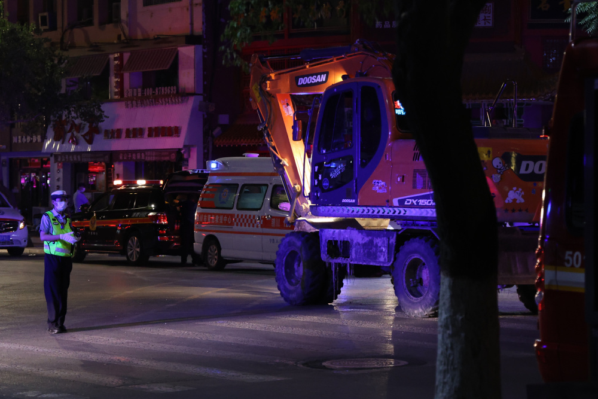
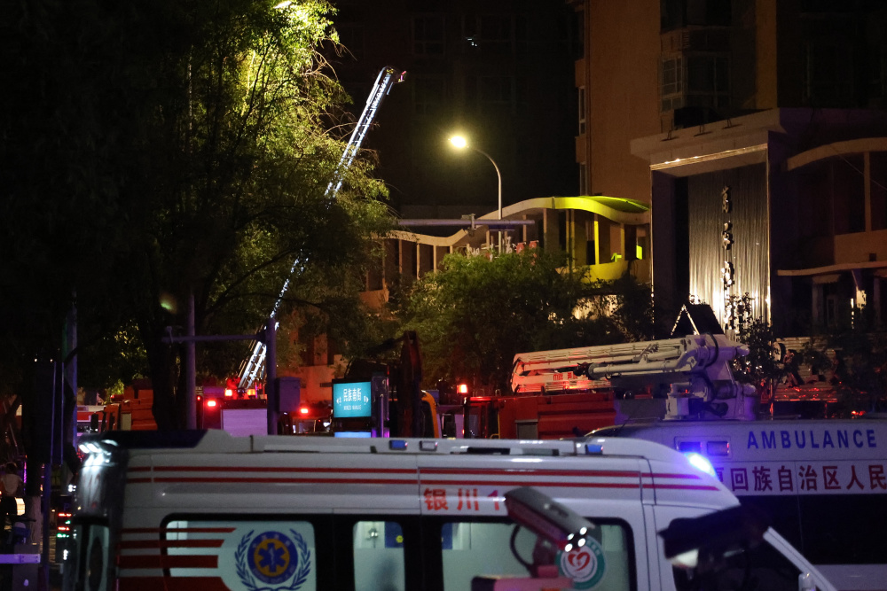
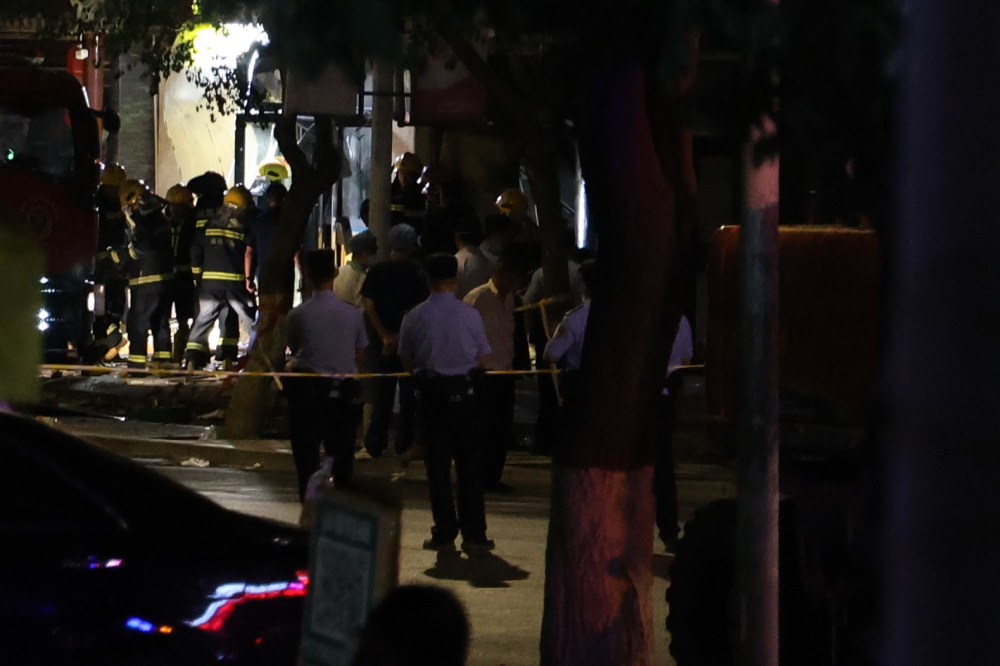
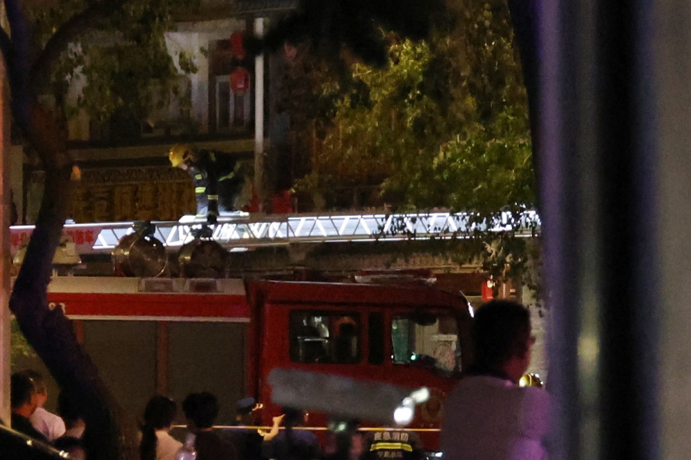

# 直击银川烧烤店爆炸现场：正值用餐高峰，二楼有KTV包间

顶端新闻记者 何玉帅 摄影报道

据新华社消息，6月21日20时40分许，宁夏回族自治区银川市兴庆区民族南街富洋烧烤店操作间液化石油气(液化气罐)泄漏引发爆炸，造成38人伤亡，其中31人经抢救无效死亡，7人正在全力救治中(危重1人、中度烧伤2人、轻症2人、玻璃划伤2人)。

从社交平台上传播的爆炸现场视频可以看到，富洋烧烤店冒出两股很大的黑烟，门口到处都是玻璃碎片，有人身上衣服被冲击波撕碎。

21日晚上11点20分，顶端新闻记者来到爆炸现场周边，附近路口已经实施交通管制，富洋烧烤周边50米左右已经拉起警戒线，现场有超过10辆救护车和数辆消防车。

晚11点50分左右，有挖掘机进入爆炸现场。

_22日0点，消防队员用云梯救援二楼被困群众，直到凌晨2点救援仍在进行。_

_22日凌晨1点20分左右，还有救护车往返爆炸现场。_

附近居民郝先生告诉顶端新闻记者，自己家离富洋烧烤有100米，大概在21日晚上8点30分听到一声巨响，随后便看到富洋烧烤(一中店)那边有烟雾升起，于是便立即报警，不到10分钟消防车就到了。

郝先生告诉顶端新闻记者，富洋烧烤是一家连锁店，他经常去富洋烧烤(一中店)吃饭，黄金时段这个店的上座率有90%，该店共有两层，一楼大概能坐20人，二楼有包房，能坐下的人会更多。

顶端新闻记者从团购平台该店所示公告了解到，该店已收录10年，二楼有KTV包房，大包间可以容纳12-18人，小包间可以容纳4-7人，营业时间下午3点到凌晨4点30分。

_22日凌晨1点，在救援现场，游客李先生告诉记者，自己是安徽人，过来银川旅游。_

李先生称，21日晚上8点多，自己刚把车停在富洋烧烤店门口准备去吃饭，店里就爆炸了，冲击波搞得门口一片狼藉，所幸自己没有受伤，但是自己的车还在警戒区域内，车开不出来，自己的旅游计划受到很大影响。

