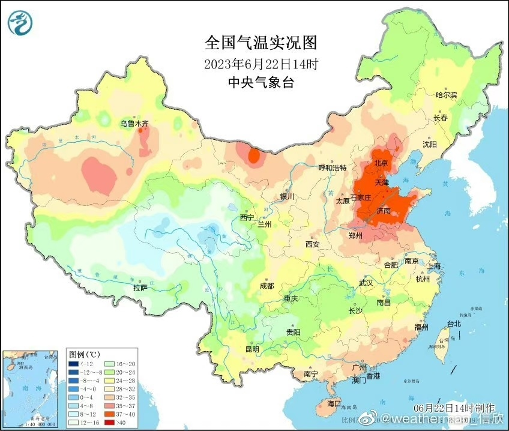

# 破纪录！北京怀柔汤河口达到41.8℃，当前气温全国第一

高温橙色预警之下，北京的气温还在噌噌往上蹿！

南郊观象台13时25分气温冲上40.1℃之后，截至14时，北京汤河口气温达到41.8℃，位居全国第一，并打破当地观测史最高纪录！北京南郊观象台气温也在继续上升，目前已经达到40.3℃（6月第二，纪录40.6℃）。

另外，在京津冀范围内，天津西青40.6℃，天津市区41.2℃，均打破当地观测史最高气温纪录（原纪录西青40.5℃，市区41℃）。

来源 北京日报客户端 记者 骆倩雯

编辑 王海萍

流程编辑 刘伟利

