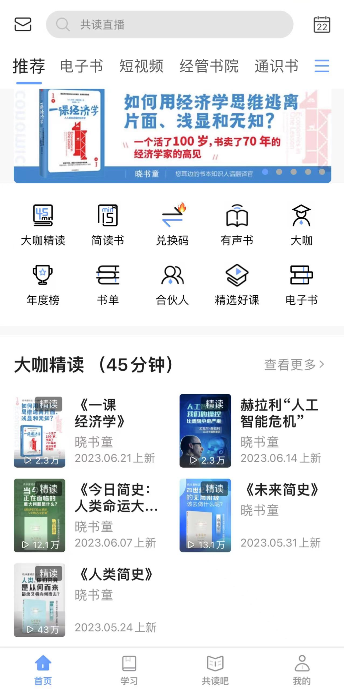

# “不敢倒闭”的早晚读书

卖酒卖茶叶、聊孟羽童离职、评周鸿祎离婚，自称走上“直播带货”新赛道的当当网创始人李国庆，已经有一段时间没有提起“早晚读书”了。

早晚读书是李国庆2019年的创业项目，离开当当网的他依旧选择图书方向，决心进军知识付费领域，主打名师解读书。然而4年过去，曾被寄予厚望的早晚读书陷入了困境。

近日，红星资本局从数位早晚读书前员工处了解到，他们于2022年7月接到裁员通知，李国庆曾承诺按“N+1”的标准支付补偿金，但过去近一年补偿金还未全数到账，目前已有前员工提起劳动仲裁。

裁员的背后，是早晚读书项目的资金问题。“说是经营问题，账上没钱了，为了节省开支。”一位前员工介绍，公司此前就“裁了好几次”，他们是最后一批。

项目初期，李国庆亲力亲为，他在电视节目上发表创业演讲，云集大咖到发布会现场支持，出席“早晚读书会”省分会成立仪式，与各地代理人当面交流。“夺章”成功后，他又以当当网的名义招兵买马，还提出要全员持股，让读者也成为股东。在直播带货首秀中，他更是以“拍卖1小时午餐时间”为噱头，卸下包袱卖起会员卡。

2022年6月，李国庆在抖音发布视频称，自己直播卖酒，是为了赚钱养活早晚读书。他放出员工办公室的画面，自嘲“太寒酸了”，但又表示“这里装着我的初心和梦想”。有网友在下方评论，“早晚读书，内容还是不太全。”李国庆回复称，“会完善。”

如今，有着情怀加持的早晚读书该如何往下走，似乎没有人知道答案。

**李国庆二次创业进军知识付费**

**如今员工已不到10人**

一位“元老级”早晚读书前员工向红星资本局介绍，公司规模最大时有近60名员工，有技术、内容、市场、渠道、产品等部门，后来为控制成本数次裁员，如今只剩下不到10人。该前员工称，公司曾提出在2021年用发会员卡的方式代替发工资，但因员工们不同意未能执行。

2019年2月20日，李国庆发布公开信，宣布已离开创立19年的当当网，将再次启程，创办“书友会”项目。他当时的构想是：做10个细分读书会，每个分会每年请几十位名家讲52本书，读者可以以书会友，阅读达人可以自发组织书友会。

他还在公开信中表示，要打造知识生产者、筛选者和消费者一体的知识合作社，不依赖大资本和创始人。“现在我的梦，是用3到5年达到年用户4000万，再造一个互联网文化生态。”那时的李国庆，希望能再创辉煌。

2019年4月，李国庆作为法定代表人的北京万卷书友网络科技有限公司、天津万卷书网络科技有限公司（以下简称“天津万卷书”）成立，后者是“早晚读书”项目的主体公司。

工商信息显示，天津万卷书的两名大股东分别是唐虓珲、刘浩宇，李国庆持股比例仅占1%。但有接近早晚读书的人士告诉红星资本局，公司的实际出资人是李国庆自己。

2019年6月，早晚读书APP正式上线。官方微信号显示，早晚读书举办了产品发布会暨城市合伙人启动仪式，邀请了时任当当副总裁陈立均、文化学者张颐武、演员黄磊等多位大咖到场支持。

_2019年6月2日，李国庆在早晚读书发布会现场演讲_

李国庆在发布会现场提出了“贴近三四五线城市”“每个城市都有代理合伙人”的招募计划。其实在APP上线前，早晚读书就发出邀请称，不仅要招募省级合伙人，还希望他们有资金支持项目运营，能发展区域内市级合伙人。

接下来的几个月，早晚读书陆续发布与不同城市合伙人签约的消息，截至2019年年底，合伙人遍布十余个省、市。红星资本局梳理发现，这些合伙人的身份，有书店老板、影评人、作协会员，还有具备市场营销经验的项目负责人和地方企业家。

所谓的城市合伙人，其实就是渠道商。有前员工向红星资本局指出，在全国范围招揽渠道商分销会员卡，是早晚读书主要的营收方式。

彼时早晚读书势头正盛，成为合伙人有一定门槛，除了独立法人资格、经营团队、相关运营经验等要求外，最重要的是，要先花钱购卡。早晚读书早期的一则消息显示，“要根据区域市场规模，首批采购对应数量会员卡（根据级别按零售价388元的2.7-4.0折计算），承诺年度最低新增会员数。”

在部分渠道商看来，这笔钱也叫加盟费。“省级跟市级的情况不一样，省级的话50到80万不等，要根据代理省份的经济情况和市场情况来变动。”6月21日，一位2019年加盟的西北地区渠道商告诉红星资本局。

据国际金融报2019年7月报道，此前有媒体报道，省级合伙人加盟费为20到145万，一线城市及直辖市合伙人加盟费40到60万，一般地级市合伙人加盟费10到25万，此外还需要交3万或5万保证金。

红星资本局了解到，一开始早晚读书承诺，滞销的会员卡可以收回、退款，但这也导致部分渠道商没有卖货压力，最终主动或被动退出项目。

“能退的话就导致他们不重视这个事，能做就做，做不了就算了，就不会全身心投入。”一位接近早晚读书渠道商的相关人士介绍，在2021年以后，早晚读书称未售出的会员卡不再支持退回，渠道商要么在区域内重新找人接替，要么自行使用。

卖不出去的卡成了“烫手山芋”。红星资本局了解到，目前有渠道商在向李国庆讨钱退卡，也有渠道商放弃要钱，不愿再提起早晚读书。

6月23日，红星资本局拨打天津万卷书公开电话，一名工作人员告诉红星资本局，目前早晚读书的确只剩下不到10名员工，但不清楚前员工补偿款和渠道商要求退卡的情况。对于资金方面的问题，该员工称“李总是在积极地筹钱”。红星资本局通过微信联系李国庆，至截稿时未获回应。

**没有融资的项目**

**无奈离场的渠道商**

有前员工向红星资本局透露，“退卡”的承诺源于创业初期对新项目的信心，也源于李国庆对自身IP的自信。但这也在某种程度上导致早晚读书后期出现资金短缺的情况。

事实上，早晚读书项目一直没有融资。2019年9月，李国庆在接受媒体采访时表示，有不少风险投资公司想来投资，包括IDG和高融资本等，资本方认为知识付费是个风口，也看好他本人，但他决定换个打法，不要投资人投资。李国庆还表示，他想将更多股份拿给核心团队和全体员工，做到全员持股，还想让各省市合伙人、读者也成为股东。

“与其他企业中创始人占绝对控股比例的情况不同，自早晚读书创立之始，李国庆就表示把更多的股份分给核心团队和合伙人们。”早晚读书发布于2020年1月的一篇文章这样写道。

项目初期，李国庆拿出千万资金投入，即使没有融资，也足以支持早晚读书的发展。上线近四个月后，早晚读书付费用户数超过10万人，彼时李国庆表示，“明年（2020年）的目标是达到100万付费会员”。

红星资本局梳理发现，在各省市，渠道商们一般通过办读书会、到企业或高校宣讲、与公益组织合作、投放流动广告等方式，打开早晚读书的知名度，再将目标客户引到线上，购买会员卡实现变现。

_2019年6月，李国庆参加“早晚读书”陕西分会成立仪式_

然而进入2020年，渠道商推广方式逐渐由线下转到线上。

一名在广东参与过推广工作的渠道商员工告诉红星资本局，此前，其所在公司与当地上市公司合作，有时办一场二三十人的读书会，有时到企业宣讲，一次就是上百人，活动结束后向对方员工推销早晚读书年卡，变现效果很好。

“比如我们和某个集团、银行合作，对方直接购买两三千张年卡，当时一张年卡388，我们给内部价200多，那四五十万不就回来了。”该员工也表示，优质客户不会经常有，懂推广才是关键。

“线上不一样，你没办法给别人营造氛围。”该员工介绍，2020年传统推销方法失效后，他们只能走“知识赋能”的打法，然而公司主营业务是传统行业，大家对知识付费并不熟悉，再加上现金流等问题，慢慢地就放弃了这个项目。该员工表示，广东在全国属于读书大省，市民对知识付费的接受度也比较高，加盟的地级市就接近半数，“原本是非常有势头的。”

不过，有早晚读书前员工向红星资本局透露，即便是有渠道商卖出去很多卡，也不一定能带来真正的用户，“很多都是关系户，不开卡，带来不了真正的流量。”

据不完全统计，江苏、安徽、山西、湖北、河南、广东等地的早晚读书官方微信号均在2020年停更。6月21日，红星资本局拨打上述部分地区公开的渠道商联系电话，有的未接通，有的表示已经退出项目。

湖南某地级市的一位前渠道商告诉红星资本局，他们在两三年前就与早晚读书停止合作了，主要是因为省级代理的退出。该负责人还表示，项目非常难做。

红星资本局注意到，目前“早晚读书湖南”微信公号已经注销，关联公司湖南早晚读书文化科技有限公司也于2021年3月被注销。红星资本局拨打该公司在天眼查官网上留下的号码，对方听闻来意后挂断电话。

_2020年6月，李国庆直播带货首秀_

**拖欠员工补偿款**

**有员工已提起劳动仲裁**

“早晚读书可能一直是亏损的，一直靠李总自掏腰包，做直播赚钱输血。”一位前员工向红星资本局感叹道。

据多家媒体报道，2022年下半年，李国庆有次在直播间的有问必答环节被主持人问及直播以来赚了多少钱。李国庆回答，自己直播正好一年了，大概养活了100多人，赚了1500万，但自己没揣兜里一分钱，都用来养活早晚读书和直播公司。

_图据李国庆抖音视频_

2022年6月，李国庆在抖音发布视频称，自己直播卖酒是为了赚钱养活早晚读书。

近年来，随着喜马拉雅、知乎live和得到等各类知识付费产品的涌现，用户对优质内容的需求大增。早晚读书主打名师大咖讲书，最初便选择在解读书这条赛道上发展，但被认为无论从LOGO还是商业模式，都在模仿樊登读书。据公开数据，截至2021年10月，樊登读书APP注册用户数已突破5000万。

红星资本局了解到，最后一波裁员发生前，早晚读书的总用户数只有几十万。据七麦数据，截至6月23日上午，早晚读书APP在畅销图书榜单类型排名172名。二次创业三年，李国庆距离4000万目标还非常遥远。

有前员工认为，对于早晚读书自身而言，看用户量意义不大，因为“日活很低，加起来不上万”。其表示，对标樊登读书，早晚读书也从产品本身、运营、吸引用户等方面做出过努力，但实际上是“看似什么功能都有，但每个功能都不好”。

“其实大家对早晚读书这个项目都有感情，我们都挺愿意再尝试一下。”一位前员工称，得知要裁员的时候，“有点懵”，因为原来项目一直是在模仿，大家希望能沉下心来好好做出自己的产品。

还有前员工向红星资本局表示，李国庆一直对员工不错，即使目前拖欠补偿金，大家也还是相信最后他能将钱补上。不过红星资本局了解到，因为距离签订补偿协议已过去近一年，有部分前员工提起劳动仲裁。

6月21日，红星资本局登陆早晚读书发现，APP仍在正常运营，6月份共上新了四本解读书，总播放量最高的是6月7日上新的《今日简史：人类命运大议题》。目前共有四种类型的会员卡，其中“钻石VIP”年卡保持着最初定下的388元高价。

_图据早晚读书APP_

在APP首页，招募合伙人的活动还在继续，首次贷款额由50万元到1万元不等，代理级别最高为直辖市级，还要缴纳2万元的保证金。

红星资本局注意到，李国庆在早晚读书APP上发布的最新一则短视频是在去年3月16日，他在视频中称：“前半年做直播带货，赚了一点辛苦钱，可这些并没有装到我口袋里，主要用于早晚读书发展用户了。我把前半生的钱、下半生的命都投入到早晚读书，无怨无悔。”

_图据早晚读书APP_

有前员工对李国庆的说法表示肯定，“李总多次说过，就算早晚读书不挣钱，他也会一直坚持做，他要做公益。”

但也有前员工讲述，早晚读书现在的状态是“不敢倒闭”“一方面是因为老李的情怀，另一方面是如果倒闭了，那很有可能其他的渠道商都要追款。”

红星新闻实习记者 蒋紫雯 记者 俞瑶

编辑 杨程

