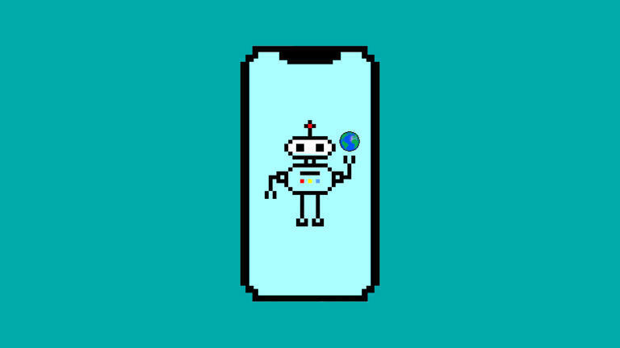

# 人工智能正悄悄接管你的iPhone

**划重点**

  * _1_ 虽然苹果没有明说在iPhone上集成了人工智能功能，但实际上其最近进行的诸多升级表明，人工智能正悄悄接管iPhone。
  * _2_ 苹果升级了自动纠错功能，可以根据上上下文语境预测单词，照片应用可以区分狗狗，耳机可以根据具体情况调整背景噪音。
  * _3_ 苹果在人工智能方面的做法与其他科技公司存在很大差异，这是因为它们采用了不同的商业模式，并非都以同样的方式赚钱。
  * _4_ 分析师预计，苹果的新人工智能功能“只是主菜前的开胃菜”。在过去的四五年里，苹果在这项技术上的投入在80亿到100亿美元之间。

腾讯科技讯
在不久前举行的全球开发者大会上，苹果对其备受诟病的iPhone自动纠错功能进行了升级，增加了大语言模型支持的人工智能功能。新的自动纠错软件不仅可以根据字典检查单词拼写错误，还可以考虑单词所在句子中的上下文语境，以免用错单词。

事实上，升级自动纠错功能只是iPhone体验的几项微调之一。苹果照片应用Photos将能够区分你的狗和其他狗，自动识别你的小狗，就像识别经常出现在你照片中的人一样。随着时间的推移，苹果耳机AirPods将变得更加智能，可以根据你的收听情况来调整背景噪音。

所有这些功能都是由人工智能驱动的，即使你可能不知道苹果如何称呼它们。在发布这些更新的活动中，苹果从未提及“人工智能”字眼，尽管人工智能已经成为各行各业追逐的热门技术。相反，苹果使用了更多的技术性语言，如“机器学习”或“转换语言模型”。

长期以来，苹果始终对人工智能技术的快速发展保持沉默，以至于被指落在了后面。的确，当前爆火的聊天机器人ChatGPT已经可以写出非常棒的商业计划书，而Siri只能设置早晨的闹钟，除此之外基本没什么能力了。然而，苹果正在以一种不引人注意的方式推进人工智能发展，它可能仍然代表着这项技术的未来发展方向。

自从去年秋天ChatGPT首次亮相以来，科技行业的领导者们纷纷对人工智能的潜力（无论是好是坏）发表看法。OpenAI首席执行官萨姆·奥特曼(Sam
Altman)上个月在推特上表示，人工智能“是迄今为止最令人惊叹的工具”。微软创始人比尔·盖茨（Bill
Gates）称人工智能是“自图形用户界面以来最重要的技术进步”。在谷歌的一次会议上，Alphabet首席执行官桑达尔·皮查伊（Sundar
Pichai）在15分钟的演讲中提到了27次“AI”，他甚至称人工智能的深远影响不亚于火。

与此同时，提到人工智能时，苹果似乎对这股热潮视而不见。约翰·格鲁伯(John Gruber)是苹果的长期观察者，经营着科技博客Daring
Fireball。他认为，苹果今年宣布的任何机器学习功能都不会显著改变iPhone的用户体验，他们只会让它在名义上变得更好。格鲁伯称：“我们希望自动纠错能够正常工作。当它出现异常时，我们会注意到。”

新的自动纠错功能将在今年晚些时候的iOS升级中提供，它有点像人们口袋里功能不那么强大的ChatGPT。苹果表示，该软件将更好地根据我们的输入方式进行微调，并预测我们接下来将使用哪些单词和短语。当人们向ChatGPT提问时，实际上他们正在访问的是存储在云上的大语言模型。但是，更小、更个性化的语言模型将会在你的iPhone上出现，它将为自动纠错提供动力。

斯坦福大学计算机科学家桥本辰则（Tatsunori
Hashimoto）表示，苹果还没有透露有关该功能如何工作的更多细节，该公司在这里使用的确切技术方法也不清楚。包括桥本在内的研究人员始终在努力研究如何缩小大型语言模型，使其适合移动设备。

与此同时，AirPods现在将使用“自适应音频”来分析你周围的声音并进行相应的调整。例如，当你开始和咖啡店的咖啡师说话时，你的Airpods可能会自动降低音乐的音量，然后在你停下来时重新提高音量。苹果表示，它将利用机器学习来了解你的音量偏好，并优化你的聆听体验。

苹果长期观察者格鲁伯说，所有这些都深深体现了苹果的特色：专注于一项功能的作用，而不是如何开发该功能。格鲁伯说：“苹果在幕后使用的人工智能技术对用户来说并不重要，就像他们使用哪种编程语言来创建它一样。”

苹果还重视保护用户隐私，这是苹果长期以来优先考虑的东西。由于该公司使用的是“设备端”模式，因此与ChatGPT等大型基于云的模式相比，它带来的隐私风险可能更小。斯坦福商学院人工智能专家莫森·巴亚蒂(Mohsen
Bayati)说：“从某种意义上说，这是私人所有的，因为用户数据不会离开他们的手机，针对该用户进行微调的模型也不会离开他们的手机。”

苹果在人工智能方面的做法与其他科技公司存在很大差异，这是因为它们采用了不同的商业模式。科技巨头并非都以同样的方式赚钱：谷歌和Meta控制着大约一半的数字广告市场，人工智能驱动的聊天机器人可能会成为另一种促使我们购物的方式。

微软涉足的广告业务较少，但它希望在搜索引擎中加入聊天机器人功能，这样可以帮助削弱谷歌。亚马逊庞大的云托管业务将从大语言模型的采用中获益。苹果则是一个奢侈品牌，致力于让你的电脑和手机的使用变得更愉快。格鲁伯说：“因此，苹果以产品为导向，谨慎对待人工智能并不奇怪。”

不过，iPhone可能是很多人首次接触苹果在人工智能方面取得进展的地方，部分原因在于聊天机器人将如何在我们的日常生活中发挥作用仍不确定。ChatGPT很受欢迎，在推出两个月内就获得了1亿用户，但不清楚有多少人仍然经常使用它。当被问及目前的月平均用户数时，OpenAI的发言人不愿透露具体数字。

许多公司都在增加自己的聊天机器人功能，Instacart应用程序现在正在使用人工智能来提供菜谱，Salesforce最近推出了名为“爱因斯坦GPT”的聊天机器人。然而，这些聊天机器人仍然有很大局限性。他们总是胡乱编造故事，带有偏见，经常侵犯版权。

技术方面缺少便利很容易让人恼火，但更好的自动纠错系统将覆盖数十亿部手机、平板电脑和台式机：现在美国大多数智能手机都是iPhone，苹果在全球拥有超过20亿台活跃设备。其他科技巨头也在利用人工智能对现有产品进行小规模升级，谷歌最近推出了通过聊天机器人起草Gmail回复的功能。

类人聊天机器人接管一切的场景并不是人工智能改变世界的唯一方式。很多在我们眼皮底下进行的微小调整都能产生巨大的影响。从某种意义上说，他们已经做到了：多年来，机器学习为我们提供了定向广告，过滤了我们的社交媒体动态，并帮助确定了我们的搜索结果。

和硅谷的其他公司一样，苹果可能很快会采取更大的动作。韦德布什证券公司的科技分析师丹尼尔·艾夫斯(Daniel
Ives)认为，苹果的新人工智能功能“只是主菜前的开胃菜”。据他的团队估计，在过去的四五年里，苹果在人工智能上的投入在80亿到100亿美元之间，与微软今年1月份给OpenAI的投资数额相当。此外，苹果也在招募人工智能领域的人才。也许，Siri的日子真的不多了！（金鹿）

