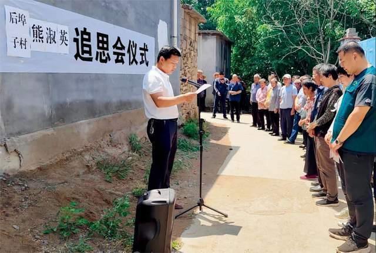
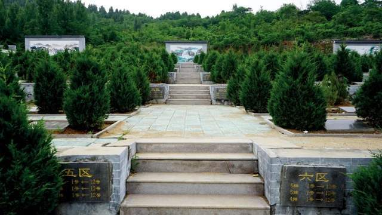
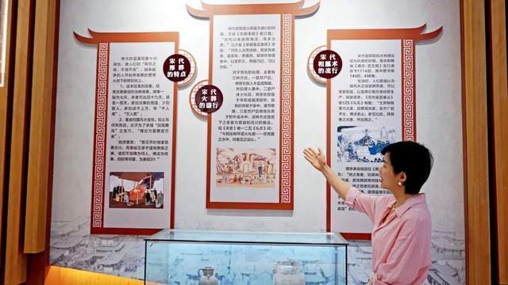
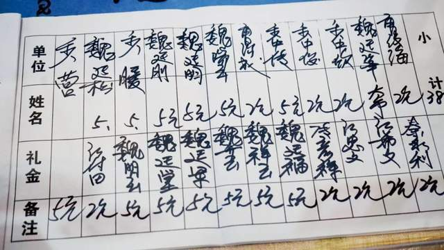

# 免费提供墓地和骨灰盒，这个县6年的殡葬改革怎么样了

殡葬改革始终是舆论场关注的话题。在今年的全国两会上，全国人大代表、合肥荣事达电子电器集团董事长潘保春提交了“加大殡葬行业改革”的议案。他建议，应加大殡葬业立法研究，尽快出台《殡葬法》，规范行业乱象，为离世的人提供免费墓地和骨灰盒。

2017年，山东省临沂市沂水县就开启了这样一场改革。具有当地户口、在沂水去世的民众，其遗体运输费、火化费、骨灰盒费、公益性公墓墓穴费、墓碑使用费、碑文刻制费全部免除，逝者统一免费安葬在公益性公墓，相关费用由县、乡两级财政承担。

六年过去了，这场改革进行得如何？沂水经验是否能复制推广到全国？

**从大操大办到全链条改革**

5月31日，沂水县龙家圈街道前埠子社区后埠子村，97岁村民熊淑英去世。她的家属第一时间通知了村主任张其东，张其东则赶紧通知了包村干部、龙家圈埠子管理区副书记张文强，以及红白理事会的其他成员。

红白理事会是沂水殡葬改革的“抓手”，每个村都有红白理事会，成员有三五名，包括村支书（村主任）、村两委人员、村中老党员以及村中德高望重的长者等，红白理事会主任通常由村主任兼任。

张其东等人赶到后，帮忙为逝者整理仪容、办理死亡证明，另外还帮忙招待宾客、记账、组织追思会、举行安葬仪式等。张其东说，“我们要和家属商量好，什么时候开追思会，什么时候火化，信息报给街道党工委，由他们联系民政，安排好车辆，公墓那边也要提前准备。”

丧仪中，“披麻戴孝”“扎纸”“大棺材”消失了，从城市里学来的追思会成为重要的环节。熊淑英的追思会有三四十人参加，先致悼词、宣读逝者生平，再默哀行鞠躬礼。

5月31日上午，沂水县后埠子村，在熊淑英的追思会上，张文强（左）致悼词：希望家属节哀顺变……上孝老人，下教子女，团结邻里。

追思会由张其东主持，张文强为其致悼词。村民告诉《中国新闻周刊》，有村两委、乡镇干部参加丧事，是极有面子的。曾有临沂市领导在沂水调研时遇到追思会，也就顺势参加。

张文强在悼词里这样介绍熊淑英，“她的一生是勤劳的一生⋯⋯她养育了7个子女，是受人尊敬的好邻居、好村民。”他也没有放过这个机会，又一次为殡葬改革做普及，“为逝者办追思会是社会发展的需要，也是精神文明和移风易俗的需要。这种形式简短、隆重，有仪式感，是对逝者最大的尊重。”

追思会结束后，逝者遗体被送到殡仪馆免费火化，骨灰被安排进免费公墓，由逝者家属及红白理事会成员一同举行安葬仪式。

相较以往，沂水县当前的丧仪流程简化。正如时任县委书记薛峰所说，殡葬改革是全链条改革，对殡葬体制、观念以及文化进行重塑。

_沂水县的公益性公墓均有监控，且全部联网，有专人管理。_

薛峰现在已调任临沂市委常委、秘书长，他向《中国新闻周刊》回忆，他从小在农村长大，对殡葬陋习有切身感受。工作后，他发现陈规陋习并未减少，反而有愈演愈烈的趋势。比如农村奢华坟墓占地多，大棺材下葬，起大坟头；城市里，有的地方墓穴价格高得离谱，殡仪馆的各项费用也不低。

主政沂水后，他发现，“坟墓占据基本农田”的现象时有出现。过去，每个村都有公墓，但近些年逐渐满了，有的民众就把亲人埋在承包地里，散埋乱葬一年用地三四百亩。

他和同事们算了一笔账：沂水县是有120万人的人口大县，每年去世人数相对固定，有8500~9000人，一场葬礼少则1万多元，多则几万甚至十几万元，户均2.5万元左右，沂水每年用于殡葬的社会支出2亿多元。

如果进行殡葬改革，实行全链条免费，建公墓需要一次性投入5000余万元，可建110处公墓10万个墓穴，满足居民十年安葬需求。再加上公益性墓穴运营维护、运输遗体花费、骨灰盒成本，以及殡仪馆运营及职工工资，一年全部费用不超2000万元（包括建公墓年均摊费用500余万元）。也就是说，每年2000万元，可以置换每年社会支出2亿多元。另外，如果使用骨灰盒安葬，全县一年还可节约木材1万立方米左右。

_沂水县的公益性公墓设有树葬、花葬、草坪葬等多种形式的生态葬。本文摄影/本刊记者
佟西中_

更何况，最重要的现实因素是，沂水有着殡葬改革的坚实基础，当地火化率早在数十年前就已达到百分之百。因此，上任之后仅一个月，2017年初，薛峰就决定推动殡葬改革。

**“党员干部带头，他们就服气”**

“殡葬改革，我就不信沂水能改成”。2020年，沂水推出话剧《樱桃崮下》，里面有句台词这样说，这也是当时许多党员干部的真实想法。

最初，沂水县的有关干部进行了为期三个月的调研。调研过程中，听到最多的是担心，薛峰回忆，“他们担心改革干不成，办砸了怎么办。改殡葬陋习，这活是出力不讨好，不光是广大党员干部这么想，班子成员也都担心这个。”

他们分析后认为，“党员干部与企业家是关键因素。”薛峰说，他们决定先抓好党员干部和企业家的思想工作，对民众则要避免出现群体性事件和极端事件。

薛峰回忆，在各类座谈会上，广大党员干部、企业家多是比较赞同的，“至少明面上没有反对的”。至于普通民众，年轻人比较容易接受，年龄大的仍需多做思想工作。

为此，沂水县还制定了风险预案，尤其是舆情风险和政策风险。沂水县民政局时任副局长贾文勇告诉《中国新闻周刊》，他们认为，如果舆情方面出问题，就立即进行沟通，不能为平息舆情而简单将涉事干部“拿下”，应找到舆情背后的原因，通过完善工作平息舆情。

至于政策，他说，他们梳理了近些年民政部出台的关于殡葬的措施和指导意见，确保殡葬改革有政策依据，“不能被人抓小辫子”。

2017年5月8日，沂水殡葬改革正式开始。从当年5月10日起，该县殡葬涉及的遗体运送费、火化费、骨灰盒等费用全部免费，同时倡导公墓安葬。薛峰明确要求，正面引导说理为主，不准强制、不准“一刀切”、不准搞平坟运动。

殡葬改革刚开始的时候，一位县级老干部去世了，薛峰问县委办公室人员，这位干部是否进公墓，如果进公墓，他就参加这位干部的追悼会，如果不进公墓，他就不参加。后来，这位干部进了公墓，薛峰以县委书记的身份参加了追悼会。

对企业家亦是如此。一次，薛峰和一位企业家开会，这位企业家说有急事要回家，原来是其父亲去世了。薛峰劝道，“你家老人要带头进公墓啊。”这位企业家表示，早就有此打算。之后，薛峰就以县委书记的名义，给企业家父亲送了花圈，并在多个场合表扬。

薛峰也碰到过有干部以实际行动反对的。殡葬改革之初，有群众举报，一名干部深夜把去世的母亲埋进事先建好的坟墓中。在薛峰看来，这事带了坏头，“搞改革，说白了民众就是看党员干部，党员干部带头，他们就服气”。

为此，他在全县大会不点名批评了这个干部不忠不孝，“作为党员领导干部，不带头执行党委政府的号召，顶风而上，忠在哪里？一个人从懂事开始，父母就教育我们要服从党委政府的安排，要遵章守纪，父母的话都不听，孝从何来？”

在说服民众时，也有不少难点。有的村庄说服村民死后进公墓花了半年时间。薛峰说，乡镇长、党委书记到村民家做工作是常事，“我在大会上说，如果个别户实在做不下来工作，可以把任务交给我”。

为推进改革，基层干部在村民家有丧事的时候，前去随礼并且磕头，给足“面子”的同时继续做思想工作。许多民众持观望态度，因此当地对前几名进公墓安葬的，都有数千元不等的物质奖励。

_沂水县建立了移风易俗教育基地，殡改已成为当地的“名片”。_

_沂水县移风易俗教育基地内的展品显示，殡改后随礼金额大为减少。_

对最难被说服的老一辈，则需要另辟蹊径。“在世的时候，大家住房都希望集中一点，大家热热闹闹的，百年之后进公墓，这相当于住小区，大家还是热热闹闹的。”“散埋也就三代之内能照顾到，进公墓定期有人管，后辈祭祀的时候，顺带也能管管老祖宗们”。还有基层干部对老人说，公墓环境好，或许会陵园变公园，以后子孙后代也会常来看看。

意料之外的事情也有发生。有村民利用运输骨灰的环节，在运输车上偷换骨灰，捧着空骨灰盒去安葬，被人发现盒子重量很轻。这是改革前没有想到的。

为了避免类似事件发生，当地采取了两个补救措施。一是封签，也就是将骨灰装入骨灰盒后封签，如果要拿出骨灰，必须扯断封签；二是对所有运送遗体的车和所有公墓都加装监控，避免有人偷取骨灰或为阻止殡葬改革而破坏公墓。

因是全链条改革，推崇免费，因此沂水的经营性公墓、殡葬用品市场都被“动了奶酪”。此前，沂水仅有一个经营性公墓，归民政局管，民政局取消了其经营资格。与此同时，当地强力整顿清理殡葬用品市场，棺材、纸扎等用品都在清理之列，被禁止销售。

触动了利益，威胁随之而来。薛峰说，那段时间接到了几百个电话，有询问的，有诅咒谩骂的，还有言语威胁的。不过，薛峰强调，反对的声音，最终都没有形成气候。

他说，他们坚持了原则性和灵活性。政策和目的是刚性的，即百分百进公墓，这是没有妥协空间的。但方法可以灵活，比如给予物质奖励等。殡葬改革六年以来，沂水53700多户逝者家庭享受到“殡葬全免费”政策，户均减负2.5万元，累计节约社会殡葬支出13亿余元，节省土地1200多亩、木材5万多立方米。

**沂水殡葬改革可以复制吗？**

中国已进到深度老龄化社会，并且，仍在进一步加剧。湖北省社科院社会学研究所研究员马德富告诉《中国新闻周刊》，新中国成立至今，有过几次人口出生高峰，从年龄看，未来三十年正是人口死亡高峰（75岁以上的人）。这个背景之下，殡葬改革尤其受关注。

国家民政部社会事务司司长王金华在接受《中国新闻周刊》采访时指出，沂水从政府职责入手，率先在全国实行殡葬综合性改革，让殡仪馆回归公益，建立基本殡葬服务制度，由政府免费提供，由乡村干部为每位逝者举行追思会，推行“惠民礼葬”，这一模式值得肯定和推广。

不过，外界审视沂水殡葬改革时，一方面是其早已实现百分之百的火化率让其他地区难以立刻效仿；另一方面，财政也是焦点，全免费的全链条改革，其他地方财政负担得起吗？

王金华向《中国新闻周刊》解释说，其实账是大致固定的，年均死亡人数不到千分之七，各地区死亡人数比较稳定，火化费、遗体运送费、暂存费、骨灰盒费等费用都可以测算。

从全国来看，王金华认为，基本殡葬服务由政府免费提供，各地是可以做到的，财政完全能够负担，即使财力较弱的省份也完全有能力承担。现在国内有九个省份已实现殡葬基本服务全免费。他相信，财力不是主要问题，最重要的是决心问题、认识问题，是移风易俗的观念问题。

这事实上关涉到了殡葬改革至今仍然受争议的最核心议题。一位该领域的研究专家在接受《中国新闻周刊》采访时指出，殡葬改革是一项系统性的社会改革，涉及政府、社会和个人之间的关系。三者要实现良性互动，才能推动殡葬改革顺利发展。他说，在满足民众基本殡葬服务需要的同时，如何满足居民的多元化、个性化需求，也是值得考量的。

曾任中国殡葬业协会秘书长的孙树仁同样告诉《中国新闻周刊》，殡葬的重要属性是民生，本质属性是文化，现代殡葬礼仪形成强大的文化影响力后，改革的杂音会小很多，民众的接受度也会更高。

他认为，殡葬改革的终极目标是“三性”，即生命的尊严性、死亡的平等性、服务的公共性。所谓尊严性，是指对生命要尊重，死亡要有尊严。平等性是指人的生命具有自然属性和社会属性。在自然属性上，对遗体的处理应该是平等的，不再占用自然资源，为子子孙孙繁衍生息提供发展空间。另外在服务的公共性上，政府买单让民众不会就此攀比。这“三性”是密切相关的，缺一不可。

孙树仁进一步补充说，殡葬改革不应强求某种模式，可因地制宜、百花齐放，但不管创造什么模式，三个底线得守住，也就是节地、生态，以及促进社会文明与进步，为子孙后代负责。

发于2023.6.26总第1097期《中国新闻周刊》杂志

杂志标题：沂水殡葬改革背后

作者：佟西中

