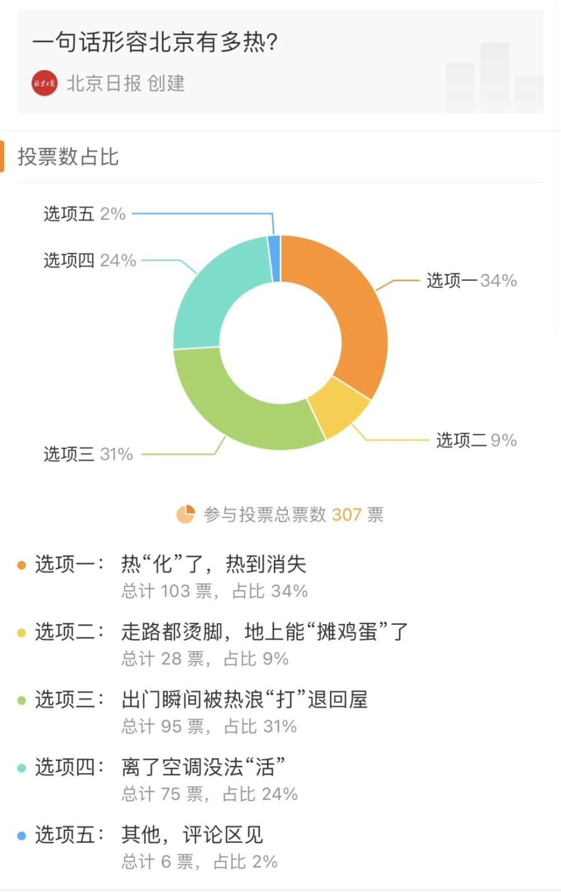
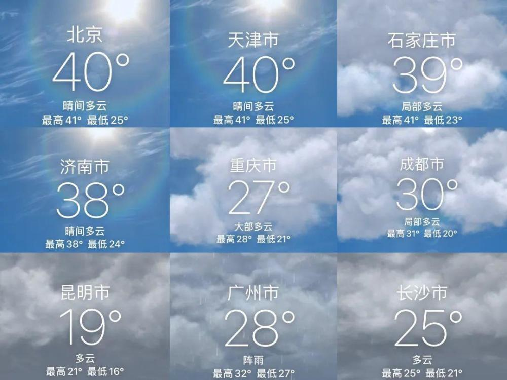

# 北京72年来首次连续两天破40℃，未来10天还有持续高温天气

北京市气象台6月23日7时升级发布 **高温红色预警信号：**
预计，6月23日至25日本市高温天气仍将持续，大部分地区最高气温可达37～40℃。上一次北京发布高温红色预警是2014年5月29日，
**距今已经9年了。**

针对京津冀地区持续高温天气，23日下午，中国气象局召开高温天气新闻通气会。北京市气象台首席预报员张迎新表示，截至今天14时，南郊观象台气温已达40℃，出现在13时36分；全市556个气象监测站中有305个测站最高气温在39℃以上，158个测站最高气温在40℃及以上；
**“这是观象台建站以来（1951年）首次出现了连续两天超过40 ℃以上的高温天气。”**

此次高温强度强，持续时间长， **其主要成因：**
一是从21日开始，京津冀地区受暖气团控制，暖气团的强度比较强，且影响时间也长；二是在高压脊的形势控制下，天空晴朗少云，没有云层的遮挡，辐射增温更加有力，促进了升温；三是目前刚进入夏至节气，白昼最长，长时间的日照有利于高温出现和维持；四是空气湿度小，天气干燥也有利于气温升高。

高温热浪愈演愈烈。中国气象频道气象分析师信欣介绍，今天截至12时，全国最高气温榜的前十门槛已经提升到了39.1℃。

截至今天13时， **北京斋堂40.4℃位列榜首，** 天津大港40.3℃，河北肃宁40.0℃排在二、三位。

北京市应急局发布提示：请 **高温时段停止户外作业，减少户外活动，** 做好防暑降温工作。身体不适请及时就医，注意防火。

据统计，北京观象台建站以来（1951年至2022年） **极端最高气温为41.9℃，出现在1999年7月24日。**
其次为41.1℃，出现在2002年7月14日、2014年5月29日、 **2023年6月22日。**

北京这两天到底有多热

看看网友们的感受↓↓↓

**未来10天还有持续高温天气**

来自中国气象局应急办消息，6月22日，北京、天津、河北、山东等多个国家级气象观测站最高气温突破历史极值，中央气象台6月23日6时继续发布高温橙色预警，
**预计未来10天，华北东部、黄淮大部将持续高温天气，高温日数有8天左右。**

经综合研判和应急会商， **中国气象局于6月23日9时启动高温四级应急响应。**
中国气象局各有关单位在做好暴雨应急响应的同时，加强值班值守，强化国省联动，滚动做好高温天气监测预报预警服务。北京、天津、河北、山东、河南、内蒙古等地及可能受影响的省级气象局根据实际研判启动或调整相应级别应急响应。

**防御指南：**

1、有关部门和单位按照职责落实防暑降温保障措施；

2、尽量避免在高温时段进行户外活动，高温条件下作业的人员应当缩短连续工作时间；

3、对老、弱、病、幼人群提供防暑降温指导，并采取必要的防护措施；

4、有关部门和单位应当注意防范因用电量过高，以及电线、变压器等电力负载过大而引发的火灾。

**网友：“想去南方避避暑”**

**中央气象台发布暴雨黄色预警**

中央气象台6月23日6时继续发布 **暴雨黄色预警。**
预计，6月23日8时至24日8时，浙江大部、安徽南部、江西东部和南部、福建西部、广东中北部、广西东部和南部、云南中东部和西北部等地的部分地区有大到暴雨，其中，浙江中西部、江西东北部、福建西北部、湖南南部、广西东北部、广东北部等地部分地区有大暴雨（100～180毫米）。上述部分地区伴有短时强降水（最大小时降雨量40～60毫米，局地可超过80毫米），局地有雷暴大风等强对流天气。

**防御指南：**

1、政府及相关部门按照职责做好防暴雨工作；

2、交通管理部门应当根据路况在强降雨路段采取交通管制措施，在积水路段实行交通引导；

3、切断低洼地带有危险的室外电源，暂停在空旷地方的户外作业，转移危险地带人员和危房居民到安全场所避雨；

4、检查城市、农田、鱼塘排水系统，采取必要的排涝措施。

**您那里现在多少度呢？**

来源：北京日报

