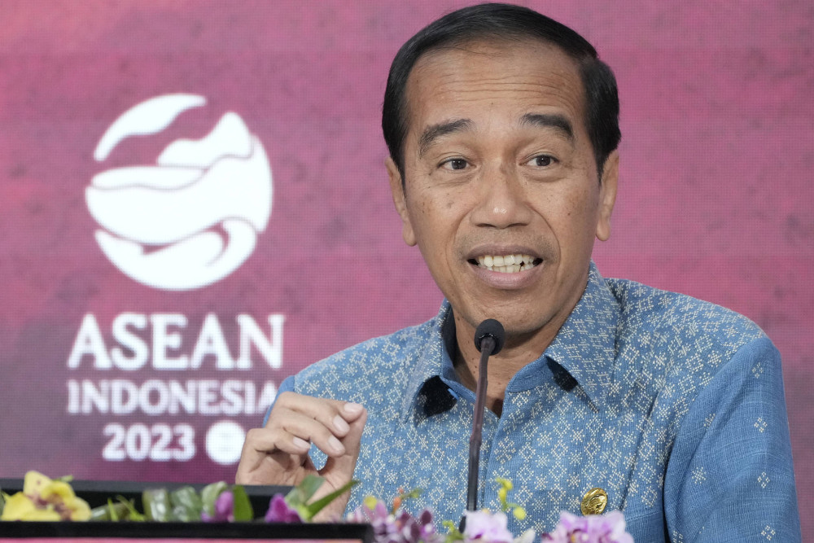

# 印尼总统：印尼决定取消对159个国家及地区的免签政策

（观察者网讯）据印度尼西亚《罗盘报》报道，印尼政府在本月早些时候取消了对159个国家及地区的免签入境政策，仅有另外9个东盟成员国和东帝汶的旅客可以继续享受免签政策。对此，印尼总统佐科6月21日表示，该国是经过审慎的考虑和评估之后做出了这一决定。

_印尼《罗盘报》报道截图_

报道称，印尼法律和人权部在6月7日签署了取消免签的法令。法律和人权部移民总局公共关系副协调员艾哈迈德·努尔·萨利赫称，免签政策影响了印尼居民的生活，导致非法移民、扰乱公共秩序、流行病传播等问题加剧，“基于相关考虑，我们发布了这项法令。”

他表示，目前印尼的免签入境政策仅适用于10个国家，分别为文莱、菲律宾、柬埔寨、老挝、马来西亚、缅甸、新加坡、泰国和越南这9个东盟成员国，以及即将正式加入东盟的东帝汶。

对于这一决定，印尼总统佐科21日视察西爪哇省期间回应说，相关政策已经得到当局的审查和评估，“在我们全面开放之前，我们需要评估这是否对国家有利……不管是在哪个国家，评估政策是很常见的事。这是在评估有没有好处。”

不过《罗盘报》称，佐科并没有透露印尼政府评估的具体标准和要点。

_资料图：印尼总统佐科 图自视觉中国_

印尼旅游和创意经济部长桑迪亚加·乌诺声称，取消免签的决定不会对印尼的旅游业造成太大影响。他认为，推动电子签证和电子落地签证的申请有助于“提高旅游质量和可持续发展”。桑迪亚加承诺，印尼当局将发布多项创新措施，帮助印尼旅游业适应“数字化趋势”，吸引更多游客。

作为东南亚地区的旅游胜地之一，印尼自2016年起为169个国家及地区的旅客提供免签入境的便利。但近年来，频频有外国游客在巴厘岛等地作出不当行为，影响当地社会秩序。澳大利亚广播公司报道称，自今年年初至5月底，已有超过130名外国游客被印尼驱逐出境。

今年5月，一名德国女游客裸体闯入巴厘岛舞蹈表演现场，还促使当地政府出台了针对国际游客的行为准则。澳大利亚广播公司提到，这项适用于整个巴厘岛的指导方针首次明确规定，禁止游客攀爬岛上的“圣树”或裸体出现在文化和宗教场所。

据《罗盘报》报道，关于印尼政府是否会恢复对159个国家及地区的免签入境政策，印尼法律和人权部移民总局局长西尔米·卡里姆19日回应称，如果以后恢复免签政策，有关国家及地区需要符合互惠、对印尼有利和安全这三个方面的标准。

**本文系观察者网独家稿件，未经授权，不得转载。**

