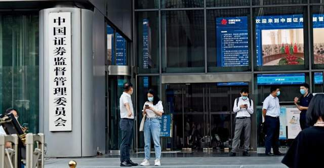
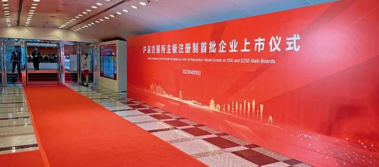

# 多名实权官员被查，发审反腐“收网”？

今年5月，朱从玖在浙江省政协副主席任上落马。在2012年5月出任浙江省副省长、成为当时为数不多的“金融副省长”之前，朱从玖任职证监系统长达20年。他离开前的职务是证监会党委委员、主席助理，同时兼任发行监管部主任，这意味着从2008年11月起，朱从玖主管证监会发行工作近四年。

朱从玖因何落马尚不得而知，但是外界纷纷猜测或与发行工作相关，毕竟其2008年从上交所回归证监会任职时，正是接替“发审皇帝”姚刚的职位。

发审领域一度是证监系统腐败的重灾区。一方面是核准制下“上市资源”稀缺；另一方面是证监会发行部门、发审委手握重权，两相结合，加之发审领域一度缺乏公开透明的机制，使得发审领域权力寻租频发。

2021年以来，一场针对发审领域腐败问题专项治理悄然展开。两年多来，伴随着多名发审领域实权官员被查，中国的资本市场也在今年告别核准制，迎来全面注册制。

人们不仅期待一场针对发审领域的彻底肃贪，更期待全面注册制下发审领域的制度性变革，这可能才是终结这一腐败重灾区的关键。

_图/视觉中国_

**发审反腐“收网”**

与朱从玖一样，姚刚自2004年7月起出任证监会主席助理，兼任发行监管部主任，直至2008年。后经审理查明，仅2007年1月至4月，姚刚利用担任证监会主席助理兼发行监管部主任的职务便利，获悉相关公司重组上市的内幕信息，使用由其实际控制的他人股票账户在关联股票停牌前买入，复牌后卖出，非法获利共计人民币210万余元。姚刚已于2018年9月被判处有期徒刑18年。

姚刚从2002年起便出任发行监管部主任，此番朱从玖落马，意味着2002年至2012年这十年间，证监会两任发行监管部主任相继落马。《中国新闻周刊》记者注意到，近年落马的发审领域官员，多在这一时期任职于证监会发行部门，如迄今为止涉案金额最高（超过2.74亿元）的证监系统落马官员童道驰，曾于2006年8月至2007年4月短暂出任发行监管部副主任。

此外，曾短暂存续的证监会内设部门——创业板发行监管部，即创业板部，又堪称发审领域腐败重灾区。

“发审领域的腐败可能会消停一阵子。”多位业内人士向《中国新闻周刊》记者感慨。在他们的印象中，前两年有一批发审条线的官员落马。这样的感受指向2021年、2022年几名曾共事的发审领域官员密集落马。

2022年5月，证监会会计部主任王宗成“落马”，他常年任职于发审领域，2012年4月至2016年7月，王宗成担任证监会创业板部、发行监管部巡视员兼副主任。在今年2月公布的王宗成“双开”公告称，王宗成腐败行为贯穿职业生涯各个岗位，首先便点出其利用证券发行审核职权为他人谋取巨额利益。

就在王宗成被宣布接受调查8天之后，时任民生证券董事长的冯鹤年被查，2015年“下海”前，冯鹤年长年任职于证监会系统，并于2012年7月至2013年12月短暂出任过创业板部主任。

冯鹤年是创业板部“末代主任”。伴随创业板开市，“创业板部”成立于2009年年底，当时证监会的发审监管机构主要有三个，其中发行部负责主板（包括中小板）发审监管，创业板部负责创业板发审监管，公众公司部负责三板发审监管。这种机构设置延续至2014年2月，发行部、创业板部合并为发行监管部。

创业板部成立之初，设一位主任与三位副主任，其中的两位副主任李量、曾长虹也相继落马。李量“落马”时间较早，发生在2014年12月。作为创业板部成立之初的副主任，李量曾组织参与创业板发行法规规则制定及发行审核工作，并组织设计证券发行上市保荐的设计、法规制定，及第一次、第二次保荐代表人胜任能力考试命题设计及题库建立。

而与2012年便被调至证监会机关党委工作的李量不同，自创业板部成立至取消，曾长虹始终出任副主任。2021年10月，证监会投资者保护局原一级巡视员曾长虹“落马”，距离其2019年8月从证监会离职已经超过两年。自2001年起，曾长虹在发审领域工作时间长达16年。特别是在2009年11月至2016年12月期间，她先后出任证监会创业板部副主任、发行监管部副主任。

也就是说，在创业板部存续的4年多里，目前已有一名主任、三名副主任“落马”，其中李量与曾长虹更是共事多年。

从已经公开的信息来看，三名副主任的“落马”或多或少与他们在发审领域的任职经历相关。如曾长虹的“双开”公告措辞便颇为严厉，称曾长虹丧失理想信念，以贪心取代初心，长期在证券发行审核关键岗位工作，“靠发审、吃发审”，临近退休“逃逸式”离职，妄图逃避监督监管，继续恣意敛财。此外，曾长虹放弃监管职守，利用职务便利和影响力，在企业发行上市、再融资审核等方面为他人谋取不当利益，严重破坏发行审核秩序，损害证券监管形象。贪婪无度，纪法意识全无，甘于被“围猎”，大肆非法收受他人财物和拟上市公司股权。

“靠发审，吃发审”，显然离不开利用发审职权为他人谋取利益，曾长虹、王宗光的“双开”公告中均能看到类似表述，只不过其涉及哪些企业的IPO尚不得而知。

而根据扬州市人民检察院指控可知，2000年至2012年，李量利用担任中国证监会发行监管部发行审核一处处长、创业板发行监管部副主任等职务上的便利，为广东康美药业股份有限公司、乐视网信息技术（北京）股份有限公司等9家公司申请公开发行股票或上市提供帮助，并于2000年至2013年收受上述公司投资人所送财物，共计折合人民币693.6万元。

近两年多位发审领域厅局级官员密集被查并非巧合。2021年7月，中央纪委国家监委网站刊文称，中央纪委国家监委驻证监会纪检监察组坚持风险防范和腐败问题治理同步，深挖风险事件背后的腐败问题，对证监会证券发行注册全业务链条公权力运行进行专项监督检查，净化政治生态和资本市场生态。

2021年以来针对发审领域腐败问题的专项整治，也成为核准制时代“落幕”的一个注脚。

_4月10日，沪深交易所主板注册制首批企业上市仪式在北京、上海、深圳三地连线开展。图/视觉中国_

**发审领域缘何腐败高发？**

李志玲曾被称为证监会“最牛女处长”，历任证监会发行监管部审核二处主任科员、审核四处主任科员、助理调研员、监管六处处长等职位。其在2021年专项整治之前便已落马。

2014年，中纪委驻证监会纪检组便收到举报李志玲受贿的材料。2015年6月，李志玲被开除行政职务，并移送司法部门，其前夫乔东方也在之前被捕。

北京二中院作出的一审判决书显示，李志玲与乔东方共同受贿逾3600万元。此外，李志玲还向某知名上市公司CEO索贿540万元及奔驰汽车一辆。

李志玲与前夫的第一起共同受贿发生在2007年至2009年间。此前，浙江某公司意图上市，负责审核财务的正是李志玲。后来，该公司提出再融资，却被山东一家企业举报。最终还是因为李志玲审核，使得此次再融资成功通过。于是，当李志玲提出想去杭州游览时，老板过某不但主动去接，还提出要用钱款报答。最终，老板安排司机向乔东方提供的账户打了800万元。

从李志玲的案例不难看出，哪怕是发行部门的处级官员，依然手握实权，可以与企业进行利益交换，这与核准制下发审流程密切相关。

证监会曾公布核准制下发审的十大环节：受理、反馈会、见面会、问核、预先披露、初审会、发审会、封卷、会后事项审核、核准发行。其中，初审会与发审会是至关重要的两个环节。

有资深券商人士向《中国新闻周刊》解释说，发行监管部主要负责初审：审核申报材料，进行问询，即业内所谓“下反馈”，要求拟上市企业回复，最终形成初审意见，发行部会将初审与申报材料一同提交给发审会。“初审环节一般有两名审核员，一位负责财务问题，另一位负责法律等非财务问题。”

发审会则由通过抽签选取的7名发审委委员组成，而发审委委员由证监系统内与系统外人士组成，也就是既包括证监会与地方证监局的技术官僚，也包括券商、律所、会所的资深从业者。发审会结合申报材料与初审意见进一步提出问题，也就是发审委工作函。在问询与回复结束后，最后一步会安排发审会投票，需要7名委员中三分之二以上同意方可“过会”。

由此可见，决定一家企业能否“过会”的决定性因素是随机抽取的7名发审委委员。2021年以来，也确实有多名发审委委员接受调查。2021年下半年，上交所审核中心副主任操舰、天健会计事务所原副总裁陈翔、国泰君安投行部总经理朱毅先后被查，三人都曾出任三届主板发审委委员。其中，操舰被指“将发行审核权异化为谋利工具，非法收受大量财物，通过入股拟上市公司非法谋利，数额巨大”。

证监会曾于2003年12月对发审委制度进行了重大变革，废止了《股票发行审核委员会条例》，颁布了《股票发行审核委员会暂行办法》和配套的《工作细则》，上述变革的核心是提高发审委工作的透明度，加强对委员的监督管理。

《暂行办法》取消了原来的发审委委员身份必须保密的规定，为提高发审委工作的透明度，还规定了更为公开透明的审核工作程序，例如要求证监会有关职能部门在发审委会议召开5日前，将会议审核的发行人名单、会议时间、发行人承诺函和参会委员名单在证监会网站公布。

在发审委委员身份保密的时代，时任发审委工作处副处长的王小石涉嫌出售发审委委员名单获利数十万，被检方调查起诉。

其实，尽管发审委委员拥有最终投票权，但是作为证监会内设机构的发行监管部依然扮演着核准制下权力核心的角色。

“首先，初审由发行部负责，初审过程中如果审核员判断企业有明显财务造假嫌疑、信息披露极度不充分等问题，可能会在初审环节反复问询企业，也就是经常会看到的‘多轮问询、多轮反馈’。此外，还会通过‘窗口指导’的形式劝退企业，劝说企业主动撤回IPO申请，否则将对企业进行现场检查。”有业内人士向《中国新闻周刊》解释说。

“这使得如果一家企业需要疏通关系上市，需要涉及整条发审条线，从初审到发审环节，往往从初审审核员开始‘攻略’。比如发行部分管法律与财务审核这两个处室的处长、副处长也会成为‘围猎’目标。”前述业内人士表示，尽管发审委委员拥有最终投票权，但是委员或是工作关系在证监系统，或是日常工作受证监部门监管，“尤其是对于一些证监系统外的发审委委员而言，券商、律所、会所人士也要做IPO项目，因此不要说发行部门主任、副主任，恐怕连关键处室的领导的面子也不敢不给。拥有行政级别的人士与市场人士拥有的话语权完全不同。”这也是为什么像李志玲这样发行部门处级官员也可以进行利益交换的原因。

因此，更加公开透明一直是发审领域改革的方向。早在2015年11月，证监会曾发布《关于进一步规范发行审核权力运行的若干意见》，进一步完善了“条件明确、标准清晰、程序规范、公开透明、集体决策、全程留痕、监督有效”的发行审核权力运行机制，对发行审核权力运行过程中可能存在权力寻租和腐败风险的事项、环节进行全面梳理排查，采取了有针对性的完善和改进措施。

例如，其中明确提到，规范审核全程留痕，发审会全程录音录像。再比如，对发行人存在的问题是否构成发行融资障碍、是否影响审核进度等重要事项的确定，均应履行集体决策程序，任何处室和个人无权单独对企业问题进行定性或者叫停审核进程。

权力过于集中，这是核准制下发审领域腐败的重要原因。华东政法大学国际金融法律学院教授郑彧告诉《中国新闻周刊》，一方面，“首次公开发行”是一种比较稀缺的“上市资源”，作为资源有着其额外的价值，因此，市场上“抢着挤破头都要上市”的局面会诱发一些市场主体“抄近路、走捷径”的不良动机，这是发行人侧的根源；另一方面，主要还是核准制下，当上市这种稀缺的市场资源的决定权掌握在监管部门手中时，因为监管权力过大、过于绝对化所引发的廉政问题。

**注册制是解药吗？**

“从券商角度而言，2013年执行财务大核查之前，财务造假的成本较低，核查的力度不足，因此早年财务造假时有发生。如今券商发现一家企业有问题，很少会通过疏通关系等方式帮助其上市。但是在一些模糊地带，企业可能有法律、运营等方面的瑕疵，此时如果有监管部门资源，通过私下咨询的形式往往能得到更准确、及时的反馈。”前述券商人士告诉记者，这种关系可能更多用于了解最新的内部审核尺度。“不排除顶风作案的可能，但是通过疏通关系给造假企业开绿灯几乎不太可能。”

2023年2月，《中国纪检监察报》刊文称，自2021年以来，驻证监会纪检监察组织持续开展证券发行审核领域腐败问题专项治理，从证监会派出机构到证监会机关发行监管部，从在职人员到离职干部再到市场中介机构从业人员，从深挖细查腐败背后的作风问题到对各种新型腐败和隐性腐败行为进行重点打击，严肃查处了曾长虹、王宗成、冯鹤年、操舰等人违法犯罪问题，为全面注册制改革扫清障碍。

今年2月，注册制改革完成“三步走”中的最后一步：启动全面实行股票发行注册制改革。此次全面注册制改革的亮点之一便是：监审分离、放管结合，证监会和交易所的职能定位更加明确，前者负责注册，后者负责审核，延续了此前试点阶段交易所审核、证监会注册两个环节的审核注册架构。

在交易所审核环节，主要关注“两符合四重大”：判断企业是否符合国家产业政策、是否符合板块定位；发现在审项目涉及重大敏感事项、重大无先例情况、重大舆情、重大违法线索的，及时向证监会请示报告，由证监会进行把关。

在证监会注册环节，证监会基于交易所审核意见依法履行注册程序，在20个工作日内对发行人的注册申请作出是否同意注册的决定。

证监会有关负责人表示，“审核流程的优化绝不意味着审核要求的放松，审核把关会更加严格。”交易所承担审核主体责任，证监会将加强对交易所审核工作的统筹协调和监督考核，督促交易所提高审核质量，比如督促交易所建立健全“防火墙”、加强质控部门和上市委、重组委把关责任等内部制衡机制。

注册制之下，“交易所审核+证监会注册”的架构被外界给予减少发审领域腐败的期望。证监会有关负责人也表示，在审核注册流程方面，要建立分级把关、集体决策的内控机制，防范权力过于集中。

“这样的架构相对有效地区分了作为市场一线的自律组织和作为政府部门的行政组织之间的关系，行政权变小了，市场权变大了。”郑彧认为，在市场权变大的同时，为了防止自律组织内部人员寻租风险，又通过两个方面的制度减少市场寻租的可能：一个是“透明审核”，即无论是从受理材料还是问询发行人以及中介机构的反馈，整个审核周期对市场全过程透明，便于市场各方主体的监督；另一个是上市委员会的组成结构变化，新一届负责表决的上市委员会大都是由行业主管部门、证券交易所、监管部门的骨干人员组成，在组织约束和纪委监督下，上市委员会的决策过程做到有案可查、有迹可循，最大程度地减少寻租的可能。

在过往的发审委委员中，来自证监系统内部的委员被称为“专职委员”，提高其占比一直是发审委改革方向。

“从业内来看，新的审核注册架构其实将证监会审核权力下放至交易所，交易所新增审核中心等机构，原本设立在证监会层面的发审委，转变为交易所层面的上市委。流程其实与此前大同小异，交易所的审核中心初审，形成初审意见后提交给上市委表决是否‘过会’。‘过会’后需要再报证监会注册，注册工作仍然由发行监管部负责。”有券商人士向记者表示，更为实质的变化是从原来仅由证监会层面审核，转变为交易所、证监会“两审制”，证监会的注册环节实质也会进行审核，很多企业都是在证监会注册环节被打回交易所重新审核。

“从反腐角度而言，监审分离确实起到一定作用。核准制之下，只需‘拿下’发行部门相关领导即可，但是新的审核注册架构之下，证监会不负责审核，但是交易所审核完毕后仍需向证监会注册。”前述券商人士向记者感慨，过去企业疏通关系，往往目标比较明确，但是现在通常不知道该找谁。“如果找交易所人士，还需面临证监会注册程序的不确定性，而且企业申请上市过程中由发行部哪个处室对接注册工作也不确定。因此在审核流程中增加一道程序，也意味着疏通关系的难度增加。”

显然，“防范权力过于集中”仍是关键。今年5月，证监会主席易会满在系统内干部轮训班上发声，指出“以强有力监督打造廉洁的注册制”。中央纪委国家监委驻证监会纪检监察组组长、证监会党委委员樊大志则指出，“聚焦注册制改革公权力运行实际情况强化廉政监督，加大力度惩治新型腐败和隐性腐败。”

发于2023.6.26总第1097期《中国新闻周刊》杂志

杂志标题：发审肃贪

记者：陈惟杉

