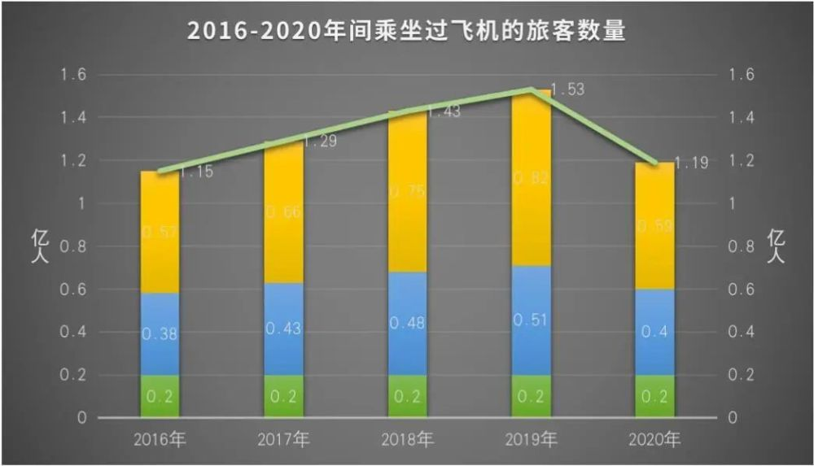
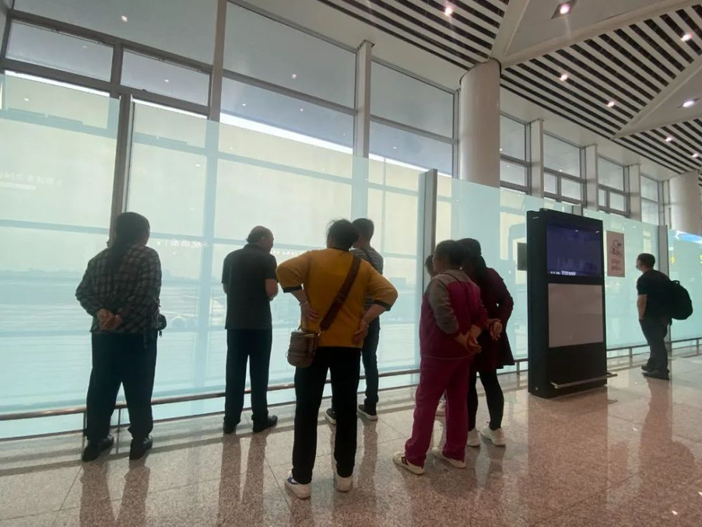
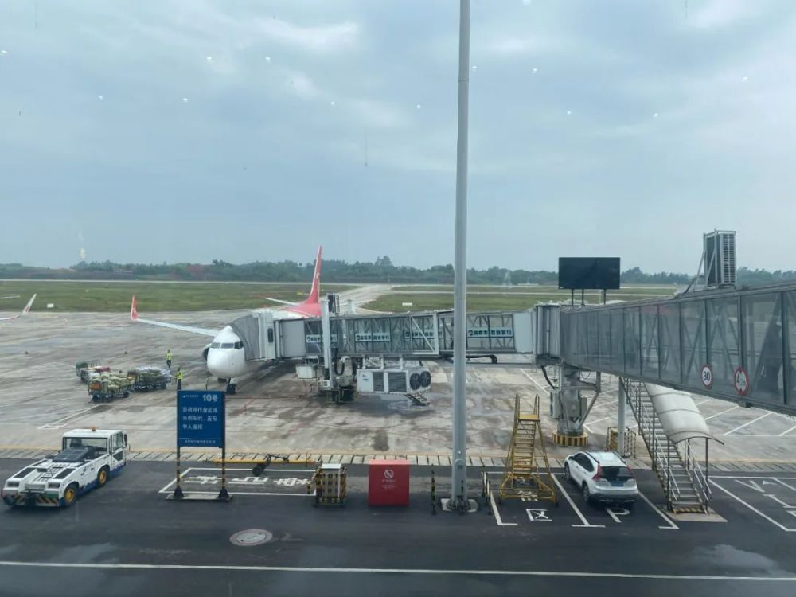
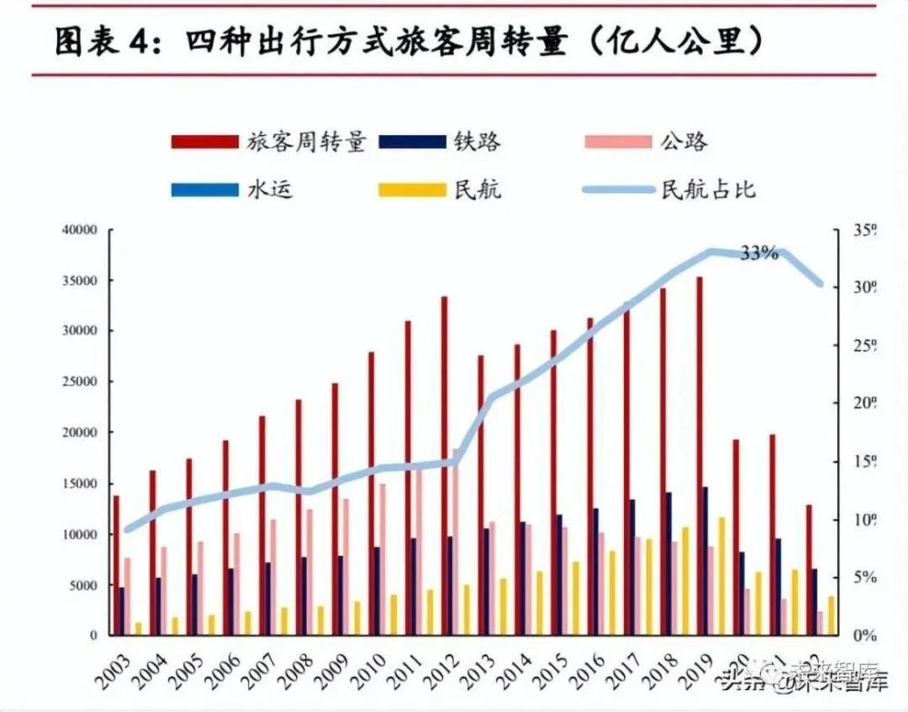
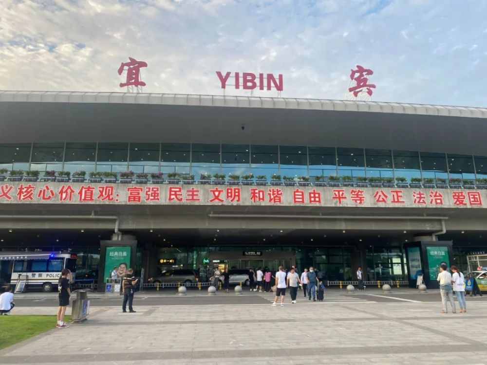
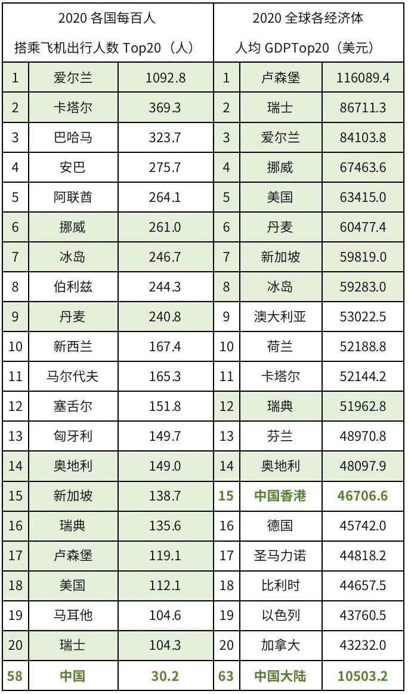

# 媒体：在中国，10亿人没坐过飞机

_图/视觉中国_

**文 | 《财经》记者 王静仪**

**编辑 | 施智梁**

宜宾五粮液机场的航站楼落地窗前，总是站着一群人。

不管男女老少，大家伸着头，背着手，目光朝着一个方向，那就是飞机。每当有飞机滑到停机位上，玻璃前聚集的人就明显变多，大家不愿意坐着，都要来看看这个新奇的大家伙。

陈阿姨今年59岁，在2023年5月迎来了人生第一次坐飞机出行，她有点兴奋，也有点紧张。她目不斜视地看着前方，还和身边人讨论了起来：“原来飞机就是这个样子的啊。”

像宜宾五粮液机场这样的地方并不少， **一个流传已久的说法是：有10亿中国人没有坐过飞机。**

**10亿人的数字没有权威出处，但得到业内认可。**
航旅纵横数据显示，2016-2020年间，每年民航出行的旅客人数在1.15亿到1.53亿人上下。剔除同一旅客多次乘机的情况，这5年约有3.4亿旅客乘坐过飞机，因此“10亿中国人没有坐过飞机”的说法并不夸张。

民航，从来都是地区间发展差异非常大的行业。
**中国内地目前一共有254个机场，其中东部地区占全国旅客吞吐量的一半以上，北京、上海和广州三大城市就占全国吞吐量的五分之一。**

在中国，年旅客吞吐量1000万人次以上的机场有18个，但是旅客吞吐量占全国的52.8%；像宜宾五粮液机场这样的200万人次以下的机场，全国一共有206个，吞吐量加起来才占13.8%。

“中国人均飞机出行次数是每年0.5次，就是说，每两个中国人里，一年只有一次坐飞机出行的机会，美国是人均2.5次。预计到2041年，中国的人均飞行次数会达到每年1.5次。”空中客车全球执行副总裁、中国公司首席执行官徐岗对《财经》记者表示。

2023年初夏，《财经》记者两次飞往宜宾五粮液机场，探寻小城机场的故事。

_《财经》记者王静仪拍摄_

**火车太久、飞机太贵，汽车是出行首选**

陈阿姨的航班是下午1点半起飞，她早上10点就早早到了机场，她想看看飞机，也看看机场。

在登机口旁的落地窗前站了一会儿，陈阿姨看出了门道：“飞机先从一个地方拉一飞机人过来，到了这里，让他们先下来，然后让我们上去，原来飞机就是这样的啊，和老家的大巴车也差不多。”她对《财经》记者说。

站累了，陈阿姨坐回到椅子上。快到午饭时间了，她从双肩包里掏出桶装泡面，去旁边接上热水，一股熟悉的香味飘了出来。

宜宾地处云贵川渝四省中心，距离成都、重庆、昆明、贵阳的距离都是200公里左右，高铁仅需2小时。但这个西南小城距离北京和上海都相当远，距离超过2000公里，飞机要飞3个小时，高铁也要接近12小时，贯通中国东部和西部的路程漫长。

多位宜宾人告诉《财经》记者，作为人口流出大市，本地人多去浙江和广东打工，“因为那里厂多”。最常用的交通方式是汽车，坐大巴或者自驾拼车。

因为普通火车耗时太长，近年由于高铁通车也停运了；飞机又太贵，出门基本不会想到坐飞机；汽车则兼顾了时间和费用，路上开一天就到了。

一张飞机票贵吗？当然不便宜，但好像也不是天价。《财经》记者查阅订票软件发现，宜宾直达北京、上海、广州的航班普遍不超过1000元，如果愿意转机，最低500元也能拿下。

5月16日这一天，陈阿姨要搭乘的是宜宾飞往合肥的ZH8606航班，票价仅410元，加上机建和燃油附加费，一共520元，在陈阿姨眼里，不算太贵。

在宜宾，飞机并不算新鲜事，最早的菜坝机场在1992年建成，在2019年被新建的五粮液机场取代，已经有30年通航的历史。

但飞机在当地人眼里仍是稀罕物件。统计公报显示，宜宾市2022年人均地区生产总值是74341元，低于全国全年人均国内生产总值的85698元；在宜宾，2022年全体居民人均可支配收入是32663元，低于全国平均的36883元。

在宜宾五粮液机场，每天有大约30个航班起降，连接北京、上海、广州、深圳、温州等经济发达地区，以及西双版纳、三亚、丽江、拉萨等旅游目的地。

陈阿姨不关心这些数字，她只觉得，机场很干净，地面光可鉴人、卫生间也一尘不染，比大巴车站好多了。乘客也有素质，没什么人大声吵闹。

每天都有几千人从这里往返全国各地。2019年，宜宾五粮液机场旅客吞吐量为100.07万人次；2020年受疫情影响，为91.31万人次；2021年吞吐量达153.1万人次，创下历史最高记录，居全国第74位；2022年预计年旅客吞吐量110万人次。

_《财经》记者王静仪拍摄_

**北上广撑起民航业，地区发展不均衡**

傍晚7点多，宜宾机场的贵宾候机室里坐满了人，后来的旅客仍在不断进入，但已经无处落座。门口负责接待的工作人员只能递上一瓶水，请西装革履的旅客们坐到外面的普通候机区。

飞往北京和上海的航班分别在20:30和20:25出发，临近出发时间，航空公司精英会员、两舱旅客们挤满了宜宾机场小小的贵宾室，创造出休息室不够坐的少见景象。

“去别的地方的旅客，哪有要坐贵宾室的，外面等一会儿就是了。每天晚上有两班去北京去上海的飞机，这些大城市来宜宾出差的人，正好白天出差晚上走，就都涌到我们这里来了。”工作人员对《财经》记者说道。

**这正是民航地区发展不均衡的一个缩影——东部占全国旅客吞吐量的一半左右，其中北京、上海和广州三大城市就占全国吞吐量的四分之一；类似宜宾机场这样的小型机场，数量繁多，但吞吐量只是零头。**

《2022年全国民用运输机场生产统计公报》显示，2022年中国内地运输机场（不含港澳台）共有254个。其中，年旅客吞吐量1000万人次以上的机场有18个，200-1000万人次运输机场有30个，200万人次以下的运输机场有206个。

大机场尽管数量最少，占总量的7%，但是旅客吞吐量最大，占全国的52.8%；中型机场的水平居中，以12%的机场数量实现了33.3%的吞吐量；全国超过200个的小型机场，数量超八成，吞吐量仅占13.8%。

为什么仍有不少中小城市居民极少坐飞机、甚至还没有坐过飞机？

航旅纵横认为，其一，机场规划一般具有一定的超前性，中小城市的中低收入群体并不能立刻为这些机场创造出相应的民航出行需求；其二，受到低迷的市场需求影响，中小机场往往航线少、通航城市有限，且有时机票价格比临近的大机场还要高、可选择的航班时段更少，甚至有些机场一天只有一趟航班起降。

**不管是疫情前还是疫情后，以北上广为代表的东部地区，都撑起了民航业的半边天。**

统计公报显示，2019年东部地区完成旅客吞吐量7.10亿人次，占全国的53%；其次是广袤的西部地区，旅客吞吐量4.03亿人次，占比30%；再次是中部地区，旅客吞吐量1.56亿人次，占比12%，同比增速最快；最后是东北地区，旅客吞吐量0.84亿人次，占比6%。

_《财经》记者王静仪拍摄_

**平均每两个中国人，一年只有一次飞机出行**

从宜宾出发的航班上，看手机的人不多，用电脑办公的人更是几乎没有，旅客们都忙着望向舷窗外的风景，观察飞机的一举一动。

“飞机动了！”几声小小的惊呼传来，吸引了更多的目光。

《财经》记者的后座坐了一对年轻的情侣，当飞机开始滑行，女生轻声说了一句，自己有点害怕。男生则迅速回答道：“不怕，有我呢，就算要跳下去，我也抱着你一起跳。”女生笑了一下，俩人没再说话。

坐飞机仍然是新奇的体验。民航局运输司副司长靳军号介绍，2019年中国民航行业完成旅客运输量6.6亿人次，连续多年位居世界第二，但人均乘机次数是0.47次，低于世界平均水平的0.87次，更远低于美国的2.48次。

**也就是说，平均每两个中国人里，一年只有一次坐飞机出行的机会。**

中国的人均乘机次数低于全球平均水平，根据国际货币基金组织发布的《2020年世界民航航空统计》，中国每百人乘飞机出行的人数只有30.2，全球排名第58，而排第一的爱尔兰高达1092.8，美国为112.1。

**人均乘机次数和人均GDP有明显关系。** 中国大陆的人均GDP在2020年为10503.2美元，排名全球63，和人均乘机次数的第58名基本相当。

