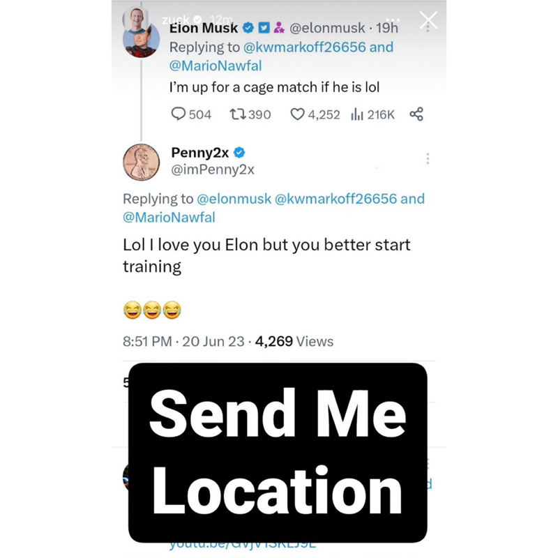
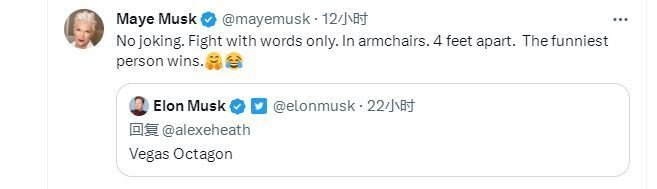

# 马斯克和扎克伯格线上约架黄了？马斯克母亲：我取消了这场比赛

不少外媒今日围观美国社交媒体平台Meta公司CEO马克·扎克伯格和推特公司老板埃隆·马斯克的隔空喊话。美国“商业内幕”网站称，马斯克当地时间20日发推称他准备和扎克伯格进行一场“笼斗”，扎克伯格21日晚随即在Instagram
限时动态（IG STORY ）平台上发出简短回应，“地址发我。”

Meta发言人Iska Saric更是告诉媒体称，已确认扎克伯格发表的回复并不是在开玩笑。

马斯克也很快做出了回应。他周三晚些时候在推特上写道：“拉斯维加斯八角笼（Vegas
Octagon）。”他补充称，自己有一个名为“海象”的绝招，可以轻松把对手压在身下，并发布了一张海象的动图。

在一众“吃瓜群众”的围观和拱火之下，这场两位亿万富翁之间的角斗似乎已经注定要发生了。但一个关键人物出现了，强烈要求取消这场角斗，这就是马斯克的妈妈梅耶尔·马斯克。

她说：“不是开玩笑。要文斗不要武斗。在扶手椅里。相隔4英尺。最有趣的人赢。”几小时后她又发推称：“事实上，我取消了这场比赛。我还没告诉他们。但我还是要说，角斗取消了，以防万一……”面对母亲的一片爱子之心，马斯克也只能无奈地在这条推文下回复了一个“笑哭”的表情符号。

现年39岁的扎克伯格最近刚刚在巴西柔术锦标赛获得奖牌。据报道，Meta正在开发一款独立的、基于文本的社交网络应用程序，未来或将与推特展开竞争。

资料来源：澎湃新闻、环球网、红星新闻

编辑：陈艳琦

责编：周尚斗

审核：冯飞

